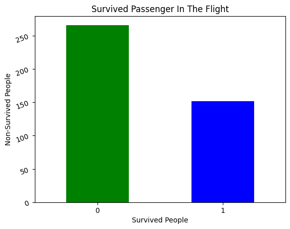

```python
import pandas as pd
import matplotlib.pyplot as mp
```


```python
gender = pd.read_csv("gender_submission.csv")
print(gender.head(40).T)
```

                  0    1    2    3    4    5    6    7    8    9   ...   30   31  \
    PassengerId  892  893  894  895  896  897  898  899  900  901  ...  922  923   
    Survived       0    1    0    0    1    0    1    0    1    0  ...    0    0   
    
                  32   33   34   35   36   37   38   39  
    PassengerId  924  925  926  927  928  929  930  931  
    Survived       1    1    0    0    1    1    0    0  
    
    [2 rows x 40 columns]
    


```python
gender.rename(columns= {"PassengerId":"Number"},inplace=True)
print(gender)
```

         Number  Survived
    0       892         0
    1       893         1
    2       894         0
    3       895         0
    4       896         1
    ..      ...       ...
    413    1305         0
    414    1306         1
    415    1307         0
    416    1308         0
    417    1309         0
    
    [418 rows x 2 columns]
    


```python
filter = gender[gender["Survived"]==1]
print(filter)
```

         Number  Survived
    1       893         1
    4       896         1
    6       898         1
    8       900         1
    12      904         1
    ..      ...       ...
    409    1301         1
    410    1302         1
    411    1303         1
    412    1304         1
    414    1306         1
    
    [152 rows x 2 columns]
    


```python
totalPass = gender["Survived"].value_counts()
Total = len(gender)
Total_Death = totalPass[0]
percent = (Total_Death / Total) * 100
print(f"Percentage of non-survivors is: {percent:.2f}%")
```

    Percentage of non-survivors is: 63.64%
    


```python
totalPass.plot(kind = 'bar', color = ["Green", "blue"])
mp.xlabel("Survived People")
mp.ylabel("Non-Survived People")
mp.title("Survived Passenger In The Flight")
mp.xticks(rotation=0)
mp.yticks(rotation=20)
mp.show()
```


    

    

