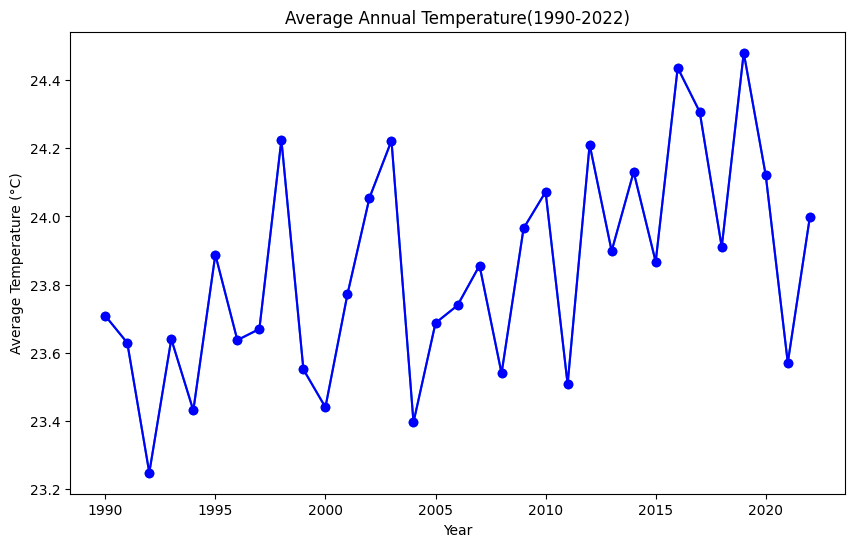

```python
import pandas as pnd
import matplotlib.pyplot as mp
weather=pnd.read_csv("Bangalore_1990_2022_BangaloreCity.csv")
```


```python
print(weather.isnull().sum())
```

    time       0
    tavg      70
    tmin    1389
    tmax     629
    prcp    4620
    dtype: int64
    


```python
weather['tavg']=weather['tavg'].fillna(weather['tavg'].mean())
weather['tmax']=weather['tmax'].fillna(weather['tmax'].mean())
weather['tmin']=weather['tmin'].fillna(weather['tmin'].mean())
weather['prcp']=weather['prcp'].fillna(weather['prcp'].mean())
print(weather.isnull().sum())
```

    time    0
    tavg    0
    tmin    0
    tmax    0
    prcp    0
    dtype: int64
    


```python
weather['time']=pnd.to_datetime(weather['time'], format="%d-%m-%Y")
weather['year']=weather['time'].dt.year
weather['month']=weather['time'].dt.month
weather['day']=weather['time'].dt.day
yearly=weather.groupby('year')['tavg'].mean().reset_index()

```


```python
yearly
```


<div>
<style scoped>
    .dataframe tbody tr th:only-of-type {
        vertical-align: middle;
    }

    .dataframe tbody tr th {
        vertical-align: top;
    }

    .dataframe thead th {
        text-align: right;
    }
</style>
<table border="1" class="dataframe">
  <thead>
    <tr style="text-align: right;">
      <th></th>
      <th>year</th>
      <th>tavg</th>
    </tr>
  </thead>
  <tbody>
    <tr>
      <th>0</th>
      <td>1990</td>
      <td>23.708400</td>
    </tr>
    <tr>
      <th>1</th>
      <td>1991</td>
      <td>23.629047</td>
    </tr>
    <tr>
      <th>2</th>
      <td>1992</td>
      <td>23.247721</td>
    </tr>
    <tr>
      <th>3</th>
      <td>1993</td>
      <td>23.639895</td>
    </tr>
    <tr>
      <th>4</th>
      <td>1994</td>
      <td>23.430469</td>
    </tr>
    <tr>
      <th>5</th>
      <td>1995</td>
      <td>23.887951</td>
    </tr>
    <tr>
      <th>6</th>
      <td>1996</td>
      <td>23.637002</td>
    </tr>
    <tr>
      <th>7</th>
      <td>1997</td>
      <td>23.669595</td>
    </tr>
    <tr>
      <th>8</th>
      <td>1998</td>
      <td>24.225042</td>
    </tr>
    <tr>
      <th>9</th>
      <td>1999</td>
      <td>23.550854</td>
    </tr>
    <tr>
      <th>10</th>
      <td>2000</td>
      <td>23.439728</td>
    </tr>
    <tr>
      <th>11</th>
      <td>2001</td>
      <td>23.771507</td>
    </tr>
    <tr>
      <th>12</th>
      <td>2002</td>
      <td>24.054468</td>
    </tr>
    <tr>
      <th>13</th>
      <td>2003</td>
      <td>24.222413</td>
    </tr>
    <tr>
      <th>14</th>
      <td>2004</td>
      <td>23.395628</td>
    </tr>
    <tr>
      <th>15</th>
      <td>2005</td>
      <td>23.687123</td>
    </tr>
    <tr>
      <th>16</th>
      <td>2006</td>
      <td>23.738904</td>
    </tr>
    <tr>
      <th>17</th>
      <td>2007</td>
      <td>23.855949</td>
    </tr>
    <tr>
      <th>18</th>
      <td>2008</td>
      <td>23.539344</td>
    </tr>
    <tr>
      <th>19</th>
      <td>2009</td>
      <td>23.965042</td>
    </tr>
    <tr>
      <th>20</th>
      <td>2010</td>
      <td>24.072055</td>
    </tr>
    <tr>
      <th>21</th>
      <td>2011</td>
      <td>23.507397</td>
    </tr>
    <tr>
      <th>22</th>
      <td>2012</td>
      <td>24.210929</td>
    </tr>
    <tr>
      <th>23</th>
      <td>2013</td>
      <td>23.898356</td>
    </tr>
    <tr>
      <th>24</th>
      <td>2014</td>
      <td>24.130685</td>
    </tr>
    <tr>
      <th>25</th>
      <td>2015</td>
      <td>23.866849</td>
    </tr>
    <tr>
      <th>26</th>
      <td>2016</td>
      <td>24.436339</td>
    </tr>
    <tr>
      <th>27</th>
      <td>2017</td>
      <td>24.306849</td>
    </tr>
    <tr>
      <th>28</th>
      <td>2018</td>
      <td>23.910137</td>
    </tr>
    <tr>
      <th>29</th>
      <td>2019</td>
      <td>24.480548</td>
    </tr>
    <tr>
      <th>30</th>
      <td>2020</td>
      <td>24.120492</td>
    </tr>
    <tr>
      <th>31</th>
      <td>2021</td>
      <td>23.570411</td>
    </tr>
    <tr>
      <th>32</th>
      <td>2022</td>
      <td>23.997087</td>
    </tr>
  </tbody>
</table>
</div>


```python
mp.figure(figsize=(10, 6))
mp.plot(yearly['year'], yearly['tavg'], marker='o')
mp.plot(yearly['year'], yearly['tavg'], marker='o', color='Blue')
mp.title('Average Annual Temperature(1990-2022)')
mp.xlabel('Year')
mp.ylabel('Average Temperature (°C)')
mp.show()
```


    

    

