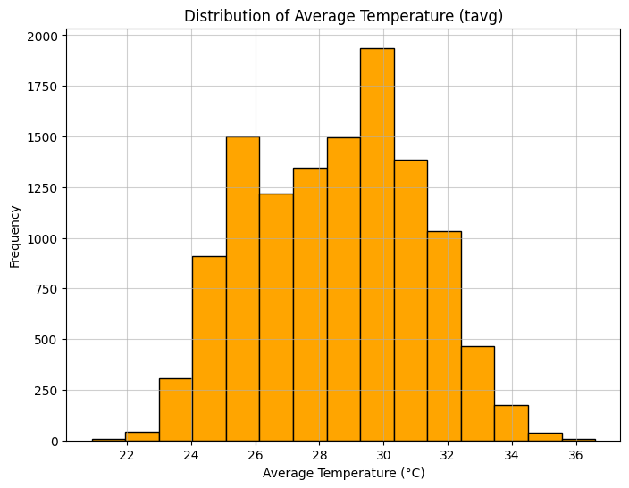

```python
import matplotlib.pyplot as plt
from sklearn.preprocessing import MinMaxScaler ,StandardScaler
import pandas as pd
```


```python
chennai = pd.read_csv("Chennai_1990_2022_Madras.csv")
print("Original Dataset:")
print(chennai.head())
```

    Original Dataset:
             time  tavg  tmin  tmax  prcp
    0  01-01-1990  25.2  22.8  28.4   0.5
    1  02-01-1990  24.9  21.7  29.1   0.0
    2  03-01-1990  25.6  21.4  29.8   0.0
    3  04-01-1990  25.7   NaN  28.7   0.0
    4  05-01-1990  25.5  20.7  28.4   0.0
    


```python
print("\n--- Min Max Scaler ---")
numeric_col = chennai.select_dtypes(include='number').columns
scaler = MinMaxScaler()
chennai_normalized=pd.DataFrame(scaler.fit_transform(chennai[numeric_col]),columns=numeric_col)
print(chennai_normalized.head())
```

    
    --- Min Max Scaler ---
           tavg      tmin      tmax     prcp
    0  0.273885  0.568421  0.221154  0.00145
    1  0.254777  0.510526  0.254808  0.00000
    2  0.299363  0.494737  0.288462  0.00000
    3  0.305732       NaN  0.235577  0.00000
    4  0.292994  0.457895  0.221154  0.00000
    


```python
print("\n--- Standard Scaler ---")
numeric_col1 = chennai.select_dtypes(include='number').columns
scaler =StandardScaler()
chennai_standardized=pd.DataFrame(scaler.fit_transform(chennai[numeric_col1]),columns=numeric_col1)
print(chennai_standardized.head())
```

    
    --- Standard Scaler ---
           tavg      tmin      tmax      prcp
    0 -1.262916 -0.610571 -1.629441 -0.301726
    1 -1.378048 -1.034909 -1.422370 -0.327989
    2 -1.109407 -1.150637 -1.215298 -0.327989
    3 -1.071030       NaN -1.540697 -0.327989
    4 -1.147785 -1.420670 -1.629441 -0.327989
    


```python
plt.figure(figsize=(8,6))
plt.hist(chennai['tavg'], bins=15, edgecolor='black', color='orange')
plt.title("Distribution of Average Temperature (tavg)")
plt.xlabel("Average Temperature (°C)")
plt.ylabel("Frequency")
plt.grid(True, linestyle='-', alpha=0.6)
plt.show()
```


    

    

