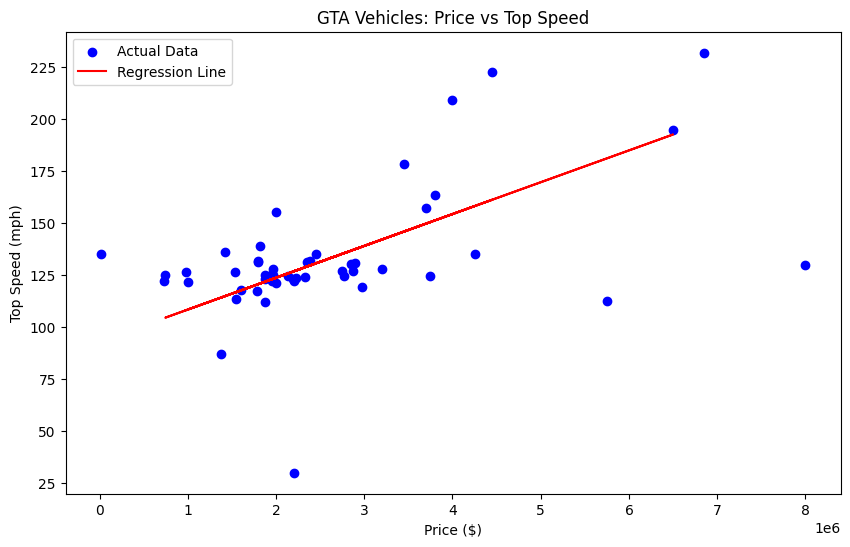

jupyter nbconvert --to markdown ".\Model 2\salarydata.ipynb"```python
import pandas as pd
import numpy as np
import matplotlib.pyplot as plt
import io
from sklearn.model_selection import train_test_split
from sklearn.linear_model import LinearRegression
from sklearn.metrics import mean_squared_error


```


```python
df = pd.read_csv("GTA 5 Vehicle Data Export.csv")

```


```python
df.head()
```


<div>
<style scoped>
    .dataframe tbody tr th:only-of-type {
        vertical-align: middle;
    }

    .dataframe tbody tr th {
        vertical-align: top;
    }

    .dataframe thead th {
        text-align: right;
    }
</style>
<table border="1" class="dataframe">
  <thead>
    <tr style="text-align: right;">
      <th></th>
      <th>Rank</th>
      <th>Vehicle Name</th>
      <th>Manufacturer</th>
      <th>Vehicle Class</th>
      <th>Price (GTA$)</th>
      <th>Top Speed (mph)</th>
      <th>Lap Time (Seconds)</th>
      <th>DLC / Release Update</th>
    </tr>
  </thead>
  <tbody>
    <tr>
      <th>0</th>
      <td>1</td>
      <td>Krieger</td>
      <td>Benefactor</td>
      <td>Super</td>
      <td>$2,875,000</td>
      <td>127.25</td>
      <td>0:59.27</td>
      <td>Diamond Casino</td>
    </tr>
    <tr>
      <th>1</th>
      <td>2</td>
      <td>Emerus</td>
      <td>Progen</td>
      <td>Super</td>
      <td>$2,750,000</td>
      <td>127.25</td>
      <td>0:58.29</td>
      <td>Diamond Casino</td>
    </tr>
    <tr>
      <th>2</th>
      <td>3</td>
      <td>Itali GTO</td>
      <td>Grotti</td>
      <td>Sports</td>
      <td>$1,965,000</td>
      <td>127.75</td>
      <td>0:59.72</td>
      <td>Arena War</td>
    </tr>
    <tr>
      <th>3</th>
      <td>4</td>
      <td>Buffalo EVX</td>
      <td>Bravado</td>
      <td>Muscle</td>
      <td>$2,140,000</td>
      <td>124.50</td>
      <td>1:03.46</td>
      <td>San Andreas Mercs</td>
    </tr>
    <tr>
      <th>4</th>
      <td>5</td>
      <td>Vagner</td>
      <td>Dewbauchee</td>
      <td>Super</td>
      <td>$1,535,000</td>
      <td>126.75</td>
      <td>0:59.19</td>
      <td>Gunrunning</td>
    </tr>
  </tbody>
</table>
</div>


```python
df.tail()
```


<div>
<style scoped>
    .dataframe tbody tr th:only-of-type {
        vertical-align: middle;
    }

    .dataframe tbody tr th {
        vertical-align: top;
    }

    .dataframe thead th {
        text-align: right;
    }
</style>
<table border="1" class="dataframe">
  <thead>
    <tr style="text-align: right;">
      <th></th>
      <th>Rank</th>
      <th>Vehicle Name</th>
      <th>Manufacturer</th>
      <th>Vehicle Class</th>
      <th>Price (GTA$)</th>
      <th>Top Speed (mph)</th>
      <th>Lap Time (Seconds)</th>
      <th>DLC / Release Update</th>
    </tr>
  </thead>
  <tbody>
    <tr>
      <th>45</th>
      <td>46</td>
      <td>Raiju</td>
      <td>Mammoth</td>
      <td>Plane</td>
      <td>$6,850,000</td>
      <td>232.00</td>
      <td>NaN</td>
      <td>San Andreas Mercs</td>
    </tr>
    <tr>
      <th>46</th>
      <td>47</td>
      <td>B-11 Strikeforce</td>
      <td>B-11</td>
      <td>Plane</td>
      <td>$3,800,000</td>
      <td>163.75</td>
      <td>NaN</td>
      <td>After Hours</td>
    </tr>
    <tr>
      <th>47</th>
      <td>48</td>
      <td>Pyro</td>
      <td>Buckingham</td>
      <td>Plane</td>
      <td>$4,450,000</td>
      <td>222.75</td>
      <td>NaN</td>
      <td>Smuggler's Run</td>
    </tr>
    <tr>
      <th>48</th>
      <td>49</td>
      <td>Hydra</td>
      <td>Mammoth</td>
      <td>Plane</td>
      <td>$3,990,000</td>
      <td>209.25</td>
      <td>NaN</td>
      <td>Heists Update</td>
    </tr>
    <tr>
      <th>49</th>
      <td>50</td>
      <td>P-996 Lazer</td>
      <td>JoBuilt</td>
      <td>Plane</td>
      <td>$6,500,000</td>
      <td>195.00</td>
      <td>NaN</td>
      <td>Base Game</td>
    </tr>
  </tbody>
</table>
</div>


```python
df.sample()
```


<div>
<style scoped>
    .dataframe tbody tr th:only-of-type {
        vertical-align: middle;
    }

    .dataframe tbody tr th {
        vertical-align: top;
    }

    .dataframe thead th {
        text-align: right;
    }
</style>
<table border="1" class="dataframe">
  <thead>
    <tr style="text-align: right;">
      <th></th>
      <th>Rank</th>
      <th>Vehicle Name</th>
      <th>Manufacturer</th>
      <th>Vehicle Class</th>
      <th>Price (GTA$)</th>
      <th>Top Speed (mph)</th>
      <th>Lap Time (Seconds)</th>
      <th>DLC / Release Update</th>
    </tr>
  </thead>
  <tbody>
    <tr>
      <th>38</th>
      <td>39</td>
      <td>Hakuchou Drag</td>
      <td>Shitzu</td>
      <td>Motorcycle</td>
      <td>$976,000</td>
      <td>126.5</td>
      <td>0:57.50</td>
      <td>Bikers Update</td>
    </tr>
  </tbody>
</table>
</div>


```python
df.info()
```

    <class 'pandas.core.frame.DataFrame'>
    RangeIndex: 50 entries, 0 to 49
    Data columns (total 8 columns):
     #   Column                Non-Null Count  Dtype  
    ---  ------                --------------  -----  
     0   Rank                  50 non-null     int64  
     1   Vehicle Name          50 non-null     object 
     2   Manufacturer          50 non-null     object 
     3   Vehicle Class         50 non-null     object 
     4   Price (GTA$)          50 non-null     object 
     5   Top Speed (mph)       50 non-null     float64
     6   Lap Time (Seconds)    39 non-null     object 
     7   DLC / Release Update  50 non-null     object 
    dtypes: float64(1), int64(1), object(6)
    memory usage: 3.3+ KB
    


```python
df.describe
```


    <bound method NDFrame.describe of     Rank       Vehicle Name Manufacturer Vehicle Class Price (GTA$)  \
    0      1            Krieger   Benefactor         Super   $2,875,000   
    1      2             Emerus       Progen         Super   $2,750,000   
    2      3          Itali GTO       Grotti        Sports   $1,965,000   
    3      4        Buffalo EVX      Bravado        Muscle   $2,140,000   
    4      5             Vagner   Dewbauchee         Super   $1,535,000   
    5      6             Pariah       Ocelot        Sports   $1,420,000   
    6      7    Hao's S95 (HSW)        Karin        Sports   $1,995,000   
    7      8             Virtue       Ocelot         Super   $2,980,000   
    8      9          Torero XO      Pegassi         Super   $2,890,000   
    9     10              Niobe    Ubermacht        Sports   $1,880,000   
    10    11              Batur         Enus         Super   $3,200,000   
    11    12          Vigero ZX     Declasse        Muscle   $1,947,000   
    12    13     GTO Stinger TT       Grotti        Sports   $2,380,000   
    13    14            Omaggio       Grotti         Super   $2,845,000   
    14    15           Calamity         Coil        Sports   $2,450,000   
    15    16                T20       Progen         Super   $2,200,000   
    16    17             Osiris      Pegassi         Super   $1,950,000   
    17    18           Zentorno      Pegassi         Super     $725,000   
    18    19              Adder     Truffade         Super   $1,000,000   
    19    20          Entity MT     Overflod         Super   $2,355,000   
    20    21       Dominator GT        Vapid        Muscle   $2,195,000   
    21    22          Jester RR        Dinka        Sports   $1,970,000   
    22    23         Calico GTF        Karin        Sports   $1,995,000   
    23    24            Corsita    Lampadati        Sports   $1,795,000   
    24    25            Draugur     Declasse      Off-Road   $1,870,000   
    25    26    Oppressor Mk II      Pegassi         Cycle   $8,000,000   
    26    27             Deluxo      Imponte        Sports   $5,750,000   
    27    28           Toreador      Pegassi        Sports   $4,250,000   
    28    29           Champion   Dewbauchee         Super   $3,750,000   
    29    30              Ignus      Pegassi         Super   $2,765,000   
    30    31           Revenant       Albany        Sedans   $1,600,000   
    31    32              Thrax     Truffade         Super   $2,325,000   
    32    33      Deveste Eight     Principe         Super   $1,795,000   
    33    34  Sultan RS Classic        Karin        Sports   $1,789,000   
    34    35           Comet S2      Pfister        Sports   $1,878,000   
    35    36             Cypher    Ubermacht        Sports   $1,550,000   
    36    37  Gauntlet Hellfire      Bravado        Muscle     $745,000   
    37    38            Shotaro     Nagasaki    Motorcycle   $2,225,000   
    38    39      Hakuchou Drag       Shitzu    Motorcycle     $976,000   
    39    40           Bati 801      Pegassi    Motorcycle      $15,000   
    40    41              Akula   Buckingham    Helicopter   $3,700,000   
    41    42            Sparrow  Sea Sparrow    Helicopter   $1,815,000   
    42    43            Kosatka          RUR     Submarine   $2,200,000   
    43    44         Terrorbyte   Benefactor       Utility   $1,375,000   
    44    45            Avenger      Mammoth         Plane   $3,450,000   
    45    46              Raiju      Mammoth         Plane   $6,850,000   
    46    47   B-11 Strikeforce         B-11         Plane   $3,800,000   
    47    48               Pyro   Buckingham         Plane   $4,450,000   
    48    49              Hydra      Mammoth         Plane   $3,990,000   
    49    50        P-996 Lazer      JoBuilt         Plane   $6,500,000   
    
        Top Speed (mph) Lap Time (Seconds)      DLC / Release Update  
    0            127.25            0:59.27            Diamond Casino  
    1            127.25            0:58.29            Diamond Casino  
    2            127.75            0:59.72                 Arena War  
    3            124.50            1:03.46         San Andreas Mercs  
    4            126.75            0:59.19                Gunrunning  
    5            136.00            1:00.63            Doomsday Heist  
    6            155.50            0:56.40           Next-Gen Update  
    7            119.25            1:02.32      Los Santos Drug Wars  
    8            131.00            1:01.32  The Criminal Enterprises  
    9            125.25            1:01.50    Bottom Dollar Bounties  
    10           128.00            1:00.80        2025 Winter Update  
    11           125.00            1:03.20  The Criminal Enterprises  
    12           132.00            1:01.20         San Andreas Mercs  
    13           130.25            0:59.90             The Chop Shop  
    14           135.00            1:00.10      2025 Mid-Year Update  
    15           122.25            1:01.28          Ill-Gotten Gains  
    16           122.00            1:01.39          Ill-Gotten Gains  
    17           122.00            1:02.30          High Life Update  
    18           121.50            1:04.96                 Base Game  
    19           131.25            1:03.19      Los Santos Drug Wars  
    20           123.00            1:04.50             The Chop Shop  
    21           125.00            1:02.50                 LS Tuners  
    22           121.25            1:03.59                 LS Tuners  
    23           131.30            1:02.10  The Criminal Enterprises  
    24           112.00            1:03.20  The Criminal Enterprises  
    25           130.00                NaN               After Hours  
    26           112.75            1:07.30            Doomsday Heist  
    27           135.25            1:01.50         Cayo Perico Heist  
    28           124.75            1:02.10              The Contract  
    29           124.75            1:00.20              The Contract  
    30           118.00            1:06.40            2025 Halloween  
    31           124.00            1:00.60            Diamond Casino  
    32           131.75            1:00.60                 Arena War  
    33           117.25            1:03.30                 LS Tuners  
    34           123.00            1:03.20                 LS Tuners  
    35           113.50            1:04.90                 LS Tuners  
    36           125.25            1:06.50            Diamond Casino  
    37           123.75            0:59.10           Deadline Update  
    38           126.50            0:57.50             Bikers Update  
    39           135.00            0:58.60                 Base Game  
    40           157.25                NaN            Doomsday Heist  
    41           139.00                NaN         Cayo Perico Heist  
    42            30.00                NaN         Cayo Perico Heist  
    43            87.25                NaN               After Hours  
    44           178.50                NaN            Doomsday Heist  
    45           232.00                NaN         San Andreas Mercs  
    46           163.75                NaN               After Hours  
    47           222.75                NaN            Smuggler's Run  
    48           209.25                NaN             Heists Update  
    49           195.00                NaN                 Base Game  >


```python
df.describe()
```


<div>
<style scoped>
    .dataframe tbody tr th:only-of-type {
        vertical-align: middle;
    }

    .dataframe tbody tr th {
        vertical-align: top;
    }

    .dataframe thead th {
        text-align: right;
    }
</style>
<table border="1" class="dataframe">
  <thead>
    <tr style="text-align: right;">
      <th></th>
      <th>Rank</th>
      <th>Top Speed (mph)</th>
    </tr>
  </thead>
  <tbody>
    <tr>
      <th>count</th>
      <td>50.00000</td>
      <td>50.000000</td>
    </tr>
    <tr>
      <th>mean</th>
      <td>25.50000</td>
      <td>133.251000</td>
    </tr>
    <tr>
      <th>std</th>
      <td>14.57738</td>
      <td>31.283652</td>
    </tr>
    <tr>
      <th>min</th>
      <td>1.00000</td>
      <td>30.000000</td>
    </tr>
    <tr>
      <th>25%</th>
      <td>13.25000</td>
      <td>122.437500</td>
    </tr>
    <tr>
      <th>50%</th>
      <td>25.50000</td>
      <td>126.625000</td>
    </tr>
    <tr>
      <th>75%</th>
      <td>37.75000</td>
      <td>134.250000</td>
    </tr>
    <tr>
      <th>max</th>
      <td>50.00000</td>
      <td>232.000000</td>
    </tr>
  </tbody>
</table>
</div>


```python
df.describe().T
```


<div>
<style scoped>
    .dataframe tbody tr th:only-of-type {
        vertical-align: middle;
    }

    .dataframe tbody tr th {
        vertical-align: top;
    }

    .dataframe thead th {
        text-align: right;
    }
</style>
<table border="1" class="dataframe">
  <thead>
    <tr style="text-align: right;">
      <th></th>
      <th>count</th>
      <th>mean</th>
      <th>std</th>
      <th>min</th>
      <th>25%</th>
      <th>50%</th>
      <th>75%</th>
      <th>max</th>
    </tr>
  </thead>
  <tbody>
    <tr>
      <th>Rank</th>
      <td>50.0</td>
      <td>25.500</td>
      <td>14.577380</td>
      <td>1.0</td>
      <td>13.2500</td>
      <td>25.500</td>
      <td>37.75</td>
      <td>50.0</td>
    </tr>
    <tr>
      <th>Top Speed (mph)</th>
      <td>50.0</td>
      <td>133.251</td>
      <td>31.283652</td>
      <td>30.0</td>
      <td>122.4375</td>
      <td>126.625</td>
      <td>134.25</td>
      <td>232.0</td>
    </tr>
  </tbody>
</table>
</div>


```python
df.shape
```


    (50, 8)


```python
print(df.dtypes)
```

    Rank                      int64
    Vehicle Name             object
    Manufacturer             object
    Vehicle Class            object
    Price (GTA$)             object
    Top Speed (mph)         float64
    Lap Time (Seconds)       object
    DLC / Release Update     object
    dtype: object
    


```python
df.dtypes.T
```


    Rank                      int64
    Vehicle Name             object
    Manufacturer             object
    Vehicle Class            object
    Price (GTA$)             object
    Top Speed (mph)         float64
    Lap Time (Seconds)       object
    DLC / Release Update     object
    dtype: object


```python
df.index
```


    RangeIndex(start=0, stop=50, step=1)


```python
df.columns
```


    Index(['Rank', 'Vehicle Name', 'Manufacturer', 'Vehicle Class', 'Price (GTA$)',
           'Top Speed (mph)', 'Lap Time (Seconds)', 'DLC / Release Update'],
          dtype='object')


```python
df['Price'] = df['Price (GTA$)'].astype(str).str.replace('$', '').str.replace(',', '')
df['Price'] = pd.to_numeric(df['Price'])

```


```python
df = df.dropna(subset=['Price', 'Top Speed (mph)'])

```


```python
X = df['Price'].values.reshape(-1, 1)
y = df['Top Speed (mph)'].values
```


```python
X_train, X_test, y_train, y_test = train_test_split(X, y, test_size=0.2, random_state=42)

print(f"Training Data Size: {len(X_train)}")
print(f"Testing Data Size: {len(X_test)}")

```

    Training Data Size: 40
    Testing Data Size: 10
    


```python
print("\n SKLEARN IMPLEMENTATION ---")

# Initialize and Fit
model = LinearRegression()
model.fit(X_train, y_train)

# Predict
y_pred_sklearn = model.predict(X_test)

# Evaluate
mse_sklearn = mean_squared_error(y_test, y_pred_sklearn)

print(f"Sklearn Slope (m): {model.coef_[0]:.6f}")
print(f"Sklearn Intercept (c): {model.intercept_:.4f}")
print(f"Sklearn MSE: {mse_sklearn:.4f}")
```

    
     SKLEARN IMPLEMENTATION ---
    Sklearn Slope (m): 0.000015
    Sklearn Intercept (c): 93.1591
    Sklearn MSE: 1841.3470
    


```python
print("\n  MANUAL IMPLEMENTATION ---")

# Flatten X_train for manual math (1D array)
x_vals = X_train.flatten()
y_vals = y_train

n = len(x_vals)

# Calculate Sums
sum_x = np.sum(x_vals)
sum_y = np.sum(y_vals)
sum_xy = np.sum(x_vals * y_vals)
sum_x2 = np.sum(x_vals ** 2)

# Calculate Slope (m)
numerator = (n * sum_xy) - (sum_x * sum_y)
denominator = (n * sum_x2) - (sum_x ** 2)
m_manual = numerator / denominator

# Calculate Intercept (c)
c_manual = (sum_y - (m_manual * sum_x)) / n

# Predict on Test Data Manually
y_pred_manual = (m_manual * X_test.flatten()) + c_manual

# Calculate MSE Manually
mse_manual = np.mean((y_test - y_pred_manual) ** 2)

print(f"Manual Slope (m): {m_manual:.6f}")
print(f"Manual Intercept (c): {c_manual:.4f}")
print(f"Manual MSE: {mse_manual:.4f}")
```

    
      MANUAL IMPLEMENTATION ---
    Manual Slope (m): 0.000015
    Manual Intercept (c): 93.1591
    Manual MSE: 1841.3470
    


```python
print("\n--- COMPARISON ---")
print(f"Difference in MSE: {abs(mse_sklearn - mse_manual):.10f}")
print("Note: The values should be nearly identical.")

# Save results to CSV for your project submission
results = pd.DataFrame({
    'Actual Top Speed': y_test,
    'Predicted Speed (Sklearn)': y_pred_sklearn,
    'Predicted Speed (Manual)': y_pred_manual
})
results.to_csv("gta_vehicle_regression_results.csv", index=False)
print("\nResults exported to 'gta_vehicle_regression_results.csv'")

# Optional: Plotting to visualize
plt.figure(figsize=(10, 6))
plt.scatter(X, y, color='blue', label='Actual Data')
plt.plot(X_train, m_manual * X_train + c_manual, color='red', label='Regression Line')
plt.title('GTA Vehicles: Price vs Top Speed')
plt.xlabel('Price ($)')
plt.ylabel('Top Speed (mph)')
plt.legend()
plt.show()
```

    
    --- COMPARISON ---
    Difference in MSE: 0.0000000000
    Note: The values should be nearly identical.
    
    Results exported to 'gta_vehicle_regression_results.csv'
    


    

    

