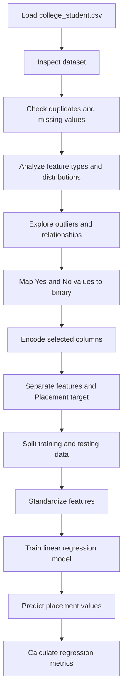
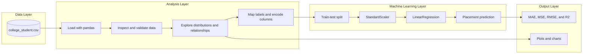

# College Student Placement Prediction

## Project Overview

This educational machine-learning project analyzes college-student academic and extracurricular information and uses a linear-regression model to predict placement status. The notebook covers dataset inspection, duplicate and missing-value checks, feature analysis, outlier inspection, visualization, preprocessing, model training, and evaluation.

## Problem Statement

The project explores whether student characteristics such as IQ, previous-semester results, CGPA, academic performance, internship experience, communication skills, and completed projects can help predict whether a student is placed.

## Dataset

`college_student.csv` contains 10,000 rows and 10 columns:

- `College_ID`
- `IQ`
- `Prev_Sem_Result`
- `CGPA`
- `Academic_Performance`
- `Internship_Experience`
- `Extra_Curricular_Score`
- `Communication_Skills`
- `Projects_Completed`
- `Placement`

The dataset contains seven numerical columns and three categorical columns. The notebook reports no missing values in the recorded modeling dataset. `Placement` is the target, with `Yes` and `No` values representing placement outcomes.

## Technologies Used

- Python
- Jupyter Notebook
- pandas for loading, inspecting, and transforming the dataset
- NumPy for numerical calculations and outlier analysis
- Matplotlib for visualizations
- Seaborn for statistical plots and relationship analysis
- scikit-learn for scaling, encoding, linear regression, and evaluation metrics

## Features

### Data Analysis

- Load and inspect the student dataset.
- Display the head, tail, sample, shape, data types, columns, index, and descriptive statistics.
- Check for duplicate rows and duplicate values in selected columns.
- Inspect missing and non-missing values.
- Separate numerical and categorical columns.
- Examine value counts and unique values.
- Calculate quartiles and the interquartile range for numerical columns.
- Create histograms, bar charts, pie charts, scatter plots, box plots, pair plots, and count plots.

### Machine Learning

- Convert `Internship_Experience` and `Placement` from `Yes`/`No` to binary values.
- Apply `LabelEncoder` to the listed feature and target columns.
- Separate the features from the `Placement` target.
- Split the data into training and testing sets.
- Standardize the feature data with `StandardScaler`.
- Train a `LinearRegression` model.
- Predict placement values and calculate regression metrics.

## Model Configuration and Results

- Model: Linear regression
- Target: `Placement`
- Test size: 20%
- Training size: 80%
- Random state: `42`
- Feature scaling: `StandardScaler`

The notebook records these test-set results:

- MAE: `0.24021710454407824`
- MSE: `0.09104807218687495`
- RMSE: `0.3017417309337158`
- R² Score: `0.3326438112534911`

The R² score indicates that the recorded linear-regression setup explains part of the variation in the binary placement target, but it is not a classification-oriented evaluation.

## Workflow

1. Load `college_student.csv` with pandas.
2. Inspect the dataset structure and descriptive statistics.
3. Check for duplicate rows and missing values.
4. Separate numerical and categorical columns.
5. Explore values, unique counts, outliers, and feature relationships.
6. Convert internship experience and placement labels to numeric values.
7. Encode the selected columns with `LabelEncoder`.
8. Separate features from the `Placement` target.
9. Split the data into training and testing sets with `random_state=42`.
10. Standardize the training and testing features.
11. Train the linear-regression model.
12. Generate placement predictions.
13. Calculate MAE, MSE, RMSE, and R² score.
14. Display exploratory visualizations and model outputs.

### Workflow Diagram



## Architecture Diagram



## Installation and Setup

### Requirements

- Python
- Jupyter Notebook
- pandas
- NumPy
- Matplotlib
- Seaborn
- scikit-learn

### Steps

1. Install Python and the required packages.
2. Open `college_student.ipynb` in Jupyter Notebook or Visual Studio Code.
3. Run the notebook cells from top to bottom.

Exact installation commands and package versions: `TODO: Information required`

Environment variables: `TODO: Information required`

Configuration files: `TODO: Information required`

## Project Structure

```text
Model 11/
├── college_student.ipynb
├── college_student.csv
├── college_student.md
├── READmd.txt
├── README.md
└── college_student_files/
```

- `college_student.ipynb`: Main student-analysis and machine-learning notebook.
- `college_student.csv`: Source college-student dataset.
- `college_student.md`: Markdown export of the notebook.
- `READmd.txt`: Existing project documentation file.
- `README.md`: Project documentation.
- `college_student_files/`: Notebook-related assets; detailed contents are not documented.

## Limitations and Missing Information

- The dataset source and attribution are not documented.
- Package versions and exact installation commands are not documented.
- No license information is provided.
- Linear regression is used for the binary `Placement` target; a classification model would be more appropriate.
- Accuracy, precision, recall, F1 score, and a confusion matrix are not reported.
- The notebook creates a one-hot encoded DataFrame but then applies `LabelEncoder` to the original DataFrame for modeling, so the one-hot encoded data is not used.
- `LabelEncoder` is applied to numerical columns as well as categorical columns, which changes their numeric ordering into encoded category values.
- No cross-validation, hyperparameter tuning, or comparison with classification algorithms is documented.
- The notebook does not document how predictions should be generated for new student records.
