```python
import numpy as np
import pandas as pd
import matplotlib.pyplot as plt
import seaborn as sns

std=pd.read_csv("college_student.csv")

```


```python
std
```


<div>
<style scoped>
    .dataframe tbody tr th:only-of-type {
        vertical-align: middle;
    }

    .dataframe tbody tr th {
        vertical-align: top;
    }

    .dataframe thead th {
        text-align: right;
    }
</style>
<table border="1" class="dataframe">
  <thead>
    <tr style="text-align: right;">
      <th></th>
      <th>College_ID</th>
      <th>IQ</th>
      <th>Prev_Sem_Result</th>
      <th>CGPA</th>
      <th>Academic_Performance</th>
      <th>Internship_Experience</th>
      <th>Extra_Curricular_Score</th>
      <th>Communication_Skills</th>
      <th>Projects_Completed</th>
      <th>Placement</th>
    </tr>
  </thead>
  <tbody>
    <tr>
      <th>0</th>
      <td>CLG0030</td>
      <td>107</td>
      <td>6.61</td>
      <td>6.28</td>
      <td>8</td>
      <td>No</td>
      <td>8</td>
      <td>8</td>
      <td>4</td>
      <td>No</td>
    </tr>
    <tr>
      <th>1</th>
      <td>CLG0061</td>
      <td>97</td>
      <td>5.52</td>
      <td>5.37</td>
      <td>8</td>
      <td>No</td>
      <td>7</td>
      <td>8</td>
      <td>0</td>
      <td>No</td>
    </tr>
    <tr>
      <th>2</th>
      <td>CLG0036</td>
      <td>109</td>
      <td>5.36</td>
      <td>5.83</td>
      <td>9</td>
      <td>No</td>
      <td>3</td>
      <td>1</td>
      <td>1</td>
      <td>No</td>
    </tr>
    <tr>
      <th>3</th>
      <td>CLG0055</td>
      <td>122</td>
      <td>5.47</td>
      <td>5.75</td>
      <td>6</td>
      <td>Yes</td>
      <td>1</td>
      <td>6</td>
      <td>1</td>
      <td>No</td>
    </tr>
    <tr>
      <th>4</th>
      <td>CLG0004</td>
      <td>96</td>
      <td>7.91</td>
      <td>7.69</td>
      <td>7</td>
      <td>No</td>
      <td>8</td>
      <td>10</td>
      <td>2</td>
      <td>No</td>
    </tr>
    <tr>
      <th>...</th>
      <td>...</td>
      <td>...</td>
      <td>...</td>
      <td>...</td>
      <td>...</td>
      <td>...</td>
      <td>...</td>
      <td>...</td>
      <td>...</td>
      <td>...</td>
    </tr>
    <tr>
      <th>9995</th>
      <td>CLG0021</td>
      <td>119</td>
      <td>8.41</td>
      <td>8.29</td>
      <td>4</td>
      <td>No</td>
      <td>1</td>
      <td>8</td>
      <td>0</td>
      <td>Yes</td>
    </tr>
    <tr>
      <th>9996</th>
      <td>CLG0098</td>
      <td>70</td>
      <td>9.25</td>
      <td>9.34</td>
      <td>7</td>
      <td>No</td>
      <td>0</td>
      <td>7</td>
      <td>2</td>
      <td>No</td>
    </tr>
    <tr>
      <th>9997</th>
      <td>CLG0066</td>
      <td>89</td>
      <td>6.08</td>
      <td>6.25</td>
      <td>3</td>
      <td>Yes</td>
      <td>3</td>
      <td>9</td>
      <td>5</td>
      <td>No</td>
    </tr>
    <tr>
      <th>9998</th>
      <td>CLG0045</td>
      <td>107</td>
      <td>8.77</td>
      <td>8.92</td>
      <td>3</td>
      <td>No</td>
      <td>7</td>
      <td>5</td>
      <td>1</td>
      <td>No</td>
    </tr>
    <tr>
      <th>9999</th>
      <td>CLG0060</td>
      <td>109</td>
      <td>9.41</td>
      <td>9.77</td>
      <td>8</td>
      <td>No</td>
      <td>3</td>
      <td>5</td>
      <td>5</td>
      <td>No</td>
    </tr>
  </tbody>
</table>
<p>10000 rows × 10 columns</p>
</div>


```python
print("\n 1) BASIC INFORMATION: \n >> Info")
print('-'*30)
std.info()
print('_'*100)
```

    
     1) BASIC INFORMATION: 
     >> Info
    ------------------------------
    <class 'pandas.core.frame.DataFrame'>
    RangeIndex: 10000 entries, 0 to 9999
    Data columns (total 10 columns):
     #   Column                  Non-Null Count  Dtype  
    ---  ------                  --------------  -----  
     0   College_ID              10000 non-null  object 
     1   IQ                      10000 non-null  int64  
     2   Prev_Sem_Result         10000 non-null  float64
     3   CGPA                    10000 non-null  float64
     4   Academic_Performance    10000 non-null  int64  
     5   Internship_Experience   10000 non-null  object 
     6   Extra_Curricular_Score  10000 non-null  int64  
     7   Communication_Skills    10000 non-null  int64  
     8   Projects_Completed      10000 non-null  int64  
     9   Placement               10000 non-null  object 
    dtypes: float64(2), int64(5), object(3)
    memory usage: 781.4+ KB
    ____________________________________________________________________________________________________
    


```python
print("\nBASIC INFORMATION:\n >> Head")
print('-'*30)
std.head().T

```

    
    BASIC INFORMATION:
     >> Head
    ------------------------------
    


<div>
<style scoped>
    .dataframe tbody tr th:only-of-type {
        vertical-align: middle;
    }

    .dataframe tbody tr th {
        vertical-align: top;
    }

    .dataframe thead th {
        text-align: right;
    }
</style>
<table border="1" class="dataframe">
  <thead>
    <tr style="text-align: right;">
      <th></th>
      <th>0</th>
      <th>1</th>
      <th>2</th>
      <th>3</th>
      <th>4</th>
    </tr>
  </thead>
  <tbody>
    <tr>
      <th>College_ID</th>
      <td>CLG0030</td>
      <td>CLG0061</td>
      <td>CLG0036</td>
      <td>CLG0055</td>
      <td>CLG0004</td>
    </tr>
    <tr>
      <th>IQ</th>
      <td>107</td>
      <td>97</td>
      <td>109</td>
      <td>122</td>
      <td>96</td>
    </tr>
    <tr>
      <th>Prev_Sem_Result</th>
      <td>6.61</td>
      <td>5.52</td>
      <td>5.36</td>
      <td>5.47</td>
      <td>7.91</td>
    </tr>
    <tr>
      <th>CGPA</th>
      <td>6.28</td>
      <td>5.37</td>
      <td>5.83</td>
      <td>5.75</td>
      <td>7.69</td>
    </tr>
    <tr>
      <th>Academic_Performance</th>
      <td>8</td>
      <td>8</td>
      <td>9</td>
      <td>6</td>
      <td>7</td>
    </tr>
    <tr>
      <th>Internship_Experience</th>
      <td>No</td>
      <td>No</td>
      <td>No</td>
      <td>Yes</td>
      <td>No</td>
    </tr>
    <tr>
      <th>Extra_Curricular_Score</th>
      <td>8</td>
      <td>7</td>
      <td>3</td>
      <td>1</td>
      <td>8</td>
    </tr>
    <tr>
      <th>Communication_Skills</th>
      <td>8</td>
      <td>8</td>
      <td>1</td>
      <td>6</td>
      <td>10</td>
    </tr>
    <tr>
      <th>Projects_Completed</th>
      <td>4</td>
      <td>0</td>
      <td>1</td>
      <td>1</td>
      <td>2</td>
    </tr>
    <tr>
      <th>Placement</th>
      <td>No</td>
      <td>No</td>
      <td>No</td>
      <td>No</td>
      <td>No</td>
    </tr>
  </tbody>
</table>
</div>


```python
print("\n BASIC INFORMATION:\n >> Tail")
print('-'*30)
std.tail().T


```

    
     BASIC INFORMATION:
     >> Tail
    ------------------------------
    


<div>
<style scoped>
    .dataframe tbody tr th:only-of-type {
        vertical-align: middle;
    }

    .dataframe tbody tr th {
        vertical-align: top;
    }

    .dataframe thead th {
        text-align: right;
    }
</style>
<table border="1" class="dataframe">
  <thead>
    <tr style="text-align: right;">
      <th></th>
      <th>9995</th>
      <th>9996</th>
      <th>9997</th>
      <th>9998</th>
      <th>9999</th>
    </tr>
  </thead>
  <tbody>
    <tr>
      <th>College_ID</th>
      <td>CLG0021</td>
      <td>CLG0098</td>
      <td>CLG0066</td>
      <td>CLG0045</td>
      <td>CLG0060</td>
    </tr>
    <tr>
      <th>IQ</th>
      <td>119</td>
      <td>70</td>
      <td>89</td>
      <td>107</td>
      <td>109</td>
    </tr>
    <tr>
      <th>Prev_Sem_Result</th>
      <td>8.41</td>
      <td>9.25</td>
      <td>6.08</td>
      <td>8.77</td>
      <td>9.41</td>
    </tr>
    <tr>
      <th>CGPA</th>
      <td>8.29</td>
      <td>9.34</td>
      <td>6.25</td>
      <td>8.92</td>
      <td>9.77</td>
    </tr>
    <tr>
      <th>Academic_Performance</th>
      <td>4</td>
      <td>7</td>
      <td>3</td>
      <td>3</td>
      <td>8</td>
    </tr>
    <tr>
      <th>Internship_Experience</th>
      <td>No</td>
      <td>No</td>
      <td>Yes</td>
      <td>No</td>
      <td>No</td>
    </tr>
    <tr>
      <th>Extra_Curricular_Score</th>
      <td>1</td>
      <td>0</td>
      <td>3</td>
      <td>7</td>
      <td>3</td>
    </tr>
    <tr>
      <th>Communication_Skills</th>
      <td>8</td>
      <td>7</td>
      <td>9</td>
      <td>5</td>
      <td>5</td>
    </tr>
    <tr>
      <th>Projects_Completed</th>
      <td>0</td>
      <td>2</td>
      <td>5</td>
      <td>1</td>
      <td>5</td>
    </tr>
    <tr>
      <th>Placement</th>
      <td>Yes</td>
      <td>No</td>
      <td>No</td>
      <td>No</td>
      <td>No</td>
    </tr>
  </tbody>
</table>
</div>


```python
print("\n BASIC iNFORMATION: \n >> Sample ")
print('-'*25)
std.sample()

```

    
     BASIC iNFORMATION: 
     >> Sample 
    -------------------------
    


<div>
<style scoped>
    .dataframe tbody tr th:only-of-type {
        vertical-align: middle;
    }

    .dataframe tbody tr th {
        vertical-align: top;
    }

    .dataframe thead th {
        text-align: right;
    }
</style>
<table border="1" class="dataframe">
  <thead>
    <tr style="text-align: right;">
      <th></th>
      <th>College_ID</th>
      <th>IQ</th>
      <th>Prev_Sem_Result</th>
      <th>CGPA</th>
      <th>Academic_Performance</th>
      <th>Internship_Experience</th>
      <th>Extra_Curricular_Score</th>
      <th>Communication_Skills</th>
      <th>Projects_Completed</th>
      <th>Placement</th>
    </tr>
  </thead>
  <tbody>
    <tr>
      <th>7635</th>
      <td>CLG0068</td>
      <td>93</td>
      <td>5.2</td>
      <td>5.01</td>
      <td>2</td>
      <td>No</td>
      <td>5</td>
      <td>4</td>
      <td>4</td>
      <td>No</td>
    </tr>
  </tbody>
</table>
</div>


```python
print("\n BASIC INFORMATION: \n >> shape")
print('-'*30)
std.shape
```

    
     BASIC INFORMATION: 
     >> shape
    ------------------------------
    


    (10000, 10)


```python
print("\n BASIC INFORMATION:\n >> info")
print('-'*30)
std.info()
```

    
     BASIC INFORMATION:
     >> info
    ------------------------------
    <class 'pandas.core.frame.DataFrame'>
    RangeIndex: 10000 entries, 0 to 9999
    Data columns (total 10 columns):
     #   Column                  Non-Null Count  Dtype  
    ---  ------                  --------------  -----  
     0   College_ID              10000 non-null  object 
     1   IQ                      10000 non-null  int64  
     2   Prev_Sem_Result         10000 non-null  float64
     3   CGPA                    10000 non-null  float64
     4   Academic_Performance    10000 non-null  int64  
     5   Internship_Experience   10000 non-null  object 
     6   Extra_Curricular_Score  10000 non-null  int64  
     7   Communication_Skills    10000 non-null  int64  
     8   Projects_Completed      10000 non-null  int64  
     9   Placement               10000 non-null  object 
    dtypes: float64(2), int64(5), object(3)
    memory usage: 781.4+ KB
    


```python
print("\n BASIC INFORMATION:\n >> describe")
print('-'*20)
std.describe().T
```

    
     BASIC INFORMATION:
     >> describe
    --------------------
    


<div>
<style scoped>
    .dataframe tbody tr th:only-of-type {
        vertical-align: middle;
    }

    .dataframe tbody tr th {
        vertical-align: top;
    }

    .dataframe thead th {
        text-align: right;
    }
</style>
<table border="1" class="dataframe">
  <thead>
    <tr style="text-align: right;">
      <th></th>
      <th>count</th>
      <th>mean</th>
      <th>std</th>
      <th>min</th>
      <th>25%</th>
      <th>50%</th>
      <th>75%</th>
      <th>max</th>
    </tr>
  </thead>
  <tbody>
    <tr>
      <th>IQ</th>
      <td>10000.0</td>
      <td>99.471800</td>
      <td>15.053101</td>
      <td>41.00</td>
      <td>89.00</td>
      <td>99.00</td>
      <td>110.00</td>
      <td>158.00</td>
    </tr>
    <tr>
      <th>Prev_Sem_Result</th>
      <td>10000.0</td>
      <td>7.535673</td>
      <td>1.447519</td>
      <td>5.00</td>
      <td>6.29</td>
      <td>7.56</td>
      <td>8.79</td>
      <td>10.00</td>
    </tr>
    <tr>
      <th>CGPA</th>
      <td>10000.0</td>
      <td>7.532379</td>
      <td>1.470141</td>
      <td>4.54</td>
      <td>6.29</td>
      <td>7.55</td>
      <td>8.77</td>
      <td>10.46</td>
    </tr>
    <tr>
      <th>Academic_Performance</th>
      <td>10000.0</td>
      <td>5.546400</td>
      <td>2.873477</td>
      <td>1.00</td>
      <td>3.00</td>
      <td>6.00</td>
      <td>8.00</td>
      <td>10.00</td>
    </tr>
    <tr>
      <th>Extra_Curricular_Score</th>
      <td>10000.0</td>
      <td>4.970900</td>
      <td>3.160103</td>
      <td>0.00</td>
      <td>2.00</td>
      <td>5.00</td>
      <td>8.00</td>
      <td>10.00</td>
    </tr>
    <tr>
      <th>Communication_Skills</th>
      <td>10000.0</td>
      <td>5.561800</td>
      <td>2.900866</td>
      <td>1.00</td>
      <td>3.00</td>
      <td>6.00</td>
      <td>8.00</td>
      <td>10.00</td>
    </tr>
    <tr>
      <th>Projects_Completed</th>
      <td>10000.0</td>
      <td>2.513400</td>
      <td>1.715959</td>
      <td>0.00</td>
      <td>1.00</td>
      <td>3.00</td>
      <td>4.00</td>
      <td>5.00</td>
    </tr>
  </tbody>
</table>
</div>


```python
print("\n BASIC INFORMATION:\n >> dtypes")
print('-'*30)
std.dtypes
```

    
     BASIC INFORMATION:
     >> dtypes
    ------------------------------
    


    College_ID                 object
    IQ                          int64
    Prev_Sem_Result           float64
    CGPA                      float64
    Academic_Performance        int64
    Internship_Experience      object
    Extra_Curricular_Score      int64
    Communication_Skills        int64
    Projects_Completed          int64
    Placement                  object
    dtype: object


```python
print("\n BASIC INFORMATION:\n >> columns")
print('-'*13)
print("\n Columns Names: \n","\n",std.columns)
```

    
     BASIC INFORMATION:
     >> columns
    -------------
    
     Columns Names: 
     
     Index(['College_ID', 'IQ', 'Prev_Sem_Result', 'CGPA', 'Academic_Performance',
           'Internship_Experience', 'Extra_Curricular_Score',
           'Communication_Skills', 'Projects_Completed', 'Placement'],
          dtype='object')
    


```python
print("\n BASIC INFORMATION:\n >> index")
print('-'*30)
std.index
```

    
     BASIC INFORMATION:
     >> index
    ------------------------------
    


    RangeIndex(start=0, stop=10000, step=1)


```python
print('_'*155)
```

    ___________________________________________________________________________________________________________________________________________________________
    


```python
print("\n 2) Drop Duplicates:")
print('-'*20)
print("\n    - Remove rows that exact duplicates of another row")
```

    
     2) Drop Duplicates:
    --------------------
    
        - Remove rows that exact duplicates of another row
    


```python
std.drop_duplicates()
```


<div>
<style scoped>
    .dataframe tbody tr th:only-of-type {
        vertical-align: middle;
    }

    .dataframe tbody tr th {
        vertical-align: top;
    }

    .dataframe thead th {
        text-align: right;
    }
</style>
<table border="1" class="dataframe">
  <thead>
    <tr style="text-align: right;">
      <th></th>
      <th>College_ID</th>
      <th>IQ</th>
      <th>Prev_Sem_Result</th>
      <th>CGPA</th>
      <th>Academic_Performance</th>
      <th>Internship_Experience</th>
      <th>Extra_Curricular_Score</th>
      <th>Communication_Skills</th>
      <th>Projects_Completed</th>
      <th>Placement</th>
    </tr>
  </thead>
  <tbody>
    <tr>
      <th>0</th>
      <td>CLG0030</td>
      <td>107</td>
      <td>6.61</td>
      <td>6.28</td>
      <td>8</td>
      <td>No</td>
      <td>8</td>
      <td>8</td>
      <td>4</td>
      <td>No</td>
    </tr>
    <tr>
      <th>1</th>
      <td>CLG0061</td>
      <td>97</td>
      <td>5.52</td>
      <td>5.37</td>
      <td>8</td>
      <td>No</td>
      <td>7</td>
      <td>8</td>
      <td>0</td>
      <td>No</td>
    </tr>
    <tr>
      <th>2</th>
      <td>CLG0036</td>
      <td>109</td>
      <td>5.36</td>
      <td>5.83</td>
      <td>9</td>
      <td>No</td>
      <td>3</td>
      <td>1</td>
      <td>1</td>
      <td>No</td>
    </tr>
    <tr>
      <th>3</th>
      <td>CLG0055</td>
      <td>122</td>
      <td>5.47</td>
      <td>5.75</td>
      <td>6</td>
      <td>Yes</td>
      <td>1</td>
      <td>6</td>
      <td>1</td>
      <td>No</td>
    </tr>
    <tr>
      <th>4</th>
      <td>CLG0004</td>
      <td>96</td>
      <td>7.91</td>
      <td>7.69</td>
      <td>7</td>
      <td>No</td>
      <td>8</td>
      <td>10</td>
      <td>2</td>
      <td>No</td>
    </tr>
    <tr>
      <th>...</th>
      <td>...</td>
      <td>...</td>
      <td>...</td>
      <td>...</td>
      <td>...</td>
      <td>...</td>
      <td>...</td>
      <td>...</td>
      <td>...</td>
      <td>...</td>
    </tr>
    <tr>
      <th>9995</th>
      <td>CLG0021</td>
      <td>119</td>
      <td>8.41</td>
      <td>8.29</td>
      <td>4</td>
      <td>No</td>
      <td>1</td>
      <td>8</td>
      <td>0</td>
      <td>Yes</td>
    </tr>
    <tr>
      <th>9996</th>
      <td>CLG0098</td>
      <td>70</td>
      <td>9.25</td>
      <td>9.34</td>
      <td>7</td>
      <td>No</td>
      <td>0</td>
      <td>7</td>
      <td>2</td>
      <td>No</td>
    </tr>
    <tr>
      <th>9997</th>
      <td>CLG0066</td>
      <td>89</td>
      <td>6.08</td>
      <td>6.25</td>
      <td>3</td>
      <td>Yes</td>
      <td>3</td>
      <td>9</td>
      <td>5</td>
      <td>No</td>
    </tr>
    <tr>
      <th>9998</th>
      <td>CLG0045</td>
      <td>107</td>
      <td>8.77</td>
      <td>8.92</td>
      <td>3</td>
      <td>No</td>
      <td>7</td>
      <td>5</td>
      <td>1</td>
      <td>No</td>
    </tr>
    <tr>
      <th>9999</th>
      <td>CLG0060</td>
      <td>109</td>
      <td>9.41</td>
      <td>9.77</td>
      <td>8</td>
      <td>No</td>
      <td>3</td>
      <td>5</td>
      <td>5</td>
      <td>No</td>
    </tr>
  </tbody>
</table>
<p>10000 rows × 10 columns</p>
</div>


```python
print("\n >> subset=['col _ name'] -  Remove duplicates based on spscfic columns only")
print('-'*23)
```

    
     >> subset=['col _ name'] -  Remove duplicates based on spscfic columns only
    -----------------------
    


```python
std.drop_duplicates(subset=['IQ'])

```


<div>
<style scoped>
    .dataframe tbody tr th:only-of-type {
        vertical-align: middle;
    }

    .dataframe tbody tr th {
        vertical-align: top;
    }

    .dataframe thead th {
        text-align: right;
    }
</style>
<table border="1" class="dataframe">
  <thead>
    <tr style="text-align: right;">
      <th></th>
      <th>College_ID</th>
      <th>IQ</th>
      <th>Prev_Sem_Result</th>
      <th>CGPA</th>
      <th>Academic_Performance</th>
      <th>Internship_Experience</th>
      <th>Extra_Curricular_Score</th>
      <th>Communication_Skills</th>
      <th>Projects_Completed</th>
      <th>Placement</th>
    </tr>
  </thead>
  <tbody>
    <tr>
      <th>0</th>
      <td>CLG0030</td>
      <td>107</td>
      <td>6.61</td>
      <td>6.28</td>
      <td>8</td>
      <td>No</td>
      <td>8</td>
      <td>8</td>
      <td>4</td>
      <td>No</td>
    </tr>
    <tr>
      <th>1</th>
      <td>CLG0061</td>
      <td>97</td>
      <td>5.52</td>
      <td>5.37</td>
      <td>8</td>
      <td>No</td>
      <td>7</td>
      <td>8</td>
      <td>0</td>
      <td>No</td>
    </tr>
    <tr>
      <th>2</th>
      <td>CLG0036</td>
      <td>109</td>
      <td>5.36</td>
      <td>5.83</td>
      <td>9</td>
      <td>No</td>
      <td>3</td>
      <td>1</td>
      <td>1</td>
      <td>No</td>
    </tr>
    <tr>
      <th>3</th>
      <td>CLG0055</td>
      <td>122</td>
      <td>5.47</td>
      <td>5.75</td>
      <td>6</td>
      <td>Yes</td>
      <td>1</td>
      <td>6</td>
      <td>1</td>
      <td>No</td>
    </tr>
    <tr>
      <th>4</th>
      <td>CLG0004</td>
      <td>96</td>
      <td>7.91</td>
      <td>7.69</td>
      <td>7</td>
      <td>No</td>
      <td>8</td>
      <td>10</td>
      <td>2</td>
      <td>No</td>
    </tr>
    <tr>
      <th>...</th>
      <td>...</td>
      <td>...</td>
      <td>...</td>
      <td>...</td>
      <td>...</td>
      <td>...</td>
      <td>...</td>
      <td>...</td>
      <td>...</td>
      <td>...</td>
    </tr>
    <tr>
      <th>7611</th>
      <td>CLG0063</td>
      <td>44</td>
      <td>5.14</td>
      <td>4.72</td>
      <td>8</td>
      <td>Yes</td>
      <td>9</td>
      <td>9</td>
      <td>1</td>
      <td>No</td>
    </tr>
    <tr>
      <th>7677</th>
      <td>CLG0077</td>
      <td>45</td>
      <td>7.84</td>
      <td>7.63</td>
      <td>2</td>
      <td>No</td>
      <td>6</td>
      <td>6</td>
      <td>3</td>
      <td>No</td>
    </tr>
    <tr>
      <th>8200</th>
      <td>CLG0076</td>
      <td>42</td>
      <td>9.36</td>
      <td>9.20</td>
      <td>2</td>
      <td>Yes</td>
      <td>9</td>
      <td>5</td>
      <td>4</td>
      <td>No</td>
    </tr>
    <tr>
      <th>8248</th>
      <td>CLG0038</td>
      <td>150</td>
      <td>8.45</td>
      <td>8.66</td>
      <td>3</td>
      <td>No</td>
      <td>10</td>
      <td>10</td>
      <td>0</td>
      <td>Yes</td>
    </tr>
    <tr>
      <th>9770</th>
      <td>CLG0030</td>
      <td>41</td>
      <td>6.51</td>
      <td>6.96</td>
      <td>2</td>
      <td>Yes</td>
      <td>10</td>
      <td>6</td>
      <td>5</td>
      <td>No</td>
    </tr>
  </tbody>
</table>
<p>104 rows × 10 columns</p>
</div>


```python
std.drop_duplicates(subset=['CGPA'])

```


<div>
<style scoped>
    .dataframe tbody tr th:only-of-type {
        vertical-align: middle;
    }

    .dataframe tbody tr th {
        vertical-align: top;
    }

    .dataframe thead th {
        text-align: right;
    }
</style>
<table border="1" class="dataframe">
  <thead>
    <tr style="text-align: right;">
      <th></th>
      <th>College_ID</th>
      <th>IQ</th>
      <th>Prev_Sem_Result</th>
      <th>CGPA</th>
      <th>Academic_Performance</th>
      <th>Internship_Experience</th>
      <th>Extra_Curricular_Score</th>
      <th>Communication_Skills</th>
      <th>Projects_Completed</th>
      <th>Placement</th>
    </tr>
  </thead>
  <tbody>
    <tr>
      <th>0</th>
      <td>CLG0030</td>
      <td>107</td>
      <td>6.61</td>
      <td>6.28</td>
      <td>8</td>
      <td>No</td>
      <td>8</td>
      <td>8</td>
      <td>4</td>
      <td>No</td>
    </tr>
    <tr>
      <th>1</th>
      <td>CLG0061</td>
      <td>97</td>
      <td>5.52</td>
      <td>5.37</td>
      <td>8</td>
      <td>No</td>
      <td>7</td>
      <td>8</td>
      <td>0</td>
      <td>No</td>
    </tr>
    <tr>
      <th>2</th>
      <td>CLG0036</td>
      <td>109</td>
      <td>5.36</td>
      <td>5.83</td>
      <td>9</td>
      <td>No</td>
      <td>3</td>
      <td>1</td>
      <td>1</td>
      <td>No</td>
    </tr>
    <tr>
      <th>3</th>
      <td>CLG0055</td>
      <td>122</td>
      <td>5.47</td>
      <td>5.75</td>
      <td>6</td>
      <td>Yes</td>
      <td>1</td>
      <td>6</td>
      <td>1</td>
      <td>No</td>
    </tr>
    <tr>
      <th>4</th>
      <td>CLG0004</td>
      <td>96</td>
      <td>7.91</td>
      <td>7.69</td>
      <td>7</td>
      <td>No</td>
      <td>8</td>
      <td>10</td>
      <td>2</td>
      <td>No</td>
    </tr>
    <tr>
      <th>...</th>
      <td>...</td>
      <td>...</td>
      <td>...</td>
      <td>...</td>
      <td>...</td>
      <td>...</td>
      <td>...</td>
      <td>...</td>
      <td>...</td>
      <td>...</td>
    </tr>
    <tr>
      <th>8418</th>
      <td>CLG0010</td>
      <td>91</td>
      <td>9.97</td>
      <td>10.44</td>
      <td>7</td>
      <td>No</td>
      <td>1</td>
      <td>3</td>
      <td>5</td>
      <td>No</td>
    </tr>
    <tr>
      <th>8574</th>
      <td>CLG0025</td>
      <td>97</td>
      <td>5.06</td>
      <td>4.57</td>
      <td>6</td>
      <td>No</td>
      <td>7</td>
      <td>5</td>
      <td>2</td>
      <td>No</td>
    </tr>
    <tr>
      <th>8729</th>
      <td>CLG0072</td>
      <td>96</td>
      <td>5.07</td>
      <td>4.67</td>
      <td>9</td>
      <td>No</td>
      <td>4</td>
      <td>4</td>
      <td>0</td>
      <td>No</td>
    </tr>
    <tr>
      <th>8835</th>
      <td>CLG0017</td>
      <td>99</td>
      <td>5.01</td>
      <td>4.56</td>
      <td>5</td>
      <td>Yes</td>
      <td>0</td>
      <td>9</td>
      <td>4</td>
      <td>No</td>
    </tr>
    <tr>
      <th>9333</th>
      <td>CLG0044</td>
      <td>113</td>
      <td>5.03</td>
      <td>4.54</td>
      <td>6</td>
      <td>Yes</td>
      <td>9</td>
      <td>5</td>
      <td>4</td>
      <td>No</td>
    </tr>
  </tbody>
</table>
<p>590 rows × 10 columns</p>
</div>


```python
std.drop_duplicates(subset=['IQ'],keep='first')
```


<div>
<style scoped>
    .dataframe tbody tr th:only-of-type {
        vertical-align: middle;
    }

    .dataframe tbody tr th {
        vertical-align: top;
    }

    .dataframe thead th {
        text-align: right;
    }
</style>
<table border="1" class="dataframe">
  <thead>
    <tr style="text-align: right;">
      <th></th>
      <th>College_ID</th>
      <th>IQ</th>
      <th>Prev_Sem_Result</th>
      <th>CGPA</th>
      <th>Academic_Performance</th>
      <th>Internship_Experience</th>
      <th>Extra_Curricular_Score</th>
      <th>Communication_Skills</th>
      <th>Projects_Completed</th>
      <th>Placement</th>
    </tr>
  </thead>
  <tbody>
    <tr>
      <th>0</th>
      <td>CLG0030</td>
      <td>107</td>
      <td>6.61</td>
      <td>6.28</td>
      <td>8</td>
      <td>No</td>
      <td>8</td>
      <td>8</td>
      <td>4</td>
      <td>No</td>
    </tr>
    <tr>
      <th>1</th>
      <td>CLG0061</td>
      <td>97</td>
      <td>5.52</td>
      <td>5.37</td>
      <td>8</td>
      <td>No</td>
      <td>7</td>
      <td>8</td>
      <td>0</td>
      <td>No</td>
    </tr>
    <tr>
      <th>2</th>
      <td>CLG0036</td>
      <td>109</td>
      <td>5.36</td>
      <td>5.83</td>
      <td>9</td>
      <td>No</td>
      <td>3</td>
      <td>1</td>
      <td>1</td>
      <td>No</td>
    </tr>
    <tr>
      <th>3</th>
      <td>CLG0055</td>
      <td>122</td>
      <td>5.47</td>
      <td>5.75</td>
      <td>6</td>
      <td>Yes</td>
      <td>1</td>
      <td>6</td>
      <td>1</td>
      <td>No</td>
    </tr>
    <tr>
      <th>4</th>
      <td>CLG0004</td>
      <td>96</td>
      <td>7.91</td>
      <td>7.69</td>
      <td>7</td>
      <td>No</td>
      <td>8</td>
      <td>10</td>
      <td>2</td>
      <td>No</td>
    </tr>
    <tr>
      <th>...</th>
      <td>...</td>
      <td>...</td>
      <td>...</td>
      <td>...</td>
      <td>...</td>
      <td>...</td>
      <td>...</td>
      <td>...</td>
      <td>...</td>
      <td>...</td>
    </tr>
    <tr>
      <th>7611</th>
      <td>CLG0063</td>
      <td>44</td>
      <td>5.14</td>
      <td>4.72</td>
      <td>8</td>
      <td>Yes</td>
      <td>9</td>
      <td>9</td>
      <td>1</td>
      <td>No</td>
    </tr>
    <tr>
      <th>7677</th>
      <td>CLG0077</td>
      <td>45</td>
      <td>7.84</td>
      <td>7.63</td>
      <td>2</td>
      <td>No</td>
      <td>6</td>
      <td>6</td>
      <td>3</td>
      <td>No</td>
    </tr>
    <tr>
      <th>8200</th>
      <td>CLG0076</td>
      <td>42</td>
      <td>9.36</td>
      <td>9.20</td>
      <td>2</td>
      <td>Yes</td>
      <td>9</td>
      <td>5</td>
      <td>4</td>
      <td>No</td>
    </tr>
    <tr>
      <th>8248</th>
      <td>CLG0038</td>
      <td>150</td>
      <td>8.45</td>
      <td>8.66</td>
      <td>3</td>
      <td>No</td>
      <td>10</td>
      <td>10</td>
      <td>0</td>
      <td>Yes</td>
    </tr>
    <tr>
      <th>9770</th>
      <td>CLG0030</td>
      <td>41</td>
      <td>6.51</td>
      <td>6.96</td>
      <td>2</td>
      <td>Yes</td>
      <td>10</td>
      <td>6</td>
      <td>5</td>
      <td>No</td>
    </tr>
  </tbody>
</table>
<p>104 rows × 10 columns</p>
</div>


```python
std.duplicated().sum()

```


    np.int64(0)


```python
print(std.duplicated().sum())
std.drop_duplicates(inplace=True)
```

    0
    


```python
std.drop_duplicates(inplace=False)
```


<div>
<style scoped>
    .dataframe tbody tr th:only-of-type {
        vertical-align: middle;
    }

    .dataframe tbody tr th {
        vertical-align: top;
    }

    .dataframe thead th {
        text-align: right;
    }
</style>
<table border="1" class="dataframe">
  <thead>
    <tr style="text-align: right;">
      <th></th>
      <th>College_ID</th>
      <th>IQ</th>
      <th>Prev_Sem_Result</th>
      <th>CGPA</th>
      <th>Academic_Performance</th>
      <th>Internship_Experience</th>
      <th>Extra_Curricular_Score</th>
      <th>Communication_Skills</th>
      <th>Projects_Completed</th>
      <th>Placement</th>
    </tr>
  </thead>
  <tbody>
    <tr>
      <th>0</th>
      <td>CLG0030</td>
      <td>107</td>
      <td>6.61</td>
      <td>6.28</td>
      <td>8</td>
      <td>No</td>
      <td>8</td>
      <td>8</td>
      <td>4</td>
      <td>No</td>
    </tr>
    <tr>
      <th>1</th>
      <td>CLG0061</td>
      <td>97</td>
      <td>5.52</td>
      <td>5.37</td>
      <td>8</td>
      <td>No</td>
      <td>7</td>
      <td>8</td>
      <td>0</td>
      <td>No</td>
    </tr>
    <tr>
      <th>2</th>
      <td>CLG0036</td>
      <td>109</td>
      <td>5.36</td>
      <td>5.83</td>
      <td>9</td>
      <td>No</td>
      <td>3</td>
      <td>1</td>
      <td>1</td>
      <td>No</td>
    </tr>
    <tr>
      <th>3</th>
      <td>CLG0055</td>
      <td>122</td>
      <td>5.47</td>
      <td>5.75</td>
      <td>6</td>
      <td>Yes</td>
      <td>1</td>
      <td>6</td>
      <td>1</td>
      <td>No</td>
    </tr>
    <tr>
      <th>4</th>
      <td>CLG0004</td>
      <td>96</td>
      <td>7.91</td>
      <td>7.69</td>
      <td>7</td>
      <td>No</td>
      <td>8</td>
      <td>10</td>
      <td>2</td>
      <td>No</td>
    </tr>
    <tr>
      <th>...</th>
      <td>...</td>
      <td>...</td>
      <td>...</td>
      <td>...</td>
      <td>...</td>
      <td>...</td>
      <td>...</td>
      <td>...</td>
      <td>...</td>
      <td>...</td>
    </tr>
    <tr>
      <th>9995</th>
      <td>CLG0021</td>
      <td>119</td>
      <td>8.41</td>
      <td>8.29</td>
      <td>4</td>
      <td>No</td>
      <td>1</td>
      <td>8</td>
      <td>0</td>
      <td>Yes</td>
    </tr>
    <tr>
      <th>9996</th>
      <td>CLG0098</td>
      <td>70</td>
      <td>9.25</td>
      <td>9.34</td>
      <td>7</td>
      <td>No</td>
      <td>0</td>
      <td>7</td>
      <td>2</td>
      <td>No</td>
    </tr>
    <tr>
      <th>9997</th>
      <td>CLG0066</td>
      <td>89</td>
      <td>6.08</td>
      <td>6.25</td>
      <td>3</td>
      <td>Yes</td>
      <td>3</td>
      <td>9</td>
      <td>5</td>
      <td>No</td>
    </tr>
    <tr>
      <th>9998</th>
      <td>CLG0045</td>
      <td>107</td>
      <td>8.77</td>
      <td>8.92</td>
      <td>3</td>
      <td>No</td>
      <td>7</td>
      <td>5</td>
      <td>1</td>
      <td>No</td>
    </tr>
    <tr>
      <th>9999</th>
      <td>CLG0060</td>
      <td>109</td>
      <td>9.41</td>
      <td>9.77</td>
      <td>8</td>
      <td>No</td>
      <td>3</td>
      <td>5</td>
      <td>5</td>
      <td>No</td>
    </tr>
  </tbody>
</table>
<p>10000 rows × 10 columns</p>
</div>


```python
print('_'*156)
```

    ____________________________________________________________________________________________________________________________________________________________
    


```python
print("\n 3) Data Clening:")
print('-'*20)
print("\n  >> Isnull() -  Check For Null Values")
print('-'*15)
```

    
     3) Data Clening:
    --------------------
    
      >> Isnull() -  Check For Null Values
    ---------------
    


```python
std.isnull()
```


<div>
<style scoped>
    .dataframe tbody tr th:only-of-type {
        vertical-align: middle;
    }

    .dataframe tbody tr th {
        vertical-align: top;
    }

    .dataframe thead th {
        text-align: right;
    }
</style>
<table border="1" class="dataframe">
  <thead>
    <tr style="text-align: right;">
      <th></th>
      <th>College_ID</th>
      <th>IQ</th>
      <th>Prev_Sem_Result</th>
      <th>CGPA</th>
      <th>Academic_Performance</th>
      <th>Internship_Experience</th>
      <th>Extra_Curricular_Score</th>
      <th>Communication_Skills</th>
      <th>Projects_Completed</th>
      <th>Placement</th>
    </tr>
  </thead>
  <tbody>
    <tr>
      <th>0</th>
      <td>False</td>
      <td>False</td>
      <td>False</td>
      <td>False</td>
      <td>False</td>
      <td>False</td>
      <td>False</td>
      <td>False</td>
      <td>False</td>
      <td>False</td>
    </tr>
    <tr>
      <th>1</th>
      <td>False</td>
      <td>False</td>
      <td>False</td>
      <td>False</td>
      <td>False</td>
      <td>False</td>
      <td>False</td>
      <td>False</td>
      <td>False</td>
      <td>False</td>
    </tr>
    <tr>
      <th>2</th>
      <td>False</td>
      <td>False</td>
      <td>False</td>
      <td>False</td>
      <td>False</td>
      <td>False</td>
      <td>False</td>
      <td>False</td>
      <td>False</td>
      <td>False</td>
    </tr>
    <tr>
      <th>3</th>
      <td>False</td>
      <td>False</td>
      <td>False</td>
      <td>False</td>
      <td>False</td>
      <td>False</td>
      <td>False</td>
      <td>False</td>
      <td>False</td>
      <td>False</td>
    </tr>
    <tr>
      <th>4</th>
      <td>False</td>
      <td>False</td>
      <td>False</td>
      <td>False</td>
      <td>False</td>
      <td>False</td>
      <td>False</td>
      <td>False</td>
      <td>False</td>
      <td>False</td>
    </tr>
    <tr>
      <th>...</th>
      <td>...</td>
      <td>...</td>
      <td>...</td>
      <td>...</td>
      <td>...</td>
      <td>...</td>
      <td>...</td>
      <td>...</td>
      <td>...</td>
      <td>...</td>
    </tr>
    <tr>
      <th>9995</th>
      <td>False</td>
      <td>False</td>
      <td>False</td>
      <td>False</td>
      <td>False</td>
      <td>False</td>
      <td>False</td>
      <td>False</td>
      <td>False</td>
      <td>False</td>
    </tr>
    <tr>
      <th>9996</th>
      <td>False</td>
      <td>False</td>
      <td>False</td>
      <td>False</td>
      <td>False</td>
      <td>False</td>
      <td>False</td>
      <td>False</td>
      <td>False</td>
      <td>False</td>
    </tr>
    <tr>
      <th>9997</th>
      <td>False</td>
      <td>False</td>
      <td>False</td>
      <td>False</td>
      <td>False</td>
      <td>False</td>
      <td>False</td>
      <td>False</td>
      <td>False</td>
      <td>False</td>
    </tr>
    <tr>
      <th>9998</th>
      <td>False</td>
      <td>False</td>
      <td>False</td>
      <td>False</td>
      <td>False</td>
      <td>False</td>
      <td>False</td>
      <td>False</td>
      <td>False</td>
      <td>False</td>
    </tr>
    <tr>
      <th>9999</th>
      <td>False</td>
      <td>False</td>
      <td>False</td>
      <td>False</td>
      <td>False</td>
      <td>False</td>
      <td>False</td>
      <td>False</td>
      <td>False</td>
      <td>False</td>
    </tr>
  </tbody>
</table>
<p>10000 rows × 10 columns</p>
</div>


```python
std.isnull().T
```


<div>
<style scoped>
    .dataframe tbody tr th:only-of-type {
        vertical-align: middle;
    }

    .dataframe tbody tr th {
        vertical-align: top;
    }

    .dataframe thead th {
        text-align: right;
    }
</style>
<table border="1" class="dataframe">
  <thead>
    <tr style="text-align: right;">
      <th></th>
      <th>0</th>
      <th>1</th>
      <th>2</th>
      <th>3</th>
      <th>4</th>
      <th>5</th>
      <th>6</th>
      <th>7</th>
      <th>8</th>
      <th>9</th>
      <th>...</th>
      <th>9990</th>
      <th>9991</th>
      <th>9992</th>
      <th>9993</th>
      <th>9994</th>
      <th>9995</th>
      <th>9996</th>
      <th>9997</th>
      <th>9998</th>
      <th>9999</th>
    </tr>
  </thead>
  <tbody>
    <tr>
      <th>College_ID</th>
      <td>False</td>
      <td>False</td>
      <td>False</td>
      <td>False</td>
      <td>False</td>
      <td>False</td>
      <td>False</td>
      <td>False</td>
      <td>False</td>
      <td>False</td>
      <td>...</td>
      <td>False</td>
      <td>False</td>
      <td>False</td>
      <td>False</td>
      <td>False</td>
      <td>False</td>
      <td>False</td>
      <td>False</td>
      <td>False</td>
      <td>False</td>
    </tr>
    <tr>
      <th>IQ</th>
      <td>False</td>
      <td>False</td>
      <td>False</td>
      <td>False</td>
      <td>False</td>
      <td>False</td>
      <td>False</td>
      <td>False</td>
      <td>False</td>
      <td>False</td>
      <td>...</td>
      <td>False</td>
      <td>False</td>
      <td>False</td>
      <td>False</td>
      <td>False</td>
      <td>False</td>
      <td>False</td>
      <td>False</td>
      <td>False</td>
      <td>False</td>
    </tr>
    <tr>
      <th>Prev_Sem_Result</th>
      <td>False</td>
      <td>False</td>
      <td>False</td>
      <td>False</td>
      <td>False</td>
      <td>False</td>
      <td>False</td>
      <td>False</td>
      <td>False</td>
      <td>False</td>
      <td>...</td>
      <td>False</td>
      <td>False</td>
      <td>False</td>
      <td>False</td>
      <td>False</td>
      <td>False</td>
      <td>False</td>
      <td>False</td>
      <td>False</td>
      <td>False</td>
    </tr>
    <tr>
      <th>CGPA</th>
      <td>False</td>
      <td>False</td>
      <td>False</td>
      <td>False</td>
      <td>False</td>
      <td>False</td>
      <td>False</td>
      <td>False</td>
      <td>False</td>
      <td>False</td>
      <td>...</td>
      <td>False</td>
      <td>False</td>
      <td>False</td>
      <td>False</td>
      <td>False</td>
      <td>False</td>
      <td>False</td>
      <td>False</td>
      <td>False</td>
      <td>False</td>
    </tr>
    <tr>
      <th>Academic_Performance</th>
      <td>False</td>
      <td>False</td>
      <td>False</td>
      <td>False</td>
      <td>False</td>
      <td>False</td>
      <td>False</td>
      <td>False</td>
      <td>False</td>
      <td>False</td>
      <td>...</td>
      <td>False</td>
      <td>False</td>
      <td>False</td>
      <td>False</td>
      <td>False</td>
      <td>False</td>
      <td>False</td>
      <td>False</td>
      <td>False</td>
      <td>False</td>
    </tr>
    <tr>
      <th>Internship_Experience</th>
      <td>False</td>
      <td>False</td>
      <td>False</td>
      <td>False</td>
      <td>False</td>
      <td>False</td>
      <td>False</td>
      <td>False</td>
      <td>False</td>
      <td>False</td>
      <td>...</td>
      <td>False</td>
      <td>False</td>
      <td>False</td>
      <td>False</td>
      <td>False</td>
      <td>False</td>
      <td>False</td>
      <td>False</td>
      <td>False</td>
      <td>False</td>
    </tr>
    <tr>
      <th>Extra_Curricular_Score</th>
      <td>False</td>
      <td>False</td>
      <td>False</td>
      <td>False</td>
      <td>False</td>
      <td>False</td>
      <td>False</td>
      <td>False</td>
      <td>False</td>
      <td>False</td>
      <td>...</td>
      <td>False</td>
      <td>False</td>
      <td>False</td>
      <td>False</td>
      <td>False</td>
      <td>False</td>
      <td>False</td>
      <td>False</td>
      <td>False</td>
      <td>False</td>
    </tr>
    <tr>
      <th>Communication_Skills</th>
      <td>False</td>
      <td>False</td>
      <td>False</td>
      <td>False</td>
      <td>False</td>
      <td>False</td>
      <td>False</td>
      <td>False</td>
      <td>False</td>
      <td>False</td>
      <td>...</td>
      <td>False</td>
      <td>False</td>
      <td>False</td>
      <td>False</td>
      <td>False</td>
      <td>False</td>
      <td>False</td>
      <td>False</td>
      <td>False</td>
      <td>False</td>
    </tr>
    <tr>
      <th>Projects_Completed</th>
      <td>False</td>
      <td>False</td>
      <td>False</td>
      <td>False</td>
      <td>False</td>
      <td>False</td>
      <td>False</td>
      <td>False</td>
      <td>False</td>
      <td>False</td>
      <td>...</td>
      <td>False</td>
      <td>False</td>
      <td>False</td>
      <td>False</td>
      <td>False</td>
      <td>False</td>
      <td>False</td>
      <td>False</td>
      <td>False</td>
      <td>False</td>
    </tr>
    <tr>
      <th>Placement</th>
      <td>False</td>
      <td>False</td>
      <td>False</td>
      <td>False</td>
      <td>False</td>
      <td>False</td>
      <td>False</td>
      <td>False</td>
      <td>False</td>
      <td>False</td>
      <td>...</td>
      <td>False</td>
      <td>False</td>
      <td>False</td>
      <td>False</td>
      <td>False</td>
      <td>False</td>
      <td>False</td>
      <td>False</td>
      <td>False</td>
      <td>False</td>
    </tr>
  </tbody>
</table>
<p>10 rows × 10000 columns</p>
</div>


```python
std.isnull().sum()
```


    College_ID                0
    IQ                        0
    Prev_Sem_Result           0
    CGPA                      0
    Academic_Performance      0
    Internship_Experience     0
    Extra_Curricular_Score    0
    Communication_Skills      0
    Projects_Completed        0
    Placement                 0
    dtype: int64


```python
std.isnull().sum()
```


    College_ID                0
    IQ                        0
    Prev_Sem_Result           0
    CGPA                      0
    Academic_Performance      0
    Internship_Experience     0
    Extra_Curricular_Score    0
    Communication_Skills      0
    Projects_Completed        0
    Placement                 0
    dtype: int64


```python
std.isnull().sum().sort_values(inplace=True)
```


```python
std.isnull().sum().sort_values(ascending=False)
```


    College_ID                0
    IQ                        0
    Prev_Sem_Result           0
    CGPA                      0
    Academic_Performance      0
    Internship_Experience     0
    Extra_Curricular_Score    0
    Communication_Skills      0
    Projects_Completed        0
    Placement                 0
    dtype: int64


```python
print("\n >> Notnull() -  Check For Non-Null Values")
print('-'*15)
```

    
     >> Notnull() -  Check For Non-Null Values
    ---------------
    


```python
std.notnull()
```


<div>
<style scoped>
    .dataframe tbody tr th:only-of-type {
        vertical-align: middle;
    }

    .dataframe tbody tr th {
        vertical-align: top;
    }

    .dataframe thead th {
        text-align: right;
    }
</style>
<table border="1" class="dataframe">
  <thead>
    <tr style="text-align: right;">
      <th></th>
      <th>College_ID</th>
      <th>IQ</th>
      <th>Prev_Sem_Result</th>
      <th>CGPA</th>
      <th>Academic_Performance</th>
      <th>Internship_Experience</th>
      <th>Extra_Curricular_Score</th>
      <th>Communication_Skills</th>
      <th>Projects_Completed</th>
      <th>Placement</th>
    </tr>
  </thead>
  <tbody>
    <tr>
      <th>0</th>
      <td>True</td>
      <td>True</td>
      <td>True</td>
      <td>True</td>
      <td>True</td>
      <td>True</td>
      <td>True</td>
      <td>True</td>
      <td>True</td>
      <td>True</td>
    </tr>
    <tr>
      <th>1</th>
      <td>True</td>
      <td>True</td>
      <td>True</td>
      <td>True</td>
      <td>True</td>
      <td>True</td>
      <td>True</td>
      <td>True</td>
      <td>True</td>
      <td>True</td>
    </tr>
    <tr>
      <th>2</th>
      <td>True</td>
      <td>True</td>
      <td>True</td>
      <td>True</td>
      <td>True</td>
      <td>True</td>
      <td>True</td>
      <td>True</td>
      <td>True</td>
      <td>True</td>
    </tr>
    <tr>
      <th>3</th>
      <td>True</td>
      <td>True</td>
      <td>True</td>
      <td>True</td>
      <td>True</td>
      <td>True</td>
      <td>True</td>
      <td>True</td>
      <td>True</td>
      <td>True</td>
    </tr>
    <tr>
      <th>4</th>
      <td>True</td>
      <td>True</td>
      <td>True</td>
      <td>True</td>
      <td>True</td>
      <td>True</td>
      <td>True</td>
      <td>True</td>
      <td>True</td>
      <td>True</td>
    </tr>
    <tr>
      <th>...</th>
      <td>...</td>
      <td>...</td>
      <td>...</td>
      <td>...</td>
      <td>...</td>
      <td>...</td>
      <td>...</td>
      <td>...</td>
      <td>...</td>
      <td>...</td>
    </tr>
    <tr>
      <th>9995</th>
      <td>True</td>
      <td>True</td>
      <td>True</td>
      <td>True</td>
      <td>True</td>
      <td>True</td>
      <td>True</td>
      <td>True</td>
      <td>True</td>
      <td>True</td>
    </tr>
    <tr>
      <th>9996</th>
      <td>True</td>
      <td>True</td>
      <td>True</td>
      <td>True</td>
      <td>True</td>
      <td>True</td>
      <td>True</td>
      <td>True</td>
      <td>True</td>
      <td>True</td>
    </tr>
    <tr>
      <th>9997</th>
      <td>True</td>
      <td>True</td>
      <td>True</td>
      <td>True</td>
      <td>True</td>
      <td>True</td>
      <td>True</td>
      <td>True</td>
      <td>True</td>
      <td>True</td>
    </tr>
    <tr>
      <th>9998</th>
      <td>True</td>
      <td>True</td>
      <td>True</td>
      <td>True</td>
      <td>True</td>
      <td>True</td>
      <td>True</td>
      <td>True</td>
      <td>True</td>
      <td>True</td>
    </tr>
    <tr>
      <th>9999</th>
      <td>True</td>
      <td>True</td>
      <td>True</td>
      <td>True</td>
      <td>True</td>
      <td>True</td>
      <td>True</td>
      <td>True</td>
      <td>True</td>
      <td>True</td>
    </tr>
  </tbody>
</table>
<p>10000 rows × 10 columns</p>
</div>


```python
print("\n >> Dropna() -  Drop Row With Null Values")
print('-'*15)
```

    
     >> Dropna() -  Drop Row With Null Values
    ---------------
    


```python
std.dropna()
```


<div>
<style scoped>
    .dataframe tbody tr th:only-of-type {
        vertical-align: middle;
    }

    .dataframe tbody tr th {
        vertical-align: top;
    }

    .dataframe thead th {
        text-align: right;
    }
</style>
<table border="1" class="dataframe">
  <thead>
    <tr style="text-align: right;">
      <th></th>
      <th>College_ID</th>
      <th>IQ</th>
      <th>Prev_Sem_Result</th>
      <th>CGPA</th>
      <th>Academic_Performance</th>
      <th>Internship_Experience</th>
      <th>Extra_Curricular_Score</th>
      <th>Communication_Skills</th>
      <th>Projects_Completed</th>
      <th>Placement</th>
    </tr>
  </thead>
  <tbody>
    <tr>
      <th>0</th>
      <td>CLG0030</td>
      <td>107</td>
      <td>6.61</td>
      <td>6.28</td>
      <td>8</td>
      <td>No</td>
      <td>8</td>
      <td>8</td>
      <td>4</td>
      <td>No</td>
    </tr>
    <tr>
      <th>1</th>
      <td>CLG0061</td>
      <td>97</td>
      <td>5.52</td>
      <td>5.37</td>
      <td>8</td>
      <td>No</td>
      <td>7</td>
      <td>8</td>
      <td>0</td>
      <td>No</td>
    </tr>
    <tr>
      <th>2</th>
      <td>CLG0036</td>
      <td>109</td>
      <td>5.36</td>
      <td>5.83</td>
      <td>9</td>
      <td>No</td>
      <td>3</td>
      <td>1</td>
      <td>1</td>
      <td>No</td>
    </tr>
    <tr>
      <th>3</th>
      <td>CLG0055</td>
      <td>122</td>
      <td>5.47</td>
      <td>5.75</td>
      <td>6</td>
      <td>Yes</td>
      <td>1</td>
      <td>6</td>
      <td>1</td>
      <td>No</td>
    </tr>
    <tr>
      <th>4</th>
      <td>CLG0004</td>
      <td>96</td>
      <td>7.91</td>
      <td>7.69</td>
      <td>7</td>
      <td>No</td>
      <td>8</td>
      <td>10</td>
      <td>2</td>
      <td>No</td>
    </tr>
    <tr>
      <th>...</th>
      <td>...</td>
      <td>...</td>
      <td>...</td>
      <td>...</td>
      <td>...</td>
      <td>...</td>
      <td>...</td>
      <td>...</td>
      <td>...</td>
      <td>...</td>
    </tr>
    <tr>
      <th>9995</th>
      <td>CLG0021</td>
      <td>119</td>
      <td>8.41</td>
      <td>8.29</td>
      <td>4</td>
      <td>No</td>
      <td>1</td>
      <td>8</td>
      <td>0</td>
      <td>Yes</td>
    </tr>
    <tr>
      <th>9996</th>
      <td>CLG0098</td>
      <td>70</td>
      <td>9.25</td>
      <td>9.34</td>
      <td>7</td>
      <td>No</td>
      <td>0</td>
      <td>7</td>
      <td>2</td>
      <td>No</td>
    </tr>
    <tr>
      <th>9997</th>
      <td>CLG0066</td>
      <td>89</td>
      <td>6.08</td>
      <td>6.25</td>
      <td>3</td>
      <td>Yes</td>
      <td>3</td>
      <td>9</td>
      <td>5</td>
      <td>No</td>
    </tr>
    <tr>
      <th>9998</th>
      <td>CLG0045</td>
      <td>107</td>
      <td>8.77</td>
      <td>8.92</td>
      <td>3</td>
      <td>No</td>
      <td>7</td>
      <td>5</td>
      <td>1</td>
      <td>No</td>
    </tr>
    <tr>
      <th>9999</th>
      <td>CLG0060</td>
      <td>109</td>
      <td>9.41</td>
      <td>9.77</td>
      <td>8</td>
      <td>No</td>
      <td>3</td>
      <td>5</td>
      <td>5</td>
      <td>No</td>
    </tr>
  </tbody>
</table>
<p>10000 rows × 10 columns</p>
</div>


```python
std.dropna(subset=['IQ'])
```


<div>
<style scoped>
    .dataframe tbody tr th:only-of-type {
        vertical-align: middle;
    }

    .dataframe tbody tr th {
        vertical-align: top;
    }

    .dataframe thead th {
        text-align: right;
    }
</style>
<table border="1" class="dataframe">
  <thead>
    <tr style="text-align: right;">
      <th></th>
      <th>College_ID</th>
      <th>IQ</th>
      <th>Prev_Sem_Result</th>
      <th>CGPA</th>
      <th>Academic_Performance</th>
      <th>Internship_Experience</th>
      <th>Extra_Curricular_Score</th>
      <th>Communication_Skills</th>
      <th>Projects_Completed</th>
      <th>Placement</th>
    </tr>
  </thead>
  <tbody>
    <tr>
      <th>0</th>
      <td>CLG0030</td>
      <td>107</td>
      <td>6.61</td>
      <td>6.28</td>
      <td>8</td>
      <td>No</td>
      <td>8</td>
      <td>8</td>
      <td>4</td>
      <td>No</td>
    </tr>
    <tr>
      <th>1</th>
      <td>CLG0061</td>
      <td>97</td>
      <td>5.52</td>
      <td>5.37</td>
      <td>8</td>
      <td>No</td>
      <td>7</td>
      <td>8</td>
      <td>0</td>
      <td>No</td>
    </tr>
    <tr>
      <th>2</th>
      <td>CLG0036</td>
      <td>109</td>
      <td>5.36</td>
      <td>5.83</td>
      <td>9</td>
      <td>No</td>
      <td>3</td>
      <td>1</td>
      <td>1</td>
      <td>No</td>
    </tr>
    <tr>
      <th>3</th>
      <td>CLG0055</td>
      <td>122</td>
      <td>5.47</td>
      <td>5.75</td>
      <td>6</td>
      <td>Yes</td>
      <td>1</td>
      <td>6</td>
      <td>1</td>
      <td>No</td>
    </tr>
    <tr>
      <th>4</th>
      <td>CLG0004</td>
      <td>96</td>
      <td>7.91</td>
      <td>7.69</td>
      <td>7</td>
      <td>No</td>
      <td>8</td>
      <td>10</td>
      <td>2</td>
      <td>No</td>
    </tr>
    <tr>
      <th>...</th>
      <td>...</td>
      <td>...</td>
      <td>...</td>
      <td>...</td>
      <td>...</td>
      <td>...</td>
      <td>...</td>
      <td>...</td>
      <td>...</td>
      <td>...</td>
    </tr>
    <tr>
      <th>9995</th>
      <td>CLG0021</td>
      <td>119</td>
      <td>8.41</td>
      <td>8.29</td>
      <td>4</td>
      <td>No</td>
      <td>1</td>
      <td>8</td>
      <td>0</td>
      <td>Yes</td>
    </tr>
    <tr>
      <th>9996</th>
      <td>CLG0098</td>
      <td>70</td>
      <td>9.25</td>
      <td>9.34</td>
      <td>7</td>
      <td>No</td>
      <td>0</td>
      <td>7</td>
      <td>2</td>
      <td>No</td>
    </tr>
    <tr>
      <th>9997</th>
      <td>CLG0066</td>
      <td>89</td>
      <td>6.08</td>
      <td>6.25</td>
      <td>3</td>
      <td>Yes</td>
      <td>3</td>
      <td>9</td>
      <td>5</td>
      <td>No</td>
    </tr>
    <tr>
      <th>9998</th>
      <td>CLG0045</td>
      <td>107</td>
      <td>8.77</td>
      <td>8.92</td>
      <td>3</td>
      <td>No</td>
      <td>7</td>
      <td>5</td>
      <td>1</td>
      <td>No</td>
    </tr>
    <tr>
      <th>9999</th>
      <td>CLG0060</td>
      <td>109</td>
      <td>9.41</td>
      <td>9.77</td>
      <td>8</td>
      <td>No</td>
      <td>3</td>
      <td>5</td>
      <td>5</td>
      <td>No</td>
    </tr>
  </tbody>
</table>
<p>10000 rows × 10 columns</p>
</div>


```python
std.dropna(subset=['IQ'],inplace=True)
```


```python
print("\n >> Fillna(Value) -  Replace null values with a specific value")
print('-'*17)
```

    
     >> Fillna(Value) -  Replace null values with a specific value
    -----------------
    


```python
std.fillna('Prev_Sem_Result')
```


<div>
<style scoped>
    .dataframe tbody tr th:only-of-type {
        vertical-align: middle;
    }

    .dataframe tbody tr th {
        vertical-align: top;
    }

    .dataframe thead th {
        text-align: right;
    }
</style>
<table border="1" class="dataframe">
  <thead>
    <tr style="text-align: right;">
      <th></th>
      <th>College_ID</th>
      <th>IQ</th>
      <th>Prev_Sem_Result</th>
      <th>CGPA</th>
      <th>Academic_Performance</th>
      <th>Internship_Experience</th>
      <th>Extra_Curricular_Score</th>
      <th>Communication_Skills</th>
      <th>Projects_Completed</th>
      <th>Placement</th>
    </tr>
  </thead>
  <tbody>
    <tr>
      <th>0</th>
      <td>CLG0030</td>
      <td>107</td>
      <td>6.61</td>
      <td>6.28</td>
      <td>8</td>
      <td>No</td>
      <td>8</td>
      <td>8</td>
      <td>4</td>
      <td>No</td>
    </tr>
    <tr>
      <th>1</th>
      <td>CLG0061</td>
      <td>97</td>
      <td>5.52</td>
      <td>5.37</td>
      <td>8</td>
      <td>No</td>
      <td>7</td>
      <td>8</td>
      <td>0</td>
      <td>No</td>
    </tr>
    <tr>
      <th>2</th>
      <td>CLG0036</td>
      <td>109</td>
      <td>5.36</td>
      <td>5.83</td>
      <td>9</td>
      <td>No</td>
      <td>3</td>
      <td>1</td>
      <td>1</td>
      <td>No</td>
    </tr>
    <tr>
      <th>3</th>
      <td>CLG0055</td>
      <td>122</td>
      <td>5.47</td>
      <td>5.75</td>
      <td>6</td>
      <td>Yes</td>
      <td>1</td>
      <td>6</td>
      <td>1</td>
      <td>No</td>
    </tr>
    <tr>
      <th>4</th>
      <td>CLG0004</td>
      <td>96</td>
      <td>7.91</td>
      <td>7.69</td>
      <td>7</td>
      <td>No</td>
      <td>8</td>
      <td>10</td>
      <td>2</td>
      <td>No</td>
    </tr>
    <tr>
      <th>...</th>
      <td>...</td>
      <td>...</td>
      <td>...</td>
      <td>...</td>
      <td>...</td>
      <td>...</td>
      <td>...</td>
      <td>...</td>
      <td>...</td>
      <td>...</td>
    </tr>
    <tr>
      <th>9995</th>
      <td>CLG0021</td>
      <td>119</td>
      <td>8.41</td>
      <td>8.29</td>
      <td>4</td>
      <td>No</td>
      <td>1</td>
      <td>8</td>
      <td>0</td>
      <td>Yes</td>
    </tr>
    <tr>
      <th>9996</th>
      <td>CLG0098</td>
      <td>70</td>
      <td>9.25</td>
      <td>9.34</td>
      <td>7</td>
      <td>No</td>
      <td>0</td>
      <td>7</td>
      <td>2</td>
      <td>No</td>
    </tr>
    <tr>
      <th>9997</th>
      <td>CLG0066</td>
      <td>89</td>
      <td>6.08</td>
      <td>6.25</td>
      <td>3</td>
      <td>Yes</td>
      <td>3</td>
      <td>9</td>
      <td>5</td>
      <td>No</td>
    </tr>
    <tr>
      <th>9998</th>
      <td>CLG0045</td>
      <td>107</td>
      <td>8.77</td>
      <td>8.92</td>
      <td>3</td>
      <td>No</td>
      <td>7</td>
      <td>5</td>
      <td>1</td>
      <td>No</td>
    </tr>
    <tr>
      <th>9999</th>
      <td>CLG0060</td>
      <td>109</td>
      <td>9.41</td>
      <td>9.77</td>
      <td>8</td>
      <td>No</td>
      <td>3</td>
      <td>5</td>
      <td>5</td>
      <td>No</td>
    </tr>
  </tbody>
</table>
<p>10000 rows × 10 columns</p>
</div>


```python
std['Prev_Sem_Result'].fillna(std['Prev_Sem_Result'].mean(),inplace=True)
```


```python
print('_'*152)

```

    ________________________________________________________________________________________________________________________________________________________
    


```python
print("\n >>  4) Columns categories - Num & Cat")
print('-'*45)
```

    
     >>  4) Columns categories - Num & Cat
    ---------------------------------------------
    


```python
numeric_columns=[feature for feature in std.columns if std[feature].dtype!='O'  ]
categoric_columns=[feature for feature in std.columns if std[feature].dtype =='O']

print('We {} have an numerical columns:{} '.format(len(numeric_columns),numeric_columns))
print('We {} have an categorical columns:{}'.format(len(categoric_columns),categoric_columns))
```

    We 7 have an numerical columns:['IQ', 'Prev_Sem_Result', 'CGPA', 'Academic_Performance', 'Extra_Curricular_Score', 'Communication_Skills', 'Projects_Completed'] 
    We 3 have an categorical columns:['College_ID', 'Internship_Experience', 'Placement']
    


```python
sns.pairplot(std[numeric_columns],plot_kws={'color':'green'})
```


    <seaborn.axisgrid.PairGrid at 0x2703e4d1400>


    
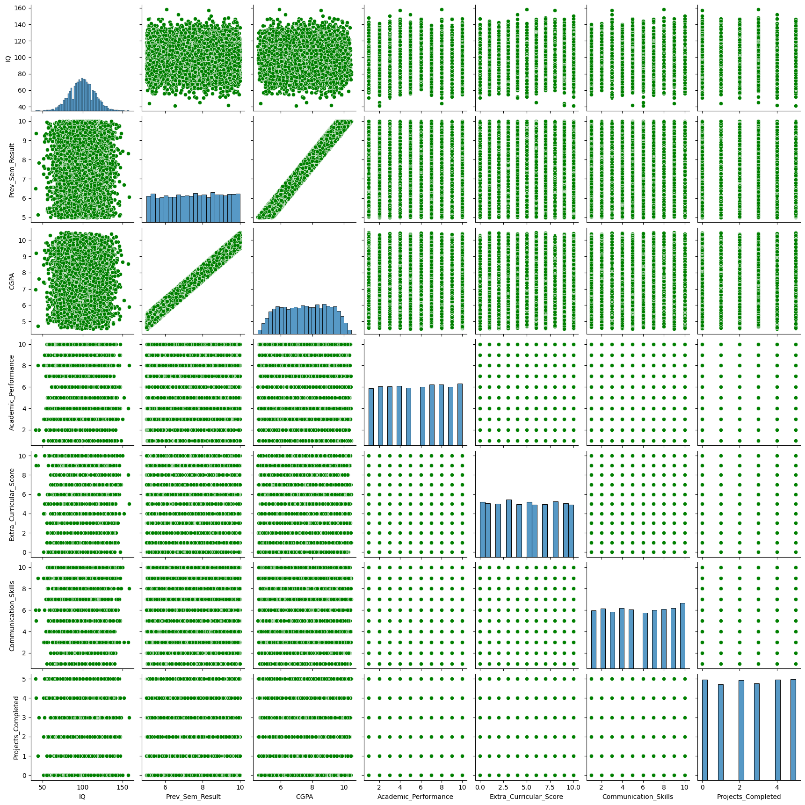
    


```python
std['Internship_Experience'] = std['Internship_Experience'].map({'Yes':1, 'No':0})

std['Placement'] = std['Placement'].map({'Yes':1, 'No':0})

```


```python

sns.pairplot(std[['Internship_Experience','Placement']],plot_kws={'color':'blue'})
```


    <seaborn.axisgrid.PairGrid at 0x2703fa42710>


    
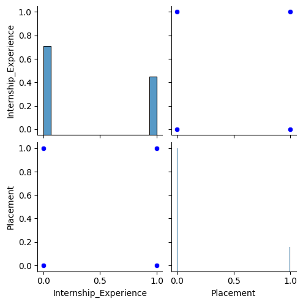
    


```python
print('_'*153)
```

    _________________________________________________________________________________________________________________________________________________________
    


```python
print("\n >>  5) Value Counts")
print('-'*20)
```

    
     >>  5) Value Counts
    --------------------
    


```python
for col in std.columns:
    display(std[col].value_counts())
```


    College_ID
    CLG0062    133
    CLG0027    120
    CLG0075    119
    CLG0065    119
    CLG0023    118
              ... 
    CLG0006     83
    CLG0060     83
    CLG0035     83
    CLG0054     79
    CLG0042     75
    Name: count, Length: 100, dtype: int64


    IQ
    99     288
    102    274
    96     270
    104    267
    100    263
          ... 
    44       1
    45       1
    42       1
    150      1
    41       1
    Name: count, Length: 104, dtype: int64


    Prev_Sem_Result
    8.41     35
    8.87     35
    5.93     35
    7.34     35
    8.05     35
             ..
    7.85     10
    5.77     10
    5.00     10
    5.71     10
    10.00     8
    Name: count, Length: 501, dtype: int64


    CGPA
    9.41     35
    7.29     32
    6.72     32
    6.09     31
    9.47     31
             ..
    10.44     1
    4.57      1
    4.67      1
    4.56      1
    4.54      1
    Name: count, Length: 590, dtype: int64


    Academic_Performance
    10    1044
    7     1027
    8     1025
    4     1004
    2      995
    3      991
    6      990
    9      987
    5      974
    1      963
    Name: count, dtype: int64


    Internship_Experience
    0    6036
    1    3964
    Name: count, dtype: int64


    Extra_Curricular_Score
    3     965
    8     931
    0     929
    5     928
    9     905
    1     903
    2     899
    7     890
    4     889
    10    882
    6     879
    Name: count, dtype: int64


    Communication_Skills
    10    1103
    4     1017
    9     1016
    2     1008
    8     1000
    5      995
    7      984
    1      980
    3      955
    6      942
    Name: count, dtype: int64


    Projects_Completed
    5    1702
    4    1693
    0    1688
    2    1681
    3    1627
    1    1609
    Name: count, dtype: int64


    Placement
    0    8341
    1    1659
    Name: count, dtype: int64


```python
print("\n >>  6) Findout The Unique Values")
print('-'*38)
```

    
     >>  6) Findout The Unique Values
    --------------------------------------
    


```python
for index in std.columns:
    print(f"{index}  --------> {std[index].nunique()} unique values")

```

    College_ID  --------> 100 unique values
    IQ  --------> 104 unique values
    Prev_Sem_Result  --------> 501 unique values
    CGPA  --------> 590 unique values
    Academic_Performance  --------> 10 unique values
    Internship_Experience  --------> 2 unique values
    Extra_Curricular_Score  --------> 11 unique values
    Communication_Skills  --------> 10 unique values
    Projects_Completed  --------> 6 unique values
    Placement  --------> 2 unique values
    


```python
print("\n >>  7) Find The Outliers")
print('-'*28)
```

    
     >>  7) Find The Outliers
    ----------------------------
    


```python
Managing_dataset_outliers= std.select_dtypes(include=[np.number])

Q1 = Managing_dataset_outliers.quantile(0.25)
Q3 = Managing_dataset_outliers.quantile(0.75)
IQR = Q3 - Q1

print(Q1)
print(Q3)
print(IQR)
```

    IQ                        89.00
    Prev_Sem_Result            6.29
    CGPA                       6.29
    Academic_Performance       3.00
    Internship_Experience      0.00
    Extra_Curricular_Score     2.00
    Communication_Skills       3.00
    Projects_Completed         1.00
    Placement                  0.00
    Name: 0.25, dtype: float64
    IQ                        110.00
    Prev_Sem_Result             8.79
    CGPA                        8.77
    Academic_Performance        8.00
    Internship_Experience       1.00
    Extra_Curricular_Score      8.00
    Communication_Skills        8.00
    Projects_Completed          4.00
    Placement                   0.00
    Name: 0.75, dtype: float64
    IQ                        21.00
    Prev_Sem_Result            2.50
    CGPA                       2.48
    Academic_Performance       5.00
    Internship_Experience      1.00
    Extra_Curricular_Score     6.00
    Communication_Skills       5.00
    Projects_Completed         3.00
    Placement                  0.00
    dtype: float64
    


```python
print("\n >>  8) Data Visualization ")
print('-'*28)
```

    
     >>  8) Data Visualization 
    ----------------------------
    


```python
print("\n > Univariate Analysis (Single Column)/ HISTOGRAM & BAR CHART")
print('-'*62)
```

    
     > Univariate Analysis (Single Column)/ HISTOGRAM & BAR CHART
    --------------------------------------------------------------
    


```python
#Univariate Analysis (Single Column)/ HISTOGRAM & BAR CHART
plt.figure(figsize=(10,12))
sns.histplot(std['IQ'], kde=True,color="red")
plt.title("HISTPLOT")
plt.show()

#Categorical Count
plt.figure(figsize=(10,12))
sns.countplot(x='IQ', data=std,color='aqua')
plt.title("COUNTPLOT")
plt.show()


#Univariate Analysis (Single Column)
plt.figure(figsize=(10,12))
sns.histplot(std['Prev_Sem_Result'], kde=True,color="yellow")
plt.title("HISTPLOT")
plt.show()

#Categorical Count
plt.figure(figsize=(10,12))
sns.countplot(x='Prev_Sem_Result', data=std,color='lime')
plt.title("COUNTPLOT")
plt.show()


#Univariate Analysis (Single Column)
plt.figure(figsize=(10,12))
sns.histplot(std['Academic_Performance'], kde=True,color="green")
plt.title("HISTPLOT")
plt.show()

#Categorical Count
plt.figure(figsize=(10,12))
sns.countplot(x='Academic_Performance', data=std,color="olive")
plt.title("COUNTPLOT")
plt.show()

```


    
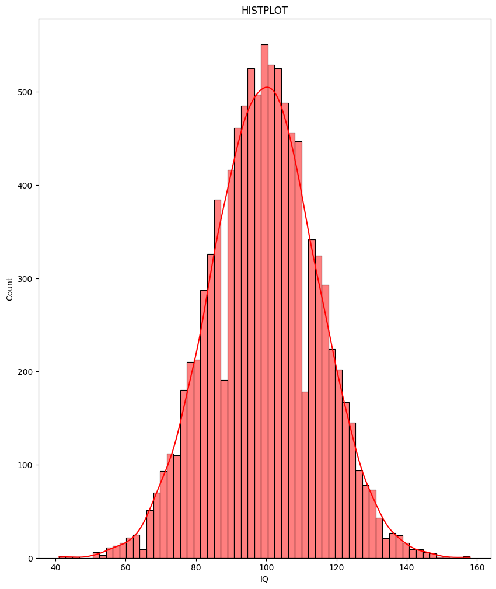
    


    
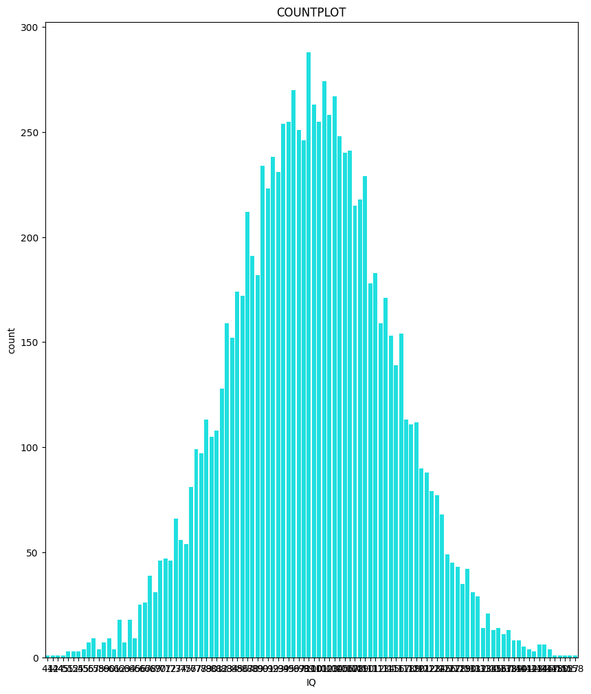
    


    
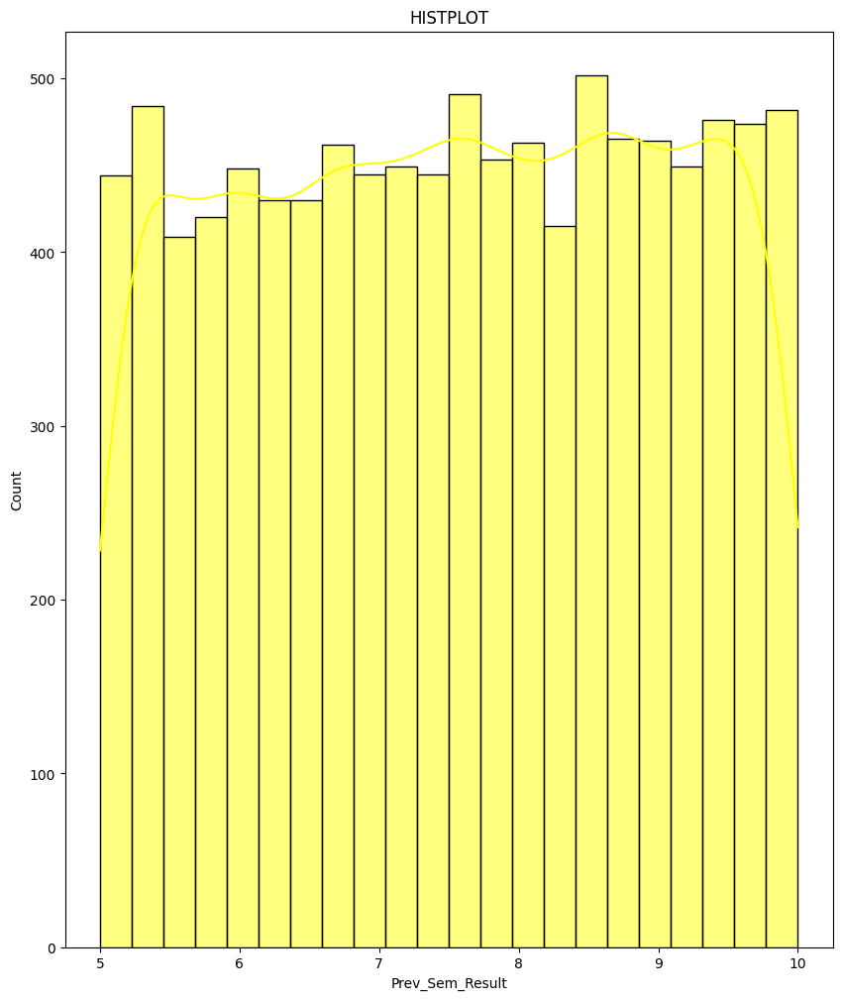
    


    
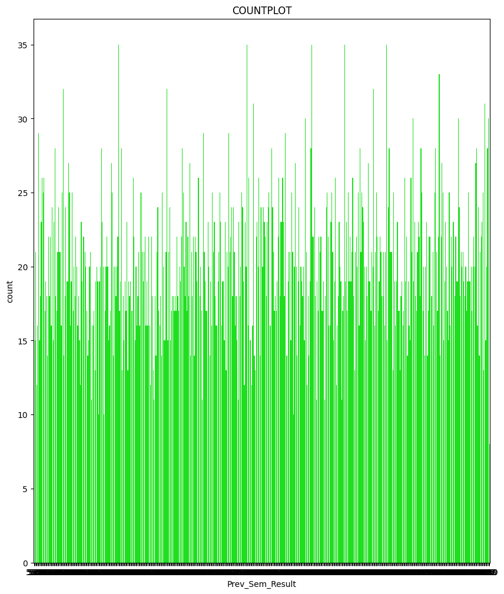
    


    
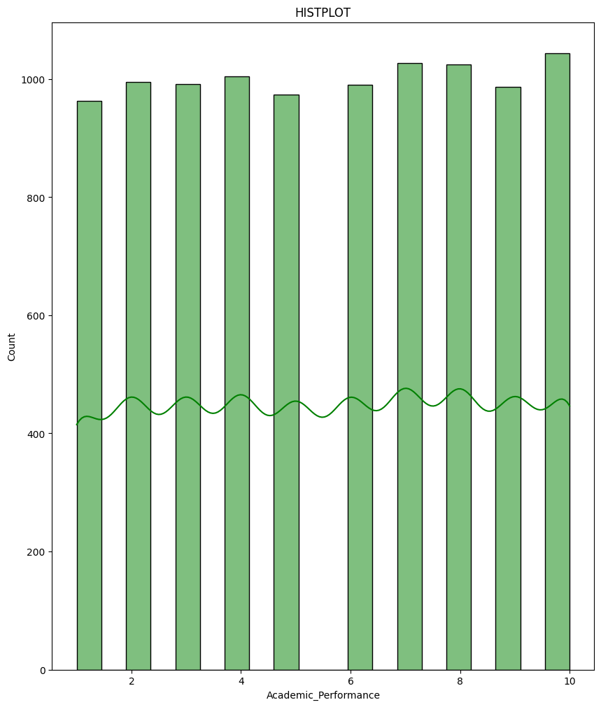
    


    
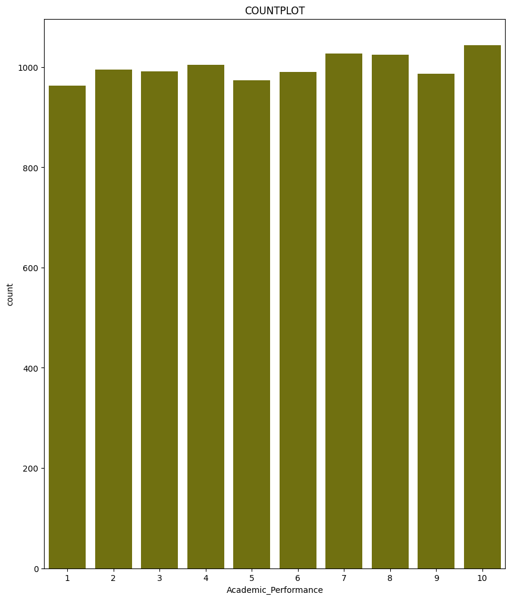
    


```python
print("\n > Univariate Analysis (Single Column)/ PIE CHART")
print('-'*50)
```

    
     > Univariate Analysis (Single Column)/ PIE CHART
    --------------------------------------------------
    


```python
plt.figure(figsize=(5,7))
plt.title("PIE CHART - Placement")
data=std['Placement'].value_counts()
colors=['green','red']
plt.pie(data.values,colors=colors,labels=data.index,autopct='%1.1f%%')
plt.show()
```


    
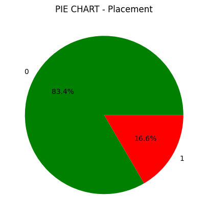
    


```python
plt.figure(figsize=(7,6))
plt.title("PIECHART- Internship Experience ")
data=std['Internship_Experience'].value_counts()
colors=['blue','olive']
plt.pie(data.values,
        colors=colors,
        labels=data.index,
        autopct='%1.1f%%')
plt.show()
```


    
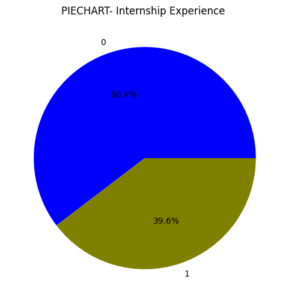
    


```python
plt.figure(figsize=(7,6))
plt.title("PIECHART - Projects Completed ")
devaraj=std['Projects_Completed'].value_counts()
manikandan=['indigo','olive','aqua','lime','teal','violet']
plt.pie(devaraj.values,
        colors=manikandan,
        labels=devaraj.index,
        autopct='%1.1f%%')
plt.show()
```


    
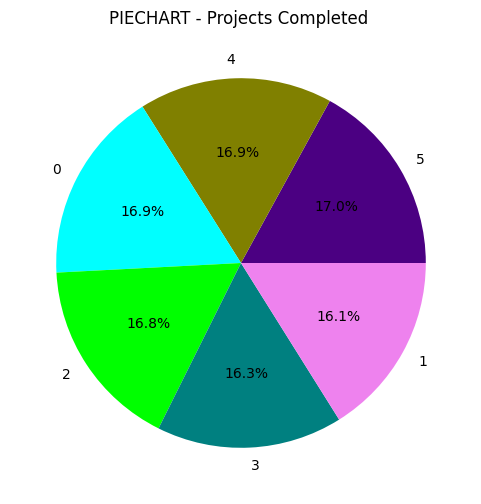
    


```python
print("\n > Bivariate Analysis // Categorical v/s Numerical - Barplot")
print('-'*68)
```

    
     > Bivariate Analysis // Categorical v/s Numerical - Barplot
    --------------------------------------------------------------------
    


```python
#Bivariate Analysis // Categorical v/s Numerical - barplot....1

# type1
plt.figure(figsize=(28,27))
m=['lime','aqua']
sns.barplot(x='IQ',y='Placement',data=std,palette=m)
plt.title('IQ  V/S Placement')
plt.yticks(rotation=50)
plt.show()

# type2
plt.figure(figsize=(40,30))
sns.barplot(x='IQ',y='Internship_Experience',data=std,color='green',palette='magma')
plt.title('IQ V/S CGPA')
plt.show()

# type3
plt.figure(figsize=(8,8))
col=['aqua','teal']
sns.barplot(hue='Placement',y='CGPA',data=std,palette=col)
plt.title('Placement')
plt.show()


```

    C:\Users\Admin\AppData\Local\Temp\ipykernel_16248\363414205.py:6: FutureWarning: 
    
    Passing `palette` without assigning `hue` is deprecated and will be removed in v0.14.0. Assign the `x` variable to `hue` and set `legend=False` for the same effect.
    
      sns.barplot(x='IQ',y='Placement',data=std,palette=m)
    C:\Users\Admin\AppData\Local\Temp\ipykernel_16248\363414205.py:6: UserWarning: 
    The palette list has fewer values (2) than needed (104) and will cycle, which may produce an uninterpretable plot.
      sns.barplot(x='IQ',y='Placement',data=std,palette=m)
    


    
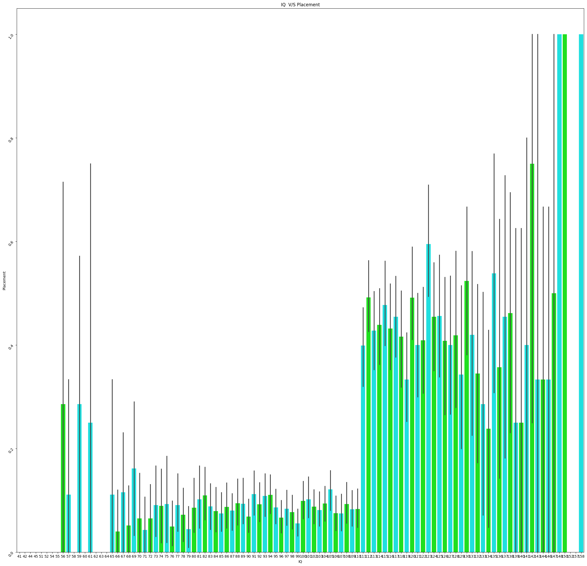
    


    C:\Users\Admin\AppData\Local\Temp\ipykernel_16248\363414205.py:13: FutureWarning: 
    
    Passing `palette` without assigning `hue` is deprecated and will be removed in v0.14.0. Assign the `x` variable to `hue` and set `legend=False` for the same effect.
    
      sns.barplot(x='IQ',y='Internship_Experience',data=std,color='green',palette='magma')
    


    
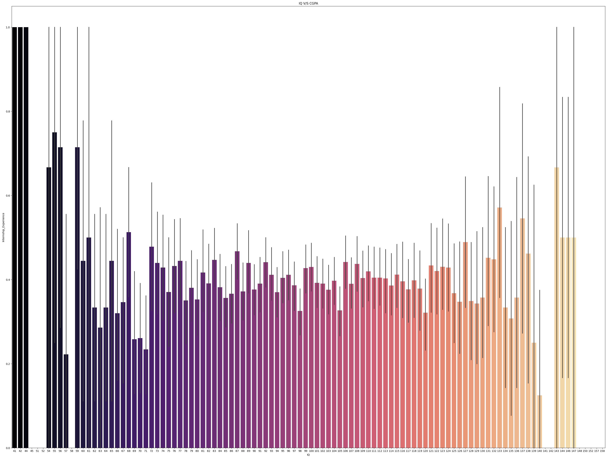
    


    
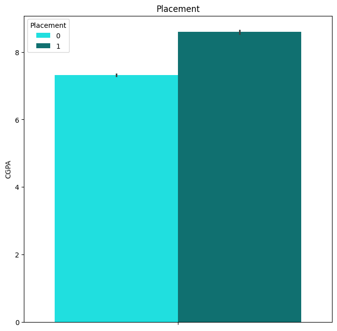
    


```python
print("\n > Bivariate Analysis // Numerical v/s Numerical - scatterplot")
print('-'*64)
```

    
     > Bivariate Analysis // Numerical v/s Numerical - scatterplot
    ----------------------------------------------------------------
    


```python
#Bivariate Analysis // Numerical v/s Numerical - scatterplot....1

plt.figure(figsize=(9,8))
sns.scatterplot(x='Academic_Performance',y='Extra_Curricular_Score',data=std,color='green')
plt.title('scatterplot')
plt.xticks(rotation=50)
plt.show()

#Bivariate Analysis // Numerical v/s Numerical - scatterplot....2
plt.figure(figsize=(20,20))
sns.scatterplot(x='IQ',y='CGPA',data=std,color='blue')
plt.title('scatter plot')
plt.xticks(rotation=50)
plt.show()

```


    
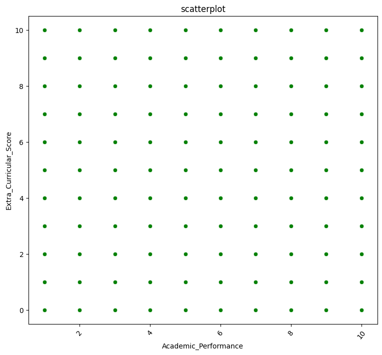
    


    
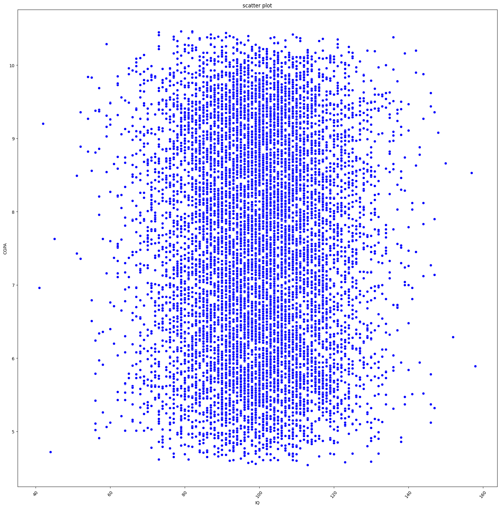
    


```python
print("\n > Bivariate Analysis // Categorical v/s Categorical - Countplot")
print('-'*65)
```

    
     > Bivariate Analysis // Categorical v/s Categorical - Countplot
    -----------------------------------------------------------------
    


```python
# Bivariate Analysis // Categorical v/s Categorical - Countplot

plt.figure(figsize=(6,5))
sns.countplot(x='Placement',hue='Internship_Experience',data=std)
plt.title('Placement V/S  Internship_Experience')
plt.xticks(rotation=4)
plt.show()
```


    
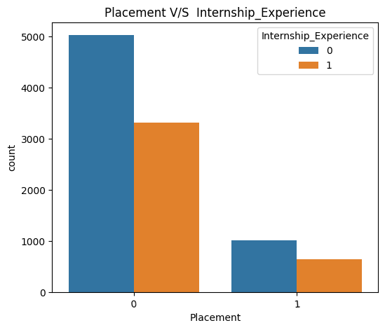
    


```python
print("\n >  Multi variate Analysis // HEAT MAP")
print('-'*39)
```

    
     >  Multi variate Analysis // HEAT MAP
    ---------------------------------------
    


```python
plt.figure(figsize=(10,10))
plt.title("college-student")
sns.heatmap(std.corr(numeric_only=True),annot=True,cmap="plasma",center=0.2) #cmap=viridis,plasma,inferno,magma,coolwarm,RdBu...etc
plt.show()
```


    
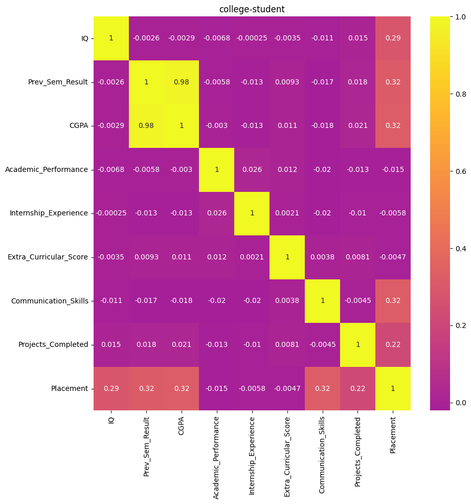
    


```python
print("\n >  Histogram (Distribution)// 2 numerical columns")
print('-'*50)
```

    
     >  Histogram (Distribution)// 2 numerical columns
    --------------------------------------------------
    


```python
# Histogram (Distribution)// 2 numerical columns

sns.histplot(std['Placement'], kde=True, bins=30,color="orange")
plt.title("Histogram")
plt.xlabel("Placement")
plt.ylabel("Extra_Curricular_Score")
plt.show()

sns.histplot(std['CGPA'], kde=True, bins=30,color="silver")
plt.title("Histogram")
plt.xlabel("CGPA")
plt.ylabel("IQ")
plt.show()
```


    
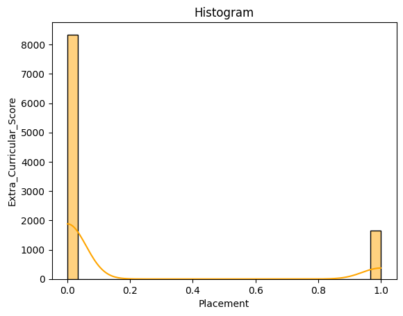
    


    
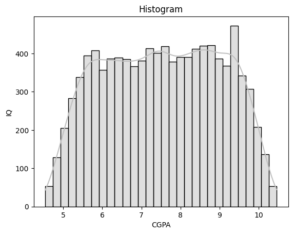
    


```python
print("\n > Boxplot Plot (Relation Between 2 Numerical Columns")
print('-'*58)
```

    
     > Boxplot Plot (Relation Between 2 Numerical Columns
    ----------------------------------------------------------
    


```python
#boxplot Plot (Relation Between 2 Numerical Columns)

plt.figure(figsize=(30,15))
sns.boxplot(x='Academic_Performance',y='Extra_Curricular_Score',data=std,color="tan")
plt.title("Academic_Performance  vs Extra_Curricular_Score ")
plt.show()

plt.figure(figsize=(30,15))
sns.boxplot(x='IQ',y='CGPA',data=std,color="magenta")
plt.title("IQ vs CGPA")
plt.show()

plt.figure(figsize=(10,10))
sns.boxplot(x='Internship_Experience',y='Projects_Completed',data=std,color="cyan")
plt.title("Internship_Experience vs Projects_Completed ")
plt.show()


```


    
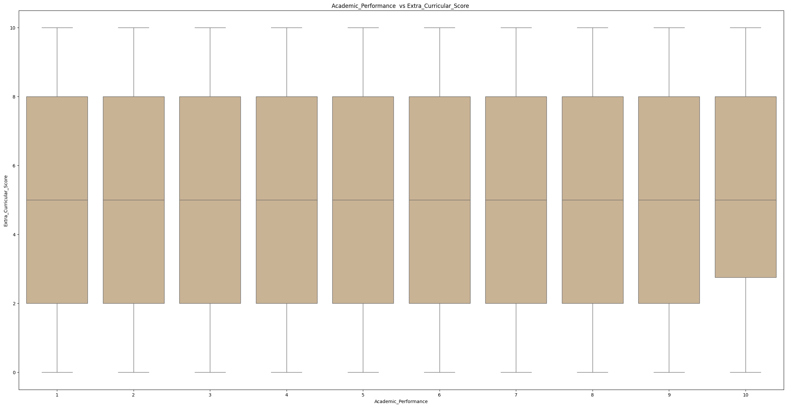
    


    
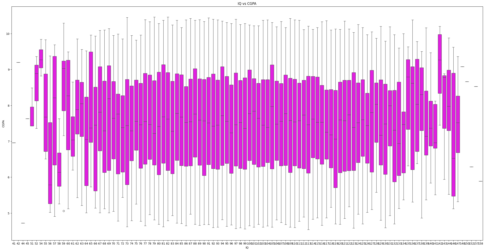
    


    
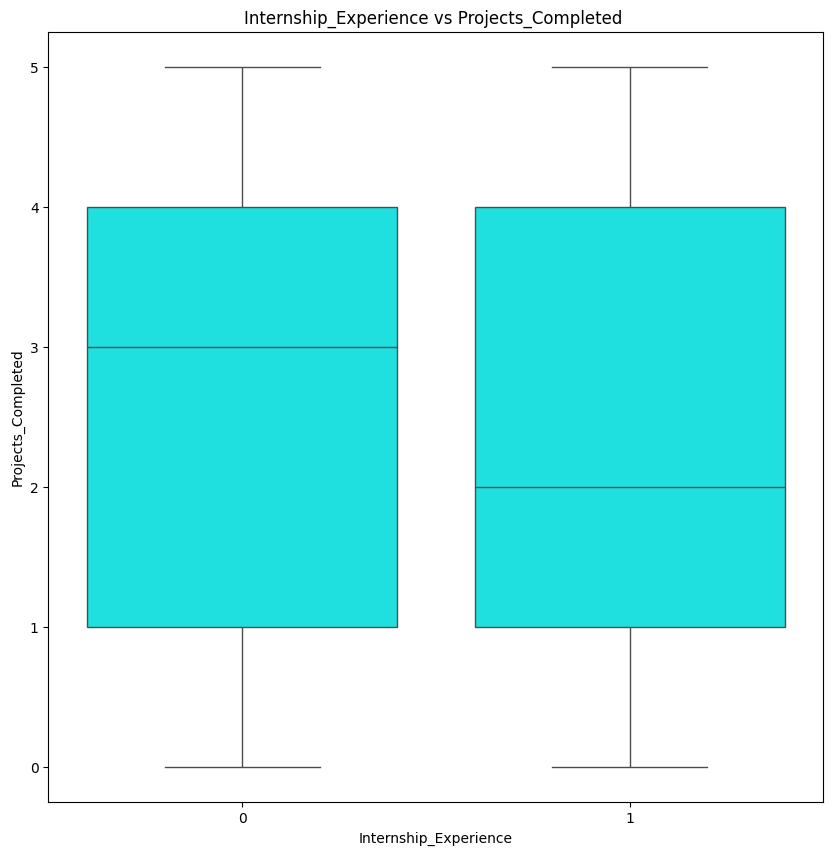
    


```python
print("\n > Pair Plot (Full Relationship View)")
print('-'*38)
```

    
     > Pair Plot (Full Relationship View)
    --------------------------------------
    


```python
#type 1
sns.pairplot(std)
```


    <seaborn.axisgrid.PairGrid at 0x2704e3e6710>


    
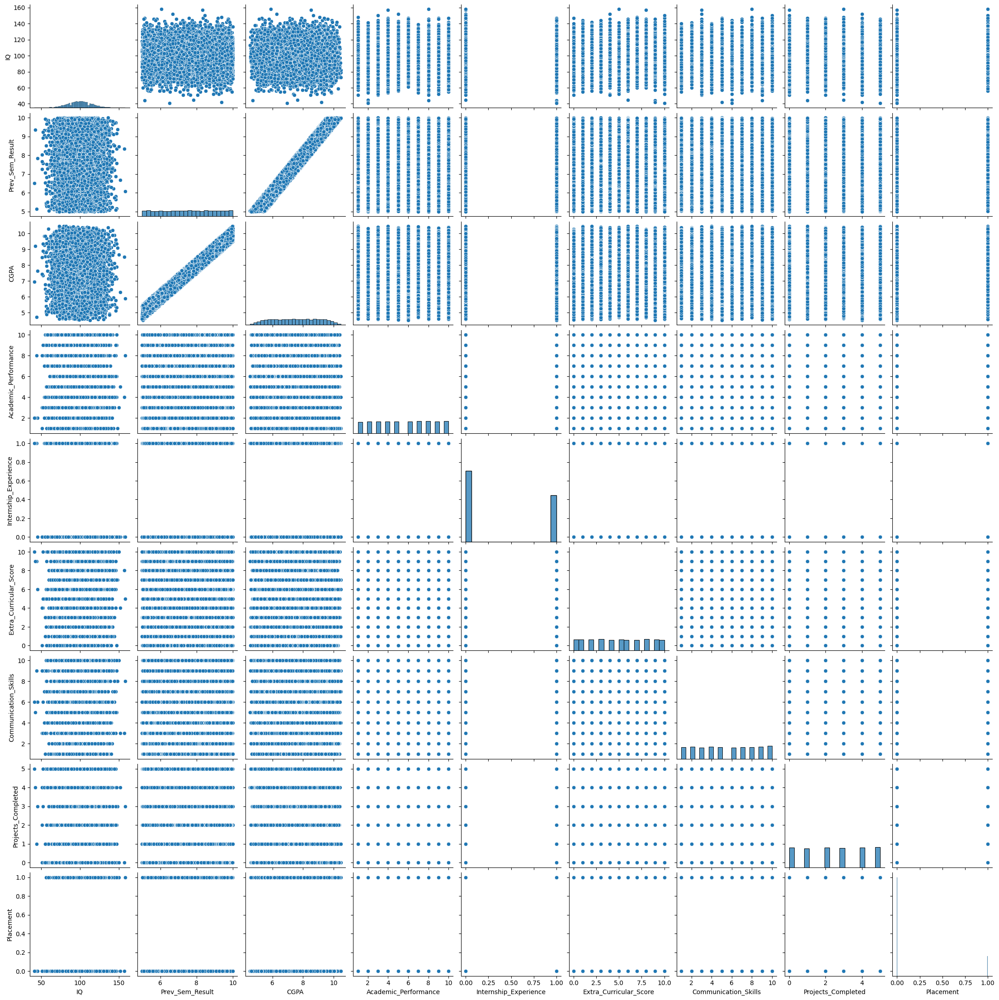
    


```python
# type 2
value_data=['IQ','CGPA','Academic_Performance','Internship_Experience', 'Placement']
sns.pairplot(std[value_data],hue="Placement",palette=['teal','violet'])
plt.show()
```


    
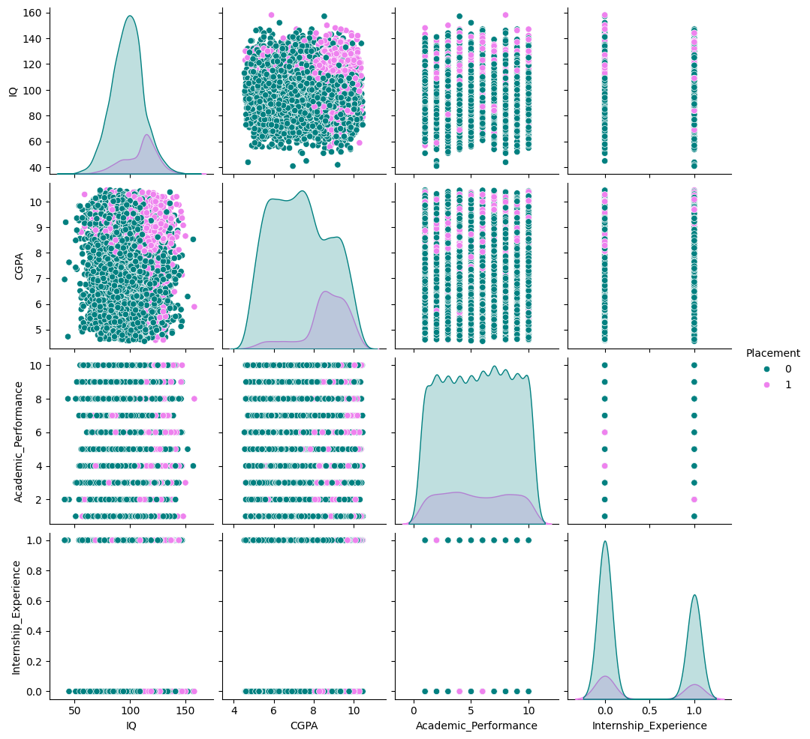
    


```python
#type 3

plt.figure(figsize=(40,36))
sns.pairplot(std,hue='Placement',palette=['Orange','red'])
plt.show()
```


    <Figure size 4000x3600 with 0 Axes>


    
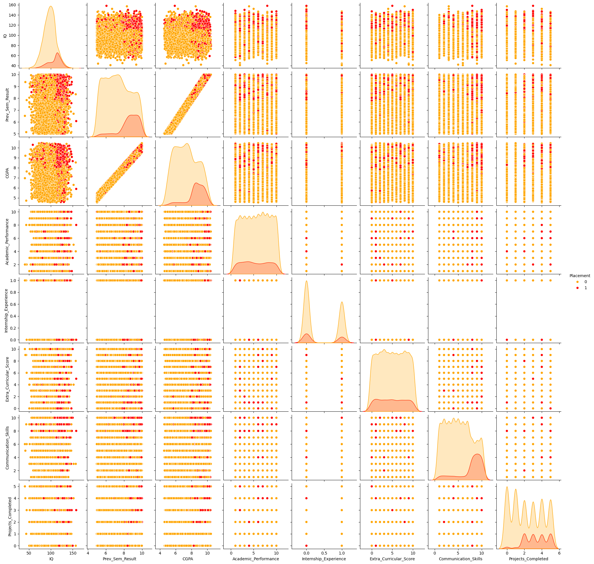
    


```python
print('_'*155)
```

    ___________________________________________________________________________________________________________________________________________________________
    


```python
print(" \n 9) Model Building concepts")
print('-'*27)
```

     
     9) Model Building concepts
    ---------------------------
    


```python
print(" \n 1 >> Linear Regression")
print('-'*24)
```

     
     1 >> Linear Regression
    ------------------------
    


```python
import pandas as pd
import numpy as np
import seaborn as sns
import matplotlib.pyplot as plt

from sklearn.model_selection import train_test_split
from sklearn.preprocessing import StandardScaler
from sklearn.linear_model import LinearRegression
from sklearn.preprocessing import LabelEncoder
from sklearn.metrics import mean_absolute_error, mean_squared_error, r2_score
from sklearn.metrics import accuracy_score, classification_report, confusion_matrix

```


```python
# Load Dataset
std=pd.read_csv("college_student.csv")

```


```python
# Check missing values
print(std.isnull().sum())
```

    College_ID                0
    IQ                        0
    Prev_Sem_Result           0
    CGPA                      0
    Academic_Performance      0
    Internship_Experience     0
    Extra_Curricular_Score    0
    Communication_Skills      0
    Projects_Completed        0
    Placement                 0
    dtype: int64
    


```python
# Convert categorical columns to numeric
df = pd.get_dummies(std,drop_first=True)
```


```python
encode= ['College_ID', 'IQ', 'Prev_Sem_Result', 'CGPA', 'Academic_Performance',
                'Internship_Experience', 'Extra_Curricular_Score','Communication_Skills', 'Projects_Completed', 'Placement']
```


```python
LabelEncoding=LabelEncoder()
```


```python
for col in encode:
    std[col]=LabelEncoding.fit_transform(std[col])
```


```python
# Define Features and Target
X=std.drop("Placement",axis=1) #............. >> Feature Variable
y=std["Placement"]  # .............. >> target Variable
```


```python
X
```


<div>
<style scoped>
    .dataframe tbody tr th:only-of-type {
        vertical-align: middle;
    }

    .dataframe tbody tr th {
        vertical-align: top;
    }

    .dataframe thead th {
        text-align: right;
    }
</style>
<table border="1" class="dataframe">
  <thead>
    <tr style="text-align: right;">
      <th></th>
      <th>College_ID</th>
      <th>IQ</th>
      <th>Prev_Sem_Result</th>
      <th>CGPA</th>
      <th>Academic_Performance</th>
      <th>Internship_Experience</th>
      <th>Extra_Curricular_Score</th>
      <th>Communication_Skills</th>
      <th>Projects_Completed</th>
    </tr>
  </thead>
  <tbody>
    <tr>
      <th>0</th>
      <td>29</td>
      <td>59</td>
      <td>161</td>
      <td>173</td>
      <td>7</td>
      <td>0</td>
      <td>8</td>
      <td>7</td>
      <td>4</td>
    </tr>
    <tr>
      <th>1</th>
      <td>60</td>
      <td>49</td>
      <td>52</td>
      <td>82</td>
      <td>7</td>
      <td>0</td>
      <td>7</td>
      <td>7</td>
      <td>0</td>
    </tr>
    <tr>
      <th>2</th>
      <td>35</td>
      <td>61</td>
      <td>36</td>
      <td>128</td>
      <td>8</td>
      <td>0</td>
      <td>3</td>
      <td>0</td>
      <td>1</td>
    </tr>
    <tr>
      <th>3</th>
      <td>54</td>
      <td>74</td>
      <td>47</td>
      <td>120</td>
      <td>5</td>
      <td>1</td>
      <td>1</td>
      <td>5</td>
      <td>1</td>
    </tr>
    <tr>
      <th>4</th>
      <td>3</td>
      <td>48</td>
      <td>291</td>
      <td>314</td>
      <td>6</td>
      <td>0</td>
      <td>8</td>
      <td>9</td>
      <td>2</td>
    </tr>
    <tr>
      <th>...</th>
      <td>...</td>
      <td>...</td>
      <td>...</td>
      <td>...</td>
      <td>...</td>
      <td>...</td>
      <td>...</td>
      <td>...</td>
      <td>...</td>
    </tr>
    <tr>
      <th>9995</th>
      <td>20</td>
      <td>71</td>
      <td>341</td>
      <td>374</td>
      <td>3</td>
      <td>0</td>
      <td>1</td>
      <td>7</td>
      <td>0</td>
    </tr>
    <tr>
      <th>9996</th>
      <td>97</td>
      <td>22</td>
      <td>425</td>
      <td>479</td>
      <td>6</td>
      <td>0</td>
      <td>0</td>
      <td>6</td>
      <td>2</td>
    </tr>
    <tr>
      <th>9997</th>
      <td>65</td>
      <td>41</td>
      <td>108</td>
      <td>170</td>
      <td>2</td>
      <td>1</td>
      <td>3</td>
      <td>8</td>
      <td>5</td>
    </tr>
    <tr>
      <th>9998</th>
      <td>44</td>
      <td>59</td>
      <td>377</td>
      <td>437</td>
      <td>2</td>
      <td>0</td>
      <td>7</td>
      <td>4</td>
      <td>1</td>
    </tr>
    <tr>
      <th>9999</th>
      <td>59</td>
      <td>61</td>
      <td>441</td>
      <td>522</td>
      <td>7</td>
      <td>0</td>
      <td>3</td>
      <td>4</td>
      <td>5</td>
    </tr>
  </tbody>
</table>
<p>10000 rows × 9 columns</p>
</div>


```python
y
```


    0       0
    1       0
    2       0
    3       0
    4       0
           ..
    9995    1
    9996    0
    9997    0
    9998    0
    9999    0
    Name: Placement, Length: 10000, dtype: int64


```python
# Train-Test Split
X_train, X_test, y_train, y_test = train_test_split( X,y, test_size=0.2, random_state=42)
```


```python
# Feature Scaling
scaler = StandardScaler()

```


```python
scaler.fit(X)
```


<style>#sk-container-id-1 {
  /* Definition of color scheme common for light and dark mode */
  --sklearn-color-text: #000;
  --sklearn-color-text-muted: #666;
  --sklearn-color-line: gray;
  /* Definition of color scheme for unfitted estimators */
  --sklearn-color-unfitted-level-0: #fff5e6;
  --sklearn-color-unfitted-level-1: #f6e4d2;
  --sklearn-color-unfitted-level-2: #ffe0b3;
  --sklearn-color-unfitted-level-3: chocolate;
  /* Definition of color scheme for fitted estimators */
  --sklearn-color-fitted-level-0: #f0f8ff;
  --sklearn-color-fitted-level-1: #d4ebff;
  --sklearn-color-fitted-level-2: #b3dbfd;
  --sklearn-color-fitted-level-3: cornflowerblue;

  /* Specific color for light theme */
  --sklearn-color-text-on-default-background: var(--sg-text-color, var(--theme-code-foreground, var(--jp-content-font-color1, black)));
  --sklearn-color-background: var(--sg-background-color, var(--theme-background, var(--jp-layout-color0, white)));
  --sklearn-color-border-box: var(--sg-text-color, var(--theme-code-foreground, var(--jp-content-font-color1, black)));
  --sklearn-color-icon: #696969;

  @media (prefers-color-scheme: dark) {
    /* Redefinition of color scheme for dark theme */
    --sklearn-color-text-on-default-background: var(--sg-text-color, var(--theme-code-foreground, var(--jp-content-font-color1, white)));
    --sklearn-color-background: var(--sg-background-color, var(--theme-background, var(--jp-layout-color0, #111)));
    --sklearn-color-border-box: var(--sg-text-color, var(--theme-code-foreground, var(--jp-content-font-color1, white)));
    --sklearn-color-icon: #878787;
  }
}

#sk-container-id-1 {
  color: var(--sklearn-color-text);
}

#sk-container-id-1 pre {
  padding: 0;
}

#sk-container-id-1 input.sk-hidden--visually {
  border: 0;
  clip: rect(1px 1px 1px 1px);
  clip: rect(1px, 1px, 1px, 1px);
  height: 1px;
  margin: -1px;
  overflow: hidden;
  padding: 0;
  position: absolute;
  width: 1px;
}

#sk-container-id-1 div.sk-dashed-wrapped {
  border: 1px dashed var(--sklearn-color-line);
  margin: 0 0.4em 0.5em 0.4em;
  box-sizing: border-box;
  padding-bottom: 0.4em;
  background-color: var(--sklearn-color-background);
}

#sk-container-id-1 div.sk-container {
  /* jupyter's `normalize.less` sets `[hidden] { display: none; }`
     but bootstrap.min.css set `[hidden] { display: none !important; }`
     so we also need the `!important` here to be able to override the
     default hidden behavior on the sphinx rendered scikit-learn.org.
     See: https://github.com/scikit-learn/scikit-learn/issues/21755 */
  display: inline-block !important;
  position: relative;
}

#sk-container-id-1 div.sk-text-repr-fallback {
  display: none;
}

div.sk-parallel-item,
div.sk-serial,
div.sk-item {
  /* draw centered vertical line to link estimators */
  background-image: linear-gradient(var(--sklearn-color-text-on-default-background), var(--sklearn-color-text-on-default-background));
  background-size: 2px 100%;
  background-repeat: no-repeat;
  background-position: center center;
}

/* Parallel-specific style estimator block */

#sk-container-id-1 div.sk-parallel-item::after {
  content: "";
  width: 100%;
  border-bottom: 2px solid var(--sklearn-color-text-on-default-background);
  flex-grow: 1;
}

#sk-container-id-1 div.sk-parallel {
  display: flex;
  align-items: stretch;
  justify-content: center;
  background-color: var(--sklearn-color-background);
  position: relative;
}

#sk-container-id-1 div.sk-parallel-item {
  display: flex;
  flex-direction: column;
}

#sk-container-id-1 div.sk-parallel-item:first-child::after {
  align-self: flex-end;
  width: 50%;
}

#sk-container-id-1 div.sk-parallel-item:last-child::after {
  align-self: flex-start;
  width: 50%;
}

#sk-container-id-1 div.sk-parallel-item:only-child::after {
  width: 0;
}

/* Serial-specific style estimator block */

#sk-container-id-1 div.sk-serial {
  display: flex;
  flex-direction: column;
  align-items: center;
  background-color: var(--sklearn-color-background);
  padding-right: 1em;
  padding-left: 1em;
}


/* Toggleable style: style used for estimator/Pipeline/ColumnTransformer box that is
clickable and can be expanded/collapsed.
- Pipeline and ColumnTransformer use this feature and define the default style
- Estimators will overwrite some part of the style using the `sk-estimator` class
*/

/* Pipeline and ColumnTransformer style (default) */

#sk-container-id-1 div.sk-toggleable {
  /* Default theme specific background. It is overwritten whether we have a
  specific estimator or a Pipeline/ColumnTransformer */
  background-color: var(--sklearn-color-background);
}

/* Toggleable label */
#sk-container-id-1 label.sk-toggleable__label {
  cursor: pointer;
  display: flex;
  width: 100%;
  margin-bottom: 0;
  padding: 0.5em;
  box-sizing: border-box;
  text-align: center;
  align-items: start;
  justify-content: space-between;
  gap: 0.5em;
}

#sk-container-id-1 label.sk-toggleable__label .caption {
  font-size: 0.6rem;
  font-weight: lighter;
  color: var(--sklearn-color-text-muted);
}

#sk-container-id-1 label.sk-toggleable__label-arrow:before {
  /* Arrow on the left of the label */
  content: "▸";
  float: left;
  margin-right: 0.25em;
  color: var(--sklearn-color-icon);
}

#sk-container-id-1 label.sk-toggleable__label-arrow:hover:before {
  color: var(--sklearn-color-text);
}

/* Toggleable content - dropdown */

#sk-container-id-1 div.sk-toggleable__content {
  display: none;
  text-align: left;
  /* unfitted */
  background-color: var(--sklearn-color-unfitted-level-0);
}

#sk-container-id-1 div.sk-toggleable__content.fitted {
  /* fitted */
  background-color: var(--sklearn-color-fitted-level-0);
}

#sk-container-id-1 div.sk-toggleable__content pre {
  margin: 0.2em;
  border-radius: 0.25em;
  color: var(--sklearn-color-text);
  /* unfitted */
  background-color: var(--sklearn-color-unfitted-level-0);
}

#sk-container-id-1 div.sk-toggleable__content.fitted pre {
  /* unfitted */
  background-color: var(--sklearn-color-fitted-level-0);
}

#sk-container-id-1 input.sk-toggleable__control:checked~div.sk-toggleable__content {
  /* Expand drop-down */
  display: block;
  width: 100%;
  overflow: visible;
}

#sk-container-id-1 input.sk-toggleable__control:checked~label.sk-toggleable__label-arrow:before {
  content: "▾";
}

/* Pipeline/ColumnTransformer-specific style */

#sk-container-id-1 div.sk-label input.sk-toggleable__control:checked~label.sk-toggleable__label {
  color: var(--sklearn-color-text);
  background-color: var(--sklearn-color-unfitted-level-2);
}

#sk-container-id-1 div.sk-label.fitted input.sk-toggleable__control:checked~label.sk-toggleable__label {
  background-color: var(--sklearn-color-fitted-level-2);
}

/* Estimator-specific style */

/* Colorize estimator box */
#sk-container-id-1 div.sk-estimator input.sk-toggleable__control:checked~label.sk-toggleable__label {
  /* unfitted */
  background-color: var(--sklearn-color-unfitted-level-2);
}

#sk-container-id-1 div.sk-estimator.fitted input.sk-toggleable__control:checked~label.sk-toggleable__label {
  /* fitted */
  background-color: var(--sklearn-color-fitted-level-2);
}

#sk-container-id-1 div.sk-label label.sk-toggleable__label,
#sk-container-id-1 div.sk-label label {
  /* The background is the default theme color */
  color: var(--sklearn-color-text-on-default-background);
}

/* On hover, darken the color of the background */
#sk-container-id-1 div.sk-label:hover label.sk-toggleable__label {
  color: var(--sklearn-color-text);
  background-color: var(--sklearn-color-unfitted-level-2);
}

/* Label box, darken color on hover, fitted */
#sk-container-id-1 div.sk-label.fitted:hover label.sk-toggleable__label.fitted {
  color: var(--sklearn-color-text);
  background-color: var(--sklearn-color-fitted-level-2);
}

/* Estimator label */

#sk-container-id-1 div.sk-label label {
  font-family: monospace;
  font-weight: bold;
  display: inline-block;
  line-height: 1.2em;
}

#sk-container-id-1 div.sk-label-container {
  text-align: center;
}

/* Estimator-specific */
#sk-container-id-1 div.sk-estimator {
  font-family: monospace;
  border: 1px dotted var(--sklearn-color-border-box);
  border-radius: 0.25em;
  box-sizing: border-box;
  margin-bottom: 0.5em;
  /* unfitted */
  background-color: var(--sklearn-color-unfitted-level-0);
}

#sk-container-id-1 div.sk-estimator.fitted {
  /* fitted */
  background-color: var(--sklearn-color-fitted-level-0);
}

/* on hover */
#sk-container-id-1 div.sk-estimator:hover {
  /* unfitted */
  background-color: var(--sklearn-color-unfitted-level-2);
}

#sk-container-id-1 div.sk-estimator.fitted:hover {
  /* fitted */
  background-color: var(--sklearn-color-fitted-level-2);
}

/* Specification for estimator info (e.g. "i" and "?") */

/* Common style for "i" and "?" */

.sk-estimator-doc-link,
a:link.sk-estimator-doc-link,
a:visited.sk-estimator-doc-link {
  float: right;
  font-size: smaller;
  line-height: 1em;
  font-family: monospace;
  background-color: var(--sklearn-color-background);
  border-radius: 1em;
  height: 1em;
  width: 1em;
  text-decoration: none !important;
  margin-left: 0.5em;
  text-align: center;
  /* unfitted */
  border: var(--sklearn-color-unfitted-level-1) 1pt solid;
  color: var(--sklearn-color-unfitted-level-1);
}

.sk-estimator-doc-link.fitted,
a:link.sk-estimator-doc-link.fitted,
a:visited.sk-estimator-doc-link.fitted {
  /* fitted */
  border: var(--sklearn-color-fitted-level-1) 1pt solid;
  color: var(--sklearn-color-fitted-level-1);
}

/* On hover */
div.sk-estimator:hover .sk-estimator-doc-link:hover,
.sk-estimator-doc-link:hover,
div.sk-label-container:hover .sk-estimator-doc-link:hover,
.sk-estimator-doc-link:hover {
  /* unfitted */
  background-color: var(--sklearn-color-unfitted-level-3);
  color: var(--sklearn-color-background);
  text-decoration: none;
}

div.sk-estimator.fitted:hover .sk-estimator-doc-link.fitted:hover,
.sk-estimator-doc-link.fitted:hover,
div.sk-label-container:hover .sk-estimator-doc-link.fitted:hover,
.sk-estimator-doc-link.fitted:hover {
  /* fitted */
  background-color: var(--sklearn-color-fitted-level-3);
  color: var(--sklearn-color-background);
  text-decoration: none;
}

/* Span, style for the box shown on hovering the info icon */
.sk-estimator-doc-link span {
  display: none;
  z-index: 9999;
  position: relative;
  font-weight: normal;
  right: .2ex;
  padding: .5ex;
  margin: .5ex;
  width: min-content;
  min-width: 20ex;
  max-width: 50ex;
  color: var(--sklearn-color-text);
  box-shadow: 2pt 2pt 4pt #999;
  /* unfitted */
  background: var(--sklearn-color-unfitted-level-0);
  border: .5pt solid var(--sklearn-color-unfitted-level-3);
}

.sk-estimator-doc-link.fitted span {
  /* fitted */
  background: var(--sklearn-color-fitted-level-0);
  border: var(--sklearn-color-fitted-level-3);
}

.sk-estimator-doc-link:hover span {
  display: block;
}

/* "?"-specific style due to the `<a>` HTML tag */

#sk-container-id-1 a.estimator_doc_link {
  float: right;
  font-size: 1rem;
  line-height: 1em;
  font-family: monospace;
  background-color: var(--sklearn-color-background);
  border-radius: 1rem;
  height: 1rem;
  width: 1rem;
  text-decoration: none;
  /* unfitted */
  color: var(--sklearn-color-unfitted-level-1);
  border: var(--sklearn-color-unfitted-level-1) 1pt solid;
}

#sk-container-id-1 a.estimator_doc_link.fitted {
  /* fitted */
  border: var(--sklearn-color-fitted-level-1) 1pt solid;
  color: var(--sklearn-color-fitted-level-1);
}

/* On hover */
#sk-container-id-1 a.estimator_doc_link:hover {
  /* unfitted */
  background-color: var(--sklearn-color-unfitted-level-3);
  color: var(--sklearn-color-background);
  text-decoration: none;
}

#sk-container-id-1 a.estimator_doc_link.fitted:hover {
  /* fitted */
  background-color: var(--sklearn-color-fitted-level-3);
}

.estimator-table summary {
    padding: .5rem;
    font-family: monospace;
    cursor: pointer;
}

.estimator-table details[open] {
    padding-left: 0.1rem;
    padding-right: 0.1rem;
    padding-bottom: 0.3rem;
}

.estimator-table .parameters-table {
    margin-left: auto !important;
    margin-right: auto !important;
}

.estimator-table .parameters-table tr:nth-child(odd) {
    background-color: #fff;
}

.estimator-table .parameters-table tr:nth-child(even) {
    background-color: #f6f6f6;
}

.estimator-table .parameters-table tr:hover {
    background-color: #e0e0e0;
}

.estimator-table table td {
    border: 1px solid rgba(106, 105, 104, 0.232);
}

.user-set td {
    color:rgb(255, 94, 0);
    text-align: left;
}

.user-set td.value pre {
    color:rgb(255, 94, 0) !important;
    background-color: transparent !important;
}

.default td {
    color: black;
    text-align: left;
}

.user-set td i,
.default td i {
    color: black;
}

.copy-paste-icon {
    background-image: url();
    background-repeat: no-repeat;
    background-size: 14px 14px;
    background-position: 0;
    display: inline-block;
    width: 14px;
    height: 14px;
    cursor: pointer;
}
</style><body><div id="sk-container-id-1" class="sk-top-container"><div class="sk-text-repr-fallback"><pre>StandardScaler()</pre><b>In a Jupyter environment, please rerun this cell to show the HTML representation or trust the notebook. <br />On GitHub, the HTML representation is unable to render, please try loading this page with nbviewer.org.</b></div><div class="sk-container" hidden><div class="sk-item"><div class="sk-estimator fitted sk-toggleable"><input class="sk-toggleable__control sk-hidden--visually" id="sk-estimator-id-1" type="checkbox" checked><label for="sk-estimator-id-1" class="sk-toggleable__label fitted sk-toggleable__label-arrow"><div><div>StandardScaler</div></div><div><a class="sk-estimator-doc-link fitted" rel="noreferrer" target="_blank" href="https://scikit-learn.org/1.7/modules/generated/sklearn.preprocessing.StandardScaler.html">?<span>Documentation for StandardScaler</span></a><span class="sk-estimator-doc-link fitted">i<span>Fitted</span></span></div></label><div class="sk-toggleable__content fitted" data-param-prefix="">
        <div class="estimator-table">
            <details>
                <summary>Parameters</summary>
                <table class="parameters-table">
                  <tbody>

        <tr class="default">
            <td><i class="copy-paste-icon"
                 onclick="copyToClipboard('copy',
                          this.parentElement.nextElementSibling)"
            ></i></td>
            <td class="param">copy&nbsp;</td>
            <td class="value">True</td>
        </tr>


        <tr class="default">
            <td><i class="copy-paste-icon"
                 onclick="copyToClipboard('with_mean',
                          this.parentElement.nextElementSibling)"
            ></i></td>
            <td class="param">with_mean&nbsp;</td>
            <td class="value">True</td>
        </tr>


        <tr class="default">
            <td><i class="copy-paste-icon"
                 onclick="copyToClipboard('with_std',
                          this.parentElement.nextElementSibling)"
            ></i></td>
            <td class="param">with_std&nbsp;</td>
            <td class="value">True</td>
        </tr>

                  </tbody>
                </table>
            </details>
        </div>
    </div></div></div></div></div><script>function copyToClipboard(text, element) {
    // Get the parameter prefix from the closest toggleable content
    const toggleableContent = element.closest('.sk-toggleable__content');
    const paramPrefix = toggleableContent ? toggleableContent.dataset.paramPrefix : '';
    const fullParamName = paramPrefix ? `${paramPrefix}${text}` : text;

    const originalStyle = element.style;
    const computedStyle = window.getComputedStyle(element);
    const originalWidth = computedStyle.width;
    const originalHTML = element.innerHTML.replace('Copied!', '');

    navigator.clipboard.writeText(fullParamName)
        .then(() => {
            element.style.width = originalWidth;
            element.style.color = 'green';
            element.innerHTML = "Copied!";

            setTimeout(() => {
                element.innerHTML = originalHTML;
                element.style = originalStyle;
            }, 2000);
        })
        .catch(err => {
            console.error('Failed to copy:', err);
            element.style.color = 'red';
            element.innerHTML = "Failed!";
            setTimeout(() => {
                element.innerHTML = originalHTML;
                element.style = originalStyle;
            }, 2000);
        });
    return false;
}

document.querySelectorAll('.fa-regular.fa-copy').forEach(function(element) {
    const toggleableContent = element.closest('.sk-toggleable__content');
    const paramPrefix = toggleableContent ? toggleableContent.dataset.paramPrefix : '';
    const paramName = element.parentElement.nextElementSibling.textContent.trim();
    const fullParamName = paramPrefix ? `${paramPrefix}${paramName}` : paramName;

    element.setAttribute('title', fullParamName);
});
</script></body>


```python
X_train = scaler.fit_transform(X_train)
X_test = scaler.transform(X_test)
```


```python
# Train Linear Regression Model
model = LinearRegression()
model.fit(X_train, y_train)

```


<style>#sk-container-id-2 {
  /* Definition of color scheme common for light and dark mode */
  --sklearn-color-text: #000;
  --sklearn-color-text-muted: #666;
  --sklearn-color-line: gray;
  /* Definition of color scheme for unfitted estimators */
  --sklearn-color-unfitted-level-0: #fff5e6;
  --sklearn-color-unfitted-level-1: #f6e4d2;
  --sklearn-color-unfitted-level-2: #ffe0b3;
  --sklearn-color-unfitted-level-3: chocolate;
  /* Definition of color scheme for fitted estimators */
  --sklearn-color-fitted-level-0: #f0f8ff;
  --sklearn-color-fitted-level-1: #d4ebff;
  --sklearn-color-fitted-level-2: #b3dbfd;
  --sklearn-color-fitted-level-3: cornflowerblue;

  /* Specific color for light theme */
  --sklearn-color-text-on-default-background: var(--sg-text-color, var(--theme-code-foreground, var(--jp-content-font-color1, black)));
  --sklearn-color-background: var(--sg-background-color, var(--theme-background, var(--jp-layout-color0, white)));
  --sklearn-color-border-box: var(--sg-text-color, var(--theme-code-foreground, var(--jp-content-font-color1, black)));
  --sklearn-color-icon: #696969;

  @media (prefers-color-scheme: dark) {
    /* Redefinition of color scheme for dark theme */
    --sklearn-color-text-on-default-background: var(--sg-text-color, var(--theme-code-foreground, var(--jp-content-font-color1, white)));
    --sklearn-color-background: var(--sg-background-color, var(--theme-background, var(--jp-layout-color0, #111)));
    --sklearn-color-border-box: var(--sg-text-color, var(--theme-code-foreground, var(--jp-content-font-color1, white)));
    --sklearn-color-icon: #878787;
  }
}

#sk-container-id-2 {
  color: var(--sklearn-color-text);
}

#sk-container-id-2 pre {
  padding: 0;
}

#sk-container-id-2 input.sk-hidden--visually {
  border: 0;
  clip: rect(1px 1px 1px 1px);
  clip: rect(1px, 1px, 1px, 1px);
  height: 1px;
  margin: -1px;
  overflow: hidden;
  padding: 0;
  position: absolute;
  width: 1px;
}

#sk-container-id-2 div.sk-dashed-wrapped {
  border: 1px dashed var(--sklearn-color-line);
  margin: 0 0.4em 0.5em 0.4em;
  box-sizing: border-box;
  padding-bottom: 0.4em;
  background-color: var(--sklearn-color-background);
}

#sk-container-id-2 div.sk-container {
  /* jupyter's `normalize.less` sets `[hidden] { display: none; }`
     but bootstrap.min.css set `[hidden] { display: none !important; }`
     so we also need the `!important` here to be able to override the
     default hidden behavior on the sphinx rendered scikit-learn.org.
     See: https://github.com/scikit-learn/scikit-learn/issues/21755 */
  display: inline-block !important;
  position: relative;
}

#sk-container-id-2 div.sk-text-repr-fallback {
  display: none;
}

div.sk-parallel-item,
div.sk-serial,
div.sk-item {
  /* draw centered vertical line to link estimators */
  background-image: linear-gradient(var(--sklearn-color-text-on-default-background), var(--sklearn-color-text-on-default-background));
  background-size: 2px 100%;
  background-repeat: no-repeat;
  background-position: center center;
}

/* Parallel-specific style estimator block */

#sk-container-id-2 div.sk-parallel-item::after {
  content: "";
  width: 100%;
  border-bottom: 2px solid var(--sklearn-color-text-on-default-background);
  flex-grow: 1;
}

#sk-container-id-2 div.sk-parallel {
  display: flex;
  align-items: stretch;
  justify-content: center;
  background-color: var(--sklearn-color-background);
  position: relative;
}

#sk-container-id-2 div.sk-parallel-item {
  display: flex;
  flex-direction: column;
}

#sk-container-id-2 div.sk-parallel-item:first-child::after {
  align-self: flex-end;
  width: 50%;
}

#sk-container-id-2 div.sk-parallel-item:last-child::after {
  align-self: flex-start;
  width: 50%;
}

#sk-container-id-2 div.sk-parallel-item:only-child::after {
  width: 0;
}

/* Serial-specific style estimator block */

#sk-container-id-2 div.sk-serial {
  display: flex;
  flex-direction: column;
  align-items: center;
  background-color: var(--sklearn-color-background);
  padding-right: 1em;
  padding-left: 1em;
}


/* Toggleable style: style used for estimator/Pipeline/ColumnTransformer box that is
clickable and can be expanded/collapsed.
- Pipeline and ColumnTransformer use this feature and define the default style
- Estimators will overwrite some part of the style using the `sk-estimator` class
*/

/* Pipeline and ColumnTransformer style (default) */

#sk-container-id-2 div.sk-toggleable {
  /* Default theme specific background. It is overwritten whether we have a
  specific estimator or a Pipeline/ColumnTransformer */
  background-color: var(--sklearn-color-background);
}

/* Toggleable label */
#sk-container-id-2 label.sk-toggleable__label {
  cursor: pointer;
  display: flex;
  width: 100%;
  margin-bottom: 0;
  padding: 0.5em;
  box-sizing: border-box;
  text-align: center;
  align-items: start;
  justify-content: space-between;
  gap: 0.5em;
}

#sk-container-id-2 label.sk-toggleable__label .caption {
  font-size: 0.6rem;
  font-weight: lighter;
  color: var(--sklearn-color-text-muted);
}

#sk-container-id-2 label.sk-toggleable__label-arrow:before {
  /* Arrow on the left of the label */
  content: "▸";
  float: left;
  margin-right: 0.25em;
  color: var(--sklearn-color-icon);
}

#sk-container-id-2 label.sk-toggleable__label-arrow:hover:before {
  color: var(--sklearn-color-text);
}

/* Toggleable content - dropdown */

#sk-container-id-2 div.sk-toggleable__content {
  display: none;
  text-align: left;
  /* unfitted */
  background-color: var(--sklearn-color-unfitted-level-0);
}

#sk-container-id-2 div.sk-toggleable__content.fitted {
  /* fitted */
  background-color: var(--sklearn-color-fitted-level-0);
}

#sk-container-id-2 div.sk-toggleable__content pre {
  margin: 0.2em;
  border-radius: 0.25em;
  color: var(--sklearn-color-text);
  /* unfitted */
  background-color: var(--sklearn-color-unfitted-level-0);
}

#sk-container-id-2 div.sk-toggleable__content.fitted pre {
  /* unfitted */
  background-color: var(--sklearn-color-fitted-level-0);
}

#sk-container-id-2 input.sk-toggleable__control:checked~div.sk-toggleable__content {
  /* Expand drop-down */
  display: block;
  width: 100%;
  overflow: visible;
}

#sk-container-id-2 input.sk-toggleable__control:checked~label.sk-toggleable__label-arrow:before {
  content: "▾";
}

/* Pipeline/ColumnTransformer-specific style */

#sk-container-id-2 div.sk-label input.sk-toggleable__control:checked~label.sk-toggleable__label {
  color: var(--sklearn-color-text);
  background-color: var(--sklearn-color-unfitted-level-2);
}

#sk-container-id-2 div.sk-label.fitted input.sk-toggleable__control:checked~label.sk-toggleable__label {
  background-color: var(--sklearn-color-fitted-level-2);
}

/* Estimator-specific style */

/* Colorize estimator box */
#sk-container-id-2 div.sk-estimator input.sk-toggleable__control:checked~label.sk-toggleable__label {
  /* unfitted */
  background-color: var(--sklearn-color-unfitted-level-2);
}

#sk-container-id-2 div.sk-estimator.fitted input.sk-toggleable__control:checked~label.sk-toggleable__label {
  /* fitted */
  background-color: var(--sklearn-color-fitted-level-2);
}

#sk-container-id-2 div.sk-label label.sk-toggleable__label,
#sk-container-id-2 div.sk-label label {
  /* The background is the default theme color */
  color: var(--sklearn-color-text-on-default-background);
}

/* On hover, darken the color of the background */
#sk-container-id-2 div.sk-label:hover label.sk-toggleable__label {
  color: var(--sklearn-color-text);
  background-color: var(--sklearn-color-unfitted-level-2);
}

/* Label box, darken color on hover, fitted */
#sk-container-id-2 div.sk-label.fitted:hover label.sk-toggleable__label.fitted {
  color: var(--sklearn-color-text);
  background-color: var(--sklearn-color-fitted-level-2);
}

/* Estimator label */

#sk-container-id-2 div.sk-label label {
  font-family: monospace;
  font-weight: bold;
  display: inline-block;
  line-height: 1.2em;
}

#sk-container-id-2 div.sk-label-container {
  text-align: center;
}

/* Estimator-specific */
#sk-container-id-2 div.sk-estimator {
  font-family: monospace;
  border: 1px dotted var(--sklearn-color-border-box);
  border-radius: 0.25em;
  box-sizing: border-box;
  margin-bottom: 0.5em;
  /* unfitted */
  background-color: var(--sklearn-color-unfitted-level-0);
}

#sk-container-id-2 div.sk-estimator.fitted {
  /* fitted */
  background-color: var(--sklearn-color-fitted-level-0);
}

/* on hover */
#sk-container-id-2 div.sk-estimator:hover {
  /* unfitted */
  background-color: var(--sklearn-color-unfitted-level-2);
}

#sk-container-id-2 div.sk-estimator.fitted:hover {
  /* fitted */
  background-color: var(--sklearn-color-fitted-level-2);
}

/* Specification for estimator info (e.g. "i" and "?") */

/* Common style for "i" and "?" */

.sk-estimator-doc-link,
a:link.sk-estimator-doc-link,
a:visited.sk-estimator-doc-link {
  float: right;
  font-size: smaller;
  line-height: 1em;
  font-family: monospace;
  background-color: var(--sklearn-color-background);
  border-radius: 1em;
  height: 1em;
  width: 1em;
  text-decoration: none !important;
  margin-left: 0.5em;
  text-align: center;
  /* unfitted */
  border: var(--sklearn-color-unfitted-level-1) 1pt solid;
  color: var(--sklearn-color-unfitted-level-1);
}

.sk-estimator-doc-link.fitted,
a:link.sk-estimator-doc-link.fitted,
a:visited.sk-estimator-doc-link.fitted {
  /* fitted */
  border: var(--sklearn-color-fitted-level-1) 1pt solid;
  color: var(--sklearn-color-fitted-level-1);
}

/* On hover */
div.sk-estimator:hover .sk-estimator-doc-link:hover,
.sk-estimator-doc-link:hover,
div.sk-label-container:hover .sk-estimator-doc-link:hover,
.sk-estimator-doc-link:hover {
  /* unfitted */
  background-color: var(--sklearn-color-unfitted-level-3);
  color: var(--sklearn-color-background);
  text-decoration: none;
}

div.sk-estimator.fitted:hover .sk-estimator-doc-link.fitted:hover,
.sk-estimator-doc-link.fitted:hover,
div.sk-label-container:hover .sk-estimator-doc-link.fitted:hover,
.sk-estimator-doc-link.fitted:hover {
  /* fitted */
  background-color: var(--sklearn-color-fitted-level-3);
  color: var(--sklearn-color-background);
  text-decoration: none;
}

/* Span, style for the box shown on hovering the info icon */
.sk-estimator-doc-link span {
  display: none;
  z-index: 9999;
  position: relative;
  font-weight: normal;
  right: .2ex;
  padding: .5ex;
  margin: .5ex;
  width: min-content;
  min-width: 20ex;
  max-width: 50ex;
  color: var(--sklearn-color-text);
  box-shadow: 2pt 2pt 4pt #999;
  /* unfitted */
  background: var(--sklearn-color-unfitted-level-0);
  border: .5pt solid var(--sklearn-color-unfitted-level-3);
}

.sk-estimator-doc-link.fitted span {
  /* fitted */
  background: var(--sklearn-color-fitted-level-0);
  border: var(--sklearn-color-fitted-level-3);
}

.sk-estimator-doc-link:hover span {
  display: block;
}

/* "?"-specific style due to the `<a>` HTML tag */

#sk-container-id-2 a.estimator_doc_link {
  float: right;
  font-size: 1rem;
  line-height: 1em;
  font-family: monospace;
  background-color: var(--sklearn-color-background);
  border-radius: 1rem;
  height: 1rem;
  width: 1rem;
  text-decoration: none;
  /* unfitted */
  color: var(--sklearn-color-unfitted-level-1);
  border: var(--sklearn-color-unfitted-level-1) 1pt solid;
}

#sk-container-id-2 a.estimator_doc_link.fitted {
  /* fitted */
  border: var(--sklearn-color-fitted-level-1) 1pt solid;
  color: var(--sklearn-color-fitted-level-1);
}

/* On hover */
#sk-container-id-2 a.estimator_doc_link:hover {
  /* unfitted */
  background-color: var(--sklearn-color-unfitted-level-3);
  color: var(--sklearn-color-background);
  text-decoration: none;
}

#sk-container-id-2 a.estimator_doc_link.fitted:hover {
  /* fitted */
  background-color: var(--sklearn-color-fitted-level-3);
}

.estimator-table summary {
    padding: .5rem;
    font-family: monospace;
    cursor: pointer;
}

.estimator-table details[open] {
    padding-left: 0.1rem;
    padding-right: 0.1rem;
    padding-bottom: 0.3rem;
}

.estimator-table .parameters-table {
    margin-left: auto !important;
    margin-right: auto !important;
}

.estimator-table .parameters-table tr:nth-child(odd) {
    background-color: #fff;
}

.estimator-table .parameters-table tr:nth-child(even) {
    background-color: #f6f6f6;
}

.estimator-table .parameters-table tr:hover {
    background-color: #e0e0e0;
}

.estimator-table table td {
    border: 1px solid rgba(106, 105, 104, 0.232);
}

.user-set td {
    color:rgb(255, 94, 0);
    text-align: left;
}

.user-set td.value pre {
    color:rgb(255, 94, 0) !important;
    background-color: transparent !important;
}

.default td {
    color: black;
    text-align: left;
}

.user-set td i,
.default td i {
    color: black;
}

.copy-paste-icon {
    background-image: url();
    background-repeat: no-repeat;
    background-size: 14px 14px;
    background-position: 0;
    display: inline-block;
    width: 14px;
    height: 14px;
    cursor: pointer;
}
</style><body><div id="sk-container-id-2" class="sk-top-container"><div class="sk-text-repr-fallback"><pre>LinearRegression()</pre><b>In a Jupyter environment, please rerun this cell to show the HTML representation or trust the notebook. <br />On GitHub, the HTML representation is unable to render, please try loading this page with nbviewer.org.</b></div><div class="sk-container" hidden><div class="sk-item"><div class="sk-estimator fitted sk-toggleable"><input class="sk-toggleable__control sk-hidden--visually" id="sk-estimator-id-2" type="checkbox" checked><label for="sk-estimator-id-2" class="sk-toggleable__label fitted sk-toggleable__label-arrow"><div><div>LinearRegression</div></div><div><a class="sk-estimator-doc-link fitted" rel="noreferrer" target="_blank" href="https://scikit-learn.org/1.7/modules/generated/sklearn.linear_model.LinearRegression.html">?<span>Documentation for LinearRegression</span></a><span class="sk-estimator-doc-link fitted">i<span>Fitted</span></span></div></label><div class="sk-toggleable__content fitted" data-param-prefix="">
        <div class="estimator-table">
            <details>
                <summary>Parameters</summary>
                <table class="parameters-table">
                  <tbody>

        <tr class="default">
            <td><i class="copy-paste-icon"
                 onclick="copyToClipboard('fit_intercept',
                          this.parentElement.nextElementSibling)"
            ></i></td>
            <td class="param">fit_intercept&nbsp;</td>
            <td class="value">True</td>
        </tr>


        <tr class="default">
            <td><i class="copy-paste-icon"
                 onclick="copyToClipboard('copy_X',
                          this.parentElement.nextElementSibling)"
            ></i></td>
            <td class="param">copy_X&nbsp;</td>
            <td class="value">True</td>
        </tr>


        <tr class="default">
            <td><i class="copy-paste-icon"
                 onclick="copyToClipboard('tol',
                          this.parentElement.nextElementSibling)"
            ></i></td>
            <td class="param">tol&nbsp;</td>
            <td class="value">1e-06</td>
        </tr>


        <tr class="default">
            <td><i class="copy-paste-icon"
                 onclick="copyToClipboard('n_jobs',
                          this.parentElement.nextElementSibling)"
            ></i></td>
            <td class="param">n_jobs&nbsp;</td>
            <td class="value">None</td>
        </tr>


        <tr class="default">
            <td><i class="copy-paste-icon"
                 onclick="copyToClipboard('positive',
                          this.parentElement.nextElementSibling)"
            ></i></td>
            <td class="param">positive&nbsp;</td>
            <td class="value">False</td>
        </tr>

                  </tbody>
                </table>
            </details>
        </div>
    </div></div></div></div></div><script>function copyToClipboard(text, element) {
    // Get the parameter prefix from the closest toggleable content
    const toggleableContent = element.closest('.sk-toggleable__content');
    const paramPrefix = toggleableContent ? toggleableContent.dataset.paramPrefix : '';
    const fullParamName = paramPrefix ? `${paramPrefix}${text}` : text;

    const originalStyle = element.style;
    const computedStyle = window.getComputedStyle(element);
    const originalWidth = computedStyle.width;
    const originalHTML = element.innerHTML.replace('Copied!', '');

    navigator.clipboard.writeText(fullParamName)
        .then(() => {
            element.style.width = originalWidth;
            element.style.color = 'green';
            element.innerHTML = "Copied!";

            setTimeout(() => {
                element.innerHTML = originalHTML;
                element.style = originalStyle;
            }, 2000);
        })
        .catch(err => {
            console.error('Failed to copy:', err);
            element.style.color = 'red';
            element.innerHTML = "Failed!";
            setTimeout(() => {
                element.innerHTML = originalHTML;
                element.style = originalStyle;
            }, 2000);
        });
    return false;
}

document.querySelectorAll('.fa-regular.fa-copy').forEach(function(element) {
    const toggleableContent = element.closest('.sk-toggleable__content');
    const paramPrefix = toggleableContent ? toggleableContent.dataset.paramPrefix : '';
    const paramName = element.parentElement.nextElementSibling.textContent.trim();
    const fullParamName = paramPrefix ? `${paramPrefix}${paramName}` : paramName;

    element.setAttribute('title', fullParamName);
});
</script></body>


```python
# Prediction
y_pred = model.predict(X_test)
```


```python
# Model Evaluation
mae = mean_absolute_error(y_test, y_pred)
mse = mean_squared_error(y_test, y_pred)
rmse = np.sqrt(mse)
r2 = r2_score(y_test, y_pred)
```


```python
# Print Results
print("MAE :", mae)
print("MSE :", mse)
print("RMSE:", rmse)
print("R2 Score:", r2)

```

    MAE : 0.24021710454407824
    MSE : 0.09104807218687495
    RMSE: 0.3017417309337158
    R2 Score: 0.3326438112534911
    


```python
plt.figure(figsize=(8,5))
plt.scatter(y_test, y_pred,color='red')
plt.xlabel("Actual Placement")
plt.ylabel("Predicted Placement")
plt.title("Actual vs Predicted")
plt.show()
```


    
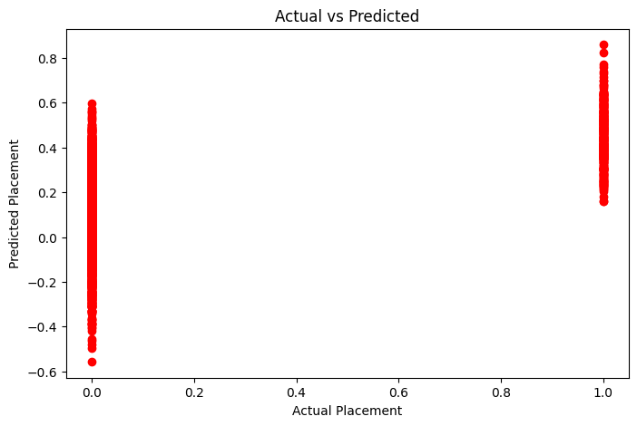
    

