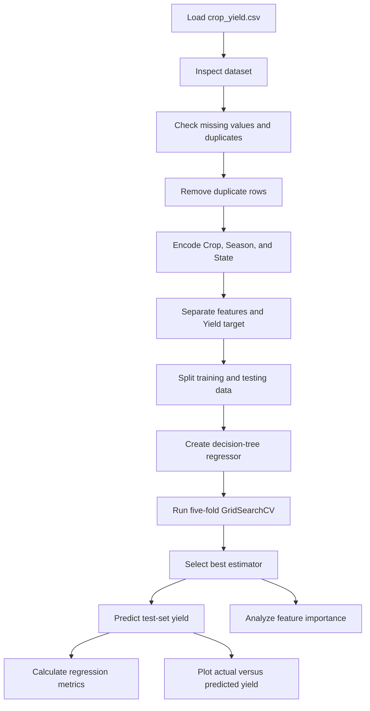
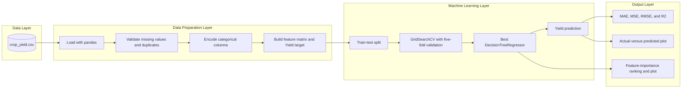

# Crop Yield Prediction

## Project Overview

This educational machine-learning project analyzes agricultural crop data and predicts crop yield with a tuned decision-tree regression model. The notebook includes dataset inspection, duplicate and missing-value checks, categorical encoding, train-test splitting, hyperparameter tuning, regression evaluation, actual-versus-predicted visualization, and feature-importance analysis.

## Problem Statement

The project explores whether crop type, year, season, location, cultivated area, production, rainfall, fertilizer usage, and pesticide usage can be used to estimate agricultural yield.

## Dataset

`crop_yield.csv` contains 19,689 rows and 10 columns:

- `Crop`
- `Crop_Year`
- `Season`
- `State`
- `Area`
- `Production`
- `Annual_Rainfall`
- `Fertilizer`
- `Pesticide`
- `Yield`

The dataset includes three categorical columns (`Crop`, `Season`, and `State`) and seven numerical columns. The notebook reports no missing values in the dataset. `Yield` is the continuous target variable.

## Technologies Used

- Python
- Jupyter Notebook
- pandas for loading, inspecting, and transforming the dataset
- NumPy for numerical calculations and metric computation
- Matplotlib for regression and feature-importance plots
- Seaborn for statistical visualizations
- scikit-learn for encoding, data splitting, decision-tree regression, hyperparameter tuning, and evaluation metrics

## Features

### Data Analysis

- Load and inspect the crop-yield dataset.
- Display dataset shape, sample rows, and data information.
- Check missing values and duplicate rows.
- Remove duplicate rows.
- Encode categorical columns with separate `LabelEncoder` instances.
- Examine crop, season, state, and numerical features.

### Machine Learning

- Use all columns except `Yield` as model features.
- Split the data into training and testing sets.
- Train a `DecisionTreeRegressor`.
- Tune tree depth and minimum sample parameters with `GridSearchCV`.
- Select the best model using cross-validated R² scoring.
- Predict yield for the test set.
- Calculate MAE, MSE, RMSE, and R² score.
- Display actual-versus-predicted yield values.
- Rank and visualize feature importance.

## Model Configuration and Results

- Model: Decision-tree regressor
- Target: `Yield`
- Test size: 20%
- Training size: 80%
- Random state: `42`
- Cross-validation: 5-fold `GridSearchCV`
- Tuning metric: R² score
- Tuned parameters:
  - `max_depth`: `3`, `5`, `7`, `10`, or `None`
  - `min_samples_split`: `2`, `5`, or `10`
  - `min_samples_leaf`: `1`, `2`, or `4`

The notebook calculates MAE, MSE, RMSE, and R² after selecting the best estimator. Metric values and the best parameter combination are not recorded in the exported notebook and will be displayed when the notebook is run.

## Workflow

1. Load `crop_yield.csv` with pandas.
2. Inspect the dataset shape, sample rows, data types, and missing values.
3. Count and remove duplicate rows.
4. Encode `Crop`, `Season`, and `State` with `LabelEncoder`.
5. Separate the features from the `Yield` target.
6. Split the data into training and testing sets with `random_state=42`.
7. Create a base `DecisionTreeRegressor`.
8. Define the hyperparameter grid.
9. Run five-fold `GridSearchCV` using R² scoring.
10. Fit the grid search on the training data.
11. Select the best estimator and predict test-set yields.
12. Calculate MAE, MSE, RMSE, and R² score.
13. Plot actual versus predicted yields.
14. Calculate and visualize feature importance.

### Workflow Diagram



## Architecture Diagram



## Installation and Setup

### Requirements

- Python
- Jupyter Notebook
- pandas
- NumPy
- Matplotlib
- Seaborn
- scikit-learn

### Steps

1. Install Python and the required packages.
2. Open `crop_yield.ipynb` in Jupyter Notebook or Visual Studio Code.
3. Run the notebook cells from top to bottom.

Exact installation commands and package versions: `TODO: Information required`

Environment variables: `TODO: Information required`

Configuration files: `TODO: Information required`

## Project Structure

```text
Model 12/
├── crop_yield.ipynb
├── crop_yield.csv
├── crop_yield.md
├── READmd.txt
├── README.md
└── crop_yield_files/
```

- `crop_yield.ipynb`: Main crop-yield analysis and machine-learning notebook.
- `crop_yield.csv`: Source crop-yield dataset.
- `crop_yield.md`: Markdown export of the notebook.
- `READmd.txt`: Existing project documentation file.
- `README.md`: Project documentation.
- `crop_yield_files/`: Notebook-related assets; detailed contents are not documented.

## Limitations and Missing Information

- The dataset source and attribution are not documented.
- Package versions and exact installation commands are not documented.
- No license information is provided.
- Metric values and best hyperparameters are not recorded in the exported notebook.
- Label encoding imposes numeric category codes on `Crop`, `Season`, and `State`; one-hot encoding may be more suitable when categories do not have an ordinal relationship.
- The random split may not represent future years or unseen states and crops.
- No external validation or time-based validation is documented.
- The notebook does not document how predictions should be generated for new crop records.
