Connected to Python 3.14.0


```python
import pandas as pd
import numpy as np
import matplotlib.pyplot as plt
import seaborn as sns

sns.set_style("whitegrid") 


```


```python

df = pd.read_csv("salary data.csv")

# Show first rows
print(df.head())
```

        Age  Gender Education Level          Job Title  Years of Experience  \
    0  32.0    Male      Bachelor's  Software Engineer                  5.0   
    1  28.0  Female        Master's       Data Analyst                  3.0   
    2  45.0    Male             PhD     Senior Manager                 15.0   
    3  36.0  Female      Bachelor's    Sales Associate                  7.0   
    4  52.0    Male        Master's           Director                 20.0   
    
         Salary  
    0   90000.0  
    1   65000.0  
    2  150000.0  
    3   60000.0  
    4  200000.0  
    


```python
print("Shape:", df.shape)
print("\nColumns:")
print(df.columns)

print("\nInfo:")
print(df.info())

print("\nStatistical Summary:")
print(df.describe())
```

    Shape: (375, 6)
    
    Columns:
    Index(['Age', 'Gender', 'Education Level', 'Job Title', 'Years of Experience',
           'Salary'],
          dtype='object')
    
    Info:
    <class 'pandas.core.frame.DataFrame'>
    RangeIndex: 375 entries, 0 to 374
    Data columns (total 6 columns):
     #   Column               Non-Null Count  Dtype  
    ---  ------               --------------  -----  
     0   Age                  373 non-null    float64
     1   Gender               373 non-null    object 
     2   Education Level      373 non-null    object 
     3   Job Title            373 non-null    object 
     4   Years of Experience  373 non-null    float64
     5   Salary               373 non-null    float64
    dtypes: float64(3), object(3)
    memory usage: 17.7+ KB
    None
    
    Statistical Summary:
                  Age  Years of Experience         Salary
    count  373.000000           373.000000     373.000000
    mean    37.431635            10.030831  100577.345845
    std      7.069073             6.557007   48240.013482
    min     23.000000             0.000000     350.000000
    25%     31.000000             4.000000   55000.000000
    50%     36.000000             9.000000   95000.000000
    75%     44.000000            15.000000  140000.000000
    max     53.000000            25.000000  250000.000000
    


```python
print("\nMissing Values:")
print(df.isnull().sum())

# Heatmap
plt.figure(figsize=(8,4))
sns.heatmap(df.isnull(), cbar=False, cmap="viridis")
plt.title("Missing Values Heatmap")
plt.show()
```

    
    Missing Values:
    Age                    2
    Gender                 2
    Education Level        2
    Job Title              2
    Years of Experience    2
    Salary                 2
    dtype: int64
    


    
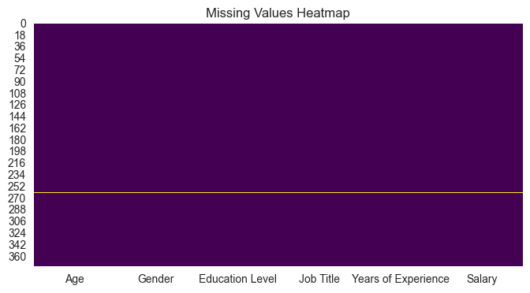
    


```python

```


```python
# Fill numeric columns with mean
df = df.fillna(df.mean(numeric_only=True))

# Fill categorical columns with mode
for col in df.select_dtypes(include="object"):
    df[col] = df[col].fillna(df[col].mode()[0])
```


```python
num_cols = df.select_dtypes(include=np.number).columns  #//Numerical columns


for col in num_cols:
    plt.figure(figsize=(5,3))
    sns.histplot(df[col], kde=True)
    plt.title(f"Distribution of {col}")
    plt.show()
```


    
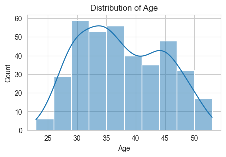
    


    
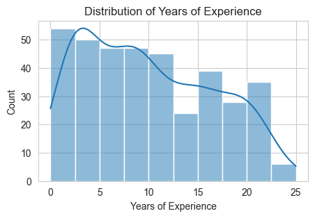
    


    
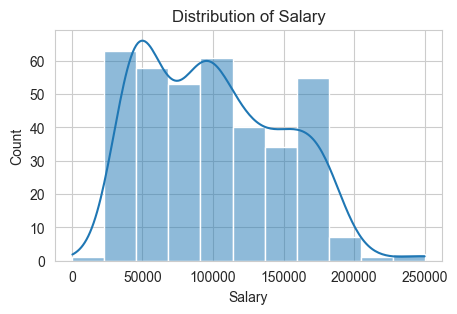
    


```python
cat_cols = df.select_dtypes(include="object").columns  #//Categorical columns

for col in cat_cols:
    plt.figure(figsize=(6,3))
    sns.countplot(x=df[col])
    plt.xticks(rotation=45)
    plt.title(f"Count Plot of {col}")
    plt.show()
```


    
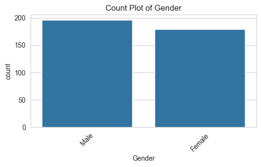
    


    
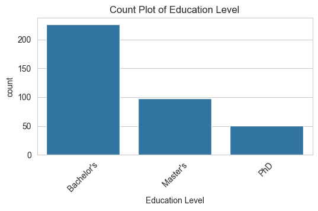
    


    
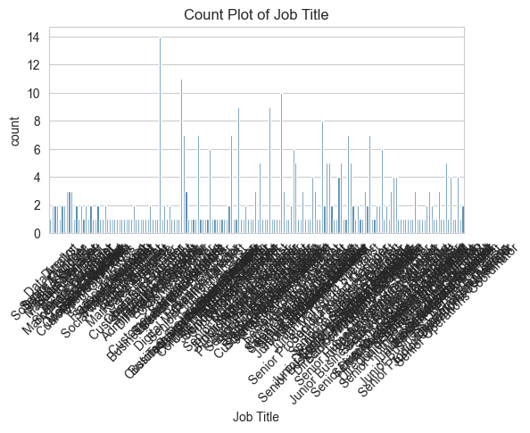
    


```python
sns.pairplot(df) #//Bivariate Analysis(relationship between columns)
plt.show()
```


    
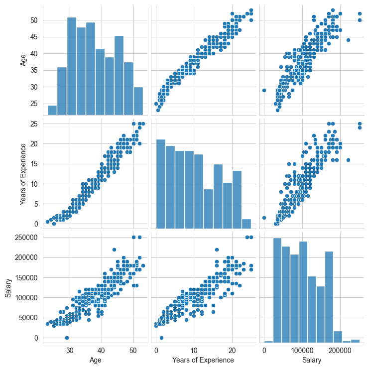
    


```python
plt.figure(figsize=(10,6))        #//Correlation Heatmap
corr = df.corr(numeric_only=True)
sns.heatmap(corr, annot=True, cmap="coolwarm")
plt.title("Correlation Heatmap")
plt.show()
```


    
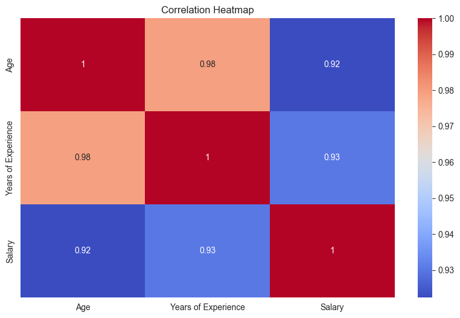
    


```python
for col in num_cols:             #//Outlier Detection (Boxplot)
    plt.figure(figsize=(5,3))
    sns.boxplot(x=df[col])
    plt.title(f"Outliers in {col}")
    plt.show()
```


    
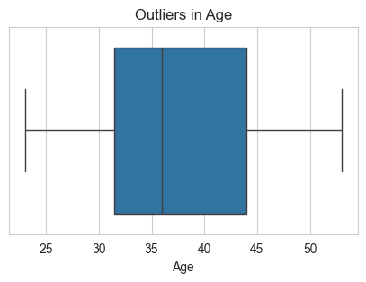
    


    
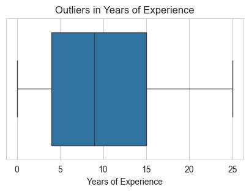
    


    
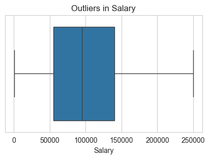
    


```python
# Check duplicate rows //Duplicate Data Check
print("Duplicate rows:", df.duplicated().sum())
df = df.drop_duplicates()
```

    Duplicate rows: 50
    


```python
# Check duplicate rows
print("Duplicate colums:", df.duplicated().sum())
df = df.drop_duplicates()
```

    Duplicate colums: 0
    


```python
for col in df.columns:      #//Unique Values in Each Column
    print(f"{col} --> {df[col].nunique()} unique values")
```

    Age --> 32 unique values
    Gender --> 2 unique values
    Education Level --> 3 unique values
    Job Title --> 174 unique values
    Years of Experience --> 29 unique values
    Salary --> 37 unique values
    


```python
print(df["Age"].value_counts())   #//Value Counts (Important for ML Target Column)

sns.countplot(x=df["Age"])
plt.title("Age Valuvation")
plt.show()
```

    Age
    29.000000    20
    33.000000    19
    31.000000    18
    36.000000    18
    44.000000    15
    35.000000    14
    45.000000    14
    34.000000    14
    30.000000    14
    47.000000    13
    40.000000    12
    37.000000    12
    39.000000    12
    38.000000    12
    32.000000    12
    28.000000    11
    42.000000    11
    43.000000    11
    41.000000    10
    27.000000     9
    46.000000     9
    48.000000     8
    50.000000     7
    26.000000     7
    49.000000     7
    51.000000     5
    25.000000     4
    52.000000     3
    24.000000     1
    23.000000     1
    53.000000     1
    37.431635     1
    Name: count, dtype: int64
    


    
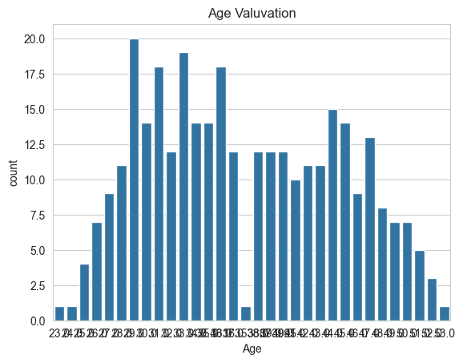
    


```python

print(df["Gender"].value_counts())   #//Value Counts (Important for ML Target Column)

sns.countplot(x=df["Gender"])
plt.title("Gender Valuvation")
plt.show()
```

    Gender
    Male      171
    Female    154
    Name: count, dtype: int64
    


    
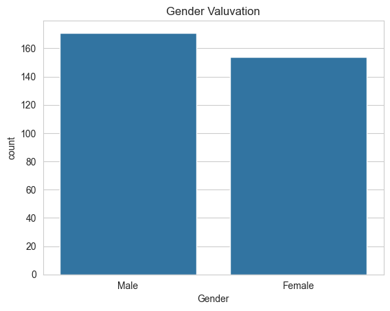
    


```python


print(df["Education Level"].value_counts())   #//Value Counts (Important for ML Target Column)

sns.countplot(x=df["Education Level"])
plt.title("Education Level Valuvation")
plt.show()
```

    Education Level
    Bachelor's    192
    Master's       91
    PhD            42
    Name: count, dtype: int64
    


    
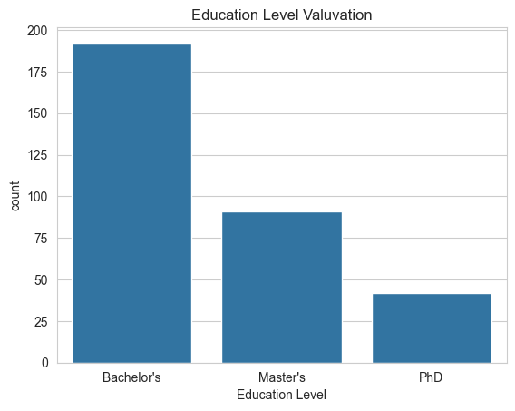
    


```python

# Job

print(df["Job Title"].value_counts())   #//Value Counts (Important for ML Target Column)

sns.countplot(x=df["Job Title"])
plt.title("Job Title Valuation")
plt.show()

```

    Job Title
    Director of Operations            9
    Director of Marketing             9
    Senior Marketing Manager          8
    Senior Project Manager            7
    Senior Data Scientist             6
                                     ..
    Junior Social Media Specialist    1
    Junior Operations Coordinator     1
    Senior HR Specialist              1
    Director of HR                    1
    Junior Financial Advisor          1
    Name: count, Length: 174, dtype: int64
    


    
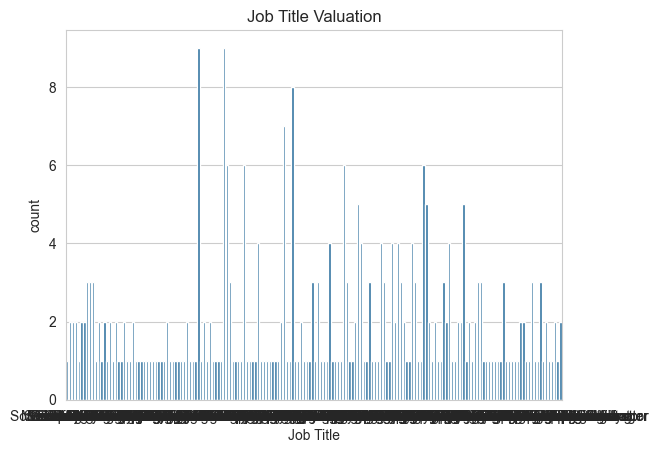
    


```python

# Years of Experiance

print(df["Years of Experience"].value_counts())   #//Value Counts 

sns.countplot(x=df["Years of Experience"])
plt.title("Years of Experience Valuation")
plt.show()

```

    Years of Experience
    3.000000     27
    2.000000     26
    9.000000     19
    8.000000     17
    5.000000     16
    10.000000    16
    7.000000     16
    4.000000     16
    16.000000    15
    12.000000    14
    19.000000    13
    20.000000    13
    15.000000    12
    21.000000    11
    14.000000    11
    18.000000    11
    6.000000     11
    1.500000     11
    13.000000    10
    11.000000     9
    22.000000     8
    1.000000      7
    17.000000     5
    25.000000     3
    0.000000      3
    23.000000     2
    24.000000     1
    0.500000      1
    10.030831     1
    Name: count, dtype: int64
    


    
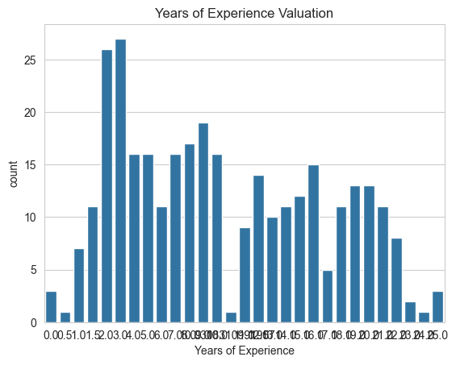
    


```python


print("Skewness:")
print(df.skew(numeric_only=True))
for col in num_cols:
    if abs(df[col].skew()) > 3:
        df[col] = np.log1p(df[col])        #//Skewness Check 
```

    Skewness:
    Age                    0.195437
    Years of Experience    0.358958
    Salary                 0.437611
    dtype: float64
    


```python

df.groupby("Age")["Age"].mean()        
df.groupby("Age")["Age"].mean().plot(kind="bar")         
plt.title("Age of salary data")
plt.show()                                                #//GroupBy Analysis 


```


    
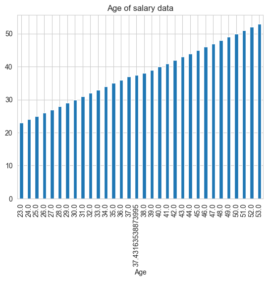
    


```python


df.groupby("Salary")["Salary"].mean()        
df.groupby("Salary")["Salary"].mean().plot(kind="bar")         
plt.title("salary salary file")

```


    
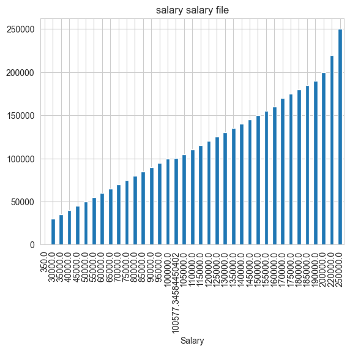
    


```python
corr_matrix = df.corr(numeric_only=True).abs()

upper = corr_matrix.where(np.triu(np.ones(corr_matrix.shape), k=1).astype(bool))

high_corr = [column for column in upper.columns if any(upper[column] > 0.90)]

print("Highly correlated columns:", high_corr)

df = df.drop(columns=high_corr)            #/ Detect Highly Correlated Features(Remove multicollinearity for ML)
```

    Highly correlated columns: ['Years of Experience', 'Salary']
    

No kernel connected


```python
import pandas as pd

# load dataset
df = pd.read_csv("salary data.csv")

# check columns (important!)
print(df.columns)

# split features and target
X = df.drop("Education Level", axis=1)
y = df["Education Level"]

print(X.shape, y.shape)

```

    Index(['Age', 'Gender', 'Education Level', 'Job Title', 'Years of Experience',
           'Salary'],
          dtype='object')
    (375, 5) (375,)
    


```python
import pandas as pd
import numpy as np
import matplotlib.pyplot as plt
import seaborn as sns

sns.set_style("whitegrid") 


sns.scatterplot(x="Years of Experience", y="Salary", data=df)
plt.show()                                                   #//Bivariate Analysis (2 Columns)Salary vs Experience


sns.boxplot(x="Education Level", y="Salary", data=df)
plt.xticks(rotation=45)
plt.show()                                                 #//Boxplot

```


    
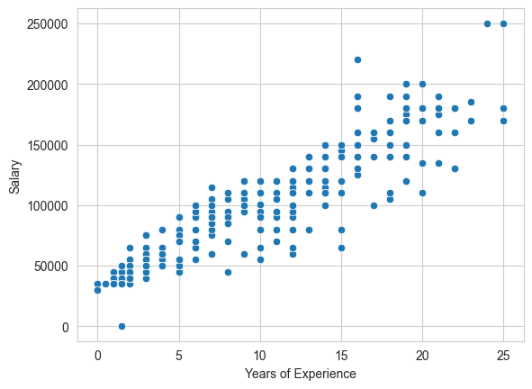
    


    
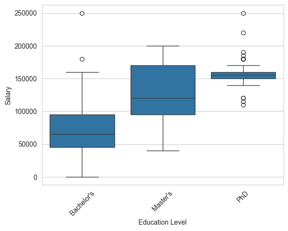
    


```python


sns.set_style("whitegrid") 


sns.scatterplot(x="Gender", y="Years of Experience", data=df)
plt.show()                                                   #//Bivariate Analysis (2 Columns)Salary vs Experience


sns.boxplot(x="Gender", y="Age", data=df)
plt.xticks(rotation=50)
plt.show()                                                 #//Boxplot

```


    
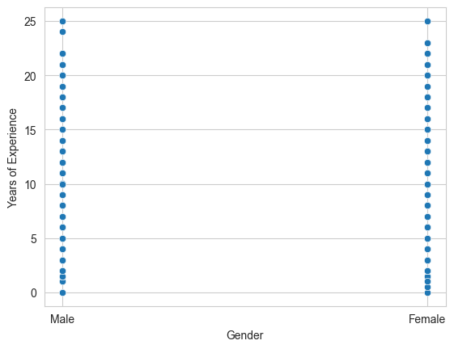
    


    
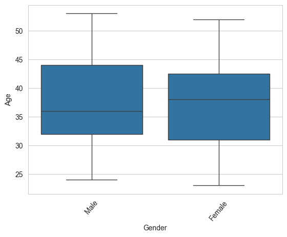
    


```python
plt.figure(figsize=(8,6))
sns.heatmap(df.corr(numeric_only=True), annot=True, cmap="coolwarm")
plt.show()                              #//Correlation Matrix

```


    
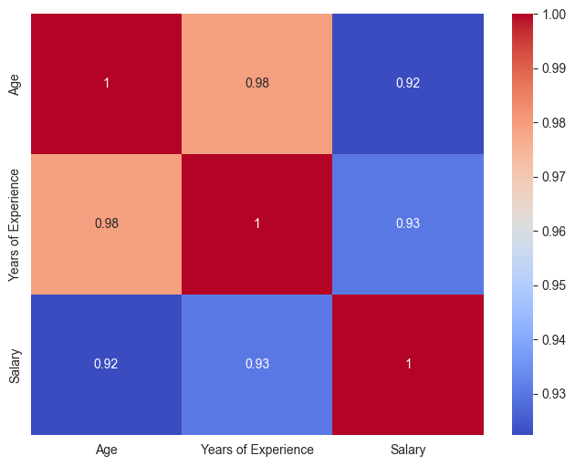
    

