```python
import pandas as pd
import numpy as np
import matplotlib.pyplot as plt
import seaborn as sns


df = pd.read_csv("House Price Prediction Dataset.csv")

print(df.head())      # first 5 rows
print(df.shape)       # rows & columns
print(df.columns)     # column names

```

       Id  Area  Bedrooms  Bathrooms  Floors  YearBuilt  Location  Condition  \
    0   1  1360         5          4       3       1970  Downtown  Excellent   
    1   2  4272         5          4       3       1958  Downtown  Excellent   
    2   3  3592         2          2       3       1938  Downtown       Good   
    3   4   966         4          2       2       1902  Suburban       Fair   
    4   5  4926         1          4       2       1975  Downtown       Fair   
    
      Garage   Price  
    0     No  149919  
    1     No  424998  
    2     No  266746  
    3    Yes  244020  
    4    Yes  636056  
    (2000, 10)
    Index(['Id', 'Area', 'Bedrooms', 'Bathrooms', 'Floors', 'YearBuilt',
           'Location', 'Condition', 'Garage', 'Price'],
          dtype='object')
    


```python
#Basic Information
df.info()
df.describe()

```

    <class 'pandas.core.frame.DataFrame'>
    RangeIndex: 2000 entries, 0 to 1999
    Data columns (total 10 columns):
     #   Column     Non-Null Count  Dtype 
    ---  ------     --------------  ----- 
     0   Id         2000 non-null   int64 
     1   Area       2000 non-null   int64 
     2   Bedrooms   2000 non-null   int64 
     3   Bathrooms  2000 non-null   int64 
     4   Floors     2000 non-null   int64 
     5   YearBuilt  2000 non-null   int64 
     6   Location   2000 non-null   object
     7   Condition  2000 non-null   object
     8   Garage     2000 non-null   object
     9   Price      2000 non-null   int64 
    dtypes: int64(7), object(3)
    memory usage: 156.4+ KB
    


<div>
<style scoped>
    .dataframe tbody tr th:only-of-type {
        vertical-align: middle;
    }

    .dataframe tbody tr th {
        vertical-align: top;
    }

    .dataframe thead th {
        text-align: right;
    }
</style>
<table border="1" class="dataframe">
  <thead>
    <tr style="text-align: right;">
      <th></th>
      <th>Id</th>
      <th>Area</th>
      <th>Bedrooms</th>
      <th>Bathrooms</th>
      <th>Floors</th>
      <th>YearBuilt</th>
      <th>Price</th>
    </tr>
  </thead>
  <tbody>
    <tr>
      <th>count</th>
      <td>2000.000000</td>
      <td>2000.000000</td>
      <td>2000.000000</td>
      <td>2000.00000</td>
      <td>2000.000000</td>
      <td>2000.000000</td>
      <td>2000.000000</td>
    </tr>
    <tr>
      <th>mean</th>
      <td>1000.500000</td>
      <td>2786.209500</td>
      <td>3.003500</td>
      <td>2.55250</td>
      <td>1.993500</td>
      <td>1961.446000</td>
      <td>537676.855000</td>
    </tr>
    <tr>
      <th>std</th>
      <td>577.494589</td>
      <td>1295.146799</td>
      <td>1.424606</td>
      <td>1.10899</td>
      <td>0.809188</td>
      <td>35.926695</td>
      <td>276428.845719</td>
    </tr>
    <tr>
      <th>min</th>
      <td>1.000000</td>
      <td>501.000000</td>
      <td>1.000000</td>
      <td>1.00000</td>
      <td>1.000000</td>
      <td>1900.000000</td>
      <td>50005.000000</td>
    </tr>
    <tr>
      <th>25%</th>
      <td>500.750000</td>
      <td>1653.000000</td>
      <td>2.000000</td>
      <td>2.00000</td>
      <td>1.000000</td>
      <td>1930.000000</td>
      <td>300098.000000</td>
    </tr>
    <tr>
      <th>50%</th>
      <td>1000.500000</td>
      <td>2833.000000</td>
      <td>3.000000</td>
      <td>3.00000</td>
      <td>2.000000</td>
      <td>1961.000000</td>
      <td>539254.000000</td>
    </tr>
    <tr>
      <th>75%</th>
      <td>1500.250000</td>
      <td>3887.500000</td>
      <td>4.000000</td>
      <td>4.00000</td>
      <td>3.000000</td>
      <td>1993.000000</td>
      <td>780086.000000</td>
    </tr>
    <tr>
      <th>max</th>
      <td>2000.000000</td>
      <td>4999.000000</td>
      <td>5.000000</td>
      <td>4.00000</td>
      <td>3.000000</td>
      <td>2023.000000</td>
      <td>999656.000000</td>
    </tr>
  </tbody>
</table>
</div>


```python
#Check Missing Values
print(df.isnull().sum())


# numeric → fill with mean
for col in df.select_dtypes(include=np.number):
    df[col].fillna(df[col].mean(), inplace=True)

# categorical → fill with mode
for col in df.select_dtypes(include='object'):
    df[col].fillna(df[col].mode()[0], inplace=True)

```

    Id           0
    Area         0
    Bedrooms     0
    Bathrooms    0
    Floors       0
    YearBuilt    0
    Location     0
    Condition    0
    Garage       0
    Price        0
    dtype: int64
    


```python
#Check Duplicates

print(df.duplicated().sum())
df.drop_duplicates(inplace=True)

```

    0
    


```python
#Univariate Analysis (Single Column)
    # .....Price Distribution

sns.histplot(df['Price'], kde=True)
plt.title("Price Distribution")
plt.show()

#Categorical Count
sns.countplot(x='Bedrooms', data=df)
plt.show()


```


    
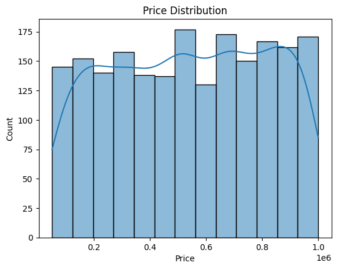
    


    
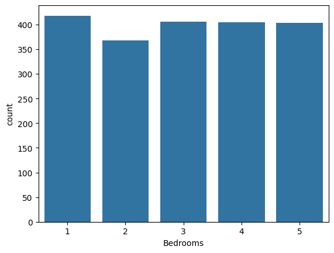
    


```python
#Univariate Analysis (Single Column)
    # .....Price Distribution

sns.histplot(df['Area'], kde=True)
plt.title("Price Distribution")
plt.show()

#Categorical Count
sns.countplot(x='Location', data=df)
plt.show()


```


    
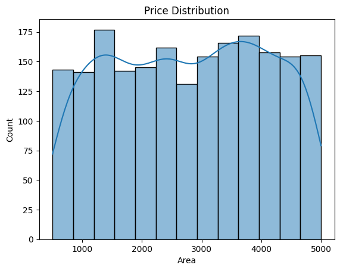
    


    

    


```python
#Univariate Analysis (Single Column)
    # .....Price Distribution

sns.histplot(df['YearBuilt'], kde=True)
plt.title("Price Distribution")
plt.show()

#Categorical Count
sns.countplot(x='Location', data=df)
plt.show()


```


    
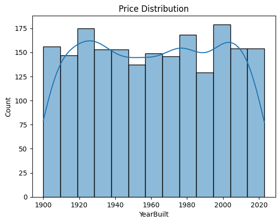
    


    
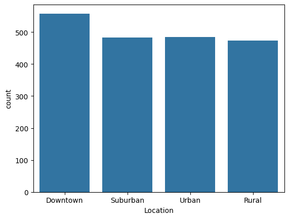
    


```python
#Univariate Analysis (Single Column)
    # .....Price Distribution

sns.histplot(df['Condition'], kde=True)
plt.title("Price Distribution")
plt.show()

#Categorical Count
sns.countplot(x='Garage', data=df)
plt.show()


```


    
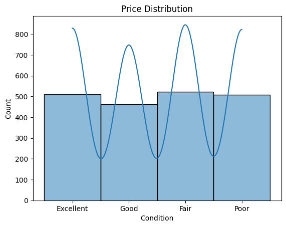
    


    
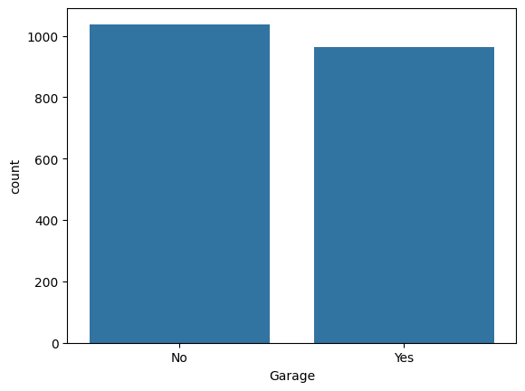
    


```python
#Bivariate Analysis (Relation Between Columns)

sns.scatterplot(x='Area', y='Price', data=df)
plt.show()

sns.scatterplot(x='Bathrooms', y='Bedrooms', data=df)
plt.show()

sns.scatterplot(x='Location', y='Garage', data=df)
plt.show()


```


    
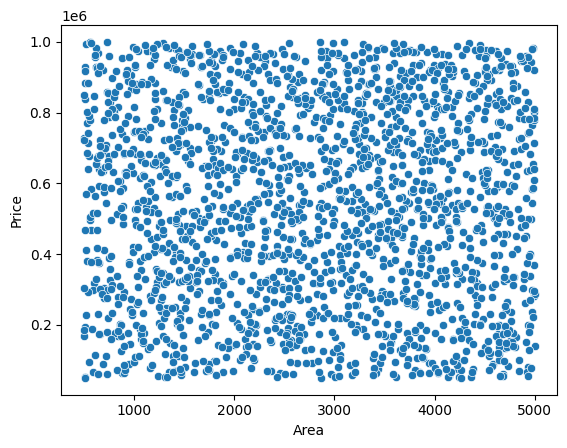
    


    
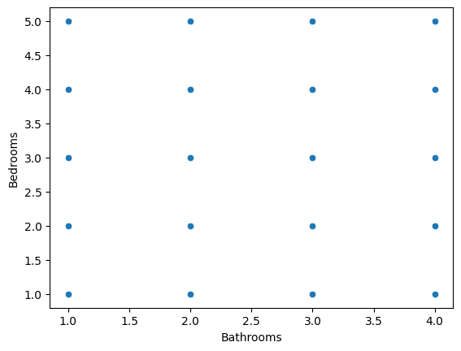
    


    
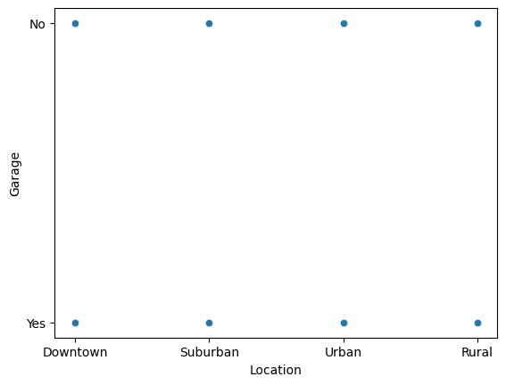
    


```python
#Correlation Heatmap


plt.figure(figsize=(10,6))
sns.heatmap(df.corr(numeric_only=True), annot=True, cmap="coolwarm")
plt.show()

```


    
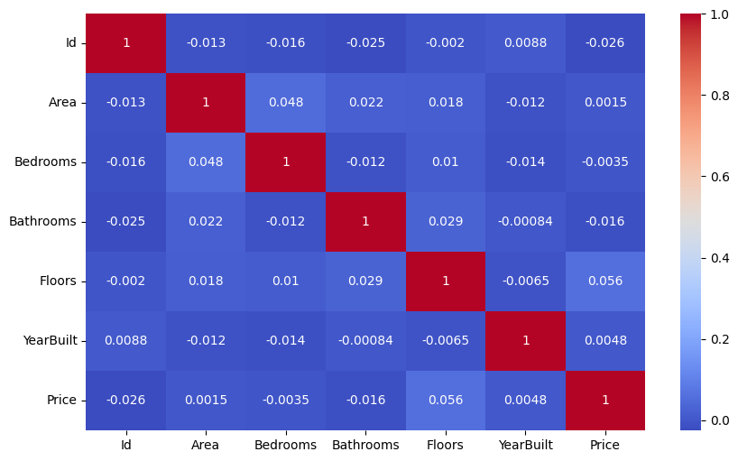
    


```python
#Convert Categorical to Numeric

df = pd.get_dummies(df, drop_first=True)

```


```python
#Machine Learning (Prediction)
#Split Data

from sklearn.model_selection import train_test_split

X = df.drop('Price', axis=1)
y = df['Price']

X_train, X_test, y_train, y_test = train_test_split(X, y, test_size=0.2, random_state=42)


#Train Model
from sklearn.linear_model import LinearRegression

model = LinearRegression()
model.fit(X_train, y_train)

#Prediction
y_pred = model.predict(X_test)


#Evaluate Model
from sklearn.metrics import mean_absolute_error, r2_score

print("MAE:", mean_absolute_error(y_test, y_pred))
print("R2 Score:", r2_score(y_test, y_pred))


```

    MAE: 242867.44926338625
    R2 Score: -0.006181784611834162
    


```python
import matplotlib.pyplot as plt
import seaborn as sns

sns.set_style("whitegrid")
plt.rcParams["figure.figsize"] = (8,5)

```


```python
# Histogram (Distribution)
#Price

sns.histplot(df['Price'], kde=True, bins=30)
plt.title("Price Distribution")
plt.xlabel("Price")
plt.ylabel("Count")
plt.show()


# Histogram (Distribution)
#Area
sns.histplot(df['Area'], kde=True, bins=30)
plt.title("Area Distribution")
plt.xlabel("Area")
plt.ylabel("Count")
plt.show()


# Histogram (Distribution)
#Bathrooms

sns.histplot(df['Bathrooms'], kde=True, bins=30)
plt.title("Bathrooms Distribution")
plt.xlabel("Bathrooms")
plt.ylabel("Count")
plt.show()

```


    
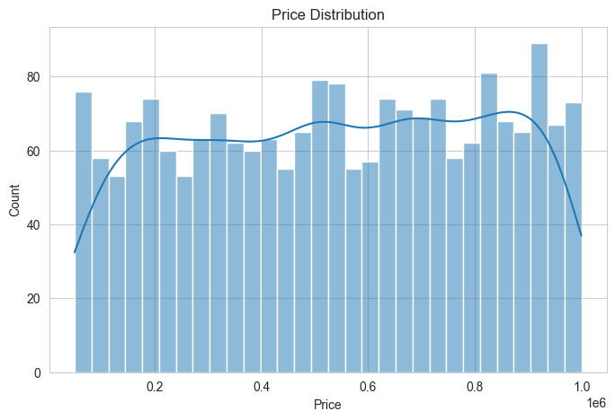
    


    
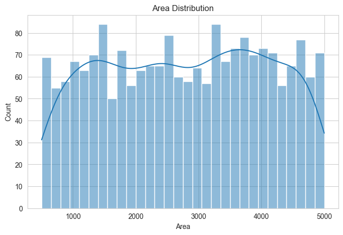
    


    
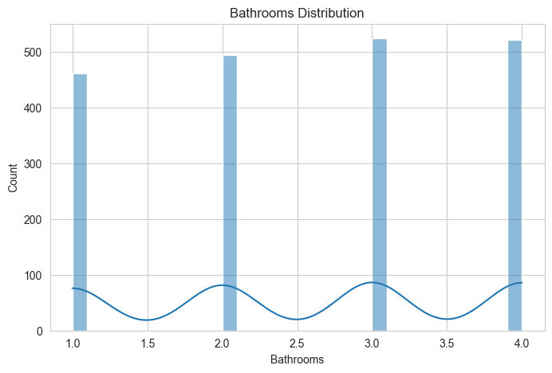
    


```python
#Scatter Plot (Relation Between 2 Numerical Columns)
sns.scatterplot(x='Area', y='Price', data=df)
plt.title("Area vs Price")
plt.show()


sns.scatterplot(x='Bathrooms', y='Bedrooms', data=df)
plt.title("Bathrooms vs Bedrooms")
plt.show()

```


    
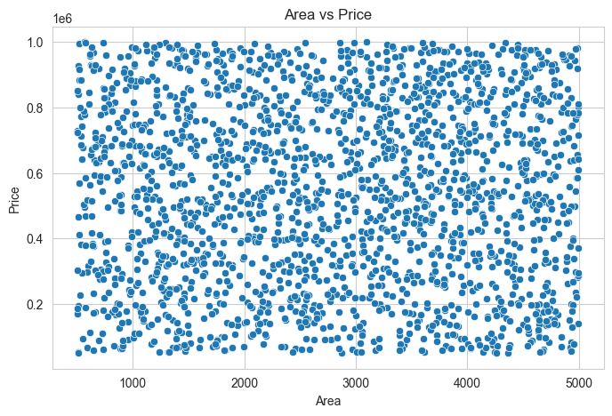
    


    
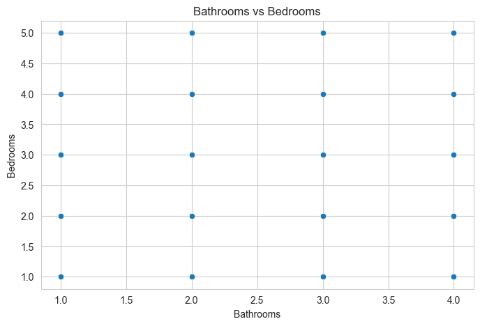
    


```python
#boxplot Plot (Relation Between 2 Numerical Columns)
sns.boxplot(x='Area', y='Price', data=df)
plt.title("Area vs Price")
plt.show()


sns.boxplot(x='Bathrooms', y='Bedrooms', data=df)
plt.title("Bathrooms vs Bedrooms")
plt.show()

```


    
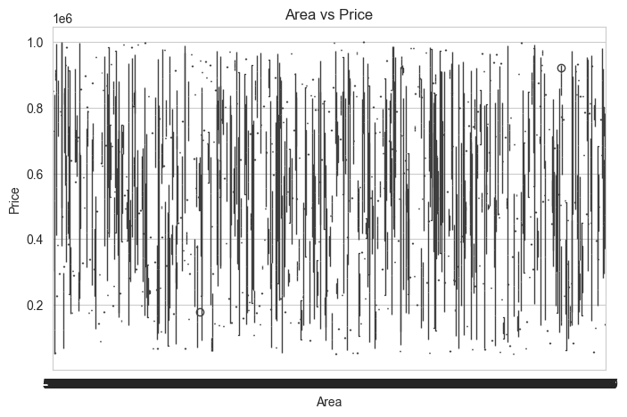
    


    
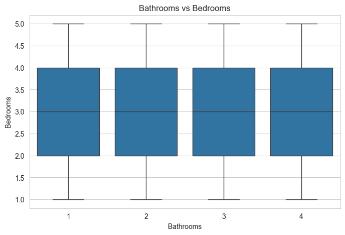
    


```python
# Bar Plot 
sns.barplot(x='Bathrooms', y='Price', data=df)
plt.title("Average Price by Bathrooms")
plt.show()

sns.barplot(x='Floors', y='Area', data=df)
plt.title("Average Price by Bathrooms")
plt.show()


```


    
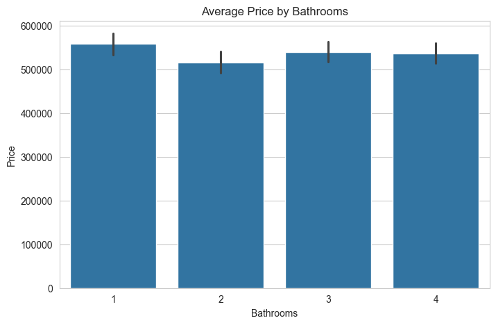
    


    
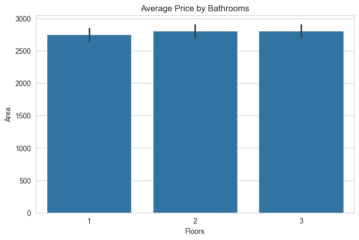
    


```python
#Correlation Heatmap

plt.figure(figsize=(10,6))
sns.heatmap(df.corr(numeric_only=True), annot=True, cmap="coolwarm")
plt.title("Correlation Heatmap")
plt.show()

```


    
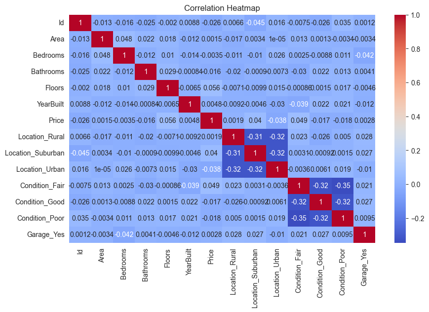
    


```python
#Pair Plot (Full Relationship View)

sns.pairplot(df[['Price','Area','Bedrooms','Bathrooms']])
plt.show()

```


    
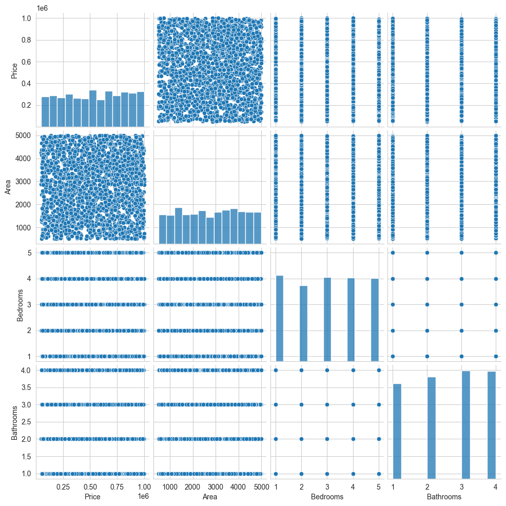
    


```python
#Pair Plot (Full Relationship View)

sns.pairplot(df[['Price','Area']])
plt.show()

```


    
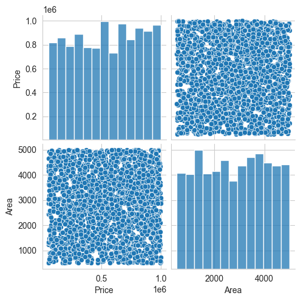
    


```python
from sklearn.model_selection import train_test_split
from sklearn.linear_model import LinearRegression
from sklearn.metrics import mean_absolute_error, mean_squared_error, r2_score
import matplotlib.pyplot as plt
import numpy as np


#Define X and y
X = df.drop('Price', axis=1)
y = df['Price']


#Train Test Split
X_train, X_test, y_train, y_test = train_test_split(
    X, y, test_size=0.2, random_state=42
)


#Train Model
model = LinearRegression()
model.fit(X_train, y_train)


#Predict
y_pred = model.predict(X_test)


#Evaluate Model
mae = mean_absolute_error(y_test, y_pred)
mse = mean_squared_error(y_test, y_pred)
rmse = np.sqrt(mse)
r2 = r2_score(y_test, y_pred)

print("MAE :", mae)
print("MSE :", mse)
print("RMSE:", rmse)
print("R2 Score:", r2)


```

    MAE : 242867.44926338625
    MSE : 78279764120.86241
    RMSE: 279785.2106900263
    R2 Score: -0.006181784611834162
    
