```python
import pandas as pd
import numpy as np
import matplotlib.pyplot as plt
import seaborn as sns 

df=pd.read_csv("Employee.csv")


```


```python
print(df.head())
```

       Age Attrition     BusinessTravel  DailyRate              Department  \
    0   41       Yes      Travel_Rarely       1102                   Sales   
    1   49        No  Travel_Frequently        279  Research & Development   
    2   37       Yes      Travel_Rarely       1373  Research & Development   
    3   33        No  Travel_Frequently       1392  Research & Development   
    4   27        No      Travel_Rarely        591  Research & Development   
    
       DistanceFromHome  Education EducationField  EmployeeCount  EmployeeNumber  \
    0                 1          2  Life Sciences              1               1   
    1                 8          1  Life Sciences              1               2   
    2                 2          2          Other              1               4   
    3                 3          4  Life Sciences              1               5   
    4                 2          1        Medical              1               7   
    
       ...  RelationshipSatisfaction StandardHours  StockOptionLevel  \
    0  ...                         1            80                 0   
    1  ...                         4            80                 1   
    2  ...                         2            80                 0   
    3  ...                         3            80                 0   
    4  ...                         4            80                 1   
    
       TotalWorkingYears  TrainingTimesLastYear WorkLifeBalance  YearsAtCompany  \
    0                  8                      0               1               6   
    1                 10                      3               3              10   
    2                  7                      3               3               0   
    3                  8                      3               3               8   
    4                  6                      3               3               2   
    
      YearsInCurrentRole  YearsSinceLastPromotion  YearsWithCurrManager  
    0                  4                        0                     5  
    1                  7                        1                     7  
    2                  0                        0                     0  
    3                  7                        3                     0  
    4                  2                        2                     2  
    
    [5 rows x 35 columns]
    


```python
print(df.shape)
```

    (1470, 35)
    


```python
df.info()
```

    <class 'pandas.core.frame.DataFrame'>
    RangeIndex: 1470 entries, 0 to 1469
    Data columns (total 35 columns):
     #   Column                    Non-Null Count  Dtype 
    ---  ------                    --------------  ----- 
     0   Age                       1470 non-null   int64 
     1   Attrition                 1470 non-null   object
     2   BusinessTravel            1470 non-null   object
     3   DailyRate                 1470 non-null   int64 
     4   Department                1470 non-null   object
     5   DistanceFromHome          1470 non-null   int64 
     6   Education                 1470 non-null   int64 
     7   EducationField            1470 non-null   object
     8   EmployeeCount             1470 non-null   int64 
     9   EmployeeNumber            1470 non-null   int64 
     10  EnvironmentSatisfaction   1470 non-null   int64 
     11  Gender                    1470 non-null   object
     12  HourlyRate                1470 non-null   int64 
     13  JobInvolvement            1470 non-null   int64 
     14  JobLevel                  1470 non-null   int64 
     15  JobRole                   1470 non-null   object
     16  JobSatisfaction           1470 non-null   int64 
     17  MaritalStatus             1470 non-null   object
     18  MonthlyIncome             1470 non-null   int64 
     19  MonthlyRate               1470 non-null   int64 
     20  NumCompaniesWorked        1470 non-null   int64 
     21  Over18                    1470 non-null   object
     22  OverTime                  1470 non-null   object
     23  PercentSalaryHike         1470 non-null   int64 
     24  PerformanceRating         1470 non-null   int64 
     25  RelationshipSatisfaction  1470 non-null   int64 
     26  StandardHours             1470 non-null   int64 
     27  StockOptionLevel          1470 non-null   int64 
     28  TotalWorkingYears         1470 non-null   int64 
     29  TrainingTimesLastYear     1470 non-null   int64 
     30  WorkLifeBalance           1470 non-null   int64 
     31  YearsAtCompany            1470 non-null   int64 
     32  YearsInCurrentRole        1470 non-null   int64 
     33  YearsSinceLastPromotion   1470 non-null   int64 
     34  YearsWithCurrManager      1470 non-null   int64 
    dtypes: int64(26), object(9)
    memory usage: 402.1+ KB
    


```python
df.describe().T
```


<div>
<style scoped>
    .dataframe tbody tr th:only-of-type {
        vertical-align: middle;
    }

    .dataframe tbody tr th {
        vertical-align: top;
    }

    .dataframe thead th {
        text-align: right;
    }
</style>
<table border="1" class="dataframe">
  <thead>
    <tr style="text-align: right;">
      <th></th>
      <th>count</th>
      <th>mean</th>
      <th>std</th>
      <th>min</th>
      <th>25%</th>
      <th>50%</th>
      <th>75%</th>
      <th>max</th>
    </tr>
  </thead>
  <tbody>
    <tr>
      <th>Age</th>
      <td>1470.0</td>
      <td>36.923810</td>
      <td>9.135373</td>
      <td>18.0</td>
      <td>30.00</td>
      <td>36.0</td>
      <td>43.00</td>
      <td>60.0</td>
    </tr>
    <tr>
      <th>DailyRate</th>
      <td>1470.0</td>
      <td>802.485714</td>
      <td>403.509100</td>
      <td>102.0</td>
      <td>465.00</td>
      <td>802.0</td>
      <td>1157.00</td>
      <td>1499.0</td>
    </tr>
    <tr>
      <th>DistanceFromHome</th>
      <td>1470.0</td>
      <td>9.192517</td>
      <td>8.106864</td>
      <td>1.0</td>
      <td>2.00</td>
      <td>7.0</td>
      <td>14.00</td>
      <td>29.0</td>
    </tr>
    <tr>
      <th>Education</th>
      <td>1470.0</td>
      <td>2.912925</td>
      <td>1.024165</td>
      <td>1.0</td>
      <td>2.00</td>
      <td>3.0</td>
      <td>4.00</td>
      <td>5.0</td>
    </tr>
    <tr>
      <th>EmployeeCount</th>
      <td>1470.0</td>
      <td>1.000000</td>
      <td>0.000000</td>
      <td>1.0</td>
      <td>1.00</td>
      <td>1.0</td>
      <td>1.00</td>
      <td>1.0</td>
    </tr>
    <tr>
      <th>EmployeeNumber</th>
      <td>1470.0</td>
      <td>1024.865306</td>
      <td>602.024335</td>
      <td>1.0</td>
      <td>491.25</td>
      <td>1020.5</td>
      <td>1555.75</td>
      <td>2068.0</td>
    </tr>
    <tr>
      <th>EnvironmentSatisfaction</th>
      <td>1470.0</td>
      <td>2.721769</td>
      <td>1.093082</td>
      <td>1.0</td>
      <td>2.00</td>
      <td>3.0</td>
      <td>4.00</td>
      <td>4.0</td>
    </tr>
    <tr>
      <th>HourlyRate</th>
      <td>1470.0</td>
      <td>65.891156</td>
      <td>20.329428</td>
      <td>30.0</td>
      <td>48.00</td>
      <td>66.0</td>
      <td>83.75</td>
      <td>100.0</td>
    </tr>
    <tr>
      <th>JobInvolvement</th>
      <td>1470.0</td>
      <td>2.729932</td>
      <td>0.711561</td>
      <td>1.0</td>
      <td>2.00</td>
      <td>3.0</td>
      <td>3.00</td>
      <td>4.0</td>
    </tr>
    <tr>
      <th>JobLevel</th>
      <td>1470.0</td>
      <td>2.063946</td>
      <td>1.106940</td>
      <td>1.0</td>
      <td>1.00</td>
      <td>2.0</td>
      <td>3.00</td>
      <td>5.0</td>
    </tr>
    <tr>
      <th>JobSatisfaction</th>
      <td>1470.0</td>
      <td>2.728571</td>
      <td>1.102846</td>
      <td>1.0</td>
      <td>2.00</td>
      <td>3.0</td>
      <td>4.00</td>
      <td>4.0</td>
    </tr>
    <tr>
      <th>MonthlyIncome</th>
      <td>1470.0</td>
      <td>6502.931293</td>
      <td>4707.956783</td>
      <td>1009.0</td>
      <td>2911.00</td>
      <td>4919.0</td>
      <td>8379.00</td>
      <td>19999.0</td>
    </tr>
    <tr>
      <th>MonthlyRate</th>
      <td>1470.0</td>
      <td>14313.103401</td>
      <td>7117.786044</td>
      <td>2094.0</td>
      <td>8047.00</td>
      <td>14235.5</td>
      <td>20461.50</td>
      <td>26999.0</td>
    </tr>
    <tr>
      <th>NumCompaniesWorked</th>
      <td>1470.0</td>
      <td>2.693197</td>
      <td>2.498009</td>
      <td>0.0</td>
      <td>1.00</td>
      <td>2.0</td>
      <td>4.00</td>
      <td>9.0</td>
    </tr>
    <tr>
      <th>PercentSalaryHike</th>
      <td>1470.0</td>
      <td>15.209524</td>
      <td>3.659938</td>
      <td>11.0</td>
      <td>12.00</td>
      <td>14.0</td>
      <td>18.00</td>
      <td>25.0</td>
    </tr>
    <tr>
      <th>PerformanceRating</th>
      <td>1470.0</td>
      <td>3.153741</td>
      <td>0.360824</td>
      <td>3.0</td>
      <td>3.00</td>
      <td>3.0</td>
      <td>3.00</td>
      <td>4.0</td>
    </tr>
    <tr>
      <th>RelationshipSatisfaction</th>
      <td>1470.0</td>
      <td>2.712245</td>
      <td>1.081209</td>
      <td>1.0</td>
      <td>2.00</td>
      <td>3.0</td>
      <td>4.00</td>
      <td>4.0</td>
    </tr>
    <tr>
      <th>StandardHours</th>
      <td>1470.0</td>
      <td>80.000000</td>
      <td>0.000000</td>
      <td>80.0</td>
      <td>80.00</td>
      <td>80.0</td>
      <td>80.00</td>
      <td>80.0</td>
    </tr>
    <tr>
      <th>StockOptionLevel</th>
      <td>1470.0</td>
      <td>0.793878</td>
      <td>0.852077</td>
      <td>0.0</td>
      <td>0.00</td>
      <td>1.0</td>
      <td>1.00</td>
      <td>3.0</td>
    </tr>
    <tr>
      <th>TotalWorkingYears</th>
      <td>1470.0</td>
      <td>11.279592</td>
      <td>7.780782</td>
      <td>0.0</td>
      <td>6.00</td>
      <td>10.0</td>
      <td>15.00</td>
      <td>40.0</td>
    </tr>
    <tr>
      <th>TrainingTimesLastYear</th>
      <td>1470.0</td>
      <td>2.799320</td>
      <td>1.289271</td>
      <td>0.0</td>
      <td>2.00</td>
      <td>3.0</td>
      <td>3.00</td>
      <td>6.0</td>
    </tr>
    <tr>
      <th>WorkLifeBalance</th>
      <td>1470.0</td>
      <td>2.761224</td>
      <td>0.706476</td>
      <td>1.0</td>
      <td>2.00</td>
      <td>3.0</td>
      <td>3.00</td>
      <td>4.0</td>
    </tr>
    <tr>
      <th>YearsAtCompany</th>
      <td>1470.0</td>
      <td>7.008163</td>
      <td>6.126525</td>
      <td>0.0</td>
      <td>3.00</td>
      <td>5.0</td>
      <td>9.00</td>
      <td>40.0</td>
    </tr>
    <tr>
      <th>YearsInCurrentRole</th>
      <td>1470.0</td>
      <td>4.229252</td>
      <td>3.623137</td>
      <td>0.0</td>
      <td>2.00</td>
      <td>3.0</td>
      <td>7.00</td>
      <td>18.0</td>
    </tr>
    <tr>
      <th>YearsSinceLastPromotion</th>
      <td>1470.0</td>
      <td>2.187755</td>
      <td>3.222430</td>
      <td>0.0</td>
      <td>0.00</td>
      <td>1.0</td>
      <td>3.00</td>
      <td>15.0</td>
    </tr>
    <tr>
      <th>YearsWithCurrManager</th>
      <td>1470.0</td>
      <td>4.123129</td>
      <td>3.568136</td>
      <td>0.0</td>
      <td>2.00</td>
      <td>3.0</td>
      <td>7.00</td>
      <td>17.0</td>
    </tr>
  </tbody>
</table>
</div>


```python
cat_col=[col for col in df.columns 
         if df[col].dtype=='object']
print("Categorical columns:",cat_col)
```

    Categorical columns: ['Attrition', 'BusinessTravel', 'Department', 'EducationField', 'Gender', 'JobRole', 'MaritalStatus', 'Over18', 'OverTime']
    


```python
df[cat_col].nunique().T
```


    Attrition         2
    BusinessTravel    3
    Department        3
    EducationField    6
    Gender            2
    JobRole           9
    MaritalStatus     3
    Over18            1
    OverTime          2
    dtype: int64


```python
#Check Duplicates

print(df.duplicated().sum())
df.drop_duplicates(inplace=True)

```

    0
    


```python
#Univariate Analysis (Single Column)


sns.histplot(df['Department'], kde=True)
plt.title("Department Name")
plt.show()

#Categorical Count
sns.countplot(x='Education', data=df)
plt.show()


```


    
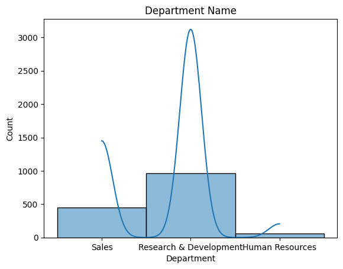
    


    
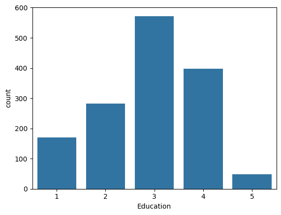
    


```python
#Bivariate Analysis (Relation Between Columns)

sns.scatterplot(x='Age', y='EmployeeCount', data=df)
plt.show()

sns.scatterplot(x='DailyRate', y='JobRole', data=df)
plt.show()

sns.scatterplot(x='Age', y='Gender', data=df)
plt.show()


```


    
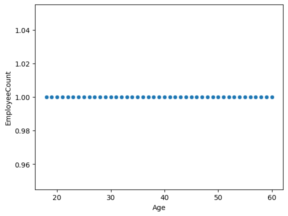
    


    
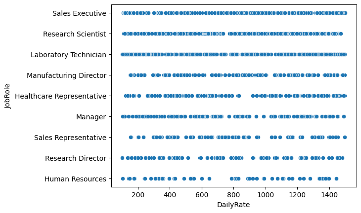
    


    
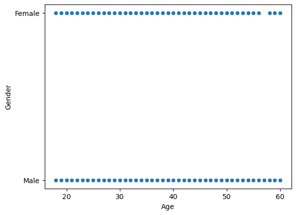
    


```python
#Correlation Heatmap


plt.figure(figsize=(30,35))
sns.heatmap(df.corr(numeric_only=True), annot=True, cmap="coolwarm")
plt.show()

```


    
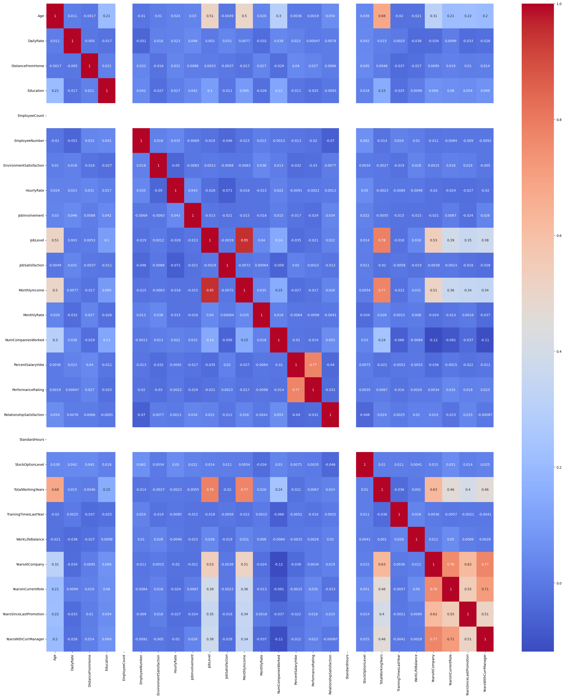
    


```python
# Histogram (Distribution)


sns.histplot(df['Age'], kde=True, bins=30)
plt.title(" Employe Data")
plt.xlabel("DailyRaet")
plt.ylabel("JobRole")
plt.show()


# Histogram (Distribution)

sns.histplot(df['Education'], kde=True, bins=30)
plt.title("Employee Data")
plt.xlabel("Education ")
plt.ylabel("EducationField")
plt.show()


# Histogram (Distribution)

sns.histplot(df['Education'], kde=True, bins=30)
plt.title("Employee Data")
plt.xlabel("HourlyRate")
plt.ylabel("JobLevel")
plt.show()

```


    
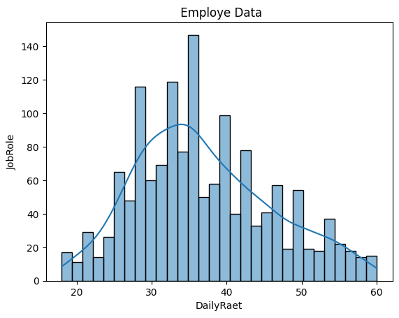
    


    
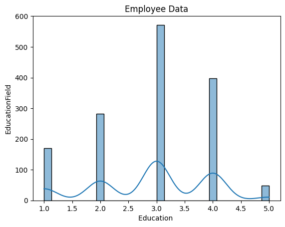
    


    
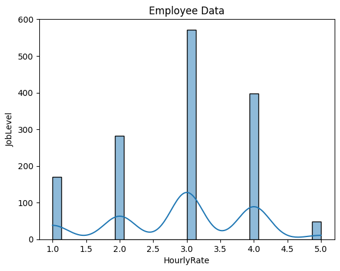
    


```python
#Scatter Plot (Relation Between 2 Numerical Columns)
sns.scatterplot(x='Age', y='Gender', data=df)
plt.title("Age vs Gender")
plt.show()


sns.scatterplot(x='JobRole', y='MonthlyIncome', data=df)
plt.title("JobRole vs MonthlyIncome")
plt.show()


#Scatter Plot (Relation Between 2 Numerical Columns)
sns.scatterplot(x='Gender', y='MaritalStatus', data=df)
plt.title("Gendar vs MaritalStatus")
plt.show()


sns.scatterplot(x='PerformanceRating', y='StandardHours', data=df)
plt.title("PerformanceRating vs StandardHours")
plt.show()


```


    
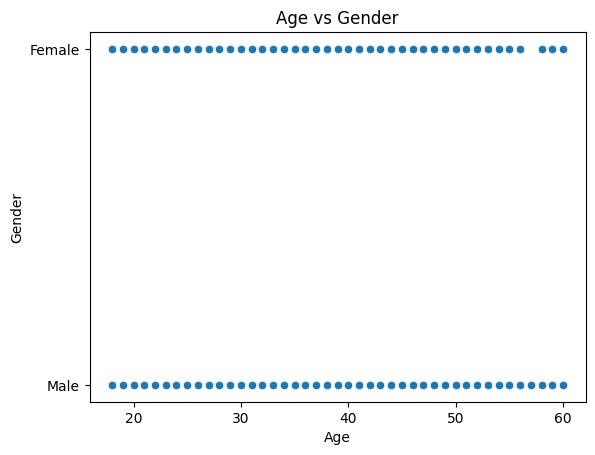
    


    
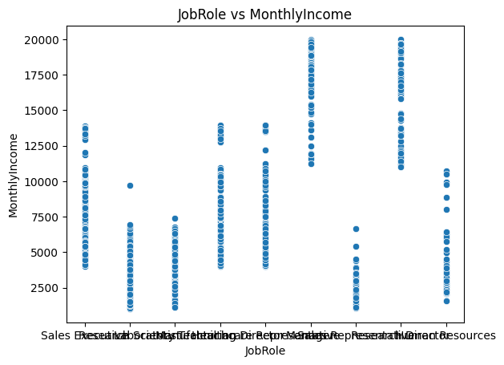
    


    
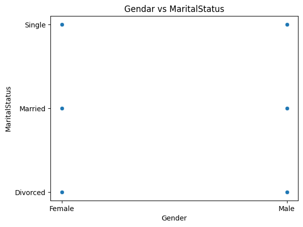
    


    
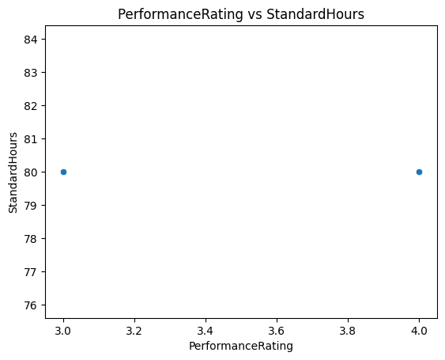
    


```python
#boxplot Plot (Relation Between 2 Numerical Columns)
sns.boxplot(x='Gender', y='MaritalStatus', data=df)
plt.title("Gender vs MaritalStatus")
plt.show()


sns.boxplot(x='JobRole', y='MonthlyIncome', data=df)
plt.title("JobRole vs MonthlyIncome")
plt.show()

```


    
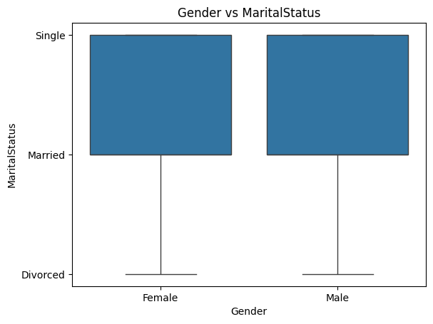
    


    
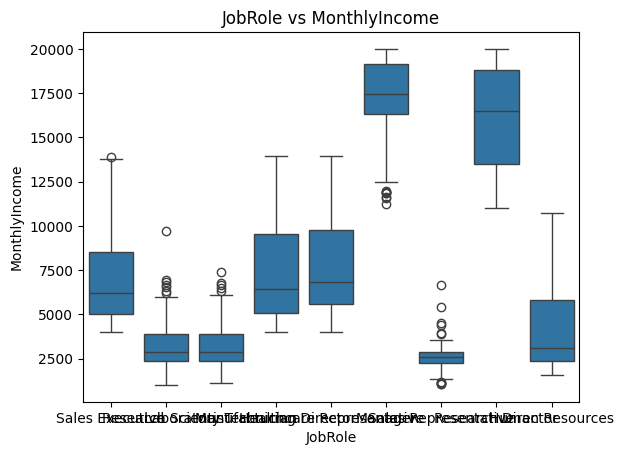
    


```python
#Correlation Heatmap

plt.figure(figsize=(40,50))
sns.heatmap(df.corr(numeric_only=True), annot=True, cmap="coolwarm")
plt.title("Correlation Heatmap")
plt.show()

```


    
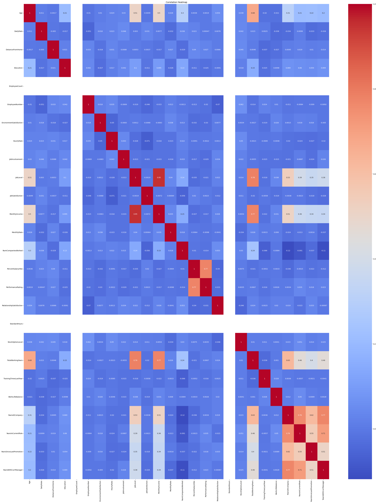
    


```python
#Pair Plot (Full Relationship View)

sns.pairplot(df[['EmployeeNumber','EnvironmentSatisfaction','Gender','HourlyRate']])
plt.show()

```


    
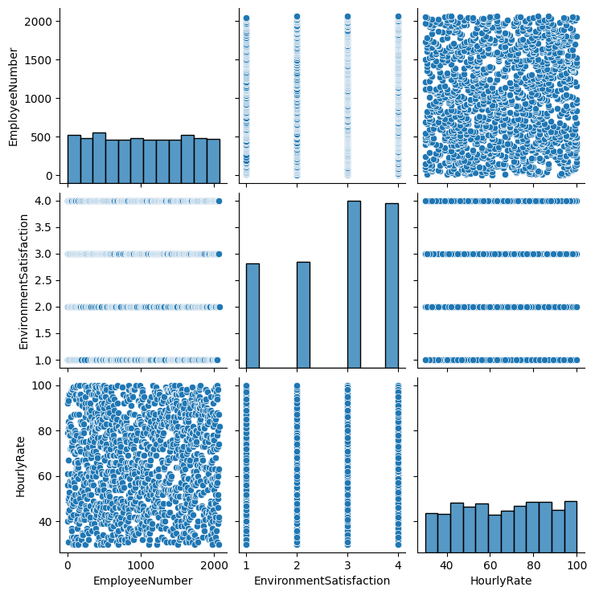
    


```python
#Pair Plot (Full Relationship View)

sns.pairplot(df[['JobLevel','JobRole','JobSatisfaction']])
plt.show()

```


    
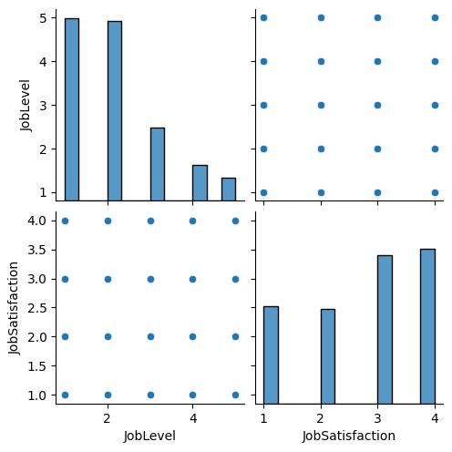
    


```python
# Model Building (Linear Regression)

import pandas as pd
import numpy as np
import matplotlib.pyplot as plt

from sklearn.model_selection import train_test_split
from sklearn.linear_model import LinearRegression
from sklearn.metrics import mean_absolute_error, mean_squared_error, r2_score


# Load Data
df = pd.read_csv("Employee.csv")


# Convert target variable
df['OverTime'] = df['OverTime'].map({'Yes':1, 'No':0})


# Convert categorical variables
df = pd.get_dummies(df, drop_first=True)


# Define X and y
X = df.drop('OverTime', axis=1)
y = df['OverTime']


# Train Test Split
X_train, X_test, y_train, y_test = train_test_split(
    X, y, test_size=0.2, random_state=42
)


# Train Model
model = LinearRegression()
model.fit(X_train, y_train)


# Predict
y_pred = model.predict(X_test)


# Evaluate Model
mae = mean_absolute_error(y_test, y_pred)
mse = mean_squared_error(y_test, y_pred)
rmse = np.sqrt(mse)
r2 = r2_score(y_test, y_pred)


print("MAE :", mae)
print("MSE :", mse)
print("RMSE:", rmse)
print("R2 Score:", r2)
```

    MAE : 0.37580048635661617
    MSE : 0.2037515976257438
    RMSE: 0.45138852181434985
    R2 Score: -0.05401119710208824
    


```python
plt.scatter(y_test, y_pred)
plt.xlabel("Actual")
plt.ylabel("Predicted")
plt.title("Actual vs Predicted")
plt.show()
```


    
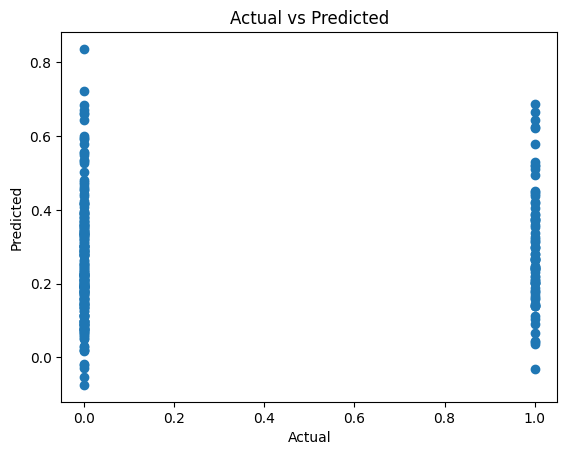
    


```python

#Logistic Regression

import pandas as pd
import numpy as np
import matplotlib.pyplot as plt
import seaborn as sns

from sklearn.model_selection import train_test_split
from sklearn.preprocessing import StandardScaler
from sklearn.linear_model import LogisticRegression
from sklearn.metrics import accuracy_score, classification_report, confusion_matrix

df=pd.read_csv("Employee.csv")

#Data Cleaning  \\predicting OverTime & Attrition

df['OverTime'] = df['OverTime'].map({'Yes':1,'No':0})
df['Attrition'] = df['Attrition'].map({'Yes':1,'No':0})

# Check missing values:
print(df.isnull().sum())


#Drop unnecessary columns if needed:
df = df.drop(['EmployeeNumber','EmployeeCount','StandardHours'], axis=1)

#Convert Remaining Categorical Data
df = pd.get_dummies(df, drop_first=True)


#Define Features and Target  Target example: Attrition
X = df.drop('Attrition', axis=1)
y = df['Attrition']


#Train Test Split
X_train, X_test, y_train, y_test = train_test_split(
    X, y, test_size=0.2, random_state=42
)

#Feature Scaling
scaler = StandardScaler()

X_train = scaler.fit_transform(X_train)
X_test = scaler.transform(X_test)


#Train Logistic Regression Model
model = LogisticRegression()
model.fit(X_train, y_train)

#Prediction
y_pred = model.predict(X_test)

#Model Evaluation // Accuracy
print("Accuracy:", accuracy_score(y_test, y_pred))

#Classification Report
print(classification_report(y_test, y_pred))


#Confusion Matrix
cm = confusion_matrix(y_test, y_pred).T

sns.heatmap(cm, annot=True, fmt='d')
plt.xlabel("Predicted")
plt.ylabel("Actual")
plt.show()

```

    Age                         0
    Attrition                   0
    BusinessTravel              0
    DailyRate                   0
    Department                  0
    DistanceFromHome            0
    Education                   0
    EducationField              0
    EmployeeCount               0
    EmployeeNumber              0
    EnvironmentSatisfaction     0
    Gender                      0
    HourlyRate                  0
    JobInvolvement              0
    JobLevel                    0
    JobRole                     0
    JobSatisfaction             0
    MaritalStatus               0
    MonthlyIncome               0
    MonthlyRate                 0
    NumCompaniesWorked          0
    Over18                      0
    OverTime                    0
    PercentSalaryHike           0
    PerformanceRating           0
    RelationshipSatisfaction    0
    StandardHours               0
    StockOptionLevel            0
    TotalWorkingYears           0
    TrainingTimesLastYear       0
    WorkLifeBalance             0
    YearsAtCompany              0
    YearsInCurrentRole          0
    YearsSinceLastPromotion     0
    YearsWithCurrManager        0
    dtype: int64
    Accuracy: 0.8775510204081632
                  precision    recall  f1-score   support
    
               0       0.92      0.95      0.93       255
               1       0.55      0.44      0.49        39
    
        accuracy                           0.88       294
       macro avg       0.73      0.69      0.71       294
    weighted avg       0.87      0.88      0.87       294
    
    


    
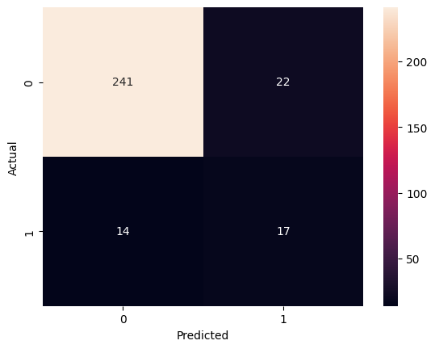
    


```python
print(classification_report(y_test, y_pred))

report = pd.DataFrame(classification_report(y_test, y_pred, output_dict=True)).T
print(report)
```

                  precision    recall  f1-score   support
    
               0       0.92      0.95      0.93       255
               1       0.55      0.44      0.49        39
    
        accuracy                           0.88       294
       macro avg       0.73      0.69      0.71       294
    weighted avg       0.87      0.88      0.87       294
    
                  precision    recall  f1-score     support
    0              0.916350  0.945098  0.930502  255.000000
    1              0.548387  0.435897  0.485714   39.000000
    accuracy       0.877551  0.877551  0.877551    0.877551
    macro avg      0.732368  0.690498  0.708108  294.000000
    weighted avg   0.867538  0.877551  0.871499  294.000000
    


```python
#Model Evaluation // Accuracy
print("Accuracy:", accuracy_score(y_test, y_pred))

#Classification Report (Table Format)
report = pd.DataFrame(classification_report(y_test, y_pred, output_dict=True)).T
print("\nClassification Report Table\n")
print(report)
```

    Accuracy: 0.8775510204081632
    
    Classification Report Table
    
                  precision    recall  f1-score     support
    0              0.916350  0.945098  0.930502  255.000000
    1              0.548387  0.435897  0.485714   39.000000
    accuracy       0.877551  0.877551  0.877551    0.877551
    macro avg      0.732368  0.690498  0.708108  294.000000
    weighted avg   0.867538  0.877551  0.871499  294.000000
    
