```python
import pandas as pd
import numpy as np
import matplotlib.pyplot as plt
import seaborn as sns 


df=pd.read_csv("diabetes.csv")


```


```python
print(df.head())
```

       Feature1  Feature2  Outcome
    0  2.882026  1.663770        0
    1  2.200079  1.820223        0
    2  2.489369  1.593427        0
    3  3.120447  1.136859        0
    4  2.933779  2.088713        0
    


```python
df.info()
```

    <class 'pandas.core.frame.DataFrame'>
    RangeIndex: 120 entries, 0 to 119
    Data columns (total 3 columns):
     #   Column    Non-Null Count  Dtype  
    ---  ------    --------------  -----  
     0   Feature1  120 non-null    float64
     1   Feature2  120 non-null    float64
     2   Outcome   120 non-null    int64  
    dtypes: float64(2), int64(1)
    memory usage: 2.9 KB
    


```python
df.describe().T
```


<div>
<style scoped>
    .dataframe tbody tr th:only-of-type {
        vertical-align: middle;
    }

    .dataframe tbody tr th {
        vertical-align: top;
    }

    .dataframe thead th {
        text-align: right;
    }
</style>
<table border="1" class="dataframe">
  <thead>
    <tr style="text-align: right;">
      <th></th>
      <th>count</th>
      <th>mean</th>
      <th>std</th>
      <th>min</th>
      <th>25%</th>
      <th>50%</th>
      <th>75%</th>
      <th>max</th>
    </tr>
  </thead>
  <tbody>
    <tr>
      <th>Feature1</th>
      <td>120.0</td>
      <td>5.022819</td>
      <td>3.038153</td>
      <td>0.723505</td>
      <td>2.053943</td>
      <td>5.181246</td>
      <td>7.976594</td>
      <td>9.191572</td>
    </tr>
    <tr>
      <th>Feature2</th>
      <td>120.0</td>
      <td>5.024861</td>
      <td>2.984773</td>
      <td>1.136859</td>
      <td>2.082658</td>
      <td>4.930055</td>
      <td>7.979243</td>
      <td>9.129654</td>
    </tr>
    <tr>
      <th>Outcome</th>
      <td>120.0</td>
      <td>0.500000</td>
      <td>0.502096</td>
      <td>0.000000</td>
      <td>0.000000</td>
      <td>0.500000</td>
      <td>1.000000</td>
      <td>1.000000</td>
    </tr>
  </tbody>
</table>
</div>


```python
cat_col=[col for col in df.columns 
         if df[col].dtype=='object']
print("Categorical columns:",cat_col)


```

    Categorical columns: []
    


```python
df[cat_col].nunique().T
```


    Series([], dtype: float64)


```python
#Check Duplicates

print(df.duplicated().sum())
df.drop_duplicates(inplace=True)

```

    0
    


```python
#Univariate Analysis (Single Column)


sns.histplot(df['Feature1'], kde=True)
plt.title("Diabetes")
plt.show()

#Categorical Count
sns.countplot(x='Feature1', data=df)
plt.show()


```


    
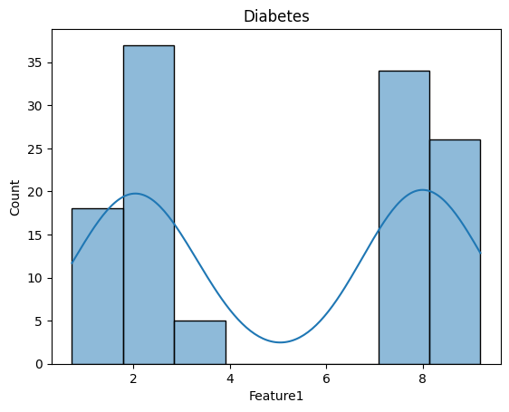
    


    
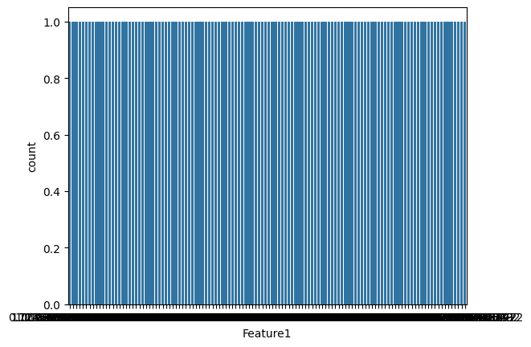
    


```python
#Univariate Analysis (Single Column)


sns.histplot(df['Feature2'], kde=True)
plt.title("Diabetes")
plt.show()

#Categorical Count
sns.countplot(x='Feature2', data=df)
plt.show()


```


    
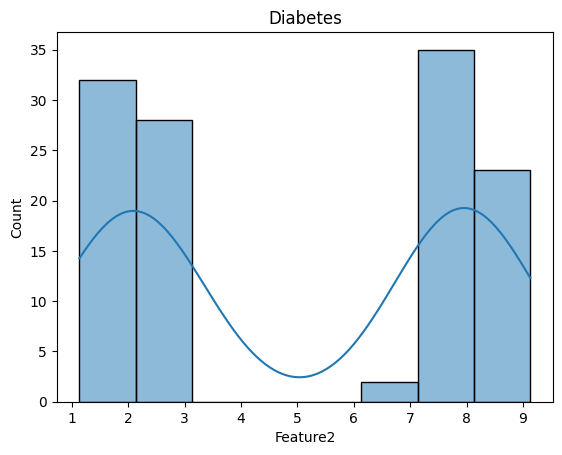
    


    
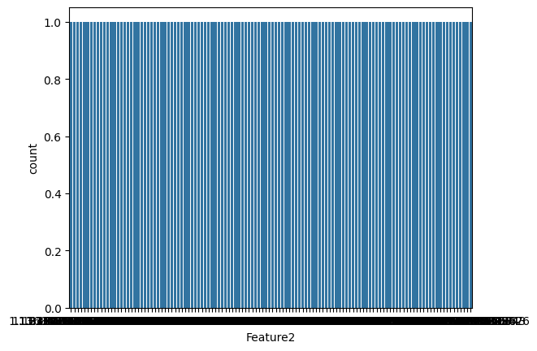
    


```python
#Bivariate Analysis (Relation Between Columns)

sns.scatterplot(x='Feature1', y='Feature2', data=df)
plt.show()

sns.scatterplot(x='Feature2', y='Feature1', data=df)
plt.show()

sns.scatterplot(x='Feature1', y='Outcome', data=df)
plt.show()


```


    
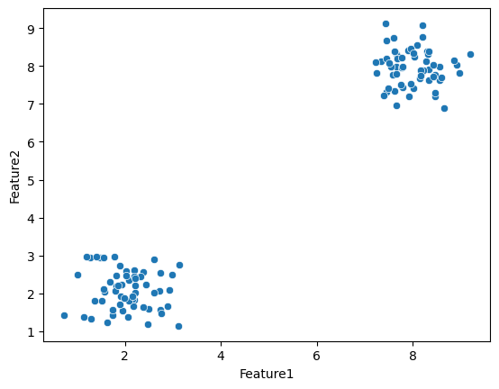
    


    
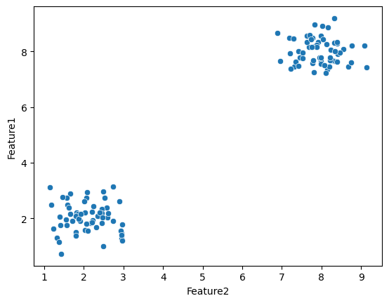
    


    
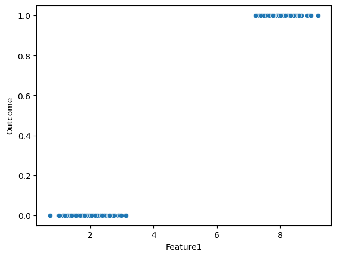
    


```python
#Correlation Heatmap


plt.figure(figsize=(9,8))
sns.heatmap(df.corr(numeric_only=True), annot=True, cmap="coolwarm")
plt.show()

```


    
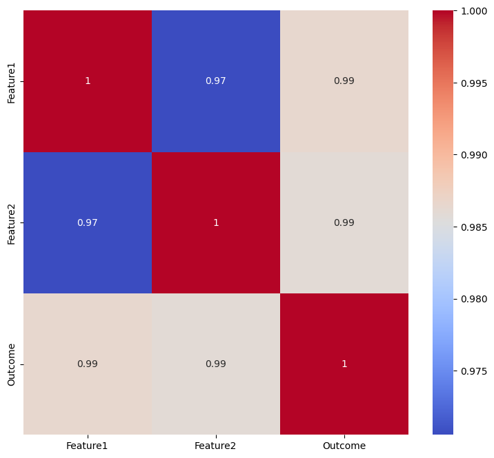
    


```python
# Histogram (Distribution)


sns.histplot(df['Feature1'], kde=True, bins=30)
plt.title("Diabetes Result")
plt.xlabel("Feature1")
plt.ylabel("Outcome")
plt.show()

sns.histplot(df['Feature2'], kde=True, bins=30)
plt.title("Diabetes Result")
plt.xlabel("Feature2")
plt.ylabel("Outcome")
plt.show()
```


    
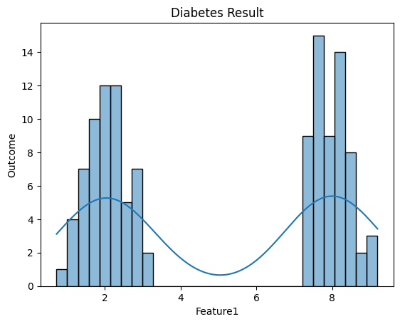
    


    
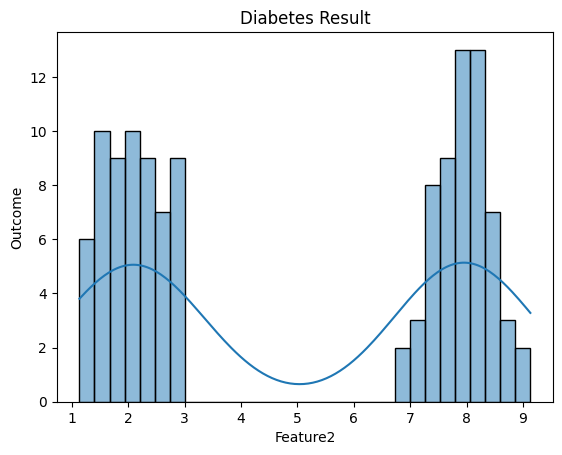
    


```python
#Scatter Plot (Relation Between 2 Numerical Columns)
sns.scatterplot(x='Feature1', y='Outcome', data=df)
plt.title("Feature1 vs Outcome")
plt.show()


sns.scatterplot(x='Feature2', y='Outcome', data=df)
plt.title("Feature2 vs Outcome")
plt.show()


#Scatter Plot (Relation Between 2 Numerical Columns)
sns.scatterplot(x='Feature1', y='Feature2', data=df)
plt.title("Feature1 vs Feature2")
plt.show()

sns.scatterplot(x='Feature2', y='Feature1', data=df)
plt.title("Feature2 vs Feature1")
plt.show()


```


    
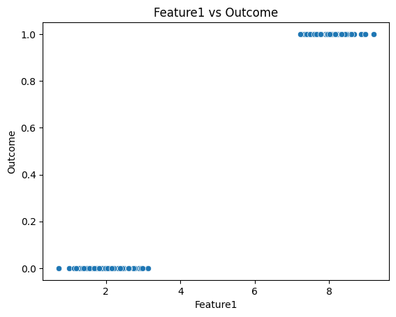
    


    
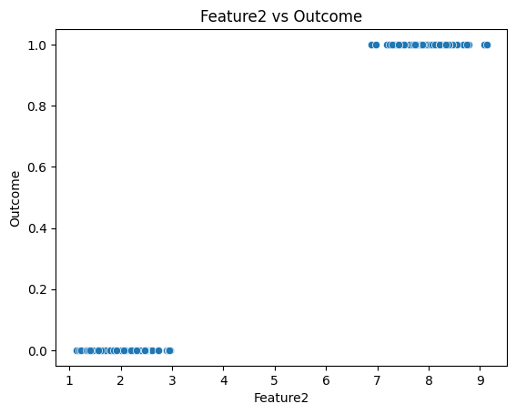
    


    
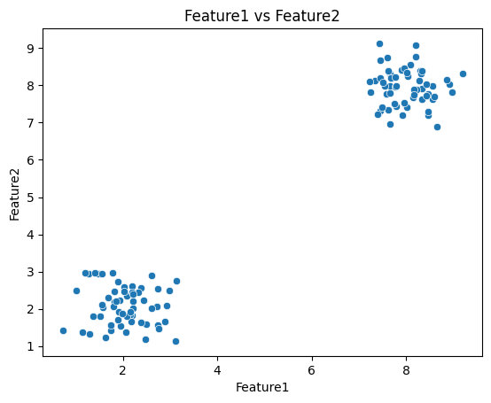
    


    
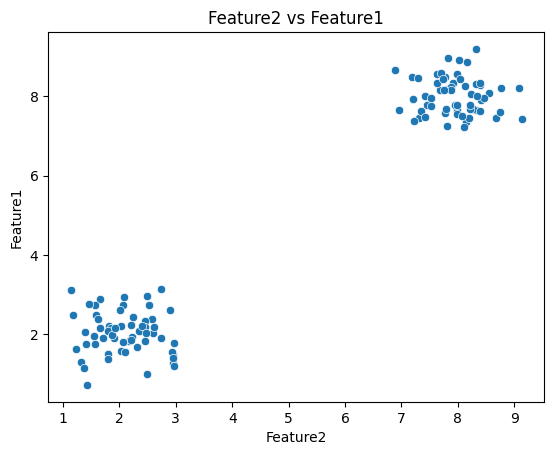
    


```python
#boxplot Plot (Relation Between 2 Numerical Columns)
sns.boxplot(x='Feature1', y='Outcome', data=df)
plt.title("Feature1 vs Outcome")
plt.show()


sns.boxplot(x='Feature2', y='Outcome', data=df)
plt.title("Feature2 vs Outcome")
plt.show()

#boxplot Plot (Relation Between 2 Numerical Columns)
sns.boxplot(x='Feature1', y='Feature2', data=df)
plt.title("Feature1 vs Feature2")
plt.show()


```


    
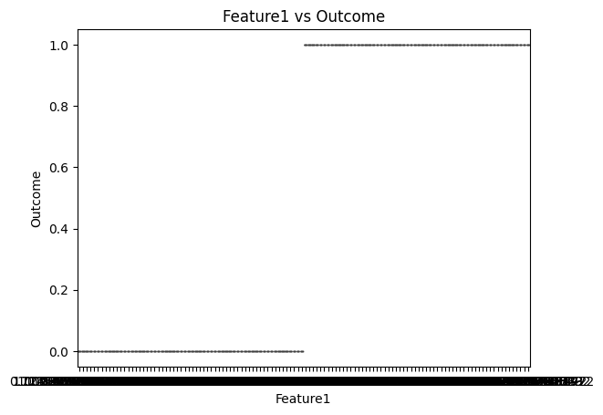
    


    
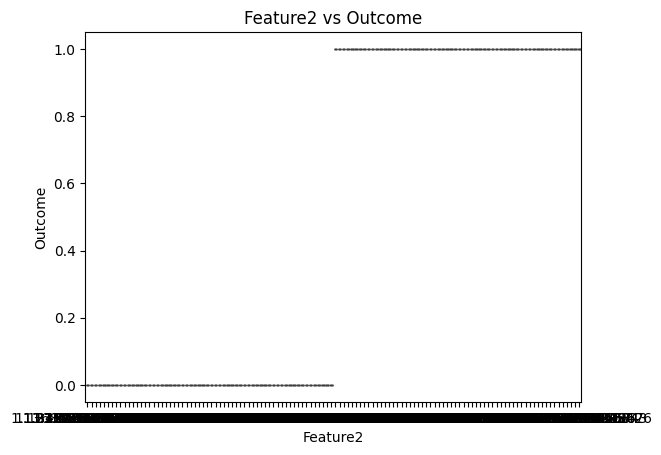
    


    
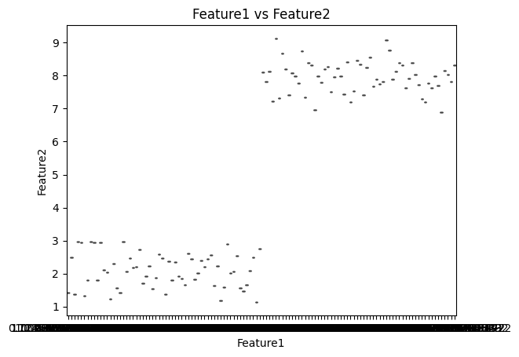
    


```python
#Correlation Heatmap

plt.figure(figsize=(6,4))
sns.heatmap(df.corr(numeric_only=True), annot=True, cmap="coolwarm")
plt.title("Correlation Heatmap")
plt.show()

```


    
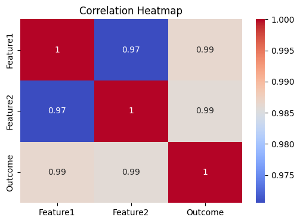
    


```python
#Pair Plot (Full Relationship View)

sns.pairplot(df[[ 'Feature1','Feature2','Outcome' ]])
plt.show()

```


    
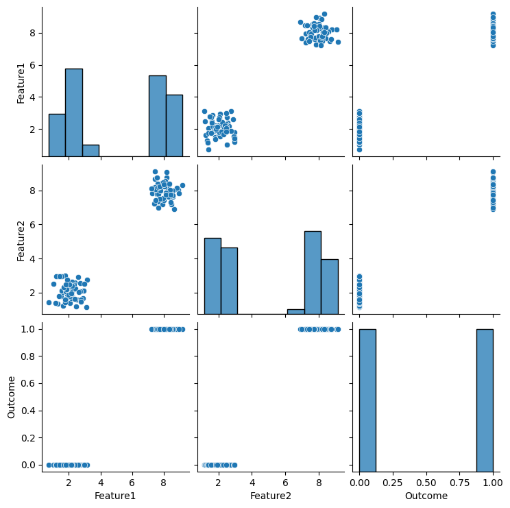
    


```python
# Model Building (Linear Regression)

import pandas as pd
import numpy as np
import matplotlib.pyplot as plt

from sklearn.model_selection import train_test_split
from sklearn.linear_model import LinearRegression
from sklearn.metrics import mean_absolute_error, mean_squared_error, r2_score


# Load Dataset
df = pd.read_csv("diabetes.csv")


# Define Features (X) and Target (y)
X = df.drop("Outcome", axis=1)
y = df["Outcome"]


# Train-Test Split
X_train, X_test, y_train, y_test = train_test_split(
    X, y, test_size=0.2, random_state=42
)


# Create Model
model = LinearRegression()


# Train Model
model.fit(X_train, y_train)


# Make Predictions
y_pred = model.predict(X_test)


# Model Evaluation
mae = mean_absolute_error(y_test, y_pred)
mse = mean_squared_error(y_test, y_pred)
rmse = np.sqrt(mse)
r2 = r2_score(y_test, y_pred)


# Print Results
print("MAE :", mae)
print("MSE :", mse)
print("RMSE:", rmse)
print("R2 Score:", r2)
```

    MAE : 0.052959901543395714
    MSE : 0.0036533658649111358
    RMSE: 0.060443079545231114
    R2 Score: 0.9852843444881901
    


```python
plt.scatter(y_test, y_pred)
plt.xlabel("Actual")
plt.ylabel("Predicted")
plt.title("Actual vs Predicted")
plt.show()
```


    
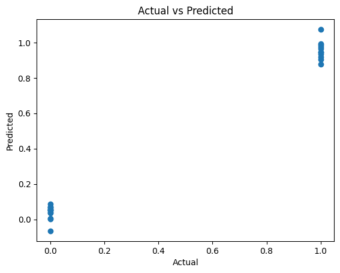
    


```python
# Logistic Regression Model

import pandas as pd
import numpy as np
import matplotlib.pyplot as plt
import seaborn as sns

from sklearn.model_selection import train_test_split
from sklearn.preprocessing import StandardScaler
from sklearn.linear_model import LogisticRegression
from sklearn.metrics import accuracy_score, classification_report, confusion_matrix

# Load Dataset
df = pd.read_csv("diabetes.csv")

# Define Features (X) and Target (y)
X = df.drop("Outcome", axis=1)
y = df["Outcome"]

# Train Test Split
X_train, X_test, y_train, y_test = train_test_split(
    X, y, test_size=0.2, random_state=42
)

# Feature Scaling
scaler = StandardScaler()

X_train = scaler.fit_transform(X_train)
X_test = scaler.transform(X_test)

# Train Logistic Regression Model
model = LogisticRegression()
model.fit(X_train, y_train)

# Prediction
y_pred = model.predict(X_test)

# Model Evaluation
accuracy = accuracy_score(y_test, y_pred)
cm = confusion_matrix(y_test, y_pred)
report = classification_report(y_test, y_pred)


print("Accuracy:",accuracy)
print("\nConfusion Matrix:\n",cm)
print("\nClassification Report:\n", report)


# Confusion Matrix Plot
sns.heatmap(cm, annot=True, fmt='d')
plt.xlabel("Predicted")
plt.ylabel("Actual")
plt.title("Confusion Matrix")
plt.show()
```

    Accuracy: 1.0
    
    Confusion Matrix:
     [[13  0]
     [ 0 11]]
    
    Classification Report:
                   precision    recall  f1-score   support
    
               0       1.00      1.00      1.00        13
               1       1.00      1.00      1.00        11
    
        accuracy                           1.00        24
       macro avg       1.00      1.00      1.00        24
    weighted avg       1.00      1.00      1.00        24
    
    


    
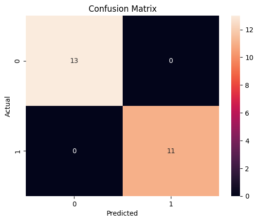
    


```python

print(classification_report(y_test, y_pred))

report = pd.DataFrame(classification_report(y_test, y_pred, output_dict=True)).T
print(report)
```

                  precision    recall  f1-score   support
    
               0       1.00      1.00      1.00        13
               1       1.00      1.00      1.00        11
    
        accuracy                           1.00        24
       macro avg       1.00      1.00      1.00        24
    weighted avg       1.00      1.00      1.00        24
    
                  precision  recall  f1-score  support
    0                   1.0     1.0       1.0     13.0
    1                   1.0     1.0       1.0     11.0
    accuracy            1.0     1.0       1.0      1.0
    macro avg           1.0     1.0       1.0     24.0
    weighted avg        1.0     1.0       1.0     24.0
    


```python
#Model Evaluation // Accuracy
print("Accuracy:", accuracy_score(y_test, y_pred))

#Classification Report (Table Format)
report = pd.DataFrame(classification_report(y_test, y_pred, output_dict=True)).T
print("\nClassification Report Table\n")
print(report)
```

    Accuracy: 1.0
    
    Classification Report Table
    
                  precision  recall  f1-score  support
    0                   1.0     1.0       1.0     13.0
    1                   1.0     1.0       1.0     11.0
    accuracy            1.0     1.0       1.0      1.0
    macro avg           1.0     1.0       1.0     24.0
    weighted avg        1.0     1.0       1.0     24.0
    
