```python
import pandas as pd
import numpy as np
import matplotlib.pyplot as plt
import seaborn as sns 


df=pd.read_csv("Medicaldataset.csv")


```


```python
print(df.head())
```

       Age  Gender  Heart rate  Systolic blood pressure  Diastolic blood pressure  \
    0   64       1          66                      160                        83   
    1   21       1          94                       98                        46   
    2   55       1          64                      160                        77   
    3   64       1          70                      120                        55   
    4   55       1          64                      112                        65   
    
       Blood sugar  CK-MB  Troponin    Result  
    0        160.0   1.80     0.012  negative  
    1        296.0   6.75     1.060  positive  
    2        270.0   1.99     0.003  negative  
    3        270.0  13.87     0.122  positive  
    4        300.0   1.08     0.003  negative  
    


```python
df.info()
```

    <class 'pandas.core.frame.DataFrame'>
    RangeIndex: 1319 entries, 0 to 1318
    Data columns (total 9 columns):
     #   Column                    Non-Null Count  Dtype  
    ---  ------                    --------------  -----  
     0   Age                       1319 non-null   int64  
     1   Gender                    1319 non-null   int64  
     2   Heart rate                1319 non-null   int64  
     3   Systolic blood pressure   1319 non-null   int64  
     4   Diastolic blood pressure  1319 non-null   int64  
     5   Blood sugar               1319 non-null   float64
     6   CK-MB                     1319 non-null   float64
     7   Troponin                  1319 non-null   float64
     8   Result                    1319 non-null   object 
    dtypes: float64(3), int64(5), object(1)
    memory usage: 92.9+ KB
    


```python
df.describe().T
```


<div>
<style scoped>
    .dataframe tbody tr th:only-of-type {
        vertical-align: middle;
    }

    .dataframe tbody tr th {
        vertical-align: top;
    }

    .dataframe thead th {
        text-align: right;
    }
</style>
<table border="1" class="dataframe">
  <thead>
    <tr style="text-align: right;">
      <th></th>
      <th>count</th>
      <th>mean</th>
      <th>std</th>
      <th>min</th>
      <th>25%</th>
      <th>50%</th>
      <th>75%</th>
      <th>max</th>
    </tr>
  </thead>
  <tbody>
    <tr>
      <th>Age</th>
      <td>1319.0</td>
      <td>56.191812</td>
      <td>13.647315</td>
      <td>14.000</td>
      <td>47.000</td>
      <td>58.000</td>
      <td>65.0000</td>
      <td>103.0</td>
    </tr>
    <tr>
      <th>Gender</th>
      <td>1319.0</td>
      <td>0.659591</td>
      <td>0.474027</td>
      <td>0.000</td>
      <td>0.000</td>
      <td>1.000</td>
      <td>1.0000</td>
      <td>1.0</td>
    </tr>
    <tr>
      <th>Heart rate</th>
      <td>1319.0</td>
      <td>78.336619</td>
      <td>51.630270</td>
      <td>20.000</td>
      <td>64.000</td>
      <td>74.000</td>
      <td>85.0000</td>
      <td>1111.0</td>
    </tr>
    <tr>
      <th>Systolic blood pressure</th>
      <td>1319.0</td>
      <td>127.170584</td>
      <td>26.122720</td>
      <td>42.000</td>
      <td>110.000</td>
      <td>124.000</td>
      <td>143.0000</td>
      <td>223.0</td>
    </tr>
    <tr>
      <th>Diastolic blood pressure</th>
      <td>1319.0</td>
      <td>72.269143</td>
      <td>14.033924</td>
      <td>38.000</td>
      <td>62.000</td>
      <td>72.000</td>
      <td>81.0000</td>
      <td>154.0</td>
    </tr>
    <tr>
      <th>Blood sugar</th>
      <td>1319.0</td>
      <td>146.634344</td>
      <td>74.923045</td>
      <td>35.000</td>
      <td>98.000</td>
      <td>116.000</td>
      <td>169.5000</td>
      <td>541.0</td>
    </tr>
    <tr>
      <th>CK-MB</th>
      <td>1319.0</td>
      <td>15.274306</td>
      <td>46.327083</td>
      <td>0.321</td>
      <td>1.655</td>
      <td>2.850</td>
      <td>5.8050</td>
      <td>300.0</td>
    </tr>
    <tr>
      <th>Troponin</th>
      <td>1319.0</td>
      <td>0.360942</td>
      <td>1.154568</td>
      <td>0.001</td>
      <td>0.006</td>
      <td>0.014</td>
      <td>0.0855</td>
      <td>10.3</td>
    </tr>
  </tbody>
</table>
</div>


```python
cat_col=[col for col in df.columns 
         if df[col].dtype=='object']
print("Categorical columns:",cat_col)


```

    Categorical columns: ['Result']
    


```python
df[cat_col].nunique().T
```


    Result    3
    dtype: int64


```python
#Check Duplicates

print(df.duplicated().sum())
df.drop_duplicates(inplace=True)

```

    0
    


```python
#Univariate Analysis (Single Column)/ HISTOGRAM & BAR CHART

sns.histplot(df['Heart rate'], kde=True,color="olive")
plt.title("Heart Rate")
plt.show()

#Categorical Count
sns.countplot(x='Heart rate', data=df)
plt.title("Heart Rate")
plt.show()


#Univariate Analysis (Single Column)

sns.histplot(df['CK-MB'], kde=True,color="indigo")
plt.title("PLOT CK-MB")
plt.show()

#Categorical Count
sns.countplot(x='CK-MB', data=df)
plt.title("PLOT CK-MB")
plt.show()


#Univariate Analysis (Single Column)

sns.histplot(df['Blood sugar'], kde=True,color="red")
plt.title("PLOT-DATA BLOOD SUGAR")
plt.show()

#Categorical Count
sns.countplot(x='Blood sugar', data=df)
plt.title("PLOT-DATA BLOOD SUGAR")
plt.show()


#Univariate Analysis (Single Column)

sns.histplot(df['Result'], kde=True,color="orange")
plt.title("PLOT-DATA RESULT")
plt.show()

#Categorical Count
sns.countplot(x='Result', data=df)
plt.title("PLOT-DATA RESULT")
plt.show()

```


    
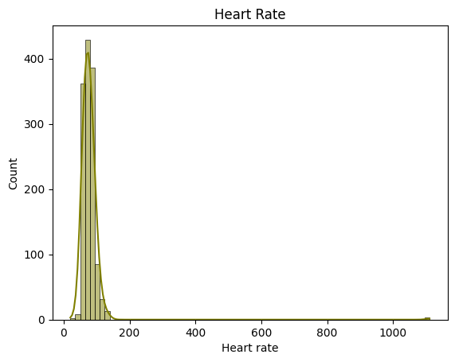
    


    
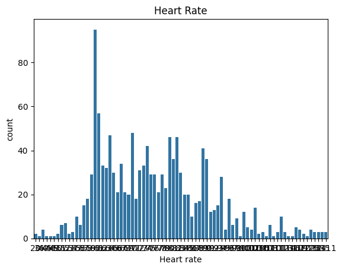
    


    
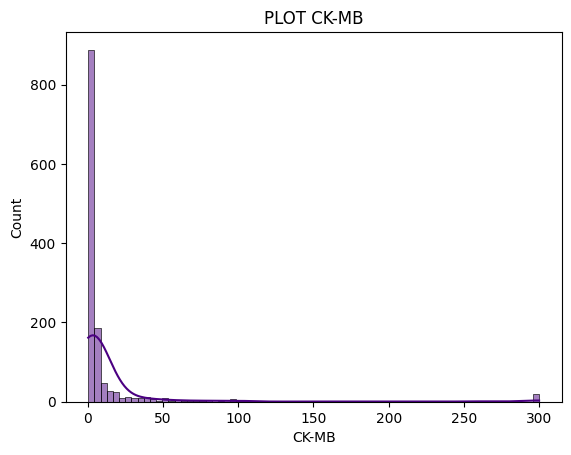
    


    
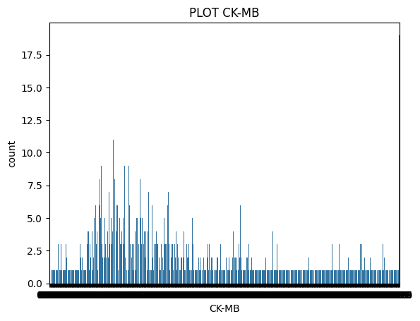
    


    
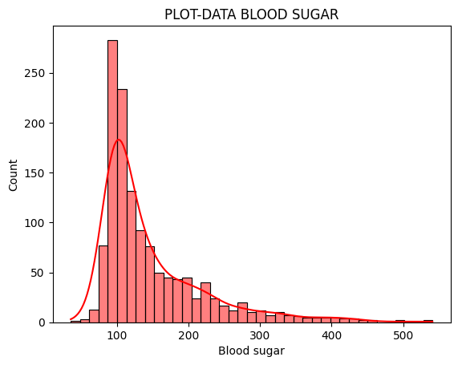
    


    
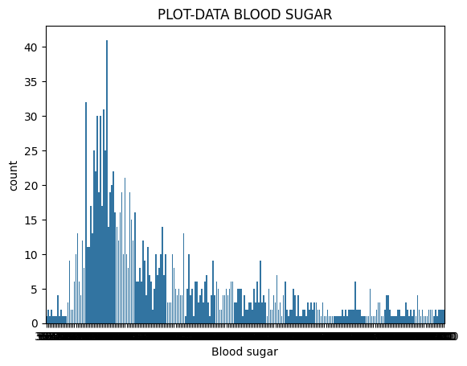
    


    
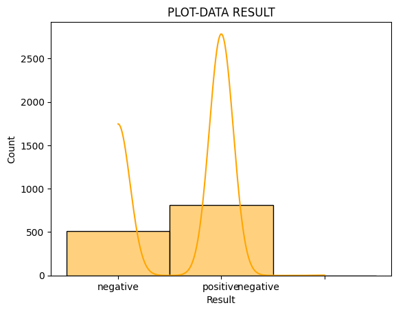
    


    
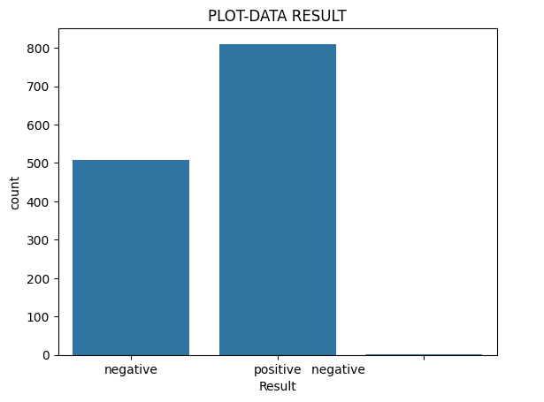
    


```python
# Univariate Analysis (Single Column) ///  PIE CHART
plt.figure(figsize=(10,10))
data=df['Age'].value_counts()
plt.title("PIE CHART-AGE")
plt.pie(data.values,
        labels=data.index,
        autopct='%1.1f%%')
plt.show()

#PIE CHART
plt.figure(figsize=(10,10))
data=df['Gender'].value_counts()
plt.title("PIE CHART-GENDER")
plt.pie(data.values,
        labels=data.index,
        autopct='%1.1f%%')
plt.show()


#PIE CHART
plt.figure(figsize=(10,10))
data=df['Heart rate'].value_counts()
plt.title("PIE CHART-HEART RATE")
plt.pie(data.values,
        labels=data.index,
        autopct='%1.1f%%')
plt.show()

#PIE CHART
plt.figure(figsize=(10,10))
data=df['Systolic blood pressure'].value_counts()
plt.title("PIE CHART- SYSTOLIC BLOOD PRESSURE")
plt.pie(data.values,
        labels=data.index,
        autopct='%1.1f%%')
plt.show()


#PIE CHART
plt.figure(figsize=(10,10))
data=df['Diastolic blood pressure'].value_counts()
plt.title("PIE CHART-DIASTOLIC BLOOD PRESSURE")
plt.pie(data.values,
        labels=data.index,
        autopct='%1.1f%%')
plt.show()


#PIE CHART
plt.figure(figsize=(10,10))
data=df['Blood sugar'].value_counts()
plt.title("PIE CHART- BLOOD SUGAR")
plt.pie(data.values,
        labels=data.index,
        autopct='%1.1f%%')
plt.show()


#PIE CHART
plt.figure(figsize=(10,10))
data=df['Troponin'].value_counts()
plt.title("PIE CHART- TROPONIN")
plt.pie(data.values,
        labels=data.index,
        autopct='%1.1f%%')
plt.show()


#PIE CHART
plt.figure(figsize=(10,10))
data=df['Result'].value_counts()
plt.title("PIE CHART-RESULT")
plt.pie(data.values,
        labels=data.index,
        autopct='%1.1f%%')
plt.show()


#PIE CHART
plt.figure(figsize=(10,10))
data=df['CK-MB'].value_counts()
plt.title("PIE CHART-CK-MB")
plt.pie(data.values,
        labels=data.index,
        autopct='%1.1f%%')
plt.show()


```


    
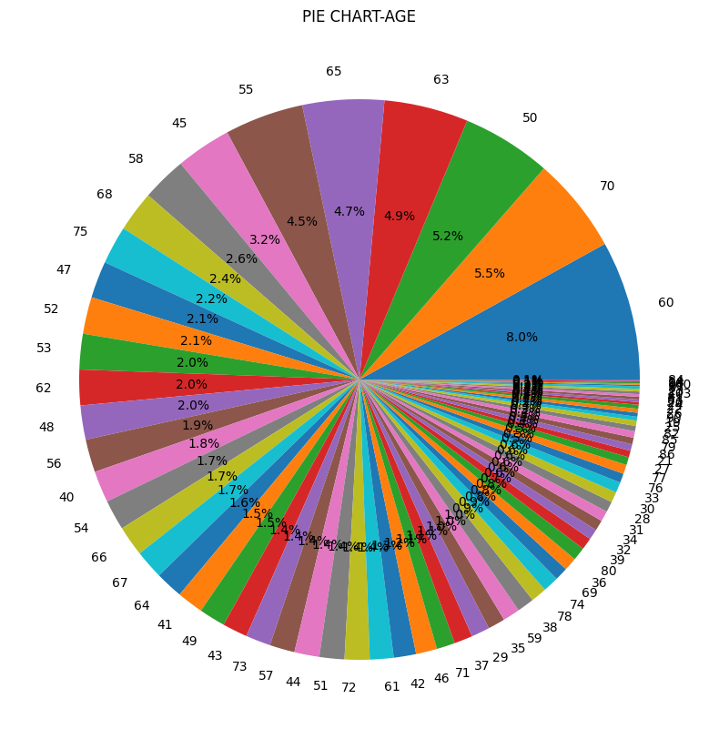
    


    
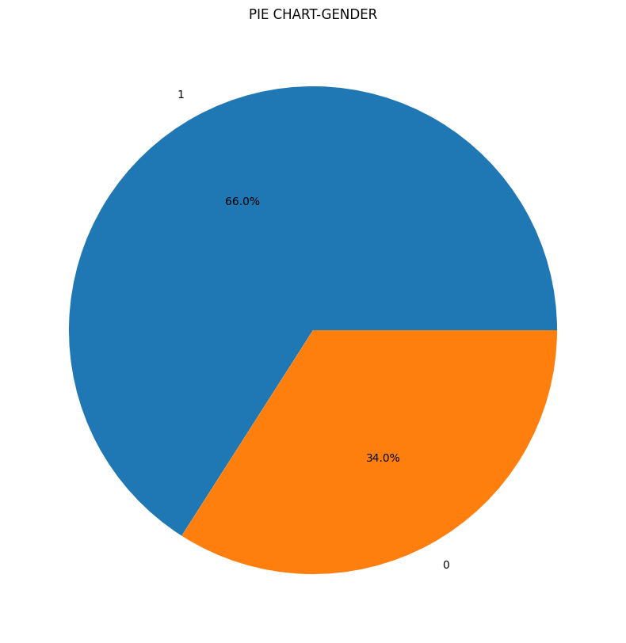
    


    
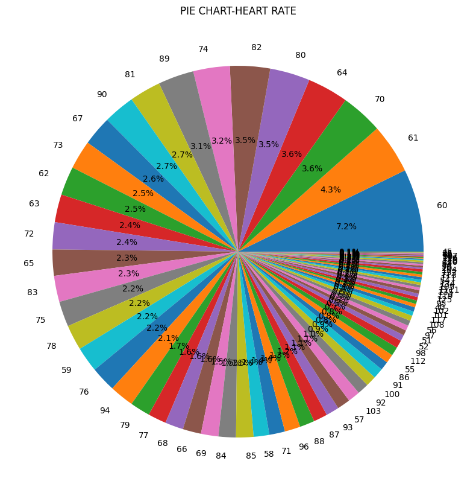
    


    
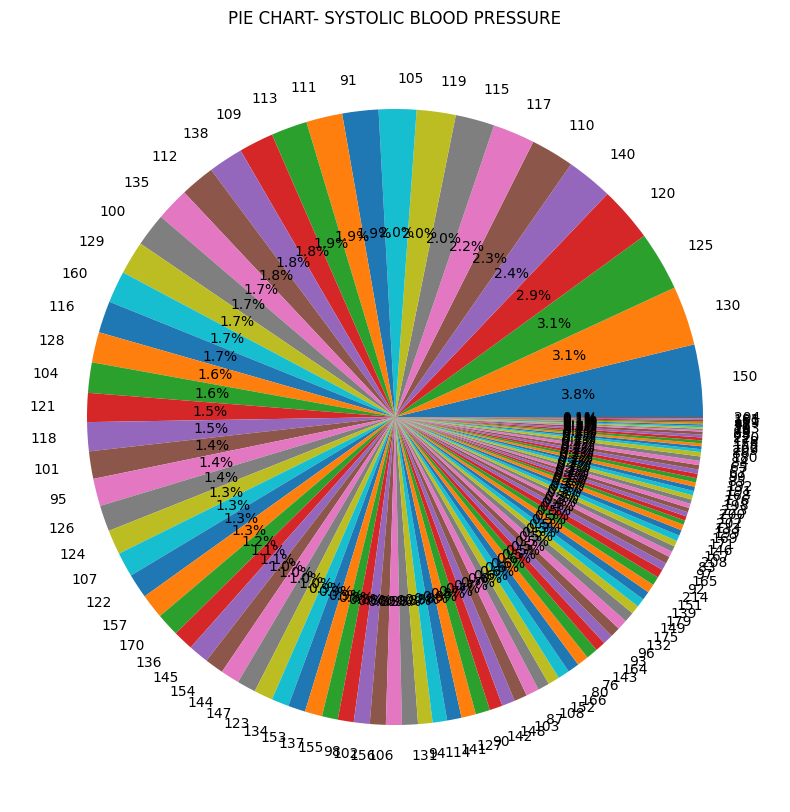
    


    
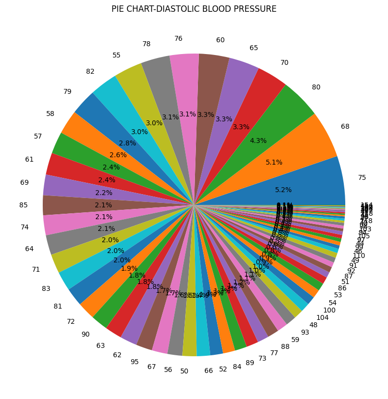
    


    
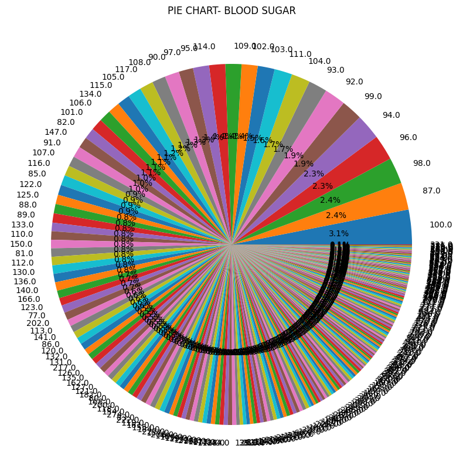
    


    
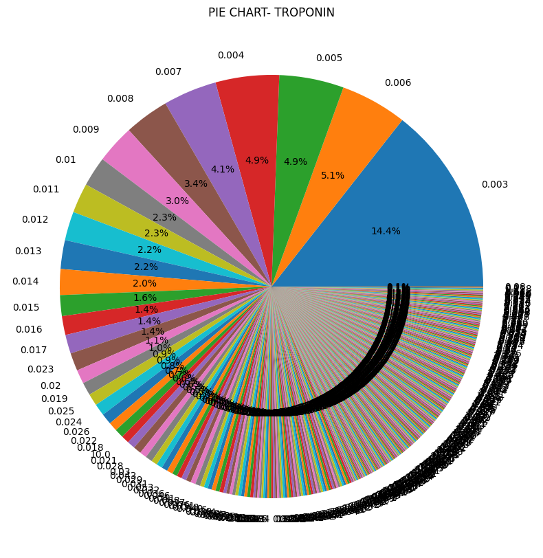
    


    
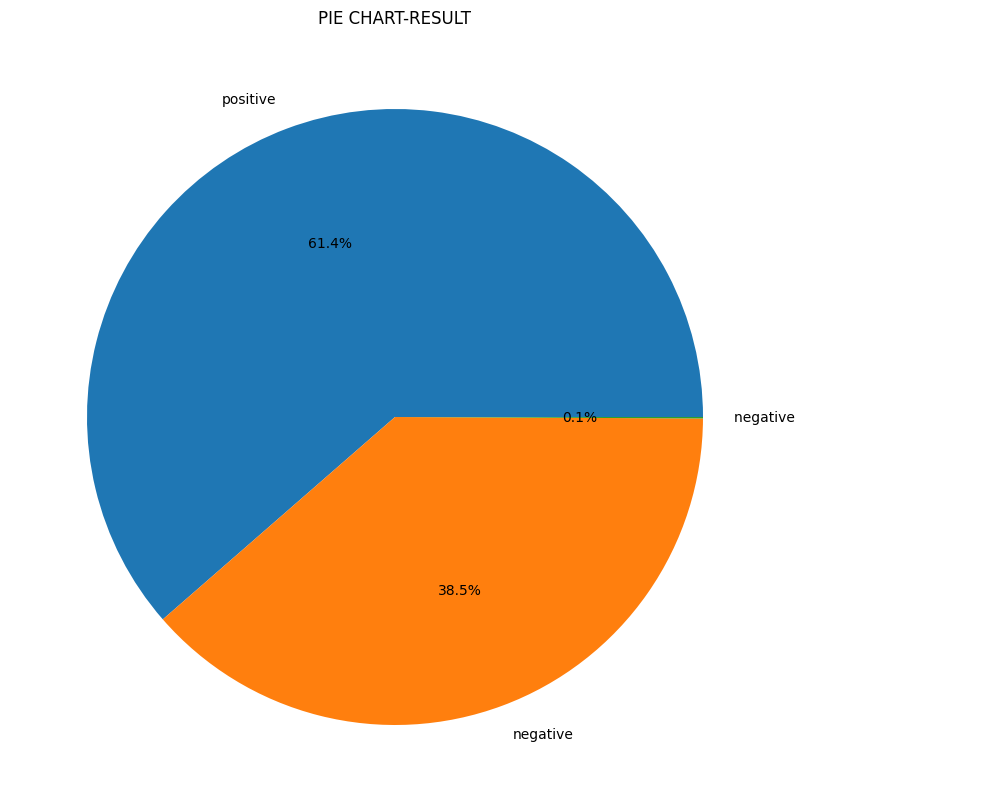
    


    
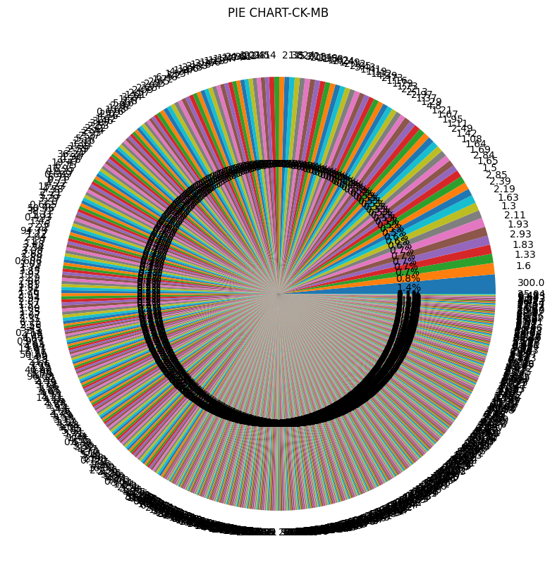
    


```python
#Bivariate Analysis // Categorical v/s Numerical - barplot....1

plt.figure(figsize=(40,30))
sns.barplot(x='Age',y='Gender',data=df,color='green',palette='coolwarm')
plt.title('AGE V/S GENDER')
plt.xticks(rotation=50)
plt.show()

#Bivariate Analysis // Categorical v/s Numerical - barplot....2

plt.figure(figsize=(50,50))
sns.barplot(x='Blood sugar',y='Troponin',data=df,color='blue',palette='coolwarm')
plt.title('Blood sugar V/S Trponin')
plt.xticks(rotation=50)
plt.show()


#Bivariate Analysis // Categorical v/s Numerical - barplot....3

plt.figure(figsize=(40,35))
sns.barplot(x='Heart rate',y='Gender',data=df,color='orange')
plt.title('Heart rate V/S Gender')
plt.xticks(rotation=50)
plt.show()


```

    C:\Users\Admin\AppData\Local\Temp\ipykernel_6504\2520337561.py:4: FutureWarning: 
    
    Passing `palette` without assigning `hue` is deprecated and will be removed in v0.14.0. Assign the `x` variable to `hue` and set `legend=False` for the same effect.
    
      sns.barplot(x='Age',y='Gender',data=df,color='green',palette='coolwarm')
    


    
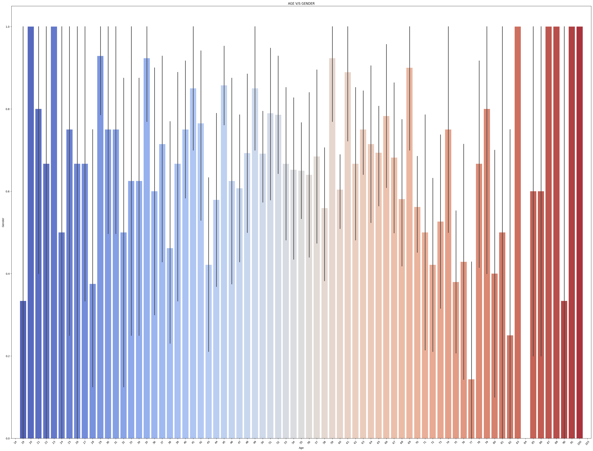
    


    C:\Users\Admin\AppData\Local\Temp\ipykernel_6504\2520337561.py:12: FutureWarning: 
    
    Passing `palette` without assigning `hue` is deprecated and will be removed in v0.14.0. Assign the `x` variable to `hue` and set `legend=False` for the same effect.
    
      sns.barplot(x='Blood sugar',y='Troponin',data=df,color='blue',palette='coolwarm')
    


    
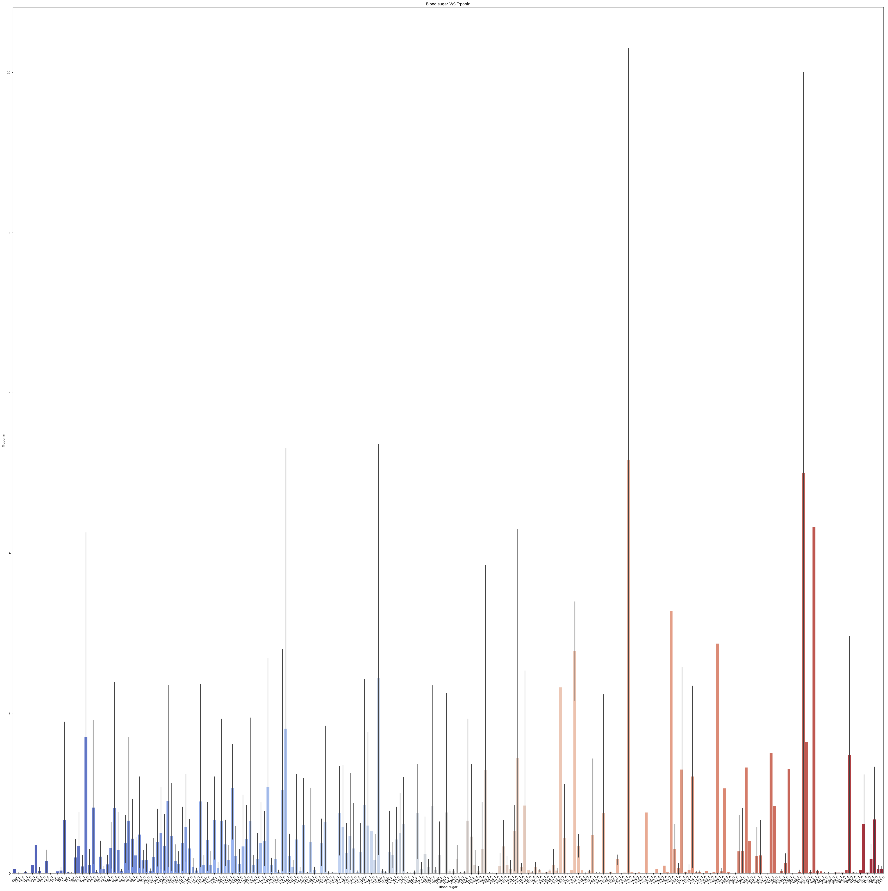
    


    
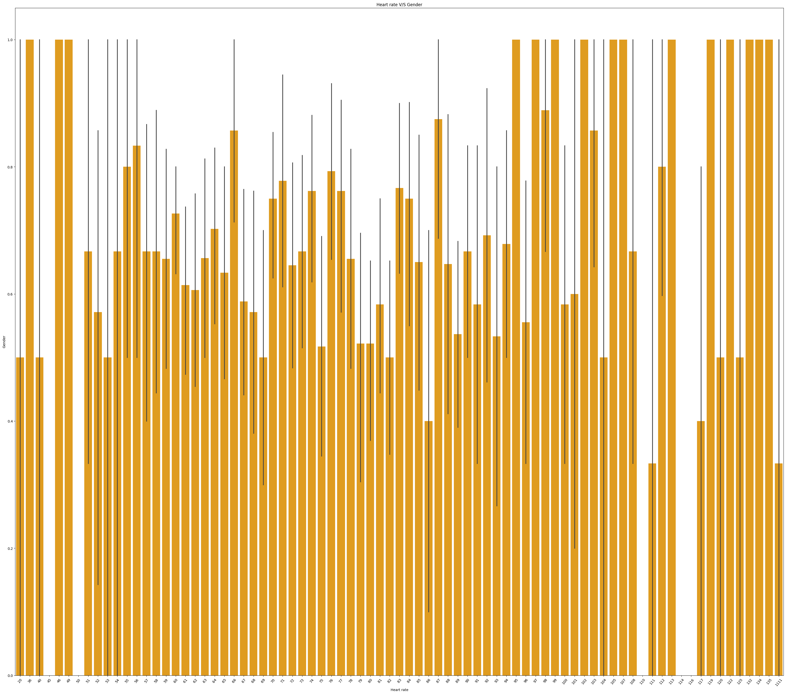
    


```python
#Bivariate Analysis // Numerical v/s Numerical - scatterplot....1

plt.figure(figsize=(9,8))
sns.scatterplot(x='Age',y='Gender',data=df,color='green',palette='coolwarm')
plt.title('AGE V/S GENDER')
plt.xticks(rotation=50)
plt.show()

#Bivariate Analysis // Numrical v/s Numerical - scatterplot....2

plt.figure(figsize=(9,8))
sns.scatterplot(x='Blood sugar',y='CK-MB',data=df,color='blue',palette='coolwarm')
plt.title('Blood sugar V/S CK-MB')
plt.xticks(rotation=50)
plt.show()


#Bivariate Analysis // Numerical v/s Numerical - scatterplot....3

plt.figure(figsize=(9,8))
sns.scatterplot(x='Heart rate',y='Result',data=df,color='orange',palette='coolwarm')
plt.title('Heart rate V/S Result')
plt.xticks(rotation=50)
plt.show()

#Bivariate Analysis // Numerical v/s Numerical - scatterplot....4

plt.figure(figsize=(9,8))
sns.scatterplot(x='Diastolic blood pressure',y='Troponin',data=df,color='aqua',palette='coolwarm')
plt.title('Diastolic blood pressure V/S Troponin')
plt.xticks(rotation=50)
plt.show()

```

    C:\Users\Admin\AppData\Local\Temp\ipykernel_6504\1718082025.py:4: UserWarning: Ignoring `palette` because no `hue` variable has been assigned.
      sns.scatterplot(x='Age',y='Gender',data=df,color='green',palette='coolwarm')
    


    
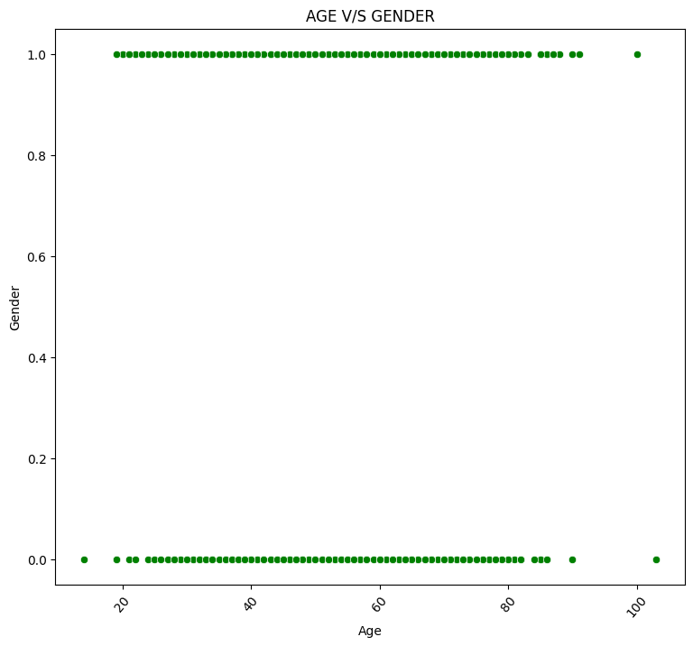
    


    C:\Users\Admin\AppData\Local\Temp\ipykernel_6504\1718082025.py:12: UserWarning: Ignoring `palette` because no `hue` variable has been assigned.
      sns.scatterplot(x='Blood sugar',y='CK-MB',data=df,color='blue',palette='coolwarm')
    


    
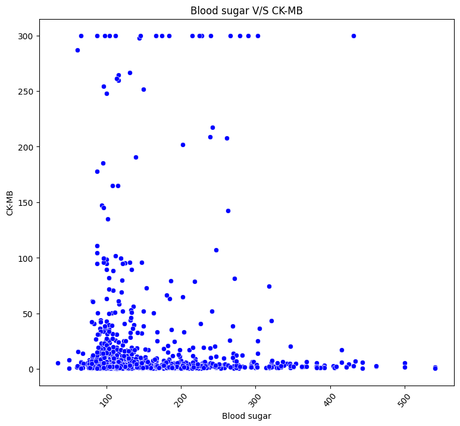
    


    C:\Users\Admin\AppData\Local\Temp\ipykernel_6504\1718082025.py:21: UserWarning: Ignoring `palette` because no `hue` variable has been assigned.
      sns.scatterplot(x='Heart rate',y='Result',data=df,color='orange',palette='coolwarm')
    


    
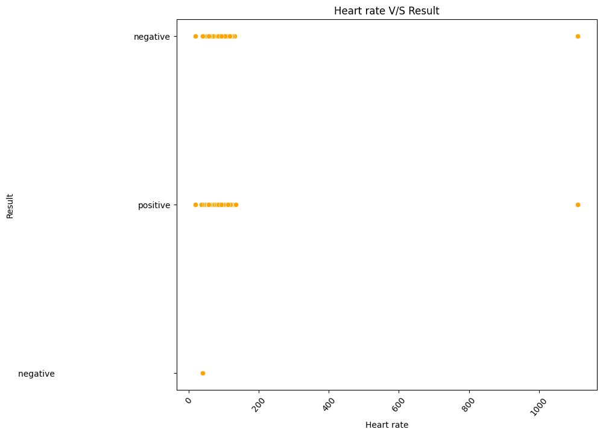
    


    C:\Users\Admin\AppData\Local\Temp\ipykernel_6504\1718082025.py:29: UserWarning: Ignoring `palette` because no `hue` variable has been assigned.
      sns.scatterplot(x='Diastolic blood pressure',y='Troponin',data=df,color='aqua',palette='coolwarm')
    


    
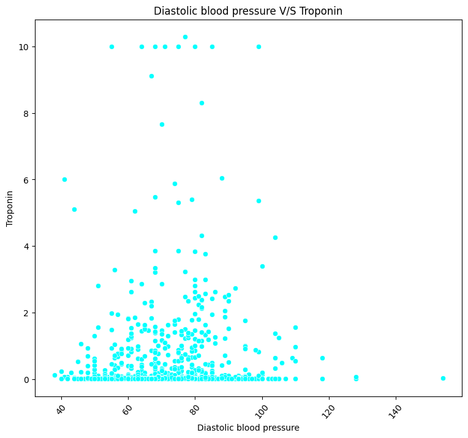
    


```python

#Bivariate Analysis // Categorical v/s Categorical - Countplot....1


plt.figure(figsize=(10,15))
sns.countplot(hue='Gender',y='Age',data=df,color='Orange')
plt.title('Gender V/S Age')
plt.xticks(rotation=4)
plt.show()


#Bivariate Analysis // Categorical v/s Categorical - Countplot....2


plt.figure(figsize=(10,15))
sns.countplot(hue='Gender',y='Age',data=df,color='green')
plt.title('Result V/S Age')
plt.xticks(rotation=4)
plt.show()


```

    C:\Users\Admin\AppData\Local\Temp\ipykernel_6504\4230541263.py:5: FutureWarning: 
    
    Setting a gradient palette using color= is deprecated and will be removed in v0.14.0. Set `palette='dark:Orange'` for the same effect.
    
      sns.countplot(hue='Gender',y='Age',data=df,color='Orange')
    


    
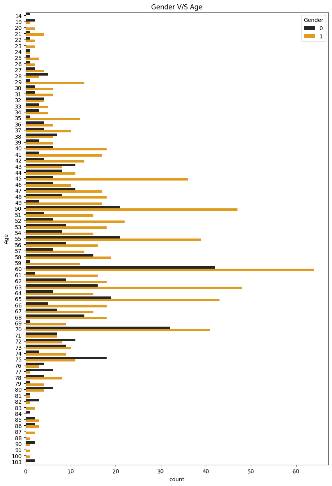
    


    C:\Users\Admin\AppData\Local\Temp\ipykernel_6504\4230541263.py:15: FutureWarning: 
    
    Setting a gradient palette using color= is deprecated and will be removed in v0.14.0. Set `palette='dark:green'` for the same effect.
    
      sns.countplot(hue='Gender',y='Age',data=df,color='green')
    


    
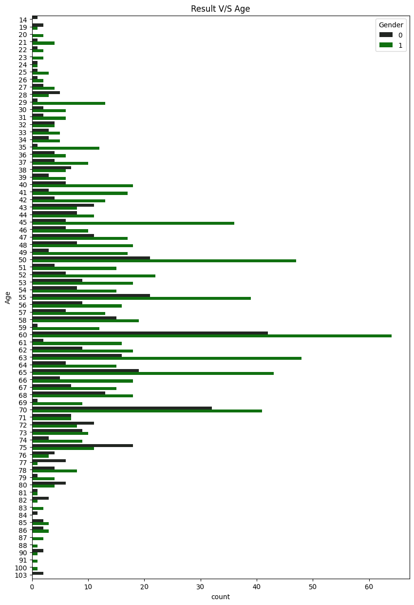
    


```python
# Multi variate Analysis // HEAT MAP


#Correlation Heatmap


plt.figure(figsize=(9,8))
plt.title("MEDICAL -DATA")
sns.heatmap(df.corr(numeric_only=True), annot=True,cmap='viridis',center=0.6) #cmap=viridis,plasma,inferno,magma,coolwarm,RdBu...etc
plt.show()


```


    
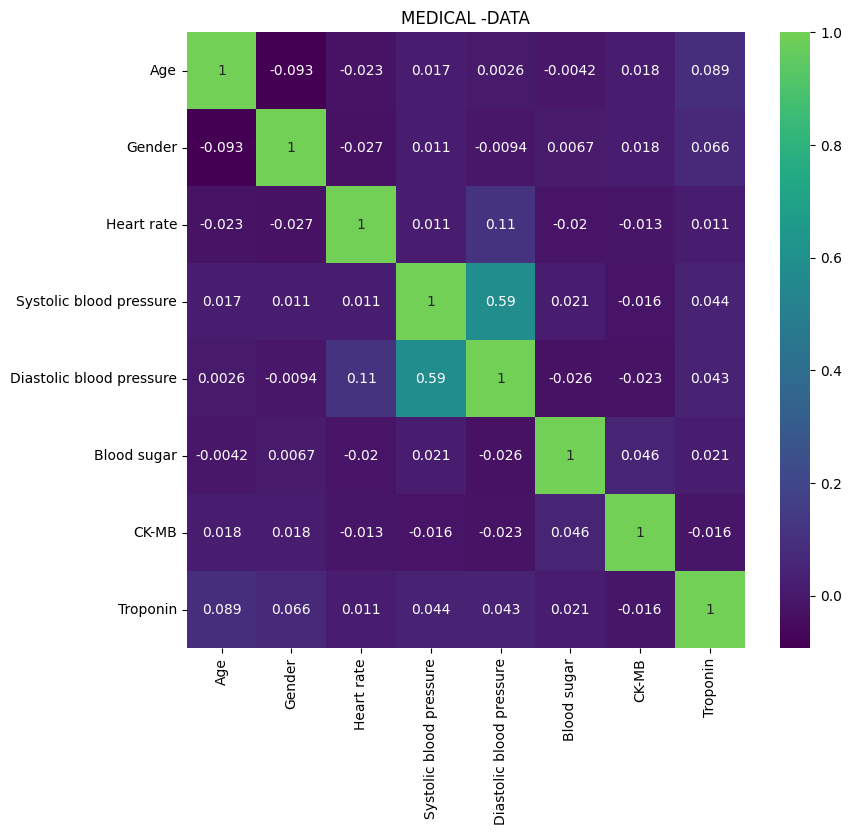
    


```python
# Histogram (Distribution)// 2 numerical columns


sns.histplot(df['Blood sugar'], kde=True, bins=30,color="lime")
plt.title("HISTOGRAM-")
plt.xlabel("Blood sugar")
plt.ylabel("CK-MB")
plt.show()

sns.histplot(df['Result'], kde=True, bins=30,color="fuchsia")
plt.title("Histogram")
plt.xlabel("Result")
plt.ylabel("Age")
plt.show()
```


    
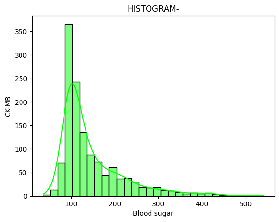
    


    
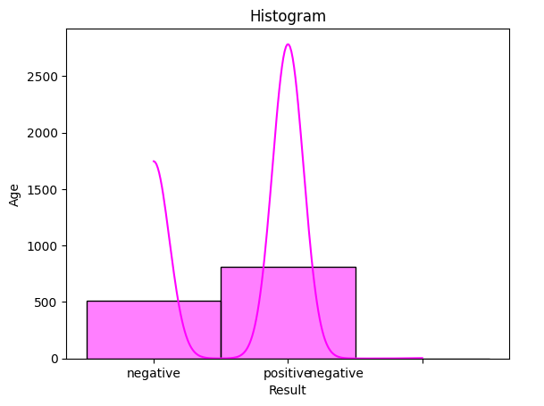
    


```python
#boxplot Plot (Relation Between 2 Numerical Columns)

plt.figure(figsize=(30,15))
sns.boxplot(x='Heart rate', y='Systolic blood pressure', data=df,color="green")
plt.title(" Heart rate vs Systolic blood pressure ")
plt.show()

plt.figure(figsize=(30,15))
sns.boxplot(x='Blood sugar', y='CK-MB', data=df,color="pink")
plt.title("Blood sugar vs CK-MB")
plt.show()

plt.figure(figsize=(10,10))
sns.boxplot(x='Troponin', y='Result', data=df,color="Yellow")
plt.title("Troponin vs Result")
plt.show()


```


    
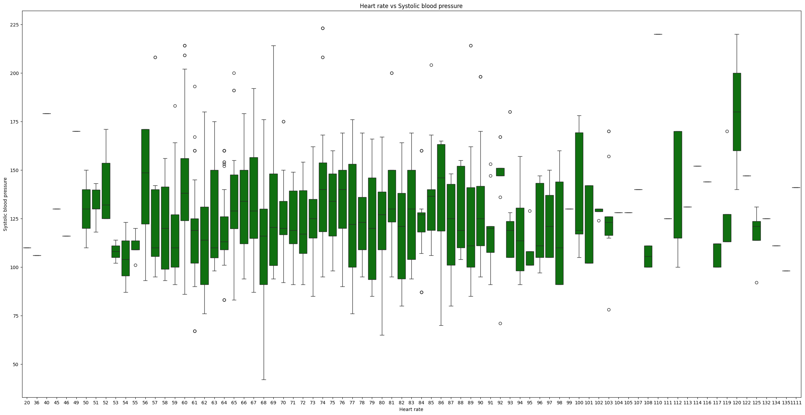
    


    
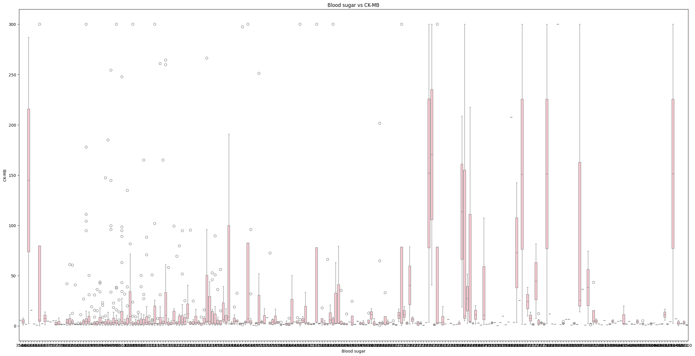
    


    
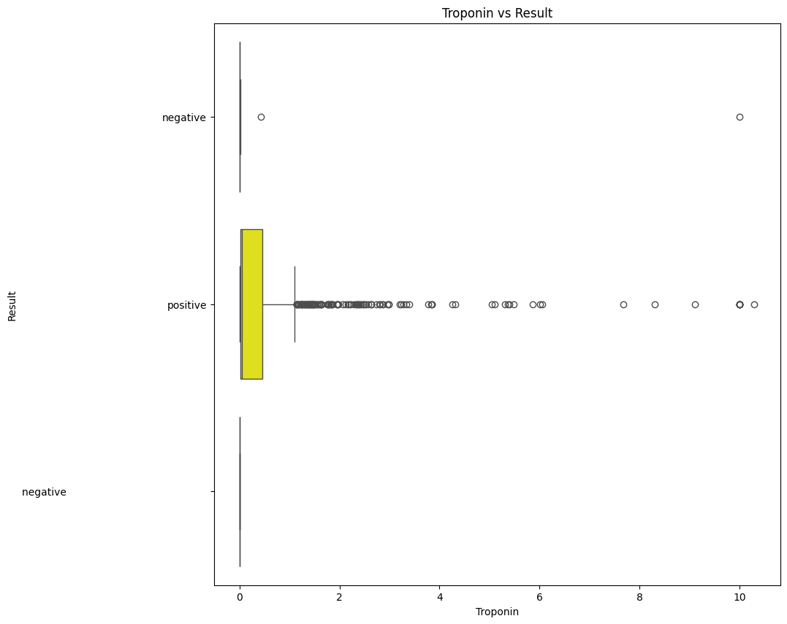
    


```python
#Pair Plot (Full Relationship View)

sns.pairplot(df[[ 'Age','Gender','Blood sugar']],plot_kws={'color':'green'})
plt.show()

```


    
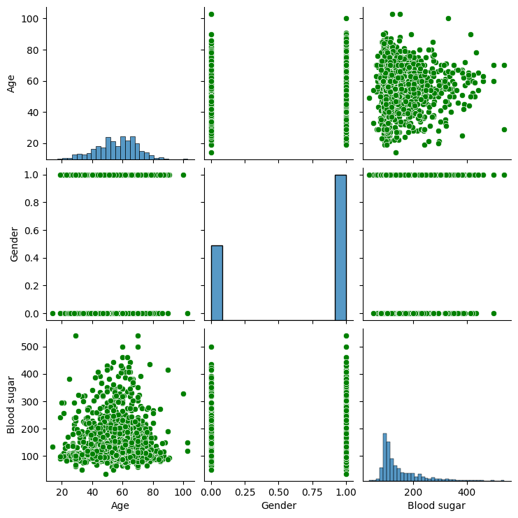
    


```python
#Pair Plot (Full Relationship View)

columns=["Age","Gender","Heart rate",
         "Systolic blood pressure","Diastolic blood pressure",
         "Blood sugar","CK-MB","Troponin","Result"]
sns.pairplot(df[columns],hue="Result",palette=['green','red'])
plt.show()


#pairplot(subset)
sub_col=["Age","Gender","Heart rate"]
sns.pairplot(df[sub_col],plot_kws={'color':'Maroon'})
plt.show()
```

    c:\Users\Admin\AppData\Local\Programs\Python\Python314\Lib\site-packages\seaborn\axisgrid.py:1513: UserWarning: 
    The palette list has fewer values (2) than needed (3) and will cycle, which may produce an uninterpretable plot.
      func(x=vector, **plot_kwargs)
    c:\Users\Admin\AppData\Local\Programs\Python\Python314\Lib\site-packages\seaborn\axisgrid.py:1513: UserWarning: 
    The palette list has fewer values (2) than needed (3) and will cycle, which may produce an uninterpretable plot.
      func(x=vector, **plot_kwargs)
    c:\Users\Admin\AppData\Local\Programs\Python\Python314\Lib\site-packages\seaborn\axisgrid.py:1513: UserWarning: 
    The palette list has fewer values (2) than needed (3) and will cycle, which may produce an uninterpretable plot.
      func(x=vector, **plot_kwargs)
    c:\Users\Admin\AppData\Local\Programs\Python\Python314\Lib\site-packages\seaborn\axisgrid.py:1513: UserWarning: 
    The palette list has fewer values (2) than needed (3) and will cycle, which may produce an uninterpretable plot.
      func(x=vector, **plot_kwargs)
    c:\Users\Admin\AppData\Local\Programs\Python\Python314\Lib\site-packages\seaborn\axisgrid.py:1513: UserWarning: 
    The palette list has fewer values (2) than needed (3) and will cycle, which may produce an uninterpretable plot.
      func(x=vector, **plot_kwargs)
    c:\Users\Admin\AppData\Local\Programs\Python\Python314\Lib\site-packages\seaborn\axisgrid.py:1513: UserWarning: 
    The palette list has fewer values (2) than needed (3) and will cycle, which may produce an uninterpretable plot.
      func(x=vector, **plot_kwargs)
    c:\Users\Admin\AppData\Local\Programs\Python\Python314\Lib\site-packages\seaborn\axisgrid.py:1513: UserWarning: 
    The palette list has fewer values (2) than needed (3) and will cycle, which may produce an uninterpretable plot.
      func(x=vector, **plot_kwargs)
    c:\Users\Admin\AppData\Local\Programs\Python\Python314\Lib\site-packages\seaborn\axisgrid.py:1513: UserWarning: 
    The palette list has fewer values (2) than needed (3) and will cycle, which may produce an uninterpretable plot.
      func(x=vector, **plot_kwargs)
    c:\Users\Admin\AppData\Local\Programs\Python\Python314\Lib\site-packages\seaborn\axisgrid.py:1615: UserWarning: 
    The palette list has fewer values (2) than needed (3) and will cycle, which may produce an uninterpretable plot.
      func(x=x, y=y, **kwargs)
    c:\Users\Admin\AppData\Local\Programs\Python\Python314\Lib\site-packages\seaborn\axisgrid.py:1615: UserWarning: 
    The palette list has fewer values (2) than needed (3) and will cycle, which may produce an uninterpretable plot.
      func(x=x, y=y, **kwargs)
    c:\Users\Admin\AppData\Local\Programs\Python\Python314\Lib\site-packages\seaborn\axisgrid.py:1615: UserWarning: 
    The palette list has fewer values (2) than needed (3) and will cycle, which may produce an uninterpretable plot.
      func(x=x, y=y, **kwargs)
    c:\Users\Admin\AppData\Local\Programs\Python\Python314\Lib\site-packages\seaborn\axisgrid.py:1615: UserWarning: 
    The palette list has fewer values (2) than needed (3) and will cycle, which may produce an uninterpretable plot.
      func(x=x, y=y, **kwargs)
    c:\Users\Admin\AppData\Local\Programs\Python\Python314\Lib\site-packages\seaborn\axisgrid.py:1615: UserWarning: 
    The palette list has fewer values (2) than needed (3) and will cycle, which may produce an uninterpretable plot.
      func(x=x, y=y, **kwargs)
    c:\Users\Admin\AppData\Local\Programs\Python\Python314\Lib\site-packages\seaborn\axisgrid.py:1615: UserWarning: 
    The palette list has fewer values (2) than needed (3) and will cycle, which may produce an uninterpretable plot.
      func(x=x, y=y, **kwargs)
    c:\Users\Admin\AppData\Local\Programs\Python\Python314\Lib\site-packages\seaborn\axisgrid.py:1615: UserWarning: 
    The palette list has fewer values (2) than needed (3) and will cycle, which may produce an uninterpretable plot.
      func(x=x, y=y, **kwargs)
    c:\Users\Admin\AppData\Local\Programs\Python\Python314\Lib\site-packages\seaborn\axisgrid.py:1615: UserWarning: 
    The palette list has fewer values (2) than needed (3) and will cycle, which may produce an uninterpretable plot.
      func(x=x, y=y, **kwargs)
    c:\Users\Admin\AppData\Local\Programs\Python\Python314\Lib\site-packages\seaborn\axisgrid.py:1615: UserWarning: 
    The palette list has fewer values (2) than needed (3) and will cycle, which may produce an uninterpretable plot.
      func(x=x, y=y, **kwargs)
    c:\Users\Admin\AppData\Local\Programs\Python\Python314\Lib\site-packages\seaborn\axisgrid.py:1615: UserWarning: 
    The palette list has fewer values (2) than needed (3) and will cycle, which may produce an uninterpretable plot.
      func(x=x, y=y, **kwargs)
    c:\Users\Admin\AppData\Local\Programs\Python\Python314\Lib\site-packages\seaborn\axisgrid.py:1615: UserWarning: 
    The palette list has fewer values (2) than needed (3) and will cycle, which may produce an uninterpretable plot.
      func(x=x, y=y, **kwargs)
    c:\Users\Admin\AppData\Local\Programs\Python\Python314\Lib\site-packages\seaborn\axisgrid.py:1615: UserWarning: 
    The palette list has fewer values (2) than needed (3) and will cycle, which may produce an uninterpretable plot.
      func(x=x, y=y, **kwargs)
    c:\Users\Admin\AppData\Local\Programs\Python\Python314\Lib\site-packages\seaborn\axisgrid.py:1615: UserWarning: 
    The palette list has fewer values (2) than needed (3) and will cycle, which may produce an uninterpretable plot.
      func(x=x, y=y, **kwargs)
    c:\Users\Admin\AppData\Local\Programs\Python\Python314\Lib\site-packages\seaborn\axisgrid.py:1615: UserWarning: 
    The palette list has fewer values (2) than needed (3) and will cycle, which may produce an uninterpretable plot.
      func(x=x, y=y, **kwargs)
    c:\Users\Admin\AppData\Local\Programs\Python\Python314\Lib\site-packages\seaborn\axisgrid.py:1615: UserWarning: 
    The palette list has fewer values (2) than needed (3) and will cycle, which may produce an uninterpretable plot.
      func(x=x, y=y, **kwargs)
    c:\Users\Admin\AppData\Local\Programs\Python\Python314\Lib\site-packages\seaborn\axisgrid.py:1615: UserWarning: 
    The palette list has fewer values (2) than needed (3) and will cycle, which may produce an uninterpretable plot.
      func(x=x, y=y, **kwargs)
    c:\Users\Admin\AppData\Local\Programs\Python\Python314\Lib\site-packages\seaborn\axisgrid.py:1615: UserWarning: 
    The palette list has fewer values (2) than needed (3) and will cycle, which may produce an uninterpretable plot.
      func(x=x, y=y, **kwargs)
    c:\Users\Admin\AppData\Local\Programs\Python\Python314\Lib\site-packages\seaborn\axisgrid.py:1615: UserWarning: 
    The palette list has fewer values (2) than needed (3) and will cycle, which may produce an uninterpretable plot.
      func(x=x, y=y, **kwargs)
    c:\Users\Admin\AppData\Local\Programs\Python\Python314\Lib\site-packages\seaborn\axisgrid.py:1615: UserWarning: 
    The palette list has fewer values (2) than needed (3) and will cycle, which may produce an uninterpretable plot.
      func(x=x, y=y, **kwargs)
    c:\Users\Admin\AppData\Local\Programs\Python\Python314\Lib\site-packages\seaborn\axisgrid.py:1615: UserWarning: 
    The palette list has fewer values (2) than needed (3) and will cycle, which may produce an uninterpretable plot.
      func(x=x, y=y, **kwargs)
    c:\Users\Admin\AppData\Local\Programs\Python\Python314\Lib\site-packages\seaborn\axisgrid.py:1615: UserWarning: 
    The palette list has fewer values (2) than needed (3) and will cycle, which may produce an uninterpretable plot.
      func(x=x, y=y, **kwargs)
    c:\Users\Admin\AppData\Local\Programs\Python\Python314\Lib\site-packages\seaborn\axisgrid.py:1615: UserWarning: 
    The palette list has fewer values (2) than needed (3) and will cycle, which may produce an uninterpretable plot.
      func(x=x, y=y, **kwargs)
    c:\Users\Admin\AppData\Local\Programs\Python\Python314\Lib\site-packages\seaborn\axisgrid.py:1615: UserWarning: 
    The palette list has fewer values (2) than needed (3) and will cycle, which may produce an uninterpretable plot.
      func(x=x, y=y, **kwargs)
    c:\Users\Admin\AppData\Local\Programs\Python\Python314\Lib\site-packages\seaborn\axisgrid.py:1615: UserWarning: 
    The palette list has fewer values (2) than needed (3) and will cycle, which may produce an uninterpretable plot.
      func(x=x, y=y, **kwargs)
    c:\Users\Admin\AppData\Local\Programs\Python\Python314\Lib\site-packages\seaborn\axisgrid.py:1615: UserWarning: 
    The palette list has fewer values (2) than needed (3) and will cycle, which may produce an uninterpretable plot.
      func(x=x, y=y, **kwargs)
    c:\Users\Admin\AppData\Local\Programs\Python\Python314\Lib\site-packages\seaborn\axisgrid.py:1615: UserWarning: 
    The palette list has fewer values (2) than needed (3) and will cycle, which may produce an uninterpretable plot.
      func(x=x, y=y, **kwargs)
    c:\Users\Admin\AppData\Local\Programs\Python\Python314\Lib\site-packages\seaborn\axisgrid.py:1615: UserWarning: 
    The palette list has fewer values (2) than needed (3) and will cycle, which may produce an uninterpretable plot.
      func(x=x, y=y, **kwargs)
    c:\Users\Admin\AppData\Local\Programs\Python\Python314\Lib\site-packages\seaborn\axisgrid.py:1615: UserWarning: 
    The palette list has fewer values (2) than needed (3) and will cycle, which may produce an uninterpretable plot.
      func(x=x, y=y, **kwargs)
    c:\Users\Admin\AppData\Local\Programs\Python\Python314\Lib\site-packages\seaborn\axisgrid.py:1615: UserWarning: 
    The palette list has fewer values (2) than needed (3) and will cycle, which may produce an uninterpretable plot.
      func(x=x, y=y, **kwargs)
    c:\Users\Admin\AppData\Local\Programs\Python\Python314\Lib\site-packages\seaborn\axisgrid.py:1615: UserWarning: 
    The palette list has fewer values (2) than needed (3) and will cycle, which may produce an uninterpretable plot.
      func(x=x, y=y, **kwargs)
    c:\Users\Admin\AppData\Local\Programs\Python\Python314\Lib\site-packages\seaborn\axisgrid.py:1615: UserWarning: 
    The palette list has fewer values (2) than needed (3) and will cycle, which may produce an uninterpretable plot.
      func(x=x, y=y, **kwargs)
    c:\Users\Admin\AppData\Local\Programs\Python\Python314\Lib\site-packages\seaborn\axisgrid.py:1615: UserWarning: 
    The palette list has fewer values (2) than needed (3) and will cycle, which may produce an uninterpretable plot.
      func(x=x, y=y, **kwargs)
    c:\Users\Admin\AppData\Local\Programs\Python\Python314\Lib\site-packages\seaborn\axisgrid.py:1615: UserWarning: 
    The palette list has fewer values (2) than needed (3) and will cycle, which may produce an uninterpretable plot.
      func(x=x, y=y, **kwargs)
    c:\Users\Admin\AppData\Local\Programs\Python\Python314\Lib\site-packages\seaborn\axisgrid.py:1615: UserWarning: 
    The palette list has fewer values (2) than needed (3) and will cycle, which may produce an uninterpretable plot.
      func(x=x, y=y, **kwargs)
    c:\Users\Admin\AppData\Local\Programs\Python\Python314\Lib\site-packages\seaborn\axisgrid.py:1615: UserWarning: 
    The palette list has fewer values (2) than needed (3) and will cycle, which may produce an uninterpretable plot.
      func(x=x, y=y, **kwargs)
    c:\Users\Admin\AppData\Local\Programs\Python\Python314\Lib\site-packages\seaborn\axisgrid.py:1615: UserWarning: 
    The palette list has fewer values (2) than needed (3) and will cycle, which may produce an uninterpretable plot.
      func(x=x, y=y, **kwargs)
    c:\Users\Admin\AppData\Local\Programs\Python\Python314\Lib\site-packages\seaborn\axisgrid.py:1615: UserWarning: 
    The palette list has fewer values (2) than needed (3) and will cycle, which may produce an uninterpretable plot.
      func(x=x, y=y, **kwargs)
    c:\Users\Admin\AppData\Local\Programs\Python\Python314\Lib\site-packages\seaborn\axisgrid.py:1615: UserWarning: 
    The palette list has fewer values (2) than needed (3) and will cycle, which may produce an uninterpretable plot.
      func(x=x, y=y, **kwargs)
    c:\Users\Admin\AppData\Local\Programs\Python\Python314\Lib\site-packages\seaborn\axisgrid.py:1615: UserWarning: 
    The palette list has fewer values (2) than needed (3) and will cycle, which may produce an uninterpretable plot.
      func(x=x, y=y, **kwargs)
    c:\Users\Admin\AppData\Local\Programs\Python\Python314\Lib\site-packages\seaborn\axisgrid.py:1615: UserWarning: 
    The palette list has fewer values (2) than needed (3) and will cycle, which may produce an uninterpretable plot.
      func(x=x, y=y, **kwargs)
    c:\Users\Admin\AppData\Local\Programs\Python\Python314\Lib\site-packages\seaborn\axisgrid.py:1615: UserWarning: 
    The palette list has fewer values (2) than needed (3) and will cycle, which may produce an uninterpretable plot.
      func(x=x, y=y, **kwargs)
    c:\Users\Admin\AppData\Local\Programs\Python\Python314\Lib\site-packages\seaborn\axisgrid.py:1615: UserWarning: 
    The palette list has fewer values (2) than needed (3) and will cycle, which may produce an uninterpretable plot.
      func(x=x, y=y, **kwargs)
    c:\Users\Admin\AppData\Local\Programs\Python\Python314\Lib\site-packages\seaborn\axisgrid.py:1615: UserWarning: 
    The palette list has fewer values (2) than needed (3) and will cycle, which may produce an uninterpretable plot.
      func(x=x, y=y, **kwargs)
    c:\Users\Admin\AppData\Local\Programs\Python\Python314\Lib\site-packages\seaborn\axisgrid.py:1615: UserWarning: 
    The palette list has fewer values (2) than needed (3) and will cycle, which may produce an uninterpretable plot.
      func(x=x, y=y, **kwargs)
    c:\Users\Admin\AppData\Local\Programs\Python\Python314\Lib\site-packages\seaborn\axisgrid.py:1615: UserWarning: 
    The palette list has fewer values (2) than needed (3) and will cycle, which may produce an uninterpretable plot.
      func(x=x, y=y, **kwargs)
    c:\Users\Admin\AppData\Local\Programs\Python\Python314\Lib\site-packages\seaborn\axisgrid.py:1615: UserWarning: 
    The palette list has fewer values (2) than needed (3) and will cycle, which may produce an uninterpretable plot.
      func(x=x, y=y, **kwargs)
    c:\Users\Admin\AppData\Local\Programs\Python\Python314\Lib\site-packages\seaborn\axisgrid.py:1615: UserWarning: 
    The palette list has fewer values (2) than needed (3) and will cycle, which may produce an uninterpretable plot.
      func(x=x, y=y, **kwargs)
    c:\Users\Admin\AppData\Local\Programs\Python\Python314\Lib\site-packages\seaborn\axisgrid.py:1615: UserWarning: 
    The palette list has fewer values (2) than needed (3) and will cycle, which may produce an uninterpretable plot.
      func(x=x, y=y, **kwargs)
    c:\Users\Admin\AppData\Local\Programs\Python\Python314\Lib\site-packages\seaborn\axisgrid.py:1615: UserWarning: 
    The palette list has fewer values (2) than needed (3) and will cycle, which may produce an uninterpretable plot.
      func(x=x, y=y, **kwargs)
    c:\Users\Admin\AppData\Local\Programs\Python\Python314\Lib\site-packages\seaborn\axisgrid.py:1615: UserWarning: 
    The palette list has fewer values (2) than needed (3) and will cycle, which may produce an uninterpretable plot.
      func(x=x, y=y, **kwargs)
    c:\Users\Admin\AppData\Local\Programs\Python\Python314\Lib\site-packages\seaborn\axisgrid.py:1615: UserWarning: 
    The palette list has fewer values (2) than needed (3) and will cycle, which may produce an uninterpretable plot.
      func(x=x, y=y, **kwargs)
    c:\Users\Admin\AppData\Local\Programs\Python\Python314\Lib\site-packages\seaborn\axisgrid.py:1615: UserWarning: 
    The palette list has fewer values (2) than needed (3) and will cycle, which may produce an uninterpretable plot.
      func(x=x, y=y, **kwargs)
    c:\Users\Admin\AppData\Local\Programs\Python\Python314\Lib\site-packages\seaborn\axisgrid.py:1615: UserWarning: 
    The palette list has fewer values (2) than needed (3) and will cycle, which may produce an uninterpretable plot.
      func(x=x, y=y, **kwargs)
    c:\Users\Admin\AppData\Local\Programs\Python\Python314\Lib\site-packages\seaborn\axisgrid.py:1615: UserWarning: 
    The palette list has fewer values (2) than needed (3) and will cycle, which may produce an uninterpretable plot.
      func(x=x, y=y, **kwargs)
    c:\Users\Admin\AppData\Local\Programs\Python\Python314\Lib\site-packages\seaborn\axisgrid.py:1615: UserWarning: 
    The palette list has fewer values (2) than needed (3) and will cycle, which may produce an uninterpretable plot.
      func(x=x, y=y, **kwargs)
    c:\Users\Admin\AppData\Local\Programs\Python\Python314\Lib\site-packages\seaborn\axisgrid.py:1615: UserWarning: 
    The palette list has fewer values (2) than needed (3) and will cycle, which may produce an uninterpretable plot.
      func(x=x, y=y, **kwargs)
    


    
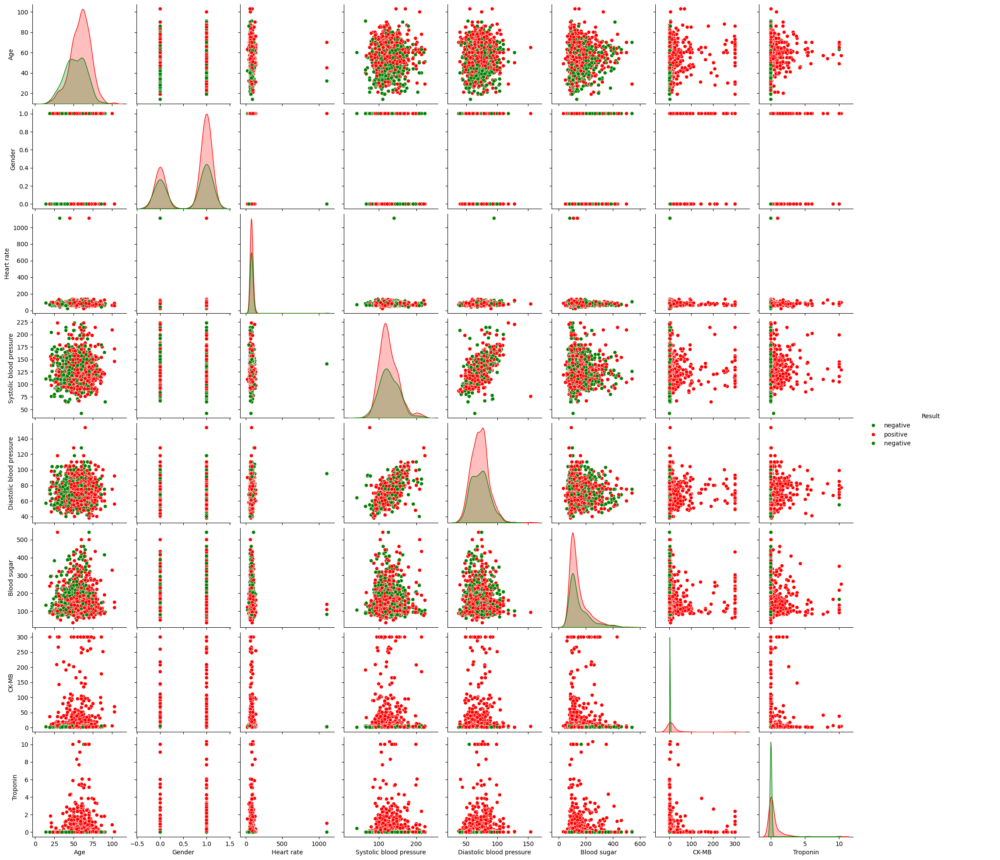
    


    
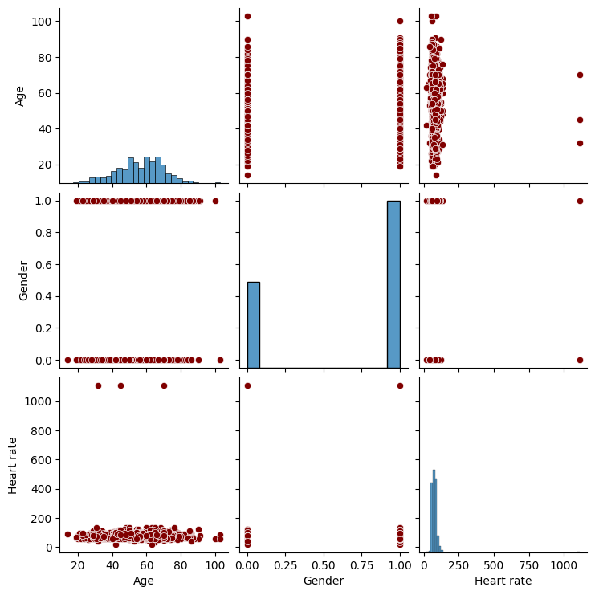
    


```python
# Model Building (Linear Regression)

import pandas as pd
import numpy as np
import seaborn as sns
import matplotlib.pyplot as plt

from sklearn.model_selection import train_test_split
from sklearn.linear_model import LinearRegression
from sklearn.metrics import mean_absolute_error, mean_squared_error, r2_score


# Load Dataset
df = pd.read_csv("Medicaldataset.csv")


# Check missing values
print(df.isnull().sum())

# Convert categorical data (if any)
df = pd.get_dummies(df, drop_first=True)


# Define Features (X) and Target (y)
X = df.drop("Age", axis=1)
y = df["Age"]


# Train-Test Split
X_train, X_test, y_train, y_test = train_test_split(
    X, y, test_size=0.2, random_state=42
)

#Model Building
model = LinearRegression()
model.fit(X_train, y_train)


# Make Predictions
y_pred = model.predict(X_test)


# Model Evaluation
mae = mean_absolute_error(y_test, y_pred)
mse = mean_squared_error(y_test, y_pred)
rmse = np.sqrt(mse)
r2 = r2_score(y_test, y_pred)


# Print Results
print("MAE :", mae)
print("MSE :", mse)
print("RMSE:", rmse)
print("R2 Score:", r2)

plt.figure(figsize=(10,7))
plt.scatter(y_test, y_pred)
plt.xlabel("Actual Age")
plt.ylabel("Predicted Age")
plt.title("Actual vs Predicted")
plt.show()
```

    Age                         0
    Gender                      0
    Heart rate                  0
    Systolic blood pressure     0
    Diastolic blood pressure    0
    Blood sugar                 0
    CK-MB                       0
    Troponin                    0
    Result                      0
    dtype: int64
    MAE : 10.657162660472808
    MSE : 178.00472608350964
    RMSE: 13.341841180418452
    R2 Score: 0.05819549979926175
    


    
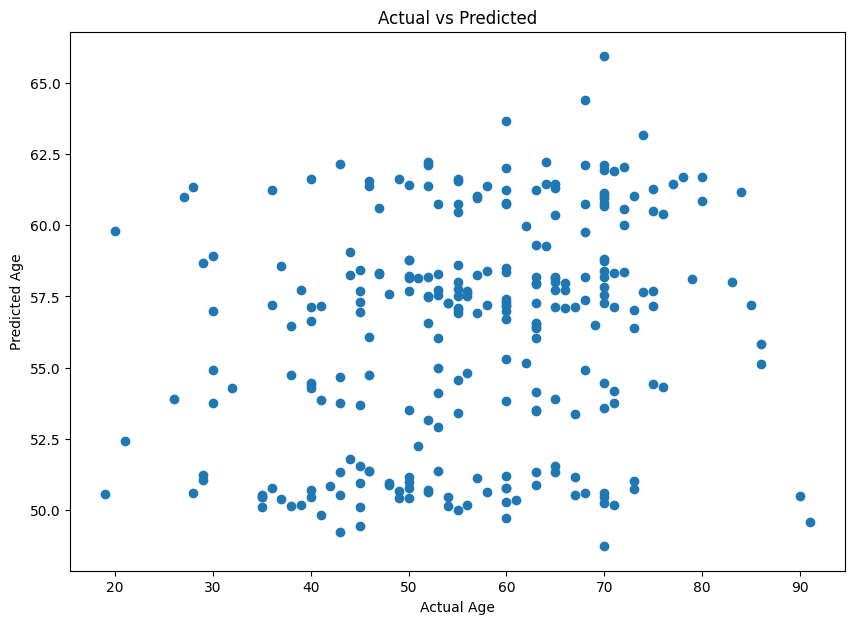
    


```python
# Logistic Regression Model

import pandas as pd
import numpy as np
import matplotlib.pyplot as plt
import seaborn as sns

from sklearn.model_selection import train_test_split
from sklearn.preprocessing import StandardScaler
from sklearn.linear_model import LogisticRegression
from sklearn.metrics import accuracy_score, classification_report, confusion_matrix

# Load Dataset
df = pd.read_csv("Medicaldataset.csv")

# Define Features (X) and Target (y)
X = df.drop("Result", axis=1)
y = df["Result"]

# Train Test Split
X_train, X_test, y_train, y_test = train_test_split(
    X, y, test_size=0.2, random_state=42
)

# Feature Scaling
scaler = StandardScaler()

X_train = scaler.fit_transform(X_train)
X_test = scaler.transform(X_test)

# Train Logistic Regression Model
model = LogisticRegression()
model.fit(X_train, y_train)

# Prediction
y_pred = model.predict(X_test)

# Model Evaluation
accuracy = accuracy_score(y_test, y_pred)*100
cm = confusion_matrix(y_test, y_pred)
report = classification_report(y_test, y_pred)


print("Accuracy:",accuracy)
print("\nConfusion Matrix:\n",cm)
print("\nClassification Report:\n", report)


# Confusion Matrix Plot
plt.figure(figsize=(10,7))
sns.heatmap(cm, annot=True,cmap="viridis",center=0.8)
plt.xlabel("Predicted")
plt.ylabel("Actual")
plt.title("Confusion Matrix")
plt.show()
```

    Accuracy: 80.68181818181817
    
    Confusion Matrix:
     [[ 72  29]
     [ 22 141]]
    
    Classification Report:
                   precision    recall  f1-score   support
    
        negative       0.77      0.71      0.74       101
        positive       0.83      0.87      0.85       163
    
        accuracy                           0.81       264
       macro avg       0.80      0.79      0.79       264
    weighted avg       0.81      0.81      0.81       264
    
    


    
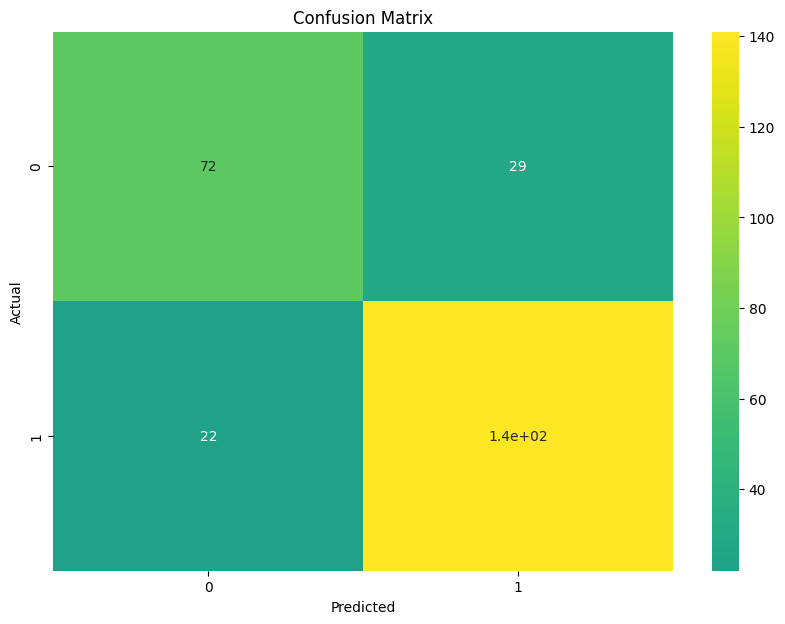
    


```python
# K-Nearest Neighbors (KNN) Model

import pandas as pd
import numpy as np
import matplotlib.pyplot as plt
import seaborn as sns

from sklearn.model_selection import train_test_split
from sklearn.preprocessing import StandardScaler
from sklearn.neighbors import KNeighborsClassifier
from sklearn.metrics import accuracy_score, classification_report, confusion_matrix

df = pd.read_csv("Medicaldataset.csv")

# Convert Target to Classification
df["Age_Binary"] = (df["Age"] > 60).astype(int)

# Handle Categorical Data
df = pd.get_dummies(df, drop_first=True)


# Define Features and Target
X = df.drop(["Age"], axis=1)
y = df["Age"]

# Train-Test Split
X_train, X_test, y_train, y_test = train_test_split(
    X, y, test_size=0.2, random_state=42
)

# Feature Scaling 
scaler = StandardScaler()

X_train = scaler.fit_transform(X_train)
X_test = scaler.transform(X_test)

# Create KNN Model
model = KNeighborsClassifier(n_neighbors=5)

# Train Model
model.fit(X_train, y_train)

# Prediction
y_pred = model.predict(X_test)

# Evaluation
accuracy = accuracy_score(y_test, y_pred)
cm = confusion_matrix(y_test, y_pred)
report = classification_report(y_test, y_pred)

print("Accuracy:", accuracy)
print("\nConfusion Matrix:\n", cm)
print("\nClassification Report:\n", report)


# Confusion Matrix Plot
plt.figure(figsize=(30,30))
sns.heatmap(cm, annot=True, fmt='d', cmap="coolwarm")
plt.xlabel("Predicted")
plt.ylabel("Actual")
plt.title("Confusion Matrix - KNN")
plt.show()
```

    c:\Users\Admin\AppData\Local\Programs\Python\Python314\Lib\site-packages\sklearn\metrics\_classification.py:1833: UndefinedMetricWarning: Precision is ill-defined and being set to 0.0 in labels with no predicted samples. Use `zero_division` parameter to control this behavior.
      _warn_prf(average, modifier, f"{metric.capitalize()} is", result.shape[0])
    c:\Users\Admin\AppData\Local\Programs\Python\Python314\Lib\site-packages\sklearn\metrics\_classification.py:1833: UndefinedMetricWarning: Recall is ill-defined and being set to 0.0 in labels with no true samples. Use `zero_division` parameter to control this behavior.
      _warn_prf(average, modifier, f"{metric.capitalize()} is", result.shape[0])
    c:\Users\Admin\AppData\Local\Programs\Python\Python314\Lib\site-packages\sklearn\metrics\_classification.py:1833: UndefinedMetricWarning: Precision is ill-defined and being set to 0.0 in labels with no predicted samples. Use `zero_division` parameter to control this behavior.
      _warn_prf(average, modifier, f"{metric.capitalize()} is", result.shape[0])
    c:\Users\Admin\AppData\Local\Programs\Python\Python314\Lib\site-packages\sklearn\metrics\_classification.py:1833: UndefinedMetricWarning: Recall is ill-defined and being set to 0.0 in labels with no true samples. Use `zero_division` parameter to control this behavior.
      _warn_prf(average, modifier, f"{metric.capitalize()} is", result.shape[0])
    c:\Users\Admin\AppData\Local\Programs\Python\Python314\Lib\site-packages\sklearn\metrics\_classification.py:1833: UndefinedMetricWarning: Precision is ill-defined and being set to 0.0 in labels with no predicted samples. Use `zero_division` parameter to control this behavior.
      _warn_prf(average, modifier, f"{metric.capitalize()} is", result.shape[0])
    c:\Users\Admin\AppData\Local\Programs\Python\Python314\Lib\site-packages\sklearn\metrics\_classification.py:1833: UndefinedMetricWarning: Recall is ill-defined and being set to 0.0 in labels with no true samples. Use `zero_division` parameter to control this behavior.
      _warn_prf(average, modifier, f"{metric.capitalize()} is", result.shape[0])
    

    Accuracy: 0.04924242424242424
    
    Confusion Matrix:
     [[0 0 0 ... 0 0 0]
     [0 0 0 ... 0 0 0]
     [0 0 0 ... 0 0 0]
     ...
     [0 0 0 ... 0 0 0]
     [0 0 0 ... 0 0 0]
     [0 0 0 ... 0 0 0]]
    
    Classification Report:
                   precision    recall  f1-score   support
    
              19       0.00      0.00      0.00         1
              20       0.00      0.00      0.00         1
              21       0.00      0.00      0.00         1
              22       0.00      0.00      0.00         0
              23       0.00      0.00      0.00         0
              25       0.00      0.00      0.00         0
              26       0.00      0.00      0.00         1
              27       0.00      0.00      0.00         1
              28       0.20      0.50      0.29         2
              29       0.00      0.00      0.00         3
              30       0.00      0.00      0.00         4
              31       0.00      0.00      0.00         0
              32       0.00      0.00      0.00         1
              33       0.00      0.00      0.00         0
              34       0.00      0.00      0.00         0
              35       0.00      0.00      0.00         4
              36       0.00      0.00      0.00         3
              37       0.00      0.00      0.00         2
              38       0.00      0.00      0.00         3
              39       0.00      0.00      0.00         2
              40       0.00      0.00      0.00         8
              41       0.17      0.33      0.22         3
              42       0.00      0.00      0.00         1
              43       0.00      0.00      0.00         6
              44       0.00      0.00      0.00         3
              45       0.00      0.00      0.00         9
              46       0.00      0.00      0.00         6
              47       0.00      0.00      0.00         3
              48       0.00      0.00      0.00         3
              49       0.00      0.00      0.00         3
              50       0.11      0.09      0.10        11
              51       0.00      0.00      0.00         2
              52       0.00      0.00      0.00        10
              53       0.00      0.00      0.00         9
              54       0.00      0.00      0.00         4
              55       0.00      0.00      0.00        14
              56       0.00      0.00      0.00         5
              57       0.00      0.00      0.00         5
              58       0.00      0.00      0.00         4
              59       0.00      0.00      0.00         0
              60       0.05      0.05      0.05        20
              61       0.00      0.00      0.00         1
              62       0.00      0.00      0.00         2
              63       0.13      0.19      0.15        16
              64       0.00      0.00      0.00         3
              65       0.09      0.18      0.12        11
              66       0.00      0.00      0.00         3
              67       0.33      0.25      0.29         4
              68       0.08      0.12      0.10         8
              69       0.00      0.00      0.00         1
              70       0.12      0.05      0.07        21
              71       0.00      0.00      0.00         6
              72       0.50      0.25      0.33         4
              73       0.00      0.00      0.00         5
              74       0.00      0.00      0.00         2
              75       0.00      0.00      0.00         5
              76       0.00      0.00      0.00         2
              77       0.00      0.00      0.00         1
              78       0.00      0.00      0.00         1
              79       0.00      0.00      0.00         1
              80       0.00      0.00      0.00         2
              83       0.00      0.00      0.00         1
              84       0.00      0.00      0.00         1
              85       0.00      0.00      0.00         1
              86       0.00      0.00      0.00         2
              90       0.00      0.00      0.00         1
              91       0.00      0.00      0.00         1
    
        accuracy                           0.05       264
       macro avg       0.03      0.03      0.03       264
    weighted avg       0.05      0.05      0.05       264
    
    


    
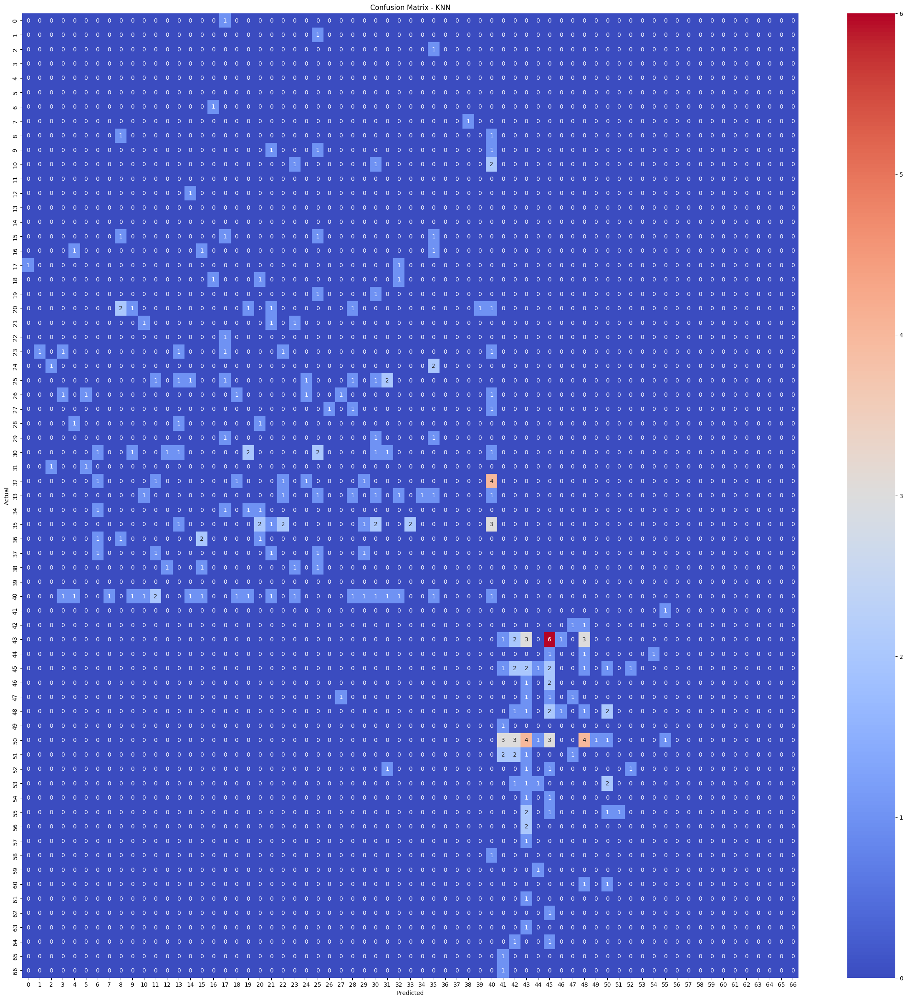
    

