```python
import pandas as pd
import numpy as np
import matplotlib.pyplot as plt
import seaborn as sns
```


```python
df=pd.read_csv("traffic.csv")
```


```python
df
```


<div>
<style scoped>
    .dataframe tbody tr th:only-of-type {
        vertical-align: middle;
    }

    .dataframe tbody tr th {
        vertical-align: top;
    }

    .dataframe thead th {
        text-align: right;
    }
</style>
<table border="1" class="dataframe">
  <thead>
    <tr style="text-align: right;">
      <th></th>
      <th>DateTime</th>
      <th>Junction</th>
      <th>Vehicles</th>
      <th>ID</th>
    </tr>
  </thead>
  <tbody>
    <tr>
      <th>0</th>
      <td>2015-11-01 00:00:00</td>
      <td>1</td>
      <td>15</td>
      <td>20151101001</td>
    </tr>
    <tr>
      <th>1</th>
      <td>2015-11-01 01:00:00</td>
      <td>1</td>
      <td>13</td>
      <td>20151101011</td>
    </tr>
    <tr>
      <th>2</th>
      <td>2015-11-01 02:00:00</td>
      <td>1</td>
      <td>10</td>
      <td>20151101021</td>
    </tr>
    <tr>
      <th>3</th>
      <td>2015-11-01 03:00:00</td>
      <td>1</td>
      <td>7</td>
      <td>20151101031</td>
    </tr>
    <tr>
      <th>4</th>
      <td>2015-11-01 04:00:00</td>
      <td>1</td>
      <td>9</td>
      <td>20151101041</td>
    </tr>
    <tr>
      <th>...</th>
      <td>...</td>
      <td>...</td>
      <td>...</td>
      <td>...</td>
    </tr>
    <tr>
      <th>48115</th>
      <td>2017-06-30 19:00:00</td>
      <td>4</td>
      <td>11</td>
      <td>20170630194</td>
    </tr>
    <tr>
      <th>48116</th>
      <td>2017-06-30 20:00:00</td>
      <td>4</td>
      <td>30</td>
      <td>20170630204</td>
    </tr>
    <tr>
      <th>48117</th>
      <td>2017-06-30 21:00:00</td>
      <td>4</td>
      <td>16</td>
      <td>20170630214</td>
    </tr>
    <tr>
      <th>48118</th>
      <td>2017-06-30 22:00:00</td>
      <td>4</td>
      <td>22</td>
      <td>20170630224</td>
    </tr>
    <tr>
      <th>48119</th>
      <td>2017-06-30 23:00:00</td>
      <td>4</td>
      <td>12</td>
      <td>20170630234</td>
    </tr>
  </tbody>
</table>
<p>48120 rows × 4 columns</p>
</div>


```python
print('\n 1) Inspect The data')
print('_'*115)

```

    
     1) Inspect The data
    ___________________________________________________________________________________________________________________
    


```python
print("\n >>   Head - View the First 5 Rows of The Dataframe")
print('_'*10)
```

    
     >>   Head - View the First 5 Rows of The Dataframe
    __________
    


```python
df.head()
```


<div>
<style scoped>
    .dataframe tbody tr th:only-of-type {
        vertical-align: middle;
    }

    .dataframe tbody tr th {
        vertical-align: top;
    }

    .dataframe thead th {
        text-align: right;
    }
</style>
<table border="1" class="dataframe">
  <thead>
    <tr style="text-align: right;">
      <th></th>
      <th>DateTime</th>
      <th>Junction</th>
      <th>Vehicles</th>
      <th>ID</th>
    </tr>
  </thead>
  <tbody>
    <tr>
      <th>0</th>
      <td>2015-11-01 00:00:00</td>
      <td>1</td>
      <td>15</td>
      <td>20151101001</td>
    </tr>
    <tr>
      <th>1</th>
      <td>2015-11-01 01:00:00</td>
      <td>1</td>
      <td>13</td>
      <td>20151101011</td>
    </tr>
    <tr>
      <th>2</th>
      <td>2015-11-01 02:00:00</td>
      <td>1</td>
      <td>10</td>
      <td>20151101021</td>
    </tr>
    <tr>
      <th>3</th>
      <td>2015-11-01 03:00:00</td>
      <td>1</td>
      <td>7</td>
      <td>20151101031</td>
    </tr>
    <tr>
      <th>4</th>
      <td>2015-11-01 04:00:00</td>
      <td>1</td>
      <td>9</td>
      <td>20151101041</td>
    </tr>
  </tbody>
</table>
</div>


```python
print("\n >>  Tail - View the Last 5 Rows of The Dataframe")
print('_'*10)

```

    
     >>  Tail - View the Last 5 Rows of The Dataframe
    __________
    


```python
df.tail()
```


<div>
<style scoped>
    .dataframe tbody tr th:only-of-type {
        vertical-align: middle;
    }

    .dataframe tbody tr th {
        vertical-align: top;
    }

    .dataframe thead th {
        text-align: right;
    }
</style>
<table border="1" class="dataframe">
  <thead>
    <tr style="text-align: right;">
      <th></th>
      <th>DateTime</th>
      <th>Junction</th>
      <th>Vehicles</th>
      <th>ID</th>
    </tr>
  </thead>
  <tbody>
    <tr>
      <th>48115</th>
      <td>2017-06-30 19:00:00</td>
      <td>4</td>
      <td>11</td>
      <td>20170630194</td>
    </tr>
    <tr>
      <th>48116</th>
      <td>2017-06-30 20:00:00</td>
      <td>4</td>
      <td>30</td>
      <td>20170630204</td>
    </tr>
    <tr>
      <th>48117</th>
      <td>2017-06-30 21:00:00</td>
      <td>4</td>
      <td>16</td>
      <td>20170630214</td>
    </tr>
    <tr>
      <th>48118</th>
      <td>2017-06-30 22:00:00</td>
      <td>4</td>
      <td>22</td>
      <td>20170630224</td>
    </tr>
    <tr>
      <th>48119</th>
      <td>2017-06-30 23:00:00</td>
      <td>4</td>
      <td>12</td>
      <td>20170630234</td>
    </tr>
  </tbody>
</table>
</div>


```python
print("\n >>   Sample - View the Random 5 Rows of The Dataframe")
print('_'*10)
```

    
     >>   Sample - View the Random 5 Rows of The Dataframe
    __________
    


```python
df.sample()
```


<div>
<style scoped>
    .dataframe tbody tr th:only-of-type {
        vertical-align: middle;
    }

    .dataframe tbody tr th {
        vertical-align: top;
    }

    .dataframe thead th {
        text-align: right;
    }
</style>
<table border="1" class="dataframe">
  <thead>
    <tr style="text-align: right;">
      <th></th>
      <th>DateTime</th>
      <th>Junction</th>
      <th>Vehicles</th>
      <th>ID</th>
    </tr>
  </thead>
  <tbody>
    <tr>
      <th>7403</th>
      <td>2016-09-04 11:00:00</td>
      <td>1</td>
      <td>32</td>
      <td>20160904111</td>
    </tr>
  </tbody>
</table>
</div>


```python
print("\n >>   Shape - Get the Dimensions of The Dataframe")
print('_'*10)
```

    
     >>   Shape - Get the Dimensions of The Dataframe
    __________
    


```python
df.shape
```


    (48120, 4)


```python
print("\n >>   Info - Get the concise summary  of The Dataset")
print('_'*10)
```

    
     >>   Info - Get the concise summary  of The Dataset
    __________
    


```python
df.info()
```

    <class 'pandas.core.frame.DataFrame'>
    RangeIndex: 48120 entries, 0 to 48119
    Data columns (total 4 columns):
     #   Column    Non-Null Count  Dtype 
    ---  ------    --------------  ----- 
     0   DateTime  48120 non-null  object
     1   Junction  48120 non-null  int64 
     2   Vehicles  48120 non-null  int64 
     3   ID        48120 non-null  int64 
    dtypes: int64(3), object(1)
    memory usage: 1.5+ MB
    


```python
print("\n >>  Describe -  Summary statistics for Numerical columns")
print('_'*13)
```

    
     >>  Describe -  Summary statistics for Numerical columns
    _____________
    


```python
df.describe()
```


<div>
<style scoped>
    .dataframe tbody tr th:only-of-type {
        vertical-align: middle;
    }

    .dataframe tbody tr th {
        vertical-align: top;
    }

    .dataframe thead th {
        text-align: right;
    }
</style>
<table border="1" class="dataframe">
  <thead>
    <tr style="text-align: right;">
      <th></th>
      <th>Junction</th>
      <th>Vehicles</th>
      <th>ID</th>
    </tr>
  </thead>
  <tbody>
    <tr>
      <th>count</th>
      <td>48120.000000</td>
      <td>48120.000000</td>
      <td>4.812000e+04</td>
    </tr>
    <tr>
      <th>mean</th>
      <td>2.180549</td>
      <td>22.791334</td>
      <td>2.016330e+10</td>
    </tr>
    <tr>
      <th>std</th>
      <td>0.966955</td>
      <td>20.750063</td>
      <td>5.944854e+06</td>
    </tr>
    <tr>
      <th>min</th>
      <td>1.000000</td>
      <td>1.000000</td>
      <td>2.015110e+10</td>
    </tr>
    <tr>
      <th>25%</th>
      <td>1.000000</td>
      <td>9.000000</td>
      <td>2.016042e+10</td>
    </tr>
    <tr>
      <th>50%</th>
      <td>2.000000</td>
      <td>15.000000</td>
      <td>2.016093e+10</td>
    </tr>
    <tr>
      <th>75%</th>
      <td>3.000000</td>
      <td>29.000000</td>
      <td>2.017023e+10</td>
    </tr>
    <tr>
      <th>max</th>
      <td>4.000000</td>
      <td>180.000000</td>
      <td>2.017063e+10</td>
    </tr>
  </tbody>
</table>
</div>


```python
df.describe().T
```


<div>
<style scoped>
    .dataframe tbody tr th:only-of-type {
        vertical-align: middle;
    }

    .dataframe tbody tr th {
        vertical-align: top;
    }

    .dataframe thead th {
        text-align: right;
    }
</style>
<table border="1" class="dataframe">
  <thead>
    <tr style="text-align: right;">
      <th></th>
      <th>count</th>
      <th>mean</th>
      <th>std</th>
      <th>min</th>
      <th>25%</th>
      <th>50%</th>
      <th>75%</th>
      <th>max</th>
    </tr>
  </thead>
  <tbody>
    <tr>
      <th>Junction</th>
      <td>48120.0</td>
      <td>2.180549e+00</td>
      <td>9.669554e-01</td>
      <td>1.000000e+00</td>
      <td>1.000000e+00</td>
      <td>2.000000e+00</td>
      <td>3.000000e+00</td>
      <td>4.000000e+00</td>
    </tr>
    <tr>
      <th>Vehicles</th>
      <td>48120.0</td>
      <td>2.279133e+01</td>
      <td>2.075006e+01</td>
      <td>1.000000e+00</td>
      <td>9.000000e+00</td>
      <td>1.500000e+01</td>
      <td>2.900000e+01</td>
      <td>1.800000e+02</td>
    </tr>
    <tr>
      <th>ID</th>
      <td>48120.0</td>
      <td>2.016330e+10</td>
      <td>5.944854e+06</td>
      <td>2.015110e+10</td>
      <td>2.016042e+10</td>
      <td>2.016093e+10</td>
      <td>2.017023e+10</td>
      <td>2.017063e+10</td>
    </tr>
  </tbody>
</table>
</div>


```python
print("\n >> Dtypes - check data types of columns")
print('_'*10)
```

    
     >> Dtypes - check data types of columns
    __________
    


```python
df.dtypes
```


    DateTime    object
    Junction     int64
    Vehicles     int64
    ID           int64
    dtype: object


```python
print("\n >> Columns - list Column Names")
print('_'*12)
```

    
     >> Columns - list Column Names
    ____________
    


```python
df.columns
```


    Index(['DateTime', 'Junction', 'Vehicles', 'ID'], dtype='object')


```python
print("\n >> Index - Display the index Range")
print('_'*10)
```

    
     >> Index - Display the index Range
    __________
    


```python
df.index
```


    RangeIndex(start=0, stop=48120, step=1)


```python
print('-'*115)
```

    -------------------------------------------------------------------------------------------------------------------
    


```python
print("\n 2) Drop Duplicates:")
print('_'*20)
print("\n    - Remove rows that exact duplicates of another row")
```

    
     2) Drop Duplicates:
    ____________________
    
        - Remove rows that exact duplicates of another row
    


```python
df.drop_duplicates()
```


<div>
<style scoped>
    .dataframe tbody tr th:only-of-type {
        vertical-align: middle;
    }

    .dataframe tbody tr th {
        vertical-align: top;
    }

    .dataframe thead th {
        text-align: right;
    }
</style>
<table border="1" class="dataframe">
  <thead>
    <tr style="text-align: right;">
      <th></th>
      <th>DateTime</th>
      <th>Junction</th>
      <th>Vehicles</th>
      <th>ID</th>
    </tr>
  </thead>
  <tbody>
    <tr>
      <th>0</th>
      <td>2015-11-01 00:00:00</td>
      <td>1</td>
      <td>15</td>
      <td>20151101001</td>
    </tr>
    <tr>
      <th>1</th>
      <td>2015-11-01 01:00:00</td>
      <td>1</td>
      <td>13</td>
      <td>20151101011</td>
    </tr>
    <tr>
      <th>2</th>
      <td>2015-11-01 02:00:00</td>
      <td>1</td>
      <td>10</td>
      <td>20151101021</td>
    </tr>
    <tr>
      <th>3</th>
      <td>2015-11-01 03:00:00</td>
      <td>1</td>
      <td>7</td>
      <td>20151101031</td>
    </tr>
    <tr>
      <th>4</th>
      <td>2015-11-01 04:00:00</td>
      <td>1</td>
      <td>9</td>
      <td>20151101041</td>
    </tr>
    <tr>
      <th>...</th>
      <td>...</td>
      <td>...</td>
      <td>...</td>
      <td>...</td>
    </tr>
    <tr>
      <th>48115</th>
      <td>2017-06-30 19:00:00</td>
      <td>4</td>
      <td>11</td>
      <td>20170630194</td>
    </tr>
    <tr>
      <th>48116</th>
      <td>2017-06-30 20:00:00</td>
      <td>4</td>
      <td>30</td>
      <td>20170630204</td>
    </tr>
    <tr>
      <th>48117</th>
      <td>2017-06-30 21:00:00</td>
      <td>4</td>
      <td>16</td>
      <td>20170630214</td>
    </tr>
    <tr>
      <th>48118</th>
      <td>2017-06-30 22:00:00</td>
      <td>4</td>
      <td>22</td>
      <td>20170630224</td>
    </tr>
    <tr>
      <th>48119</th>
      <td>2017-06-30 23:00:00</td>
      <td>4</td>
      <td>12</td>
      <td>20170630234</td>
    </tr>
  </tbody>
</table>
<p>48120 rows × 4 columns</p>
</div>


```python
print("\n >> keep(First) -  the first row of Duplicates Remove ")
print('_'*15)
```

    
     >> keep(First) -  the first row of Duplicates Remove 
    _______________
    


```python
df.drop_duplicates(keep="first")
```


<div>
<style scoped>
    .dataframe tbody tr th:only-of-type {
        vertical-align: middle;
    }

    .dataframe tbody tr th {
        vertical-align: top;
    }

    .dataframe thead th {
        text-align: right;
    }
</style>
<table border="1" class="dataframe">
  <thead>
    <tr style="text-align: right;">
      <th></th>
      <th>DateTime</th>
      <th>Junction</th>
      <th>Vehicles</th>
      <th>ID</th>
    </tr>
  </thead>
  <tbody>
    <tr>
      <th>0</th>
      <td>2015-11-01 00:00:00</td>
      <td>1</td>
      <td>15</td>
      <td>20151101001</td>
    </tr>
    <tr>
      <th>1</th>
      <td>2015-11-01 01:00:00</td>
      <td>1</td>
      <td>13</td>
      <td>20151101011</td>
    </tr>
    <tr>
      <th>2</th>
      <td>2015-11-01 02:00:00</td>
      <td>1</td>
      <td>10</td>
      <td>20151101021</td>
    </tr>
    <tr>
      <th>3</th>
      <td>2015-11-01 03:00:00</td>
      <td>1</td>
      <td>7</td>
      <td>20151101031</td>
    </tr>
    <tr>
      <th>4</th>
      <td>2015-11-01 04:00:00</td>
      <td>1</td>
      <td>9</td>
      <td>20151101041</td>
    </tr>
    <tr>
      <th>...</th>
      <td>...</td>
      <td>...</td>
      <td>...</td>
      <td>...</td>
    </tr>
    <tr>
      <th>48115</th>
      <td>2017-06-30 19:00:00</td>
      <td>4</td>
      <td>11</td>
      <td>20170630194</td>
    </tr>
    <tr>
      <th>48116</th>
      <td>2017-06-30 20:00:00</td>
      <td>4</td>
      <td>30</td>
      <td>20170630204</td>
    </tr>
    <tr>
      <th>48117</th>
      <td>2017-06-30 21:00:00</td>
      <td>4</td>
      <td>16</td>
      <td>20170630214</td>
    </tr>
    <tr>
      <th>48118</th>
      <td>2017-06-30 22:00:00</td>
      <td>4</td>
      <td>22</td>
      <td>20170630224</td>
    </tr>
    <tr>
      <th>48119</th>
      <td>2017-06-30 23:00:00</td>
      <td>4</td>
      <td>12</td>
      <td>20170630234</td>
    </tr>
  </tbody>
</table>
<p>48120 rows × 4 columns</p>
</div>


```python
print("\n >> keep(Last) -  the last row of Duplicates Remove")
print('_'*15)
```

    
     >> keep(Last) -  the last row of Duplicates Remove
    _______________
    


```python
df.drop_duplicates(keep="last")
```


<div>
<style scoped>
    .dataframe tbody tr th:only-of-type {
        vertical-align: middle;
    }

    .dataframe tbody tr th {
        vertical-align: top;
    }

    .dataframe thead th {
        text-align: right;
    }
</style>
<table border="1" class="dataframe">
  <thead>
    <tr style="text-align: right;">
      <th></th>
      <th>DateTime</th>
      <th>Junction</th>
      <th>Vehicles</th>
      <th>ID</th>
    </tr>
  </thead>
  <tbody>
    <tr>
      <th>0</th>
      <td>2015-11-01 00:00:00</td>
      <td>1</td>
      <td>15</td>
      <td>20151101001</td>
    </tr>
    <tr>
      <th>1</th>
      <td>2015-11-01 01:00:00</td>
      <td>1</td>
      <td>13</td>
      <td>20151101011</td>
    </tr>
    <tr>
      <th>2</th>
      <td>2015-11-01 02:00:00</td>
      <td>1</td>
      <td>10</td>
      <td>20151101021</td>
    </tr>
    <tr>
      <th>3</th>
      <td>2015-11-01 03:00:00</td>
      <td>1</td>
      <td>7</td>
      <td>20151101031</td>
    </tr>
    <tr>
      <th>4</th>
      <td>2015-11-01 04:00:00</td>
      <td>1</td>
      <td>9</td>
      <td>20151101041</td>
    </tr>
    <tr>
      <th>...</th>
      <td>...</td>
      <td>...</td>
      <td>...</td>
      <td>...</td>
    </tr>
    <tr>
      <th>48115</th>
      <td>2017-06-30 19:00:00</td>
      <td>4</td>
      <td>11</td>
      <td>20170630194</td>
    </tr>
    <tr>
      <th>48116</th>
      <td>2017-06-30 20:00:00</td>
      <td>4</td>
      <td>30</td>
      <td>20170630204</td>
    </tr>
    <tr>
      <th>48117</th>
      <td>2017-06-30 21:00:00</td>
      <td>4</td>
      <td>16</td>
      <td>20170630214</td>
    </tr>
    <tr>
      <th>48118</th>
      <td>2017-06-30 22:00:00</td>
      <td>4</td>
      <td>22</td>
      <td>20170630224</td>
    </tr>
    <tr>
      <th>48119</th>
      <td>2017-06-30 23:00:00</td>
      <td>4</td>
      <td>12</td>
      <td>20170630234</td>
    </tr>
  </tbody>
</table>
<p>48120 rows × 4 columns</p>
</div>


```python
print("\n >> subset=['col_name'] -  Remove duplicates based on spscfic columns only")
print('_'*23)
```

    
     >> subset=['col_name'] -  Remove duplicates based on spscfic columns only
    _______________________
    


```python
df.drop_duplicates(subset=['Vehicles'])
```


<div>
<style scoped>
    .dataframe tbody tr th:only-of-type {
        vertical-align: middle;
    }

    .dataframe tbody tr th {
        vertical-align: top;
    }

    .dataframe thead th {
        text-align: right;
    }
</style>
<table border="1" class="dataframe">
  <thead>
    <tr style="text-align: right;">
      <th></th>
      <th>DateTime</th>
      <th>Junction</th>
      <th>Vehicles</th>
      <th>ID</th>
    </tr>
  </thead>
  <tbody>
    <tr>
      <th>0</th>
      <td>2015-11-01 00:00:00</td>
      <td>1</td>
      <td>15</td>
      <td>20151101001</td>
    </tr>
    <tr>
      <th>1</th>
      <td>2015-11-01 01:00:00</td>
      <td>1</td>
      <td>13</td>
      <td>20151101011</td>
    </tr>
    <tr>
      <th>2</th>
      <td>2015-11-01 02:00:00</td>
      <td>1</td>
      <td>10</td>
      <td>20151101021</td>
    </tr>
    <tr>
      <th>3</th>
      <td>2015-11-01 03:00:00</td>
      <td>1</td>
      <td>7</td>
      <td>20151101031</td>
    </tr>
    <tr>
      <th>4</th>
      <td>2015-11-01 04:00:00</td>
      <td>1</td>
      <td>9</td>
      <td>20151101041</td>
    </tr>
    <tr>
      <th>...</th>
      <td>...</td>
      <td>...</td>
      <td>...</td>
      <td>...</td>
    </tr>
    <tr>
      <th>16057</th>
      <td>2016-01-01 01:00:00</td>
      <td>2</td>
      <td>1</td>
      <td>20160101012</td>
    </tr>
    <tr>
      <th>39597</th>
      <td>2017-01-07 21:00:00</td>
      <td>3</td>
      <td>125</td>
      <td>20170107213</td>
    </tr>
    <tr>
      <th>40723</th>
      <td>2017-02-23 19:00:00</td>
      <td>3</td>
      <td>180</td>
      <td>20170223193</td>
    </tr>
    <tr>
      <th>40724</th>
      <td>2017-02-23 20:00:00</td>
      <td>3</td>
      <td>173</td>
      <td>20170223203</td>
    </tr>
    <tr>
      <th>43574</th>
      <td>2017-06-22 14:00:00</td>
      <td>3</td>
      <td>162</td>
      <td>20170622143</td>
    </tr>
  </tbody>
</table>
<p>141 rows × 4 columns</p>
</div>


```python
df.drop_duplicates(subset=['ID'],keep='first')
```


<div>
<style scoped>
    .dataframe tbody tr th:only-of-type {
        vertical-align: middle;
    }

    .dataframe tbody tr th {
        vertical-align: top;
    }

    .dataframe thead th {
        text-align: right;
    }
</style>
<table border="1" class="dataframe">
  <thead>
    <tr style="text-align: right;">
      <th></th>
      <th>DateTime</th>
      <th>Junction</th>
      <th>Vehicles</th>
      <th>ID</th>
    </tr>
  </thead>
  <tbody>
    <tr>
      <th>0</th>
      <td>2015-11-01 00:00:00</td>
      <td>1</td>
      <td>15</td>
      <td>20151101001</td>
    </tr>
    <tr>
      <th>1</th>
      <td>2015-11-01 01:00:00</td>
      <td>1</td>
      <td>13</td>
      <td>20151101011</td>
    </tr>
    <tr>
      <th>2</th>
      <td>2015-11-01 02:00:00</td>
      <td>1</td>
      <td>10</td>
      <td>20151101021</td>
    </tr>
    <tr>
      <th>3</th>
      <td>2015-11-01 03:00:00</td>
      <td>1</td>
      <td>7</td>
      <td>20151101031</td>
    </tr>
    <tr>
      <th>4</th>
      <td>2015-11-01 04:00:00</td>
      <td>1</td>
      <td>9</td>
      <td>20151101041</td>
    </tr>
    <tr>
      <th>...</th>
      <td>...</td>
      <td>...</td>
      <td>...</td>
      <td>...</td>
    </tr>
    <tr>
      <th>48115</th>
      <td>2017-06-30 19:00:00</td>
      <td>4</td>
      <td>11</td>
      <td>20170630194</td>
    </tr>
    <tr>
      <th>48116</th>
      <td>2017-06-30 20:00:00</td>
      <td>4</td>
      <td>30</td>
      <td>20170630204</td>
    </tr>
    <tr>
      <th>48117</th>
      <td>2017-06-30 21:00:00</td>
      <td>4</td>
      <td>16</td>
      <td>20170630214</td>
    </tr>
    <tr>
      <th>48118</th>
      <td>2017-06-30 22:00:00</td>
      <td>4</td>
      <td>22</td>
      <td>20170630224</td>
    </tr>
    <tr>
      <th>48119</th>
      <td>2017-06-30 23:00:00</td>
      <td>4</td>
      <td>12</td>
      <td>20170630234</td>
    </tr>
  </tbody>
</table>
<p>48120 rows × 4 columns</p>
</div>


```python
df.duplicated().sum()
```


    np.int64(0)


```python
print(df.duplicated().sum())
df.drop_duplicates(inplace=True)
```

    0
    


```python
print('-'*112)
```

    ----------------------------------------------------------------------------------------------------------------
    


```python
print("\n 3) Data Clening:")
print('_'*20)
print("\n  >> Isnull() -  Check For Null Values")
print('_'*15)

```

    
     3) Data Clening:
    ____________________
    
      >> Isnull() -  Check For Null Values
    _______________
    


```python
df.isnull()
```


<div>
<style scoped>
    .dataframe tbody tr th:only-of-type {
        vertical-align: middle;
    }

    .dataframe tbody tr th {
        vertical-align: top;
    }

    .dataframe thead th {
        text-align: right;
    }
</style>
<table border="1" class="dataframe">
  <thead>
    <tr style="text-align: right;">
      <th></th>
      <th>DateTime</th>
      <th>Junction</th>
      <th>Vehicles</th>
      <th>ID</th>
    </tr>
  </thead>
  <tbody>
    <tr>
      <th>0</th>
      <td>False</td>
      <td>False</td>
      <td>False</td>
      <td>False</td>
    </tr>
    <tr>
      <th>1</th>
      <td>False</td>
      <td>False</td>
      <td>False</td>
      <td>False</td>
    </tr>
    <tr>
      <th>2</th>
      <td>False</td>
      <td>False</td>
      <td>False</td>
      <td>False</td>
    </tr>
    <tr>
      <th>3</th>
      <td>False</td>
      <td>False</td>
      <td>False</td>
      <td>False</td>
    </tr>
    <tr>
      <th>4</th>
      <td>False</td>
      <td>False</td>
      <td>False</td>
      <td>False</td>
    </tr>
    <tr>
      <th>...</th>
      <td>...</td>
      <td>...</td>
      <td>...</td>
      <td>...</td>
    </tr>
    <tr>
      <th>48115</th>
      <td>False</td>
      <td>False</td>
      <td>False</td>
      <td>False</td>
    </tr>
    <tr>
      <th>48116</th>
      <td>False</td>
      <td>False</td>
      <td>False</td>
      <td>False</td>
    </tr>
    <tr>
      <th>48117</th>
      <td>False</td>
      <td>False</td>
      <td>False</td>
      <td>False</td>
    </tr>
    <tr>
      <th>48118</th>
      <td>False</td>
      <td>False</td>
      <td>False</td>
      <td>False</td>
    </tr>
    <tr>
      <th>48119</th>
      <td>False</td>
      <td>False</td>
      <td>False</td>
      <td>False</td>
    </tr>
  </tbody>
</table>
<p>48120 rows × 4 columns</p>
</div>


```python
df.isnull().T
```


<div>
<style scoped>
    .dataframe tbody tr th:only-of-type {
        vertical-align: middle;
    }

    .dataframe tbody tr th {
        vertical-align: top;
    }

    .dataframe thead th {
        text-align: right;
    }
</style>
<table border="1" class="dataframe">
  <thead>
    <tr style="text-align: right;">
      <th></th>
      <th>0</th>
      <th>1</th>
      <th>2</th>
      <th>3</th>
      <th>4</th>
      <th>5</th>
      <th>6</th>
      <th>7</th>
      <th>8</th>
      <th>9</th>
      <th>...</th>
      <th>48110</th>
      <th>48111</th>
      <th>48112</th>
      <th>48113</th>
      <th>48114</th>
      <th>48115</th>
      <th>48116</th>
      <th>48117</th>
      <th>48118</th>
      <th>48119</th>
    </tr>
  </thead>
  <tbody>
    <tr>
      <th>DateTime</th>
      <td>False</td>
      <td>False</td>
      <td>False</td>
      <td>False</td>
      <td>False</td>
      <td>False</td>
      <td>False</td>
      <td>False</td>
      <td>False</td>
      <td>False</td>
      <td>...</td>
      <td>False</td>
      <td>False</td>
      <td>False</td>
      <td>False</td>
      <td>False</td>
      <td>False</td>
      <td>False</td>
      <td>False</td>
      <td>False</td>
      <td>False</td>
    </tr>
    <tr>
      <th>Junction</th>
      <td>False</td>
      <td>False</td>
      <td>False</td>
      <td>False</td>
      <td>False</td>
      <td>False</td>
      <td>False</td>
      <td>False</td>
      <td>False</td>
      <td>False</td>
      <td>...</td>
      <td>False</td>
      <td>False</td>
      <td>False</td>
      <td>False</td>
      <td>False</td>
      <td>False</td>
      <td>False</td>
      <td>False</td>
      <td>False</td>
      <td>False</td>
    </tr>
    <tr>
      <th>Vehicles</th>
      <td>False</td>
      <td>False</td>
      <td>False</td>
      <td>False</td>
      <td>False</td>
      <td>False</td>
      <td>False</td>
      <td>False</td>
      <td>False</td>
      <td>False</td>
      <td>...</td>
      <td>False</td>
      <td>False</td>
      <td>False</td>
      <td>False</td>
      <td>False</td>
      <td>False</td>
      <td>False</td>
      <td>False</td>
      <td>False</td>
      <td>False</td>
    </tr>
    <tr>
      <th>ID</th>
      <td>False</td>
      <td>False</td>
      <td>False</td>
      <td>False</td>
      <td>False</td>
      <td>False</td>
      <td>False</td>
      <td>False</td>
      <td>False</td>
      <td>False</td>
      <td>...</td>
      <td>False</td>
      <td>False</td>
      <td>False</td>
      <td>False</td>
      <td>False</td>
      <td>False</td>
      <td>False</td>
      <td>False</td>
      <td>False</td>
      <td>False</td>
    </tr>
  </tbody>
</table>
<p>4 rows × 48120 columns</p>
</div>


```python
df.isnull().sum()
```


    DateTime    0
    Junction    0
    Vehicles    0
    ID          0
    dtype: int64


```python
df.isnull().sum().sort_values(ascending=True)
```


    DateTime    0
    Junction    0
    Vehicles    0
    ID          0
    dtype: int64


```python
print("\n >> Notnull() -  Check For Non-Null Values")
print('_'*15)
```

    
     >> Notnull() -  Check For Non-Null Values
    _______________
    


```python
df.notnull()
```


<div>
<style scoped>
    .dataframe tbody tr th:only-of-type {
        vertical-align: middle;
    }

    .dataframe tbody tr th {
        vertical-align: top;
    }

    .dataframe thead th {
        text-align: right;
    }
</style>
<table border="1" class="dataframe">
  <thead>
    <tr style="text-align: right;">
      <th></th>
      <th>DateTime</th>
      <th>Junction</th>
      <th>Vehicles</th>
      <th>ID</th>
    </tr>
  </thead>
  <tbody>
    <tr>
      <th>0</th>
      <td>True</td>
      <td>True</td>
      <td>True</td>
      <td>True</td>
    </tr>
    <tr>
      <th>1</th>
      <td>True</td>
      <td>True</td>
      <td>True</td>
      <td>True</td>
    </tr>
    <tr>
      <th>2</th>
      <td>True</td>
      <td>True</td>
      <td>True</td>
      <td>True</td>
    </tr>
    <tr>
      <th>3</th>
      <td>True</td>
      <td>True</td>
      <td>True</td>
      <td>True</td>
    </tr>
    <tr>
      <th>4</th>
      <td>True</td>
      <td>True</td>
      <td>True</td>
      <td>True</td>
    </tr>
    <tr>
      <th>...</th>
      <td>...</td>
      <td>...</td>
      <td>...</td>
      <td>...</td>
    </tr>
    <tr>
      <th>48115</th>
      <td>True</td>
      <td>True</td>
      <td>True</td>
      <td>True</td>
    </tr>
    <tr>
      <th>48116</th>
      <td>True</td>
      <td>True</td>
      <td>True</td>
      <td>True</td>
    </tr>
    <tr>
      <th>48117</th>
      <td>True</td>
      <td>True</td>
      <td>True</td>
      <td>True</td>
    </tr>
    <tr>
      <th>48118</th>
      <td>True</td>
      <td>True</td>
      <td>True</td>
      <td>True</td>
    </tr>
    <tr>
      <th>48119</th>
      <td>True</td>
      <td>True</td>
      <td>True</td>
      <td>True</td>
    </tr>
  </tbody>
</table>
<p>48120 rows × 4 columns</p>
</div>


```python
print("\n >> Dropna() -  Drop Row With Null Values")
print('_'*15)
```

    
     >> Dropna() -  Drop Row With Null Values
    _______________
    


```python
df.dropna()
```


<div>
<style scoped>
    .dataframe tbody tr th:only-of-type {
        vertical-align: middle;
    }

    .dataframe tbody tr th {
        vertical-align: top;
    }

    .dataframe thead th {
        text-align: right;
    }
</style>
<table border="1" class="dataframe">
  <thead>
    <tr style="text-align: right;">
      <th></th>
      <th>DateTime</th>
      <th>Junction</th>
      <th>Vehicles</th>
      <th>ID</th>
    </tr>
  </thead>
  <tbody>
    <tr>
      <th>0</th>
      <td>2015-11-01 00:00:00</td>
      <td>1</td>
      <td>15</td>
      <td>20151101001</td>
    </tr>
    <tr>
      <th>1</th>
      <td>2015-11-01 01:00:00</td>
      <td>1</td>
      <td>13</td>
      <td>20151101011</td>
    </tr>
    <tr>
      <th>2</th>
      <td>2015-11-01 02:00:00</td>
      <td>1</td>
      <td>10</td>
      <td>20151101021</td>
    </tr>
    <tr>
      <th>3</th>
      <td>2015-11-01 03:00:00</td>
      <td>1</td>
      <td>7</td>
      <td>20151101031</td>
    </tr>
    <tr>
      <th>4</th>
      <td>2015-11-01 04:00:00</td>
      <td>1</td>
      <td>9</td>
      <td>20151101041</td>
    </tr>
    <tr>
      <th>...</th>
      <td>...</td>
      <td>...</td>
      <td>...</td>
      <td>...</td>
    </tr>
    <tr>
      <th>48115</th>
      <td>2017-06-30 19:00:00</td>
      <td>4</td>
      <td>11</td>
      <td>20170630194</td>
    </tr>
    <tr>
      <th>48116</th>
      <td>2017-06-30 20:00:00</td>
      <td>4</td>
      <td>30</td>
      <td>20170630204</td>
    </tr>
    <tr>
      <th>48117</th>
      <td>2017-06-30 21:00:00</td>
      <td>4</td>
      <td>16</td>
      <td>20170630214</td>
    </tr>
    <tr>
      <th>48118</th>
      <td>2017-06-30 22:00:00</td>
      <td>4</td>
      <td>22</td>
      <td>20170630224</td>
    </tr>
    <tr>
      <th>48119</th>
      <td>2017-06-30 23:00:00</td>
      <td>4</td>
      <td>12</td>
      <td>20170630234</td>
    </tr>
  </tbody>
</table>
<p>48120 rows × 4 columns</p>
</div>


```python
df.dropna(subset=['Junction'])
```


<div>
<style scoped>
    .dataframe tbody tr th:only-of-type {
        vertical-align: middle;
    }

    .dataframe tbody tr th {
        vertical-align: top;
    }

    .dataframe thead th {
        text-align: right;
    }
</style>
<table border="1" class="dataframe">
  <thead>
    <tr style="text-align: right;">
      <th></th>
      <th>DateTime</th>
      <th>Junction</th>
      <th>Vehicles</th>
      <th>ID</th>
    </tr>
  </thead>
  <tbody>
    <tr>
      <th>0</th>
      <td>2015-11-01 00:00:00</td>
      <td>1</td>
      <td>15</td>
      <td>20151101001</td>
    </tr>
    <tr>
      <th>1</th>
      <td>2015-11-01 01:00:00</td>
      <td>1</td>
      <td>13</td>
      <td>20151101011</td>
    </tr>
    <tr>
      <th>2</th>
      <td>2015-11-01 02:00:00</td>
      <td>1</td>
      <td>10</td>
      <td>20151101021</td>
    </tr>
    <tr>
      <th>3</th>
      <td>2015-11-01 03:00:00</td>
      <td>1</td>
      <td>7</td>
      <td>20151101031</td>
    </tr>
    <tr>
      <th>4</th>
      <td>2015-11-01 04:00:00</td>
      <td>1</td>
      <td>9</td>
      <td>20151101041</td>
    </tr>
    <tr>
      <th>...</th>
      <td>...</td>
      <td>...</td>
      <td>...</td>
      <td>...</td>
    </tr>
    <tr>
      <th>48115</th>
      <td>2017-06-30 19:00:00</td>
      <td>4</td>
      <td>11</td>
      <td>20170630194</td>
    </tr>
    <tr>
      <th>48116</th>
      <td>2017-06-30 20:00:00</td>
      <td>4</td>
      <td>30</td>
      <td>20170630204</td>
    </tr>
    <tr>
      <th>48117</th>
      <td>2017-06-30 21:00:00</td>
      <td>4</td>
      <td>16</td>
      <td>20170630214</td>
    </tr>
    <tr>
      <th>48118</th>
      <td>2017-06-30 22:00:00</td>
      <td>4</td>
      <td>22</td>
      <td>20170630224</td>
    </tr>
    <tr>
      <th>48119</th>
      <td>2017-06-30 23:00:00</td>
      <td>4</td>
      <td>12</td>
      <td>20170630234</td>
    </tr>
  </tbody>
</table>
<p>48120 rows × 4 columns</p>
</div>


```python
df.dropna(subset=['Junction'],inplace=False)
```


<div>
<style scoped>
    .dataframe tbody tr th:only-of-type {
        vertical-align: middle;
    }

    .dataframe tbody tr th {
        vertical-align: top;
    }

    .dataframe thead th {
        text-align: right;
    }
</style>
<table border="1" class="dataframe">
  <thead>
    <tr style="text-align: right;">
      <th></th>
      <th>DateTime</th>
      <th>Junction</th>
      <th>Vehicles</th>
      <th>ID</th>
    </tr>
  </thead>
  <tbody>
    <tr>
      <th>0</th>
      <td>2015-11-01 00:00:00</td>
      <td>1</td>
      <td>15</td>
      <td>20151101001</td>
    </tr>
    <tr>
      <th>1</th>
      <td>2015-11-01 01:00:00</td>
      <td>1</td>
      <td>13</td>
      <td>20151101011</td>
    </tr>
    <tr>
      <th>2</th>
      <td>2015-11-01 02:00:00</td>
      <td>1</td>
      <td>10</td>
      <td>20151101021</td>
    </tr>
    <tr>
      <th>3</th>
      <td>2015-11-01 03:00:00</td>
      <td>1</td>
      <td>7</td>
      <td>20151101031</td>
    </tr>
    <tr>
      <th>4</th>
      <td>2015-11-01 04:00:00</td>
      <td>1</td>
      <td>9</td>
      <td>20151101041</td>
    </tr>
    <tr>
      <th>...</th>
      <td>...</td>
      <td>...</td>
      <td>...</td>
      <td>...</td>
    </tr>
    <tr>
      <th>48115</th>
      <td>2017-06-30 19:00:00</td>
      <td>4</td>
      <td>11</td>
      <td>20170630194</td>
    </tr>
    <tr>
      <th>48116</th>
      <td>2017-06-30 20:00:00</td>
      <td>4</td>
      <td>30</td>
      <td>20170630204</td>
    </tr>
    <tr>
      <th>48117</th>
      <td>2017-06-30 21:00:00</td>
      <td>4</td>
      <td>16</td>
      <td>20170630214</td>
    </tr>
    <tr>
      <th>48118</th>
      <td>2017-06-30 22:00:00</td>
      <td>4</td>
      <td>22</td>
      <td>20170630224</td>
    </tr>
    <tr>
      <th>48119</th>
      <td>2017-06-30 23:00:00</td>
      <td>4</td>
      <td>12</td>
      <td>20170630234</td>
    </tr>
  </tbody>
</table>
<p>48120 rows × 4 columns</p>
</div>


```python
print("\n >> Fillna(Value) -  Replace null values with a specific value")
print('_'*17)
```

    
     >> Fillna(Value) -  Replace null values with a specific value
    _________________
    


```python
df.fillna('Junction')
```


<div>
<style scoped>
    .dataframe tbody tr th:only-of-type {
        vertical-align: middle;
    }

    .dataframe tbody tr th {
        vertical-align: top;
    }

    .dataframe thead th {
        text-align: right;
    }
</style>
<table border="1" class="dataframe">
  <thead>
    <tr style="text-align: right;">
      <th></th>
      <th>DateTime</th>
      <th>Junction</th>
      <th>Vehicles</th>
      <th>ID</th>
    </tr>
  </thead>
  <tbody>
    <tr>
      <th>0</th>
      <td>2015-11-01 00:00:00</td>
      <td>1</td>
      <td>15</td>
      <td>20151101001</td>
    </tr>
    <tr>
      <th>1</th>
      <td>2015-11-01 01:00:00</td>
      <td>1</td>
      <td>13</td>
      <td>20151101011</td>
    </tr>
    <tr>
      <th>2</th>
      <td>2015-11-01 02:00:00</td>
      <td>1</td>
      <td>10</td>
      <td>20151101021</td>
    </tr>
    <tr>
      <th>3</th>
      <td>2015-11-01 03:00:00</td>
      <td>1</td>
      <td>7</td>
      <td>20151101031</td>
    </tr>
    <tr>
      <th>4</th>
      <td>2015-11-01 04:00:00</td>
      <td>1</td>
      <td>9</td>
      <td>20151101041</td>
    </tr>
    <tr>
      <th>...</th>
      <td>...</td>
      <td>...</td>
      <td>...</td>
      <td>...</td>
    </tr>
    <tr>
      <th>48115</th>
      <td>2017-06-30 19:00:00</td>
      <td>4</td>
      <td>11</td>
      <td>20170630194</td>
    </tr>
    <tr>
      <th>48116</th>
      <td>2017-06-30 20:00:00</td>
      <td>4</td>
      <td>30</td>
      <td>20170630204</td>
    </tr>
    <tr>
      <th>48117</th>
      <td>2017-06-30 21:00:00</td>
      <td>4</td>
      <td>16</td>
      <td>20170630214</td>
    </tr>
    <tr>
      <th>48118</th>
      <td>2017-06-30 22:00:00</td>
      <td>4</td>
      <td>22</td>
      <td>20170630224</td>
    </tr>
    <tr>
      <th>48119</th>
      <td>2017-06-30 23:00:00</td>
      <td>4</td>
      <td>12</td>
      <td>20170630234</td>
    </tr>
  </tbody>
</table>
<p>48120 rows × 4 columns</p>
</div>


```python
df['ID'].fillna(df['ID'].mean(),inplace=False).T
```


    0        20151101001
    1        20151101011
    2        20151101021
    3        20151101031
    4        20151101041
                ...     
    48115    20170630194
    48116    20170630204
    48117    20170630214
    48118    20170630224
    48119    20170630234
    Name: ID, Length: 48120, dtype: int64


```python
print('-'*112)
```

    ----------------------------------------------------------------------------------------------------------------
    


```python
print("\n  4) Idetitfy Outliers")
print('_'*30)
```

    
      4) Idetitfy Outliers
    ______________________________
    


```python
# identitfy  outliers 
numeric = df.select_dtypes(include=[np.number])

Q1 = numeric.quantile(0.25)
Q3 = numeric.quantile(0.75)
IQR = Q3 - Q1

print(Q1)
print(Q3)
print(IQR)
```

    Junction    1.000000e+00
    Vehicles    9.000000e+00
    ID          2.016042e+10
    Name: 0.25, dtype: float64
    Junction    3.000000e+00
    Vehicles    2.900000e+01
    ID          2.017023e+10
    Name: 0.75, dtype: float64
    Junction          2.00
    Vehicles         20.00
    ID          9809143.25
    dtype: float64
    


```python
print("\n 5) Unique Values in Each Column")
print('_'*30)
```

    
     5) Unique Values in Each Column
    ______________________________
    


```python
for col in df.columns:
    print(f"{col} >>>>. {df[col].nunique()} unique values")
```

    DateTime >>>>. 14592 unique values
    Junction >>>>. 4 unique values
    Vehicles >>>>. 141 unique values
    ID >>>>. 48120 unique values
    


```python
print('-'*115)
```

    -------------------------------------------------------------------------------------------------------------------
    


```python
print('\n  6) Value counts')
print('_'*15)
```

    
      6) Value counts
    _______________
    


```python
print(df["Junction"].value_counts())
print(df["Vehicles"].value_counts())


```

    Junction
    1    14592
    2    14592
    3    14592
    4     4344
    Name: count, dtype: int64
    Vehicles
    8      2325
    9      2290
    7      2220
    6      2206
    10     2145
           ... 
    126       1
    125       1
    180       1
    173       1
    162       1
    Name: count, Length: 141, dtype: int64
    


```python
print('-'*115)
```

    -------------------------------------------------------------------------------------------------------------------
    


```python
print("\n 7) Data Visualization")
print('_'*23)
```

    
     7) Data Visualization
    _______________________
    


```python
#Univariate Analysis (Single Column)/ HISTOGRAM & BAR CHART

sns.histplot(x='Junction',data=df, kde=True,color="Green")
plt.title("Traffic")
plt.show()

```


    
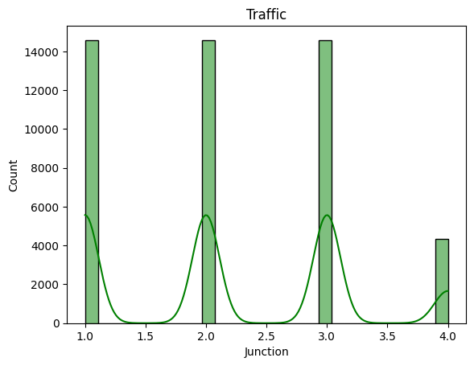
    


```python
plt.figure(figsize=(25,20))
sns.countplot(x="Vehicles",data=df,color='Red')
plt.xticks(rotation=50)

plt.show()
```


    
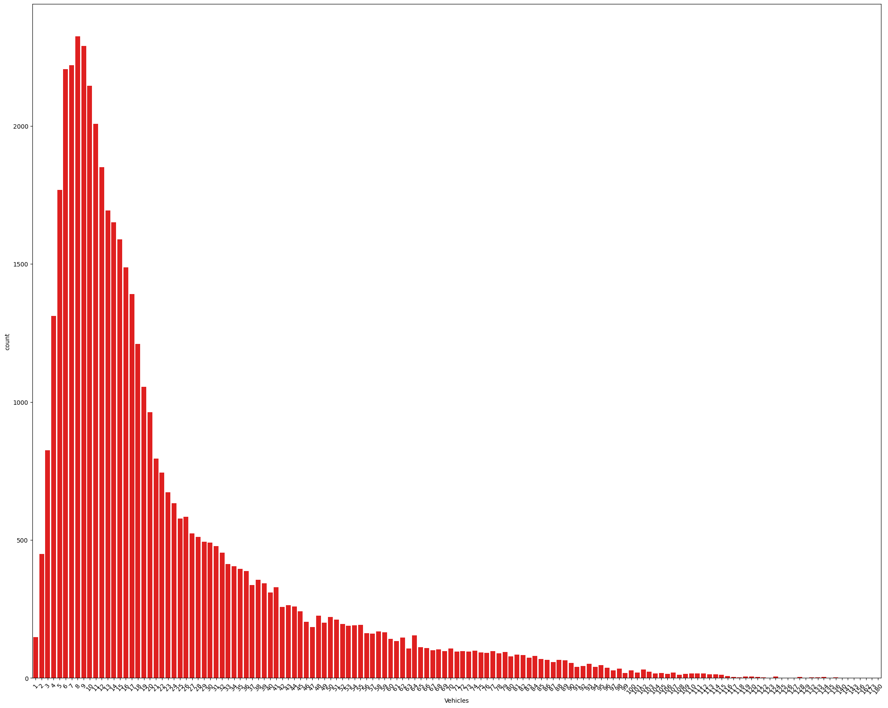
    


```python
#PIE CHART
plt.figure(figsize=(7,5))
Pie=df['Junction'].value_counts()
plt.title("PIE CHART-RESULT")
plt.pie(Pie.values,labels=Pie.index,autopct='%1.2f%%')
plt.show()
```


    
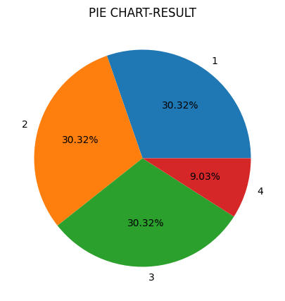
    


```python
plt.figure(figsize=(9,8))
sns.scatterplot(x='Vehicles',y='Junction',data=df,color='green',palette='coolwarm')
plt.title('DateTime V/S ID')
plt.xticks(rotation=50)
plt.yticks(rotation=50)
plt.show()
```

    C:\Users\Admin\AppData\Local\Temp\ipykernel_11168\1729592122.py:2: UserWarning: Ignoring `palette` because no `hue` variable has been assigned.
      sns.scatterplot(x='Vehicles',y='Junction',data=df,color='green',palette='coolwarm')
    


    
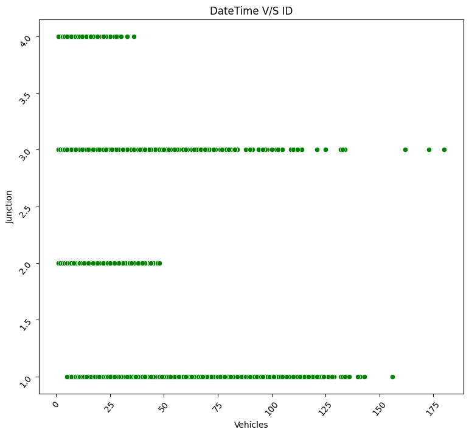
    


```python
#Bivariate Analysis // Categorical v/s Numerical - barplot....1

plt.figure(figsize=(60,70))
sns.barplot(x='Vehicles',y='Junction',data=df,color='green',palette='plasma')
plt.title('Vehicles V/S Junction')
plt.xticks(rotation=50)
plt.yticks(rotation=50)
plt.yticks()
plt.show()
```

    C:\Users\Admin\AppData\Local\Temp\ipykernel_11168\843735555.py:4: FutureWarning: 
    
    Passing `palette` without assigning `hue` is deprecated and will be removed in v0.14.0. Assign the `x` variable to `hue` and set `legend=False` for the same effect.
    
      sns.barplot(x='Vehicles',y='Junction',data=df,color='green',palette='plasma')
    


    
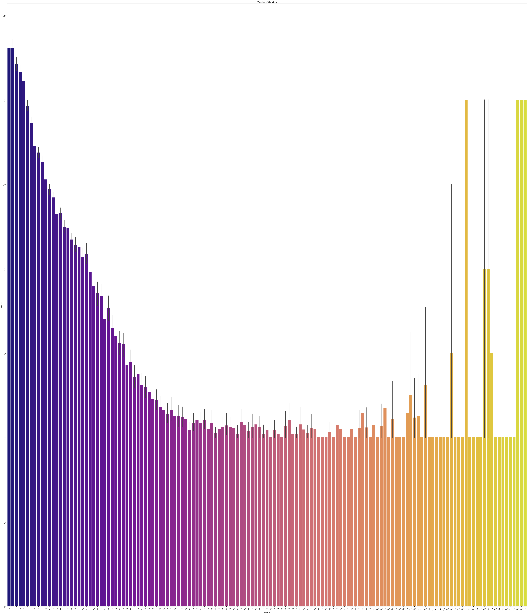
    


```python
#Bivariate Analysis // Categorical v/s Categorical - Countplot....1


plt.figure(figsize=(100,105))
sns.countplot(hue='Junction',y='Vehicles',data=df,color='Orange')
plt.title('Junction V/S Vehicles')
plt.xticks(rotation=34)
plt.yticks(rotation=34)
plt.show()
 
```

    C:\Users\Admin\AppData\Local\Temp\ipykernel_11168\1800033689.py:5: FutureWarning: 
    
    Setting a gradient palette using color= is deprecated and will be removed in v0.14.0. Set `palette='dark:Orange'` for the same effect.
    
      sns.countplot(hue='Junction',y='Vehicles',data=df,color='Orange')
    


    

    


```python
# Multi variate Analysis // HEAT MAP


#Correlation Heatmap


plt.figure(figsize=(9,8))
plt.title("Traffic- Data")
sns.heatmap(df.corr(numeric_only=True), annot=True,cmap='magma',center=0.11) #cmap=viridis,plasma,inferno,magma,coolwarm,RdBu...etc
plt.show()


```


    
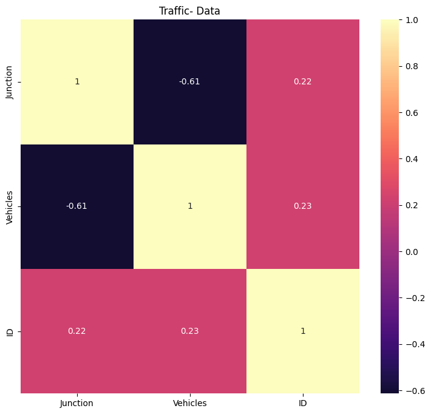
    


```python
# Histogram (Distribution)// 2 numerical columns


sns.histplot(df['Junction'], kde=True, bins=30,color="indigo")
plt.title("HISTOGRAM-")
plt.xlabel("Vehicles")
plt.ylabel("Junction")
plt.show()
```


    
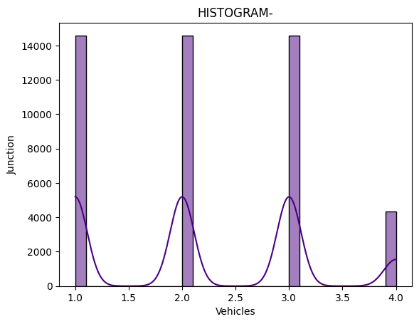
    


```python
#boxplot Plot (Relation Between 2 Numerical Columns)

plt.figure(figsize=(30,15))
sns.boxplot(x='Junction', y='Vehicles', data=df,color="green")
plt.title(" Junction rate vs Vehicles ")
plt.show()

```


    
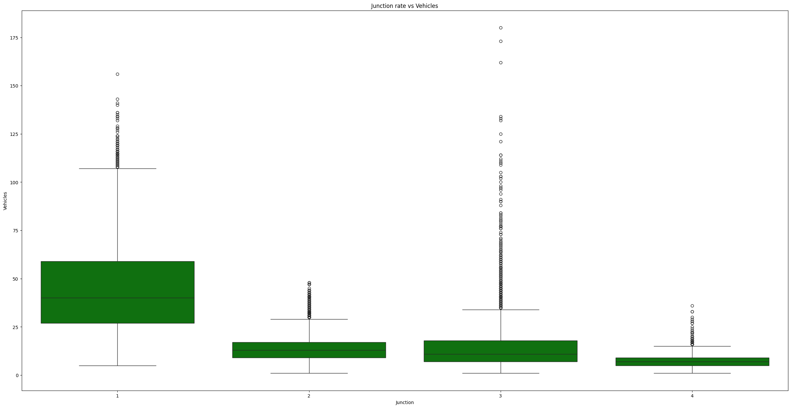
    


```python
sns.pairplot(df)
```


    <seaborn.axisgrid.PairGrid at 0x28d127181a0>


    
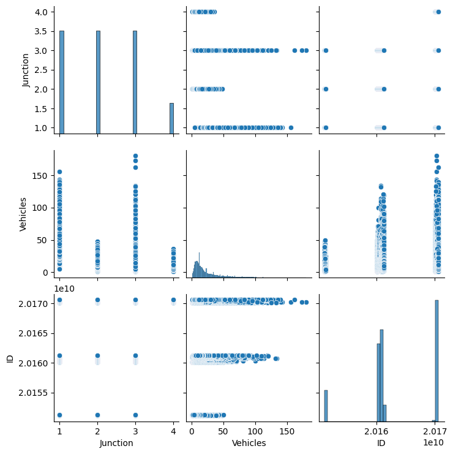
    


```python

sns.pairplot(df[[ 'DateTime','Junction','Vehicles','ID']],plot_kws={'color':'magenta'})

plt.show()

```


    
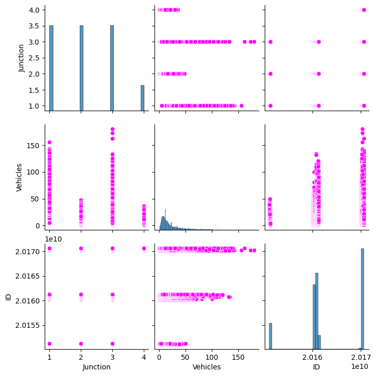
    


```python
plt.figure(figsize=(20,18))
sns.pairplot(df[[ 'DateTime','Junction','Vehicles','ID']],hue='Junction',palette=['red','green'])

plt.show()

```

    c:\Users\Admin\AppData\Local\Programs\Python\Python314\Lib\site-packages\seaborn\axisgrid.py:1513: UserWarning: 
    The palette list has fewer values (2) than needed (4) and will cycle, which may produce an uninterpretable plot.
      func(x=vector, **plot_kwargs)
    c:\Users\Admin\AppData\Local\Programs\Python\Python314\Lib\site-packages\seaborn\axisgrid.py:1513: UserWarning: 
    The palette list has fewer values (2) than needed (4) and will cycle, which may produce an uninterpretable plot.
      func(x=vector, **plot_kwargs)
    c:\Users\Admin\AppData\Local\Programs\Python\Python314\Lib\site-packages\seaborn\axisgrid.py:1615: UserWarning: 
    The palette list has fewer values (2) than needed (4) and will cycle, which may produce an uninterpretable plot.
      func(x=x, y=y, **kwargs)
    c:\Users\Admin\AppData\Local\Programs\Python\Python314\Lib\site-packages\seaborn\axisgrid.py:1615: UserWarning: 
    The palette list has fewer values (2) than needed (4) and will cycle, which may produce an uninterpretable plot.
      func(x=x, y=y, **kwargs)
    


    <Figure size 2000x1800 with 0 Axes>


    
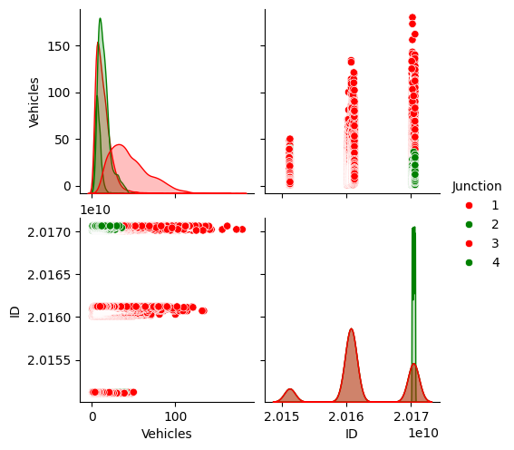
    


```python
plt.figure(figsize=(20,18))
sns.pairplot(df[[ 'DateTime','Junction','Vehicles','ID']],hue='Vehicles',palette=['orange','blue'])

plt.show()

```

    c:\Users\Admin\AppData\Local\Programs\Python\Python314\Lib\site-packages\seaborn\axisgrid.py:1513: UserWarning: 
    The palette list has fewer values (2) than needed (141) and will cycle, which may produce an uninterpretable plot.
      func(x=vector, **plot_kwargs)
    c:\Users\Admin\AppData\Local\Programs\Python\Python314\Lib\site-packages\seaborn\axisgrid.py:1513: UserWarning: 
    The palette list has fewer values (2) than needed (141) and will cycle, which may produce an uninterpretable plot.
      func(x=vector, **plot_kwargs)
    c:\Users\Admin\AppData\Local\Programs\Python\Python314\Lib\site-packages\seaborn\axisgrid.py:1615: UserWarning: 
    The palette list has fewer values (2) than needed (141) and will cycle, which may produce an uninterpretable plot.
      func(x=x, y=y, **kwargs)
    c:\Users\Admin\AppData\Local\Programs\Python\Python314\Lib\site-packages\seaborn\axisgrid.py:1615: UserWarning: 
    The palette list has fewer values (2) than needed (141) and will cycle, which may produce an uninterpretable plot.
      func(x=x, y=y, **kwargs)
    


    <Figure size 2000x1800 with 0 Axes>


    
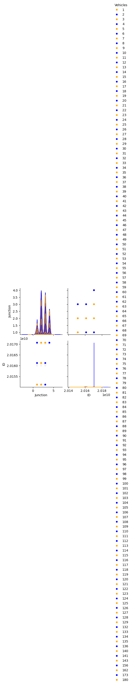
    


```python
plt.figure(figsize=(40,36))
sns.pairplot(df,hue='Junction',palette=['green','red'])
plt.show()
```

    c:\Users\Admin\AppData\Local\Programs\Python\Python314\Lib\site-packages\seaborn\axisgrid.py:1513: UserWarning: 
    The palette list has fewer values (2) than needed (4) and will cycle, which may produce an uninterpretable plot.
      func(x=vector, **plot_kwargs)
    c:\Users\Admin\AppData\Local\Programs\Python\Python314\Lib\site-packages\seaborn\axisgrid.py:1513: UserWarning: 
    The palette list has fewer values (2) than needed (4) and will cycle, which may produce an uninterpretable plot.
      func(x=vector, **plot_kwargs)
    c:\Users\Admin\AppData\Local\Programs\Python\Python314\Lib\site-packages\seaborn\axisgrid.py:1615: UserWarning: 
    The palette list has fewer values (2) than needed (4) and will cycle, which may produce an uninterpretable plot.
      func(x=x, y=y, **kwargs)
    c:\Users\Admin\AppData\Local\Programs\Python\Python314\Lib\site-packages\seaborn\axisgrid.py:1615: UserWarning: 
    The palette list has fewer values (2) than needed (4) and will cycle, which may produce an uninterpretable plot.
      func(x=x, y=y, **kwargs)
    


    <Figure size 4000x3600 with 0 Axes>


    
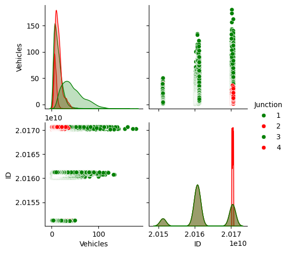
    


```python
print('-'*115)
```

    -------------------------------------------------------------------------------------------------------------------
    


```python
print(" \n 8) Linear Regression")   
print('_'*24)
```

     
     8) Linear Regression
    ________________________
    


```python
# Linear Regression Model

import pandas as pd
import numpy as np
import matplotlib.pyplot as plt
import seaborn as sns

from sklearn.model_selection import train_test_split
from sklearn.preprocessing import StandardScaler
from sklearn.linear_model import LinearRegression
from sklearn.metrics import  mean_squared_error, r2_score

# Load Dataset
df = pd.read_csv("traffic.csv")

# Define Features (X) and Target (y)
X = df[["Junction"]]
y = df["Vehicles"]

# Train Test Split
X_train, X_test, y_train, y_test = train_test_split(
    X, y, test_size=0.2, random_state=42
)

# Feature Scaling
scaler = StandardScaler()

X_train = scaler.fit_transform(X_train)
X_test = scaler.transform(X_test)

# Train Linear Regression Model
model = LinearRegression()
model.fit(X_train, y_train)

# Prediction
y_pred = model.predict(X_test)

# Model Evaluation
mse = mean_squared_error(y_test, y_pred)
r2 = r2_score(y_test, y_pred)

print("Mean Squared Error:", mse)
print("R2 Score:", r2)

# Scatter Plot
plt.figure(figsize=(8,6))
plt.scatter(X_test, y_test, color="blue", label="Actual Data")
plt.plot(X_test, y_pred, color="red", linewidth=2, label="Regression Line")
plt.xlabel("Junction")
plt.ylabel("Vehicles")
plt.title("Linear Regression")
plt.legend()
plt.show()
```

    Mean Squared Error: 254.93967005535174
    R2 Score: 0.3744529336905429
    


    
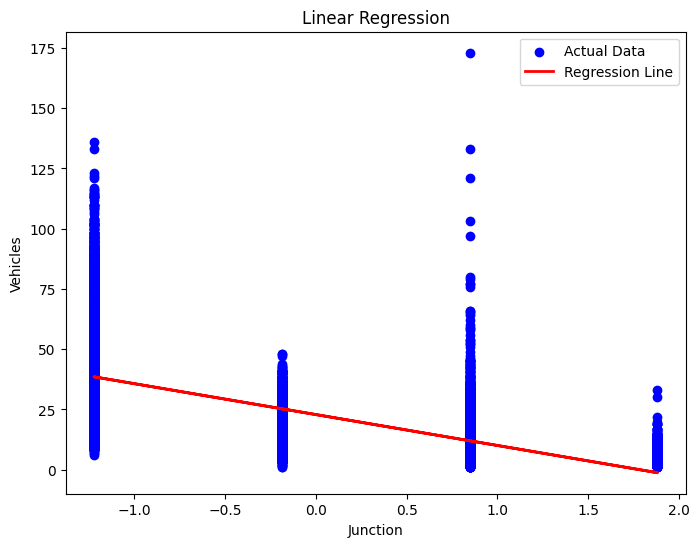
    


```python
print(" \n 9) Logistic Regression")
print('_'*24)
```

     
     9) Logistic Regression
    ________________________
    


```python
# Logistic Regression Model

import pandas as pd
import numpy as np
import matplotlib.pyplot as plt
import seaborn as sns

from sklearn.model_selection import train_test_split
from sklearn.preprocessing import StandardScaler
from sklearn.linear_model import LogisticRegression
from sklearn.metrics import accuracy_score, classification_report, confusion_matrix

# Load Dataset
df = pd.read_csv("traffic.csv")

# Create Target Column (Traffic Level)
df["Result"] = (df["Vehicles"] > 20).astype(int)

# Select Features
X = df[["Junction", "Vehicles"]]
y = df["Result"]

# Train Test Split
X_train, X_test, y_train, y_test = train_test_split(
    X, y, test_size=0.2, random_state=42
)

# Feature Scaling
scaler = StandardScaler()

X_train = scaler.fit_transform(X_train)
X_test = scaler.transform(X_test)

# Train Logistic Regression Model
model = LogisticRegression()
model.fit(X_train, y_train)

# Prediction
y_pred = model.predict(X_test)

# Model Evaluation
accuracy = accuracy_score(y_test, y_pred) * 100
cm = confusion_matrix(y_test, y_pred)
report = classification_report(y_test, y_pred)

print("Accuracy:", accuracy)
print("\nConfusion Matrix:\n", cm)
print("\nClassification Report:\n", report)

# Confusion Matrix Plot
plt.figure(figsize=(8,6))
sns.heatmap(cm, annot=True, cmap="plasma",center=0.6)
plt.xlabel("Predicted")
plt.ylabel("Actual")
plt.title("Confusion Matrix")
plt.show()
```

    Accuracy: 100.0
    
    Confusion Matrix:
     [[6171    0]
     [   0 3453]]
    
    Classification Report:
                   precision    recall  f1-score   support
    
               0       1.00      1.00      1.00      6171
               1       1.00      1.00      1.00      3453
    
        accuracy                           1.00      9624
       macro avg       1.00      1.00      1.00      9624
    weighted avg       1.00      1.00      1.00      9624
    
    


    
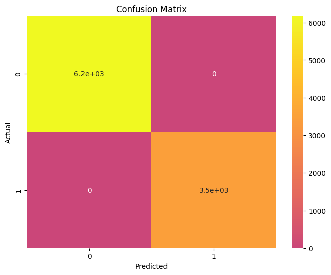
    


```python
print(" \n 10) KNN Regression")
print('_'*24)
```

     
     10) KNN Regression
    ________________________
    


```python
# KNN Model

import pandas as pd
import numpy as np
import matplotlib.pyplot as plt
import seaborn as sns

from sklearn.model_selection import train_test_split
from sklearn.preprocessing import StandardScaler
from sklearn.neighbors import KNeighborsClassifier
from sklearn.metrics import accuracy_score, classification_report, confusion_matrix

# Load Dataset
df = pd.read_csv("traffic.csv")

# Create Target Column
df["Result"] = (df["Vehicles"] > 20).astype(int)

# Define Features (X) and Target (y)
X = df[["Junction","Vehicles"]]
y = df["Result"]

# Train Test Split
X_train, X_test, y_train, y_test = train_test_split(
    X, y, test_size=0.2, random_state=42
)

# Feature Scaling
scaler = StandardScaler()

X_train = scaler.fit_transform(X_train)
X_test = scaler.transform(X_test)

# Train KNN Model
model = KNeighborsClassifier(n_neighbors=5)
model.fit(X_train, y_train)

# Prediction
y_pred = model.predict(X_test)

# Model Evaluation
accuracy = accuracy_score(y_test, y_pred) * 100
cm = confusion_matrix(y_test, y_pred)
report = classification_report(y_test, y_pred)

print("Accuracy:", accuracy)
print("\nConfusion Matrix:\n", cm)
print("\nClassification Report:\n", report)

# Confusion Matrix Plot
plt.figure(figsize=(10,7))
sns.heatmap(cm, annot=True, cmap="magma",center=1.2)
plt.xlabel("Predicted")
plt.ylabel("Actual")
plt.title("Confusion Matrix")
plt.show()
```

    Accuracy: 100.0
    
    Confusion Matrix:
     [[6171    0]
     [   0 3453]]
    
    Classification Report:
                   precision    recall  f1-score   support
    
               0       1.00      1.00      1.00      6171
               1       1.00      1.00      1.00      3453
    
        accuracy                           1.00      9624
       macro avg       1.00      1.00      1.00      9624
    weighted avg       1.00      1.00      1.00      9624
    
    


    
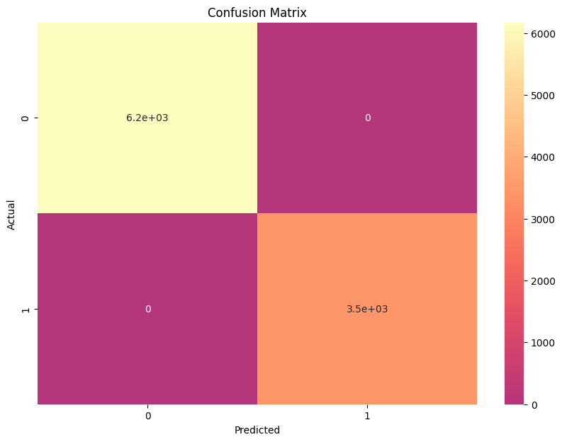
    


```python
print(" \n 11) K-Means Clustering Model")
print('_'*30)
```

     
     11) K-Means Clustering Model
    ______________________________
    


```python
# K-Means Clustering Model

import pandas as pd
import numpy as np
import matplotlib.pyplot as plt
import seaborn as sns
from sklearn.cluster import KMeans
from sklearn.preprocessing import StandardScaler

# Load Dataset
df = pd.read_csv("traffic.csv")

# Select Features
X = df[["Junction","Vehicles"]]

# Feature Scaling
scaler = StandardScaler()
X_scaled = scaler.fit_transform(X)

# Train K-Means Model
kmeans = KMeans(n_clusters=3, random_state=42)

clusters = kmeans.fit_predict(X_scaled)

# Add cluster labels to dataset
df["Cluster"] = clusters

# Visualization
plt.figure(figsize=(8,6))
plt.scatter(df["Junction","Vehicles","Cluster"],cmap="plasma")
plt.xlabel("Junction")
plt.ylabel("Vehicles")
plt.title("K-Means Clustering")
plt.show()
```


    
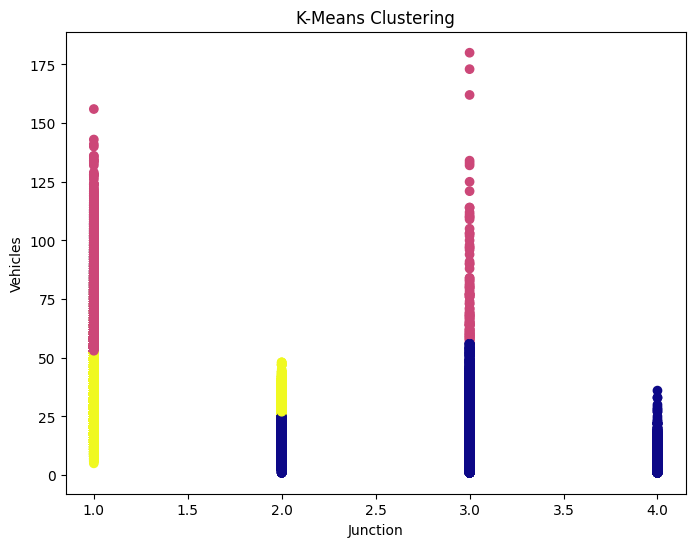
    


```python

```
