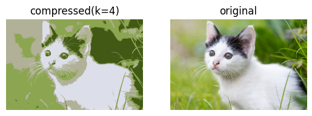

```python
import cv2
import numpy as np
import matplotlib.pyplot as plt
import os 

```


```python
photo = cv2.imread("cat.jpg")
photo = cv2.cvtColor(photo,cv2.COLOR_BGR2RGB)
```


```python
print(photo)
```

    [[[177 175 127]
      [175 173 125]
      [182 180 132]
      ...
      [ 81 110  43]
      [ 76 105  38]
      [ 75 106  38]]
    
     [[186 182 137]
      [176 173 128]
      [184 181 136]
      ...
      [ 75 104  37]
      [ 78 109  41]
      [ 79 110  42]]
    
     [[184 180 135]
      [182 178 133]
      [184 180 135]
      ...
      [ 73 103  33]
      [ 73 104  34]
      [ 78 109  39]]
    
     ...
    
     [[159 174  81]
      [161 175  87]
      [165 179  92]
      ...
      [ 45  64  34]
      [ 44  66  30]
      [ 46  68  30]]
    
     [[168 182  87]
      [169 184  93]
      [164 178  91]
      ...
      [ 45  64  32]
      [ 42  64  28]
      [ 47  69  31]]
    
     [[166 180  85]
      [168 181  91]
      [160 174  86]
      ...
      [ 44  63  31]
      [ 48  70  34]
      [ 40  62  24]]]
    


```python
pixel = photo.reshape((-1,3))
pixel = np.float32(pixel)
```


```python
k = 4
```


```python
when_stop = (cv2.TERM_CRITERIA_EPS + cv2.TERM_CRITERIA_MAX_ITER,100,0.2)
```


```python
Error,label,centers=cv2.kmeans(pixel,k,None,when_stop,10,cv2.KMEANS_RANDOM_CENTERS)
```


```python
centers = np.uint8(centers)
```


```python
compressed=centers[label.flatten()]
```


```python
compressed=compressed.reshape(photo.shape)
```


```python
cv2.imwrite("compressed.jpg", cv2.cvtColor(compressed,cv2.COLOR_RGB2BGR))
```


    True


```python
plt.figure(figsize=(10,5))
```


    <Figure size 1000x500 with 0 Axes>


    <Figure size 1000x500 with 0 Axes>


```python
plt.subplot(1,2,2)
plt.title("original")
plt.imshow(photo)
plt.axis('off')

plt.subplot(1,2,1)
plt.title("compressed(k=4)")
plt.imshow(compressed)
plt.axis('off')
plt.show()
```


    

    

