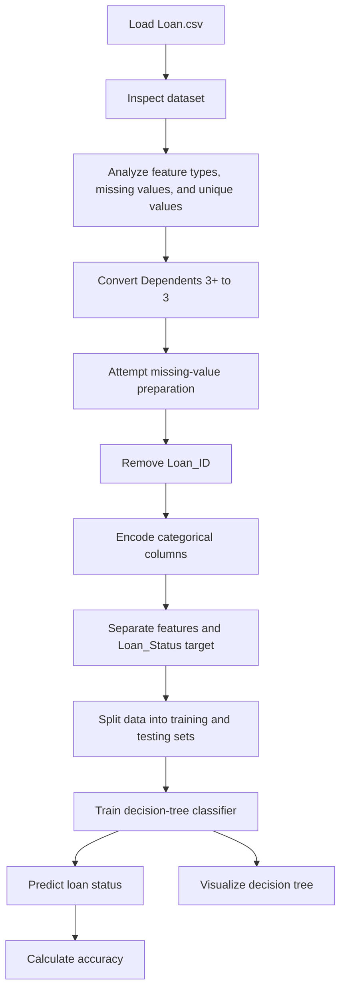
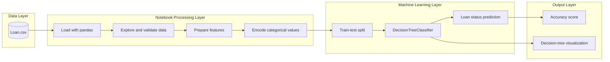

# Loan Approval Prediction

## Project Overview

This educational machine-learning project explores a loan-approval dataset and uses a decision-tree classifier to predict whether a loan application is approved. The notebook includes data inspection, categorical analysis, missing-value analysis, preprocessing, model training, evaluation, and decision-tree visualization.

## Problem Statement

The project explores whether applicant information such as income, credit history, education, employment status, family details, and property area can be used to predict the loan approval status.

## Dataset

`Loan.csv` contains 614 rows and 13 columns:

- `Loan_ID`
- `Gender`
- `Married`
- `Dependents`
- `Education`
- `Self_Employed`
- `ApplicantIncome`
- `CoapplicantIncome`
- `LoanAmount`
- `Loan_Amount_Term`
- `Credit_History`
- `Property_Area`
- `Loan_Status`

The notebook identifies five numerical features and eight categorical features. Missing values are reported in these columns:

- `Gender`: 13
- `Married`: 3
- `Dependents`: 15
- `Self_Employed`: 32
- `LoanAmount`: 22
- `Loan_Amount_Term`: 14
- `Credit_History`: 50

`Loan_Status` is the target, with `Y` representing an approved loan and `N` representing a rejected loan.

## Technologies Used

- Python
- Jupyter Notebook
- pandas for loading, inspecting, and transforming the dataset
- NumPy for numerical operations
- Matplotlib for visualizations
- Seaborn for exploratory visualization
- scikit-learn for encoding, data splitting, decision-tree classification, and accuracy evaluation

## Features

### Data Analysis

- Load and inspect the loan dataset.
- Display the dataset shape, columns, and value counts.
- Separate numerical and categorical features.
- Examine missing values and unique-value counts.
- Convert `3+` in `Dependents` to `3`.
- Visualize the trained decision tree.

### Machine Learning

- Remove `Loan_ID` from the model data.
- Encode selected categorical columns with `LabelEncoder`.
- Separate features from the `Loan_Status` target.
- Create training and testing subsets.
- Train a `DecisionTreeClassifier` using the Gini criterion.
- Predict loan status and calculate accuracy.

## Model Configuration and Results

- Model: Decision tree classifier
- Criterion: `gini`
- Test size: 20%
- Training size: 80%
- Random state: `42`
- Target: `Loan_Status`
- Recorded accuracy: `100.0%`

The recorded accuracy should be interpreted cautiously because the notebook creates a train-test split but fits the decision tree on the full dataset before predicting the test subset. This allows information from the test subset to influence the trained model.

## Workflow

1. Load `Loan.csv` with pandas.
2. Inspect the dataset shape, columns, data types, and value counts.
3. Identify numerical and categorical features.
4. Count missing values and unique values.
5. Convert `3+` in `Dependents` to `3`.
6. Attempt to fill missing categorical and numerical values.
7. Remove `Loan_ID` from the modeling data.
8. Encode the selected categorical columns with `LabelEncoder`.
9. Separate the features from the `Loan_Status` target.
10. Split the data into training and testing sets with `random_state=42`.
11. Train the decision-tree classifier.
12. Predict the test-set loan statuses and calculate accuracy.
13. Display the decision-tree structure.

### Workflow Diagram



## Architecture Diagram



## Installation and Setup

### Requirements

- Python
- Jupyter Notebook
- pandas
- NumPy
- Matplotlib
- Seaborn
- scikit-learn

### Steps

1. Install Python and the required packages.
2. Open `Loan.ipynb` in Jupyter Notebook or Visual Studio Code.
3. Run the notebook cells from top to bottom.

Exact installation commands and package versions: `TODO: Information required`

Environment variables: `TODO: Information required`

Configuration files: `TODO: Information required`

## Project Structure

```text
model 10/
├── Loan.ipynb
├── Loan.csv
├── Loan.md
├── README.md
└── Loan_files/
```

- `Loan.ipynb`: Main loan-analysis and machine-learning notebook.
- `Loan.csv`: Source loan-application dataset.
- `Loan.md`: Markdown export of the notebook.
- `README.md`: Project documentation.
- `Loan_files/`: Notebook-related assets; detailed contents are not documented.

## Limitations and Missing Information

- The dataset source and attribution are not documented.
- Package versions and exact installation commands are not documented.
- No license information is provided.
- The missing-value fill operations are not assigned back to the DataFrame, so missing values may remain during encoding.
- The model is fitted on the full dataset instead of only the training subset, causing data leakage in the recorded accuracy.
- `LabelEncoder` is reused across multiple feature columns, which is less transparent than explicit category mappings or one-hot encoding.
- Only accuracy is reported; precision, recall, F1 score, and a confusion matrix are not included.
- No cross-validation, pruning, hyperparameter tuning, or comparison with other classifiers is documented.
- The notebook does not document how the trained model should be used with new loan applications.
